# 008：Python打包教程


在本节课中，我们将学习Python中模块、包和库的核心概念，并掌握如何创建、验证和使用一个Python包。

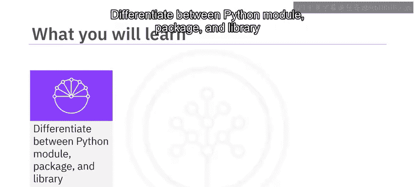

---

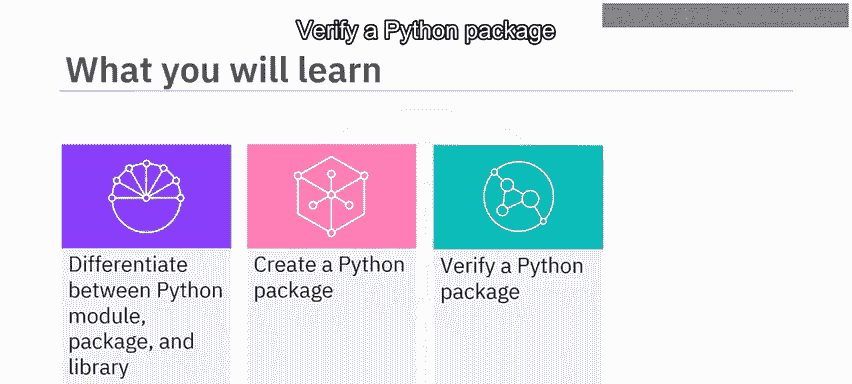

## 🧩 Python模块、包与库

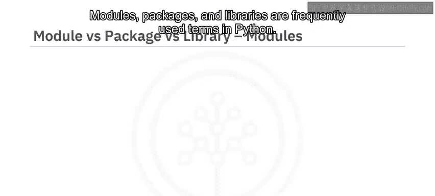

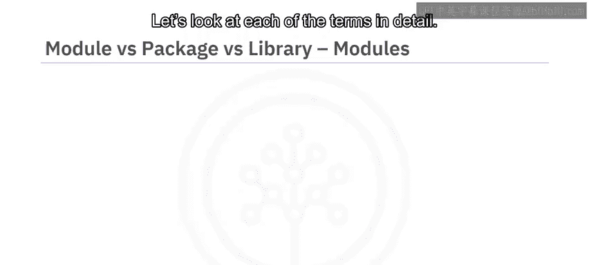

模块、包和库是Python中频繁使用的术语。上一节我们介绍了课程目标，本节中我们来看看这些术语的具体含义。

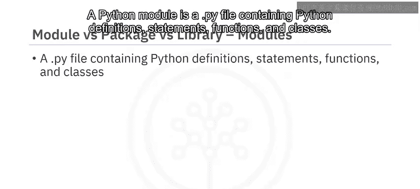

### Python模块

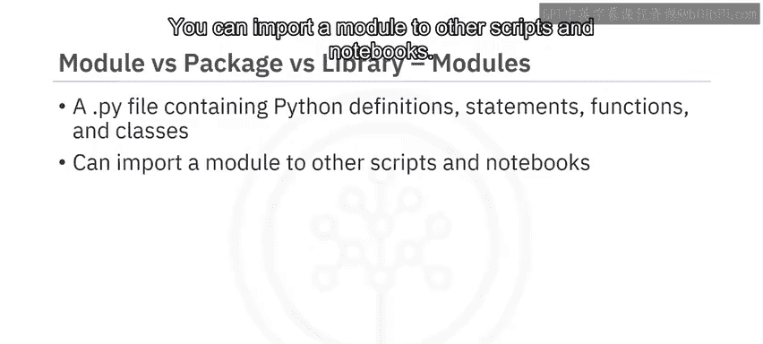

一个Python模块是一个包含Python定义、语句、函数和类的 `.py` 文件。

你可以将模块导入到其他脚本或笔记本中使用。例如，考虑一个名为 `module.py` 的模块，它包含两个函数。

第一个函数是 `square(number)`，它计算输入数字的平方并返回结果。其代码表示为：
```python
def square(number):
    return number ** 2
```

第二个函数是 `double(number)`，它将输入数字加倍并返回结果。其代码表示为：
```python
def double(number):
    return number * 2
```

如果该模块文件位于同一目录下，你可以导入并使用其中的函数。

考虑使用 `square` 函数配合 `print` 命令：
```python
print("4^2 =", square(4))
```
输出将显示为 `4^2 = 16`。

类似地，对于值为4的 `double` 函数：
```python
print("2*4 =", double(4))
```
输出是 `2*4 = 8`。

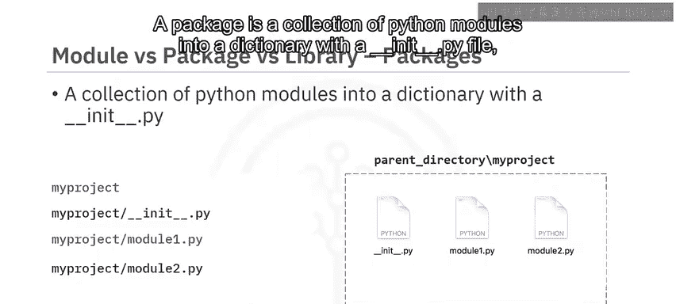

### Python包

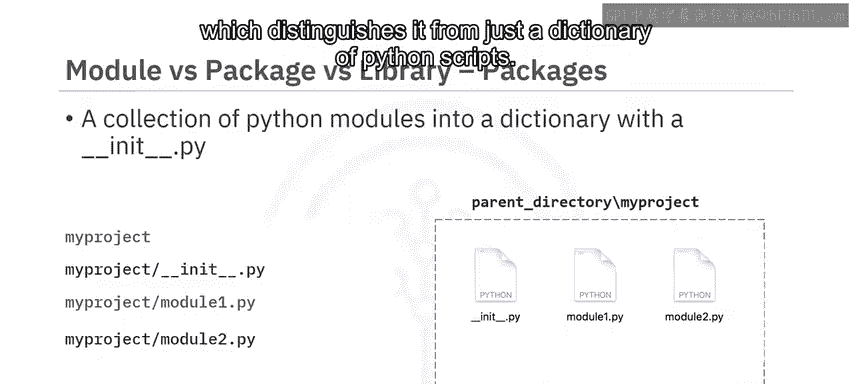

一个包是将多个Python模块组织到一个目录中，并且该目录包含一个 `__init__.py` 文件，这将其与普通的脚本目录区分开来。

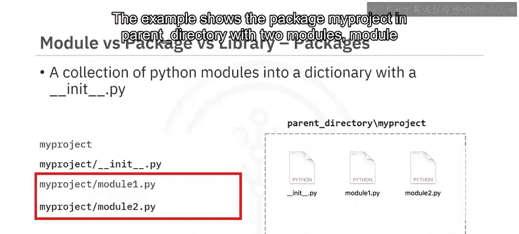

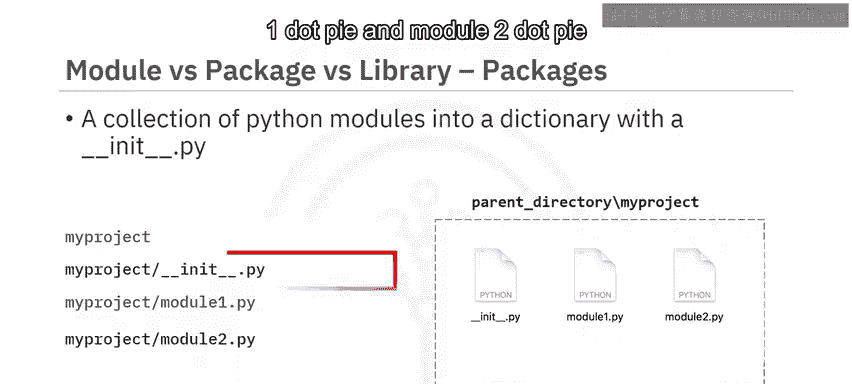

示例展示了在父目录下的 `my_project` 包，它包含两个模块：`module1.py` 和 `module2.py`。


它同时也包含 `__init__.py` 文件。

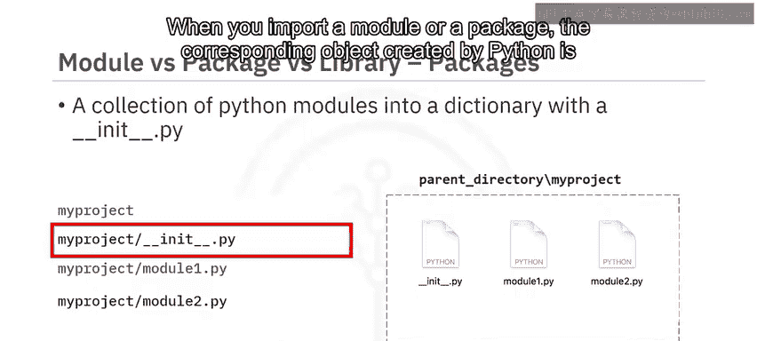

当你导入一个模块或包时，Python创建的对应对象类型始终是 `module`。


请注意，模块和包的区别仅在于文件系统层面。

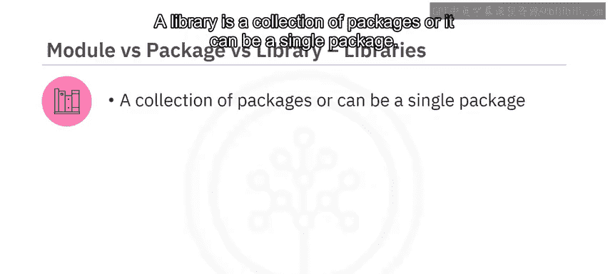

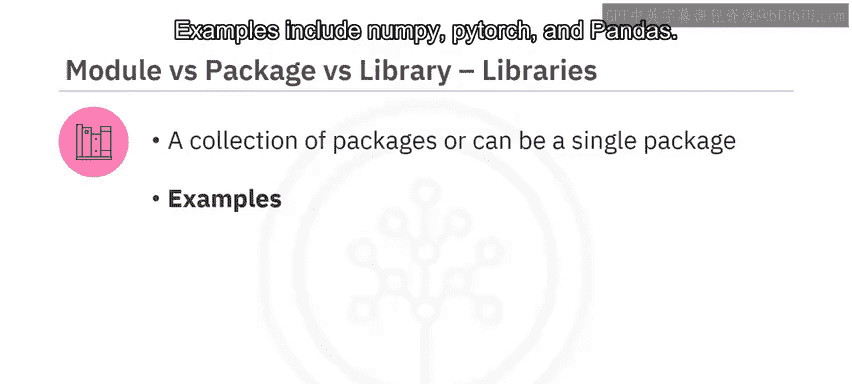

### Python库

一个库是包的集合，或者它本身可以是一个单独的包。


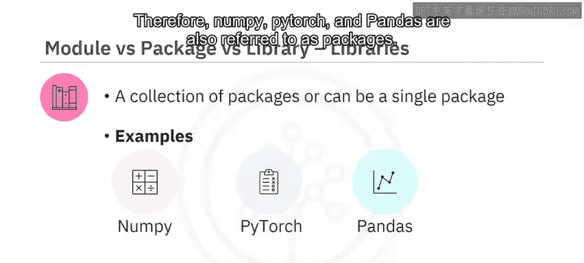

示例包括 `numpy`、`pytorch` 和 `pandas`。

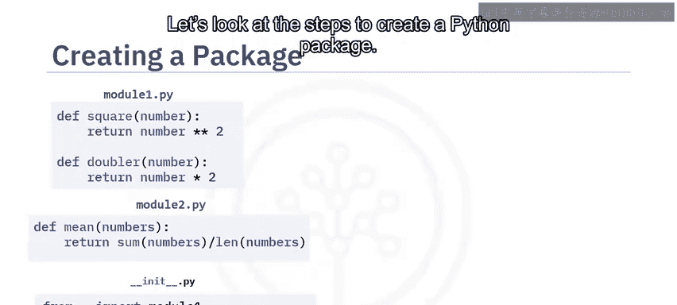

需要注意的是，术语“包”和“库”经常互换使用。因此，`numpy`、`pytorch` 和 `pandas` 也常被称为包。

---

## 🛠️ 创建Python包的步骤

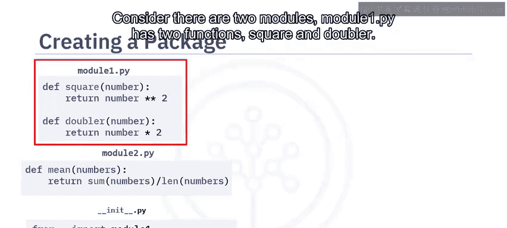

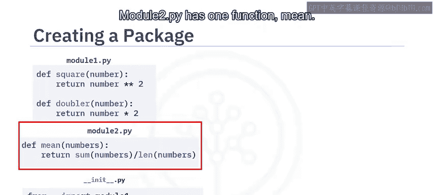

理解了核心概念后，本节中我们来看看如何一步步创建一个Python包。

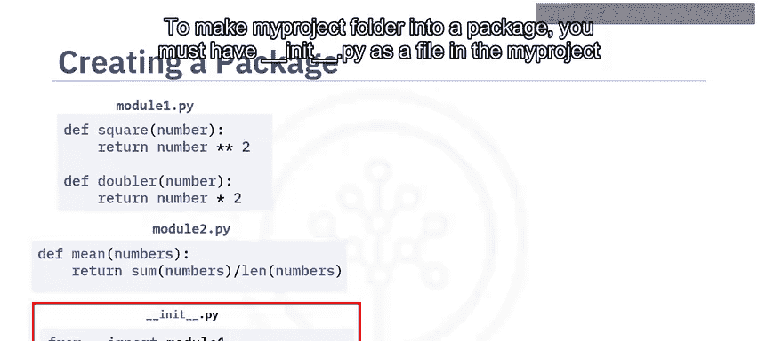

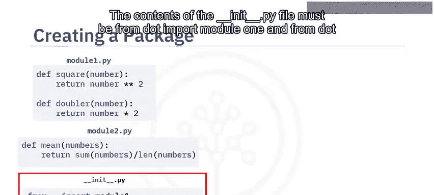

考虑有两个模块。`module1.py` 包含 `square` 和 `double` 两个函数。`module2.py` 包含一个 `mean` 函数。为了使 `my_project` 文件夹成为一个包，你必须在 `my_project` 文件夹中有一个 `__init__.py` 文件。

`__init__.py` 文件的内容必须是：
```python
from . import module1
from . import module2
```

以下是创建包的典型步骤：

首先，创建一个以包名命名的文件夹。
然后，创建一个空的 `__init__.py` 文件。
接着，创建所需的模块文件。
最后，在 `__init__.py` 文件中，添加引用包中所需模块的代码。

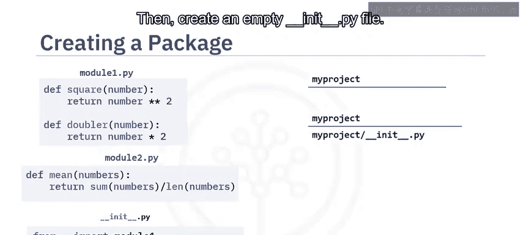


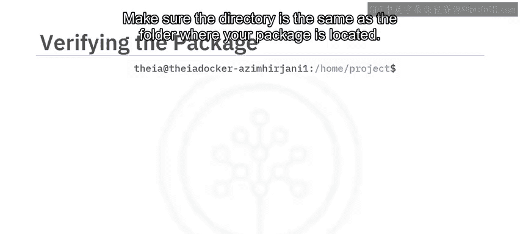

---

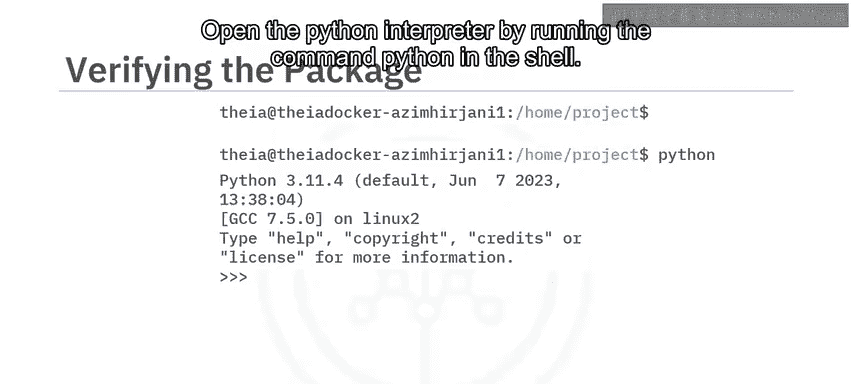

## ✅ 验证Python包

创建包之后，你需要验证它是否能正常工作。以下是验证包的步骤：

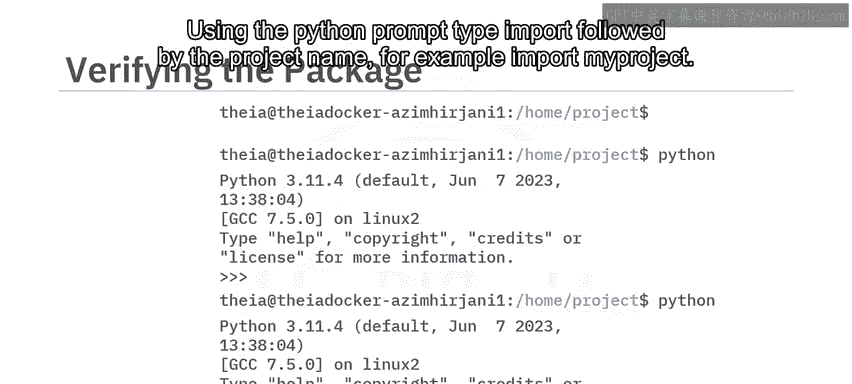

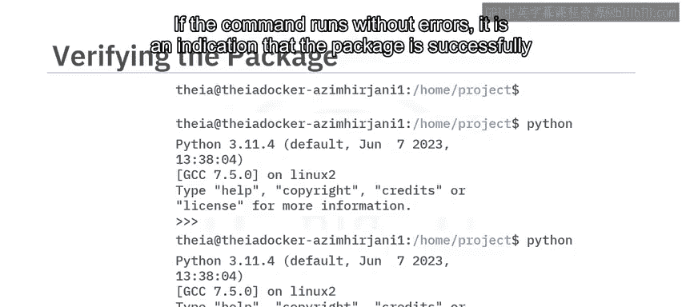

首先，打开一个bash终端。
确保当前目录与你的包所在的文件夹处于同一层级。

在shell中运行 `python` 命令以打开Python解释器。

在Python提示符下，键入 `import` 后跟项目名称，例如：
```python
import my_project
```
如果该命令运行无误，则表明包已成功加载。

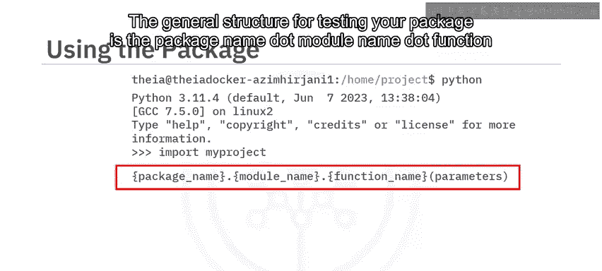

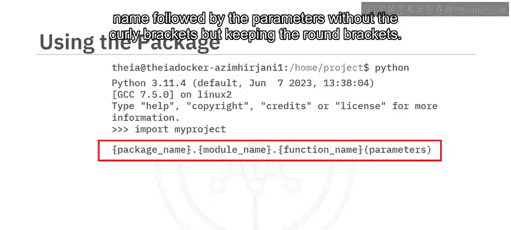

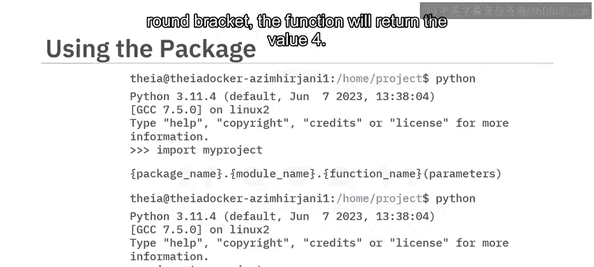

测试包功能的一般结构是：`包名.模块名.函数名(参数)`。

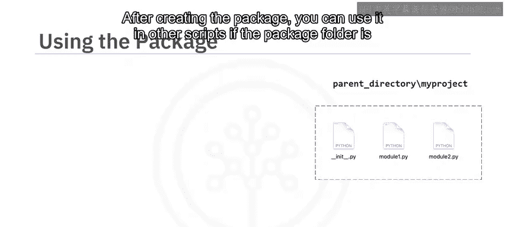

例如，使用 `my_project.module1.square(2)`，该函数将返回值 `4`。

---

## 🚀 使用Python包

创建并验证包之后，你可以在其他脚本中使用它，前提是包文件夹位于同一目录下。

在这种情况下，你在父目录中有一个 `test.py` 文件。

你可以导入包中的函数，例如使用以下Python代码：
```python
from my_project.module1 import square, double
from my_project.module2 import mean

print("4^2 =", square(4))
print("2*4 =", double(4))
print("(2+1+3)/3 =", mean([2, 1, 3]))
```
然后运行这些函数并检查是否得到正确的结果。

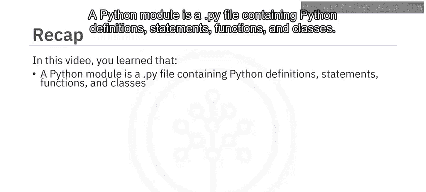

---

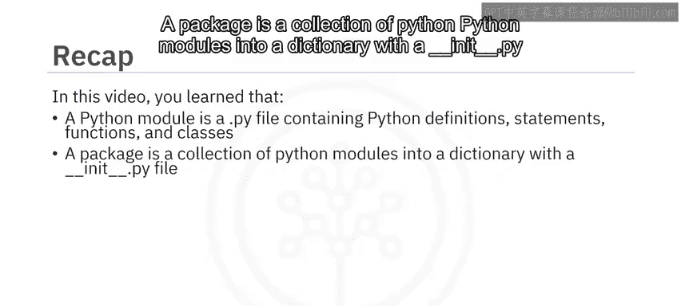

## 📝 课程总结

本节课中我们一起学习了Python打包的核心知识。

我们了解到：
*   **Python模块** 是一个包含Python定义、语句、函数和类的 `.py` 文件。
*   **Python包** 是将多个Python模块组织到一个包含 `__init__.py` 文件的目录中。
*   **Python库** 是包的集合，或者本身可以是一个单独的包。

要创建一个包，你需要：
1.  创建一个以包名命名的文件夹。
2.  创建一个空的 `__init__.py` 文件。
3.  创建所需的模块文件。
4.  在 `__init__.py` 文件中添加引用所需模块的代码。


你可以通过bash终端验证包。创建包后，如果包文件夹位于同一目录下，你可以在其他脚本中使用它。