# 003：关系类型 🗂️

在本节课中，我们将要学习关系数据库设计中核心概念之一：**关系类型**。我们将了解构成关系的基本构件，学习如何用符号表示它们，并详细探讨一对一、一对多和多对多这三种基本关系类型。

## 概述

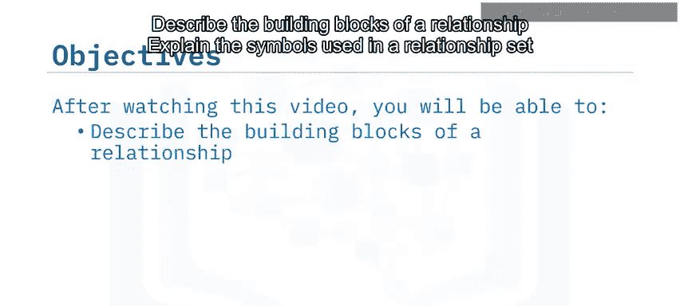

关系是连接数据库中不同实体的纽带。理解不同类型的关系对于设计高效、准确的数据库结构至关重要。本节将介绍关系的构成要素及其可视化表示方法。

## 关系的构成要素

关系的构建主要依赖于三个基本构件：**实体**、**关系集**和**鸦脚表示法**。

以下是这些构件的详细说明：

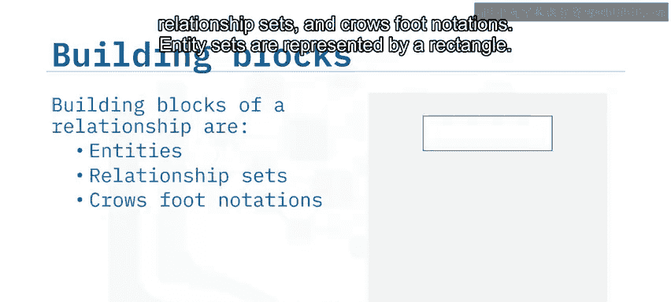

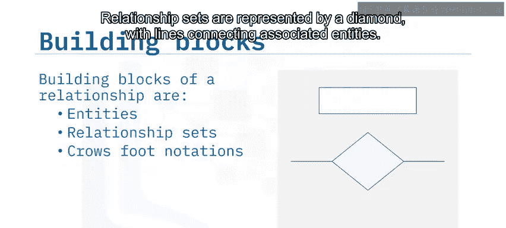

*   **实体集**：实体集由矩形表示。它代表数据库中具有相同属性的一类对象，例如“图书”或“作者”。
*   **关系集**：关系集由菱形表示，并通过线条连接相关联的实体。它描述了实体之间的交互或联系，例如“撰写”。
*   **鸦脚表示法**：这是一种用于直观表示关系基数（即数量对应关系）的符号系统。常用的符号包括大于号（`>`）、小于号（`<`）和竖线（`|`）。

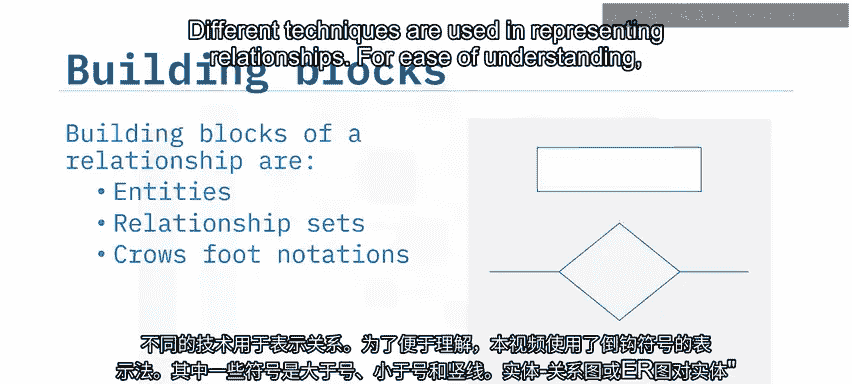

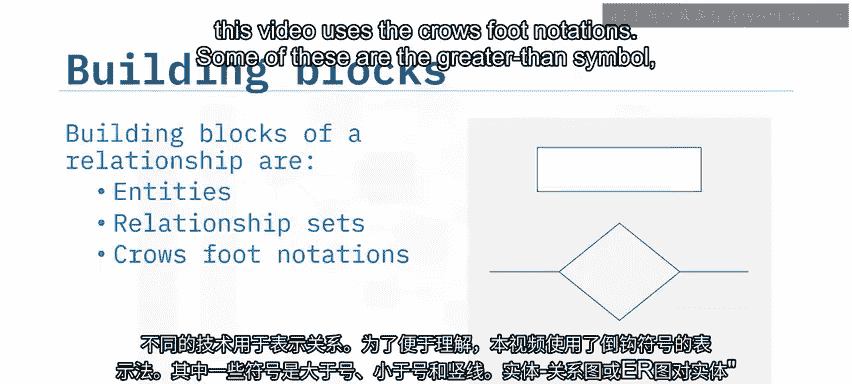

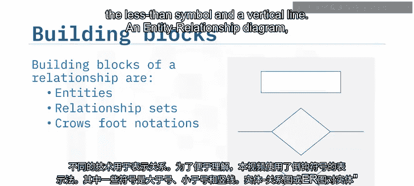

## 实体与属性

在实体关系图中，实体用矩形框表示，而实体的**属性**则用椭圆形表示。属性是描述实体特定性质的字段。

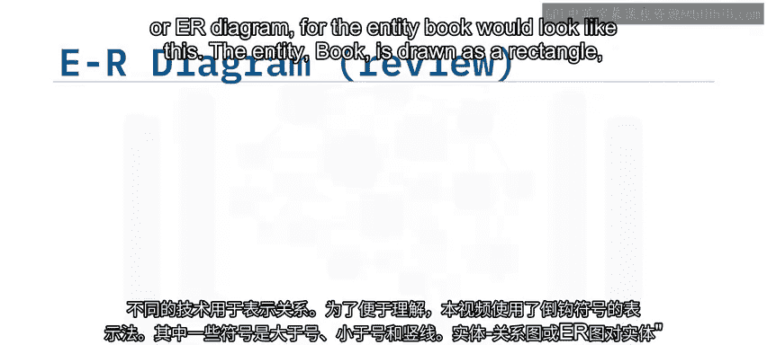

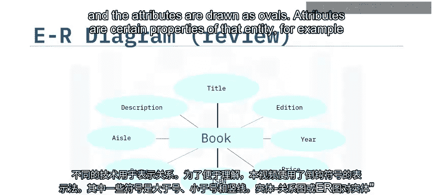

例如，“图书”实体可能拥有“标题”、“版次”、“出版年份”、“价格”等属性。每个属性必须且只能连接到一个实体。

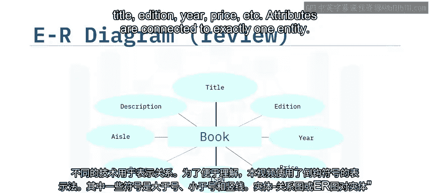

同样，“作者”实体可能拥有“姓氏”、“名字”、“邮箱”、“城市”、“国家”和“作者ID”等属性。

## 理解关系类型

上一节我们介绍了实体和属性的表示方法，本节中我们来看看实体之间如何通过不同类型的关系相互关联。

以“图书”和“作者”为例。一本书必须由至少一位作者撰写，但也可能由两位或更多位作者合著。反过来，一位作者可以只写一本书，也可以撰写两本或多本书。这种联系就是通过关系来定义的。

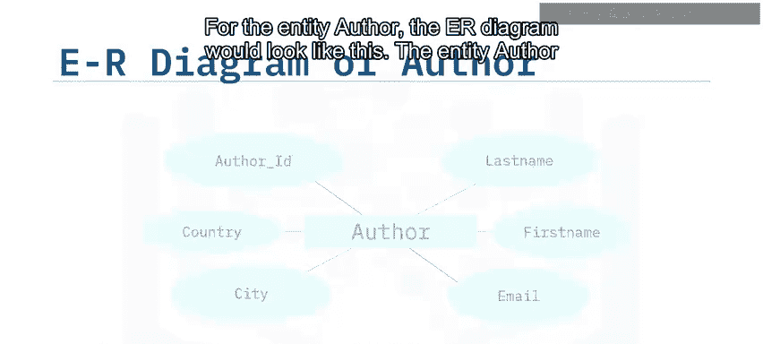

### 一对一关系

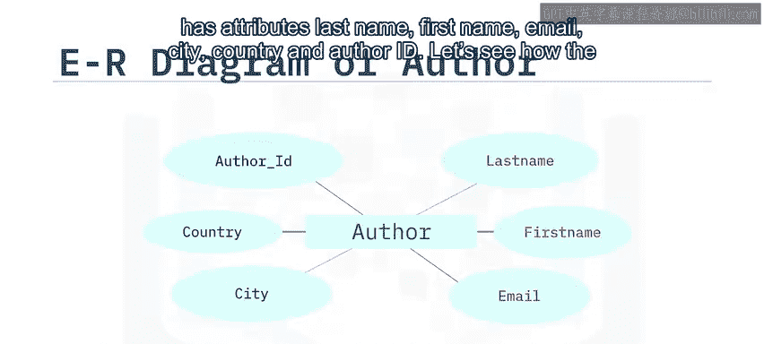

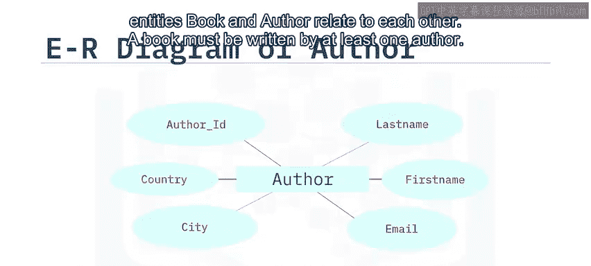

当每个实体实例只与另一个实体集中的一个实例相关联时，即构成一对一关系。

在关系图中，我们用一条**粗线**连接实体和关系集，表示“至少且恰好一个”的参与约束。

**示例公式**： `1本书` **<--[撰写]-->** `1位作者`
这表示一本书有且仅有一位作者，同时一位作者也只撰写这一本书。

> 注意：在关系图中，为了保持清晰，通常只显示实体，而省略属性，因为属性会使图表变得杂乱。

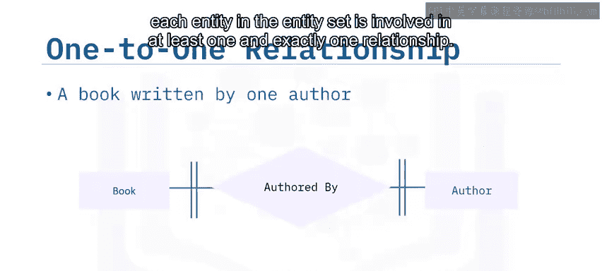

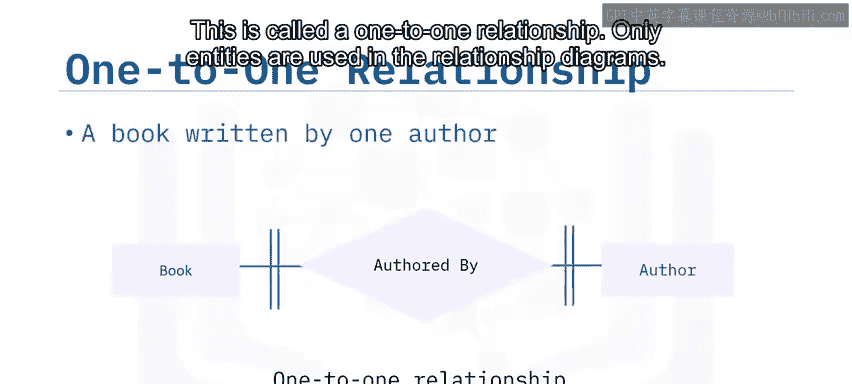

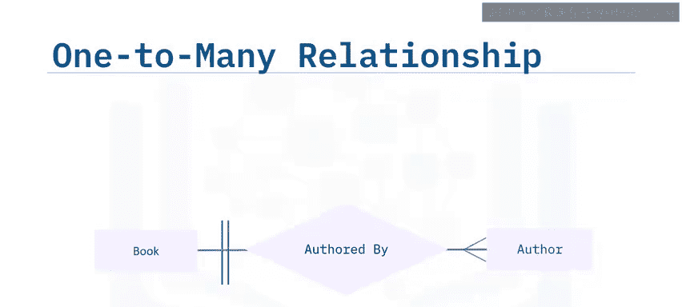

### 一对多关系

当实体集A中的一个实例可以与实体集B中的多个实例相关联，但B中的一个实例只能与A中的一个实例相关联时，即构成一对多关系。

这里我们引入**鸦脚表示法**。在“图书”端使用小于号（`<`），表示“图书”实体参与了关系集中的多个关系。

**示例公式**： `1本书` **<--[撰写]--<** `多位作者`
这表示一本书可以由多位作者合著（一对多），反之，从作者角度看，多位作者共同撰写一本书（多对一）。

### 多对多关系

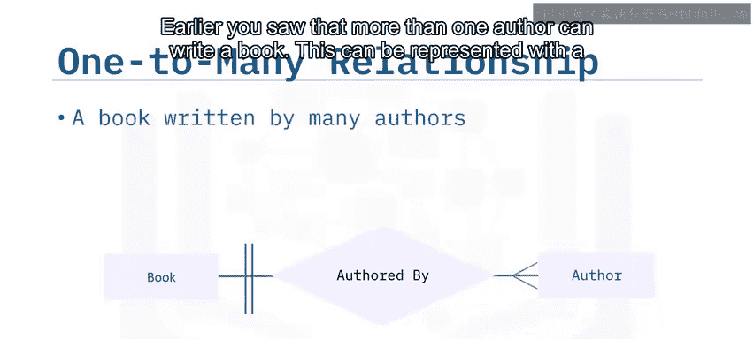

当实体集A中的多个实例可以与实体集B中的多个实例自由关联时，即构成多对多关系。

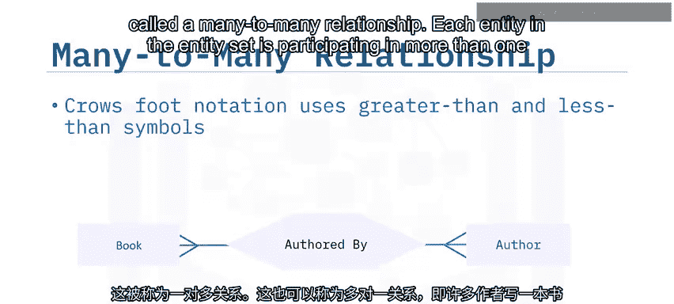

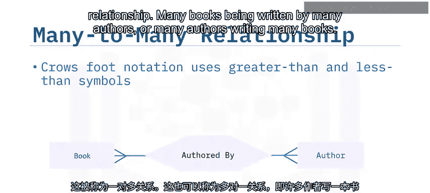

在关系集的两侧分别使用大于号（`>`）和小于号（`<`）来表示这种关系。

**示例公式**： `多本书` **>--[撰写]--<** `多位作者`
这表示多位作者可以共同撰写多本不同的书籍，同时一本书也可以由多位作者合作完成。关系集中的每个实体都参与了多个关系。

## 总结

本节课中我们一起学习了关系数据库设计的核心——关系类型。

我们了解到：
1.  关系由**实体**、**关系集**和**鸦脚表示法**构成。
2.  **一对一关系**指一个实体只关联另一个实体的一个实例，例如一本书对应唯一作者。
3.  **一对多关系**指一个实体关联另一个实体的多个实例，例如一本书拥有多位合著者。
4.  **多对多关系**指多个实体实例与另一个实体集的多个实例相互关联，例如多位作者合作撰写多本不同的书籍。

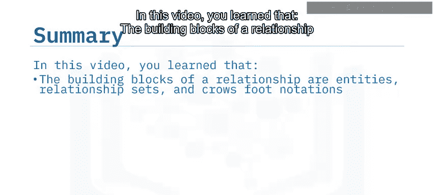

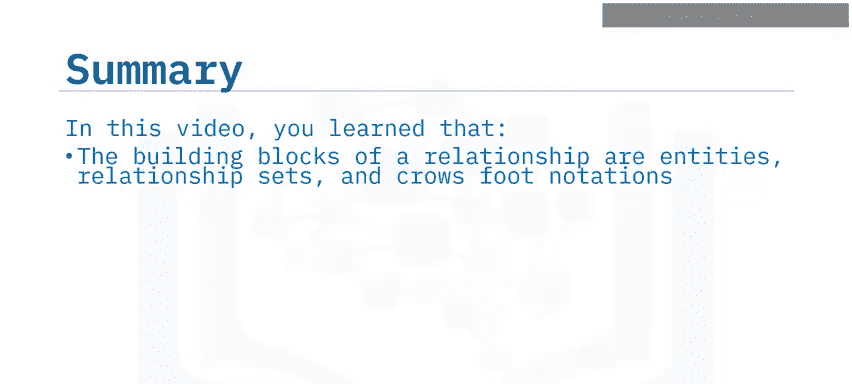

掌握这些关系类型是进行规范化数据库设计的关键基础。