# 004：将实体映射到表 📊

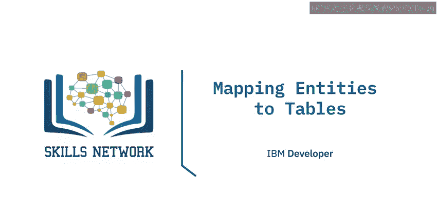

在本节课中，我们将学习如何将实体关系图（ERD）中的实体和属性，映射为关系数据库中的具体表格。这是数据库设计的关键一步。

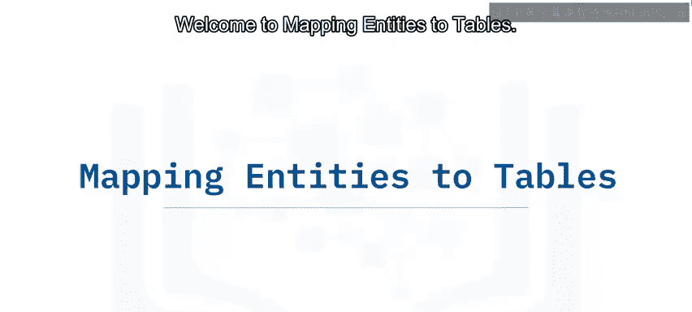

---

## 概述

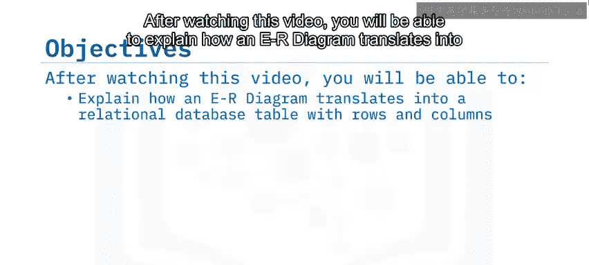

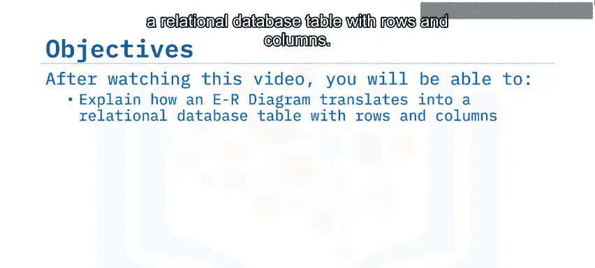

实体关系图是关系数据库设计的基础。我们首先创建ERD，然后将其映射到数据库中的表。本节将详细讲解这一映射过程。

---

## 从实体到表的映射

上一节我们介绍了实体关系图的基本概念。本节中，我们来看看如何将ERD中的一个实体及其属性，转换为数据库中的一张表。

以一个名为 **Book**（书籍）的实体为例。该实体拥有多个属性，如 `BookID`、`Title`、`ISBN` 等。

在映射过程中：
*   **实体** 本身成为数据库中的一张**表**。
*   实体的**属性** 则成为该表中的**列**。

为了便于理解，我们可以将实体和其属性分开来看。在这个例子中，实体 **Book** 变成了一张名为 `Book` 的表。

---

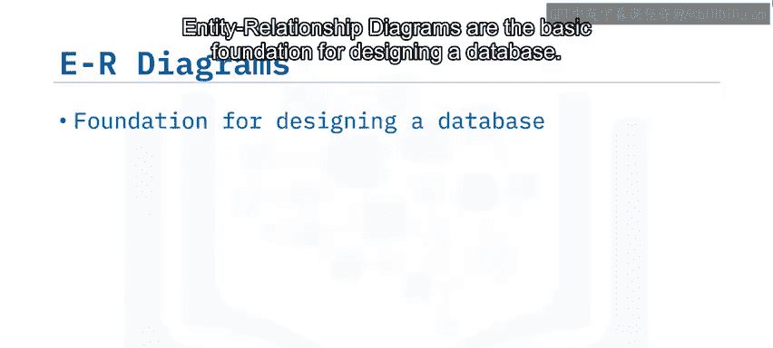

## 表的构成：行与列

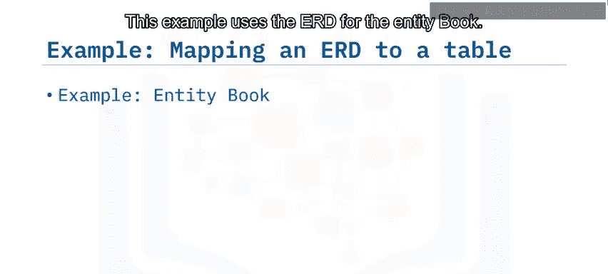

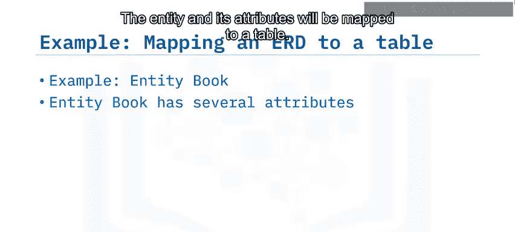

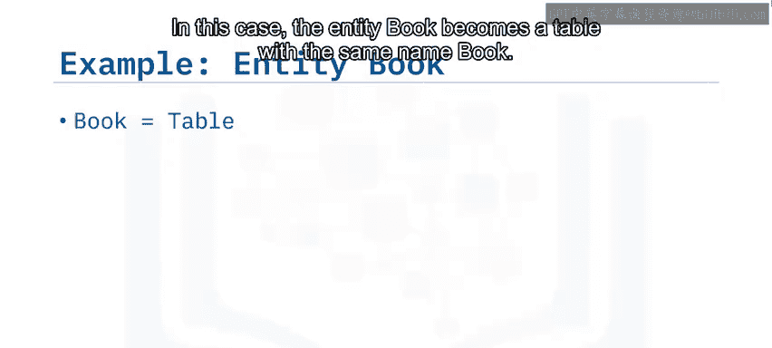

现在，我们来看看表在关系数据库模型中的具体形式。一张表是行和列的组合。

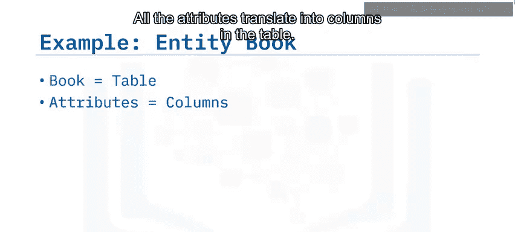

在映射的初始阶段，实体变成了表，但此时表还没有具体的行和列形式。只有当属性被翻译成表中的列后，表才具备了基本的行列结构。

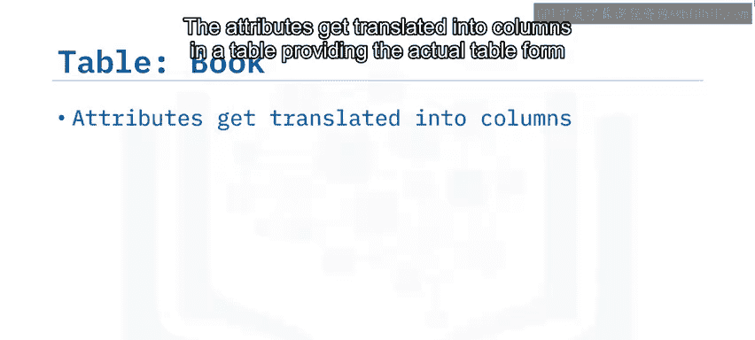

以下是映射过程的总结：

1.  **实体映射为表**：例如，实体 `Book` 映射为 `Book` 表。
2.  **属性映射为列**：实体的每个属性（如 `BookID`, `Title`）成为表中的一个列。
3.  **添加数据形成行**：后续向这些列中添加具体的数据值，就形成了表中的行，从而完成一张完整的数据表。

让我们通过另一个例子来巩固理解。对于 **Author**（作者）实体：

*   实体 `Author` 成为 `Author` 表。
*   其属性（如 `AuthorID`, `Name`）成为表中的列。
*   向这些列填入作者信息后，就构成了完整的 `Author` 数据表。

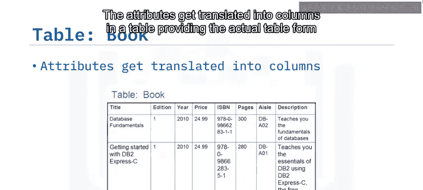

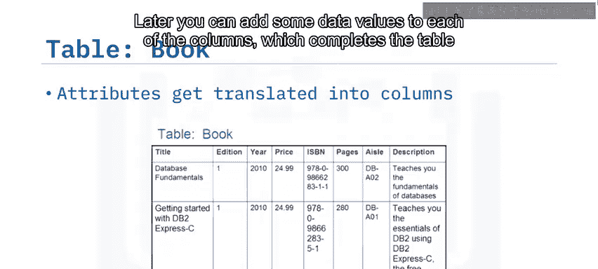

---

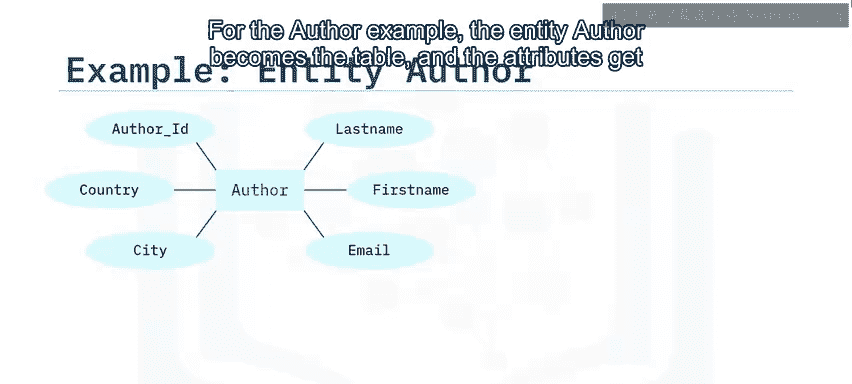

## 总结

本节课中，我们一起学习了实体关系图到数据库表的映射过程。我们了解到：

*   实体关系图是数据库设计的基础。
*   将ERD转换为关系数据库表时，**实体成为表**，**属性成为表中的列**。
*   通过向列中添加数据，最终形成包含行和列的完整数据表。

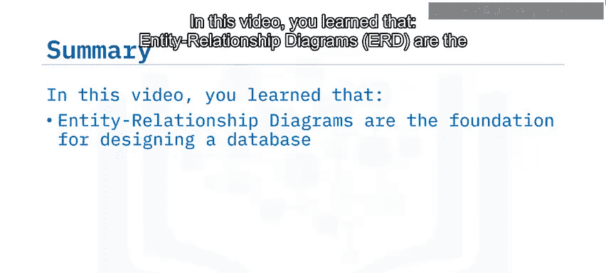

掌握这一映射原理，是进行后续数据库表设计和操作的重要前提。