# 006：关系模型核心概念 📚


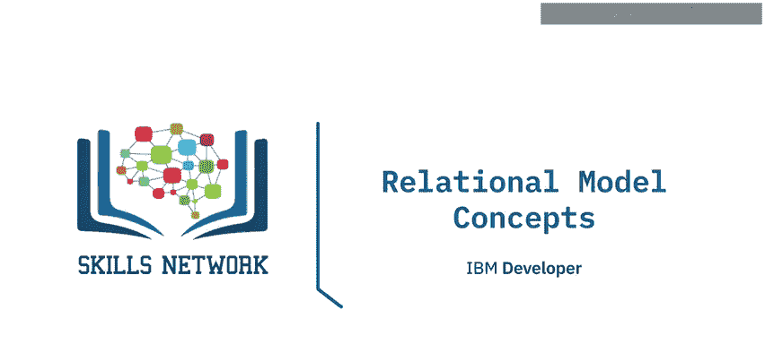

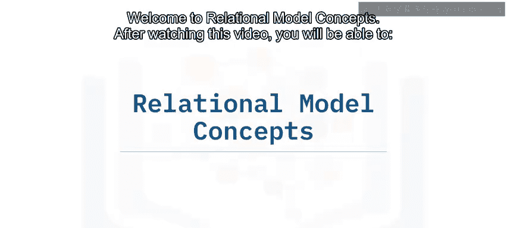

在本节课中，我们将学习关系模型的基本概念。我们将定义关系、度数和基数等关键术语，并解释关系模式与关系实例之间的区别。

## 关系模型的数学基础 🧮

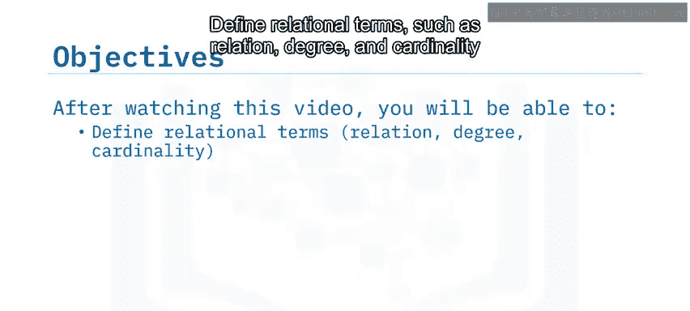

上一节我们介绍了关系数据库的概览，本节中我们来看看其背后的数学基础。关系模型于1970年首次提出，它建立在数学模型和数学术语之上。

关系模型的构建基石是**关系**和**集合**。关系数据模型基于关系的概念。关系本身是一个基于集合思想的数学概念。

一个**集合**是不同元素的无序集合。它是相同类型项目的集合，没有顺序，也没有重复项。

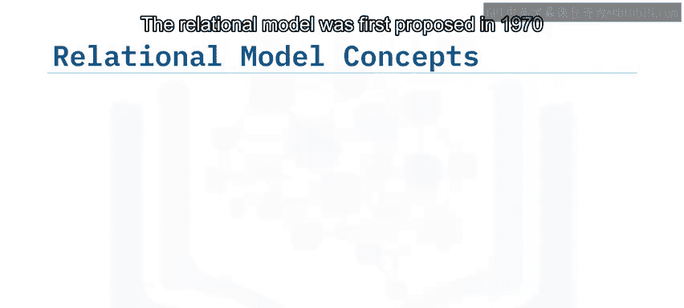

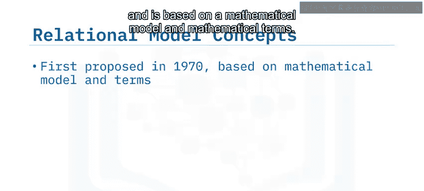

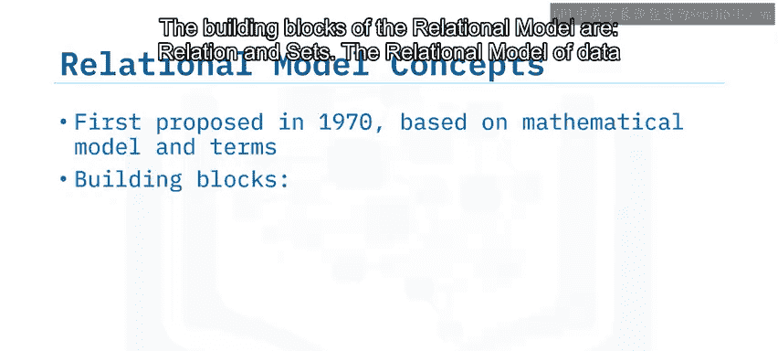

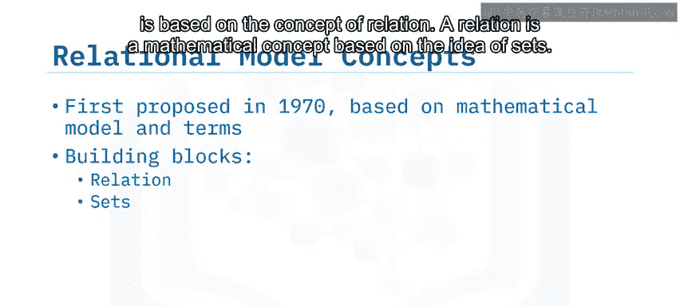

## 关系、模式与实例 📊

一个关系数据库就是一组关系的集合。在数学术语中，**关系**也指代**表**。一个表是行和列的组合。一个关系由两部分组成：**关系模式**和**关系实例**。

关系模式规定了关系的名称以及每一列（即属性）的类型。

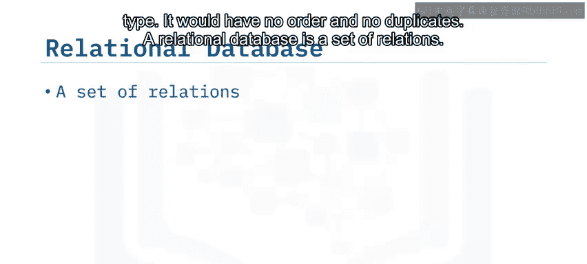

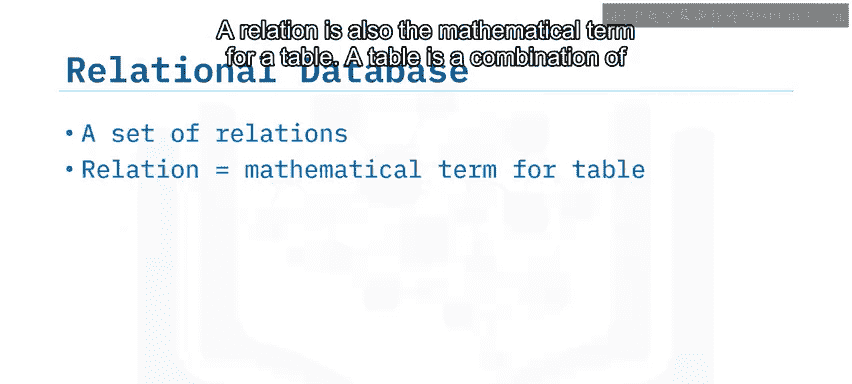

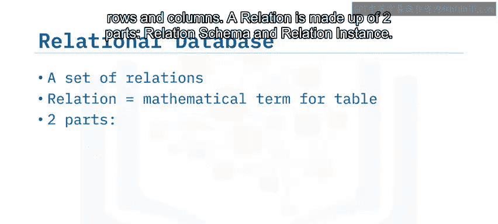

以下是关系模式的一个例子：

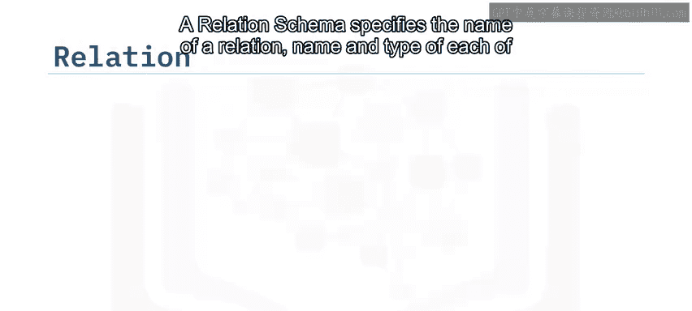

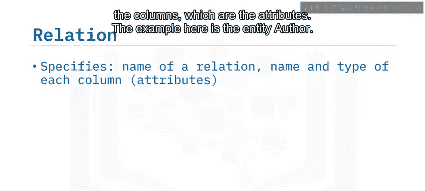

```sql
作者 (作者ID CHAR, 姓氏 VARCHAR, 名字 VARCHAR, 邮箱 VARCHAR, 城市 VARCHAR, 国家 CHAR)
```

在这个例子中：
*   `作者` 是关系的名称。
*   `作者ID` 是一个属性，其数据类型为 `CHAR`（定长字符串）。
*   `姓氏`、`名字`、`邮箱`、`城市` 的数据类型为 `VARCHAR`（变长字符串）。
*   `国家` 的数据类型也是 `CHAR`。

这构成了关系模式。

一个**关系实例**则是由行和列组成的实际表格。列是属性或字段，行是元组。

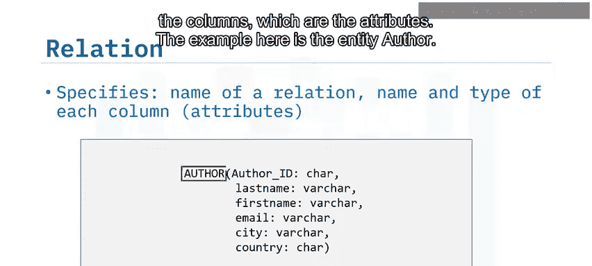

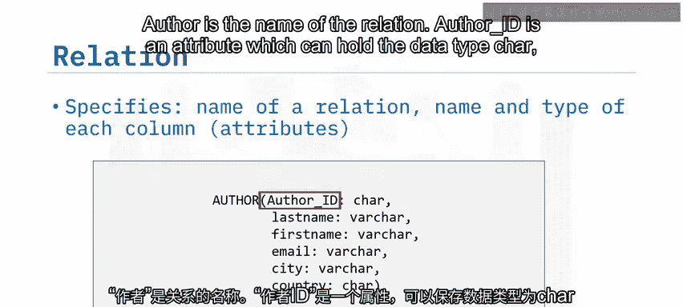

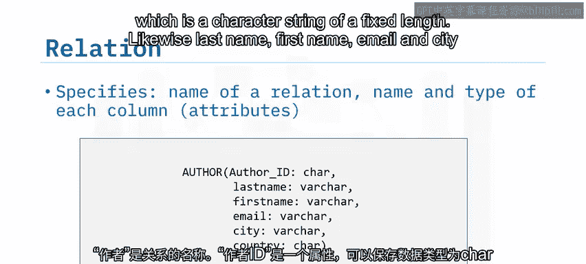

## 度数（Degree）与基数（Cardinality）🔢

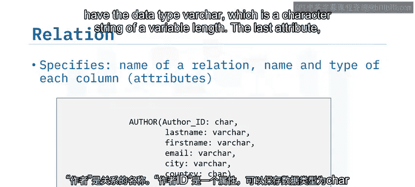

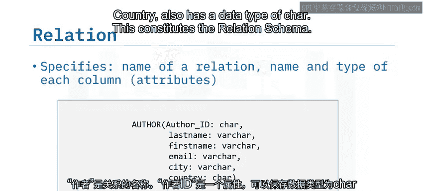

理解了关系的基本结构后，我们还需要掌握描述关系规模的两个重要指标。

以下是度数与基数的定义：
*   **度数** 指的是一个关系中属性或列的数量。
*   **基数** 指的是一个关系中元组或行的数量。

以作者表为例，如果该表有6列（作者ID、姓氏、名字、邮箱、城市、国家），那么它的**度数就是6**。如果该表中有5行作者数据，那么它的**基数就是5**。

## 总结 📝

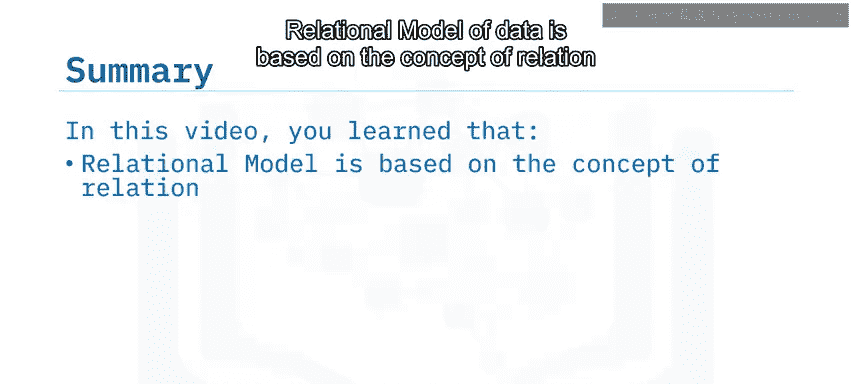

本节课中我们一起学习了关系模型的核心概念。我们了解到关系数据模型基于**关系**这一数学概念，关系在数学上等同于**表**。一个关系由**关系模式**（定义结构）和**关系实例**（实际数据）组成。**度数**描述了一个关系中列的数量，而**基数**描述了行的数量。掌握这些基础术语是理解后续更复杂数据库操作的关键。