# 007：数据库体系结构 🏗️

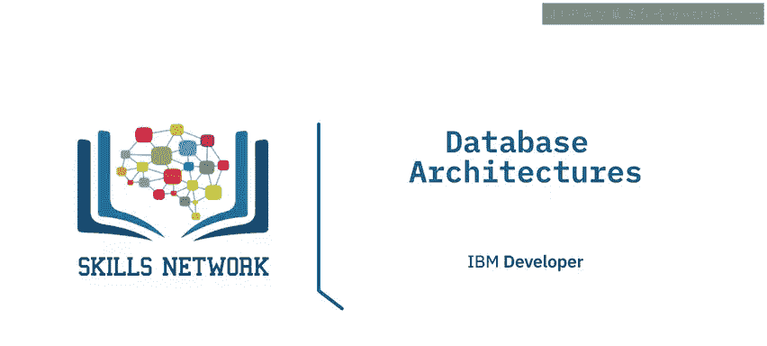

在本节课中，我们将学习数据库的部署拓扑结构，并详细解释两层和三层架构，包括其中的各个层级，例如数据库驱动程序、接口和API。

## 概述

数据库的部署拓扑结构取决于其使用方式和访问需求。不同的场景需要不同的架构来支持数据处理和用户访问。

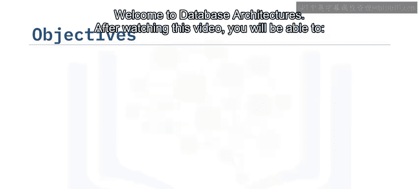

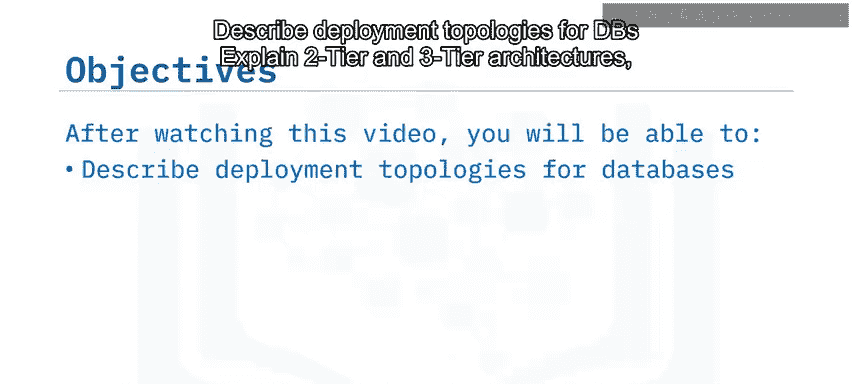

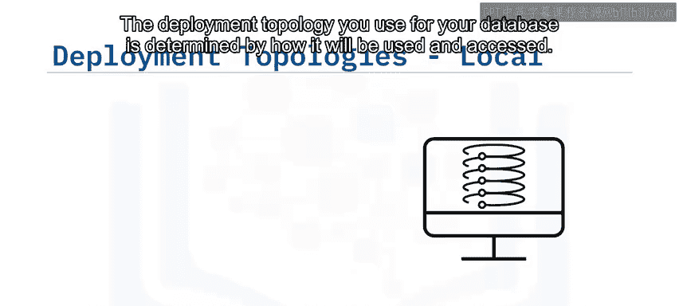

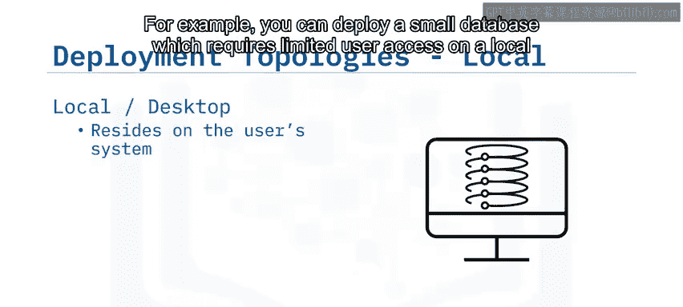

## 数据库部署拓扑

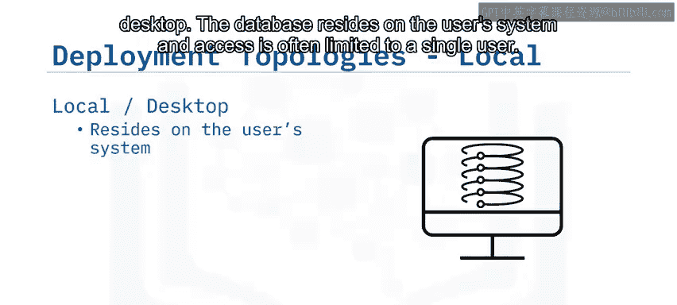

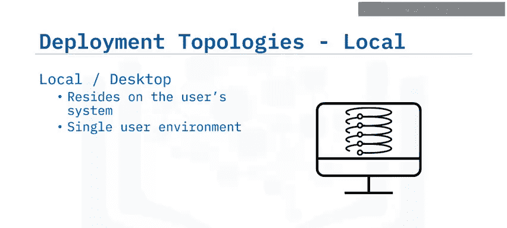

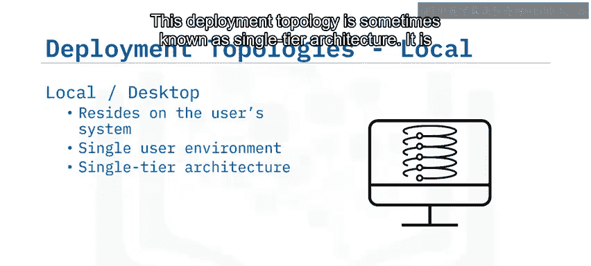

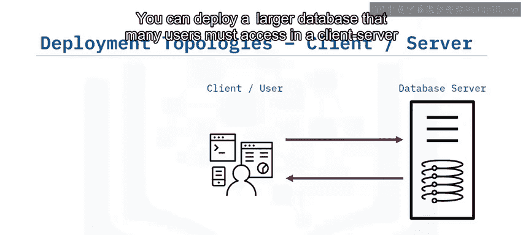

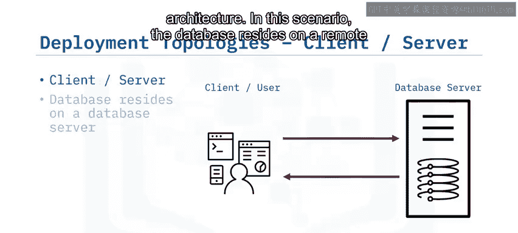

以下是几种常见的数据库部署拓扑结构。

### 单层架构

单层架构有时也称为单层拓扑。在这种架构中，数据库部署在用户的本地桌面系统上。访问通常仅限于单个用户。这种拓扑适用于开发和测试，或者当数据库嵌入在本地应用程序中时。

### 客户端-服务器架构（两层架构）

对于需要许多用户访问的较大型数据库，通常采用客户端-服务器架构。在这种场景下，数据库驻留在远程服务器上，用户通过网页或本地应用程序从客户端系统访问它。这种部署通常用于多用户场景，是生产环境的典型选择。

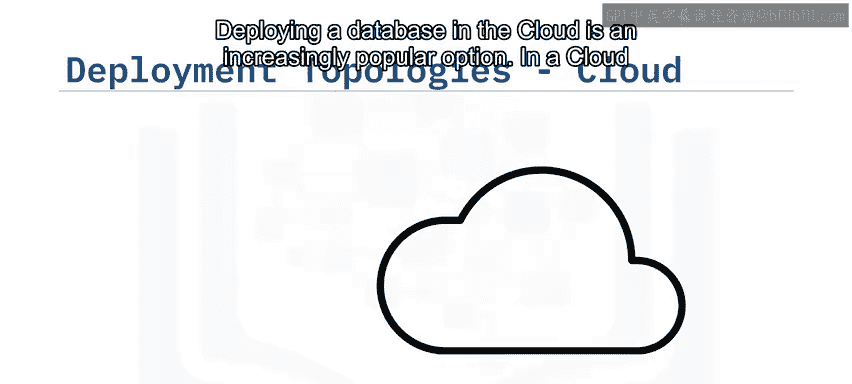

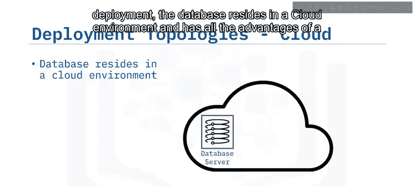

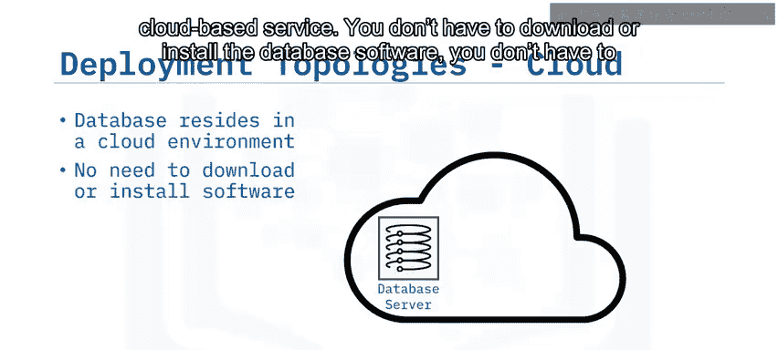

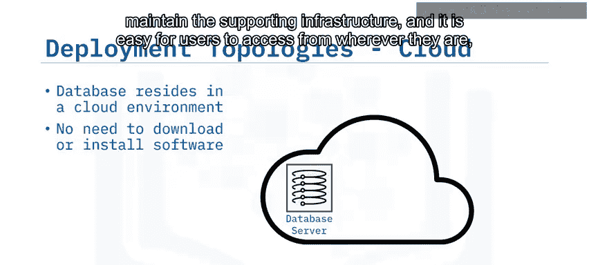

### 三层架构

某些场景会在应用程序客户端和远程数据库服务器之间采用一个中间层或应用服务器层。在这种三层架构中，数据库驻留在远程服务器上，用户通过应用服务器或中间层访问它。这提供了更好的可扩展性和安全性。

### 云部署

在云部署中，数据库驻留在云环境中，具备基于云服务的所有优势。用户无需下载或安装数据库软件，也无需维护支持基础设施。只要拥有互联网连接，用户就可以随时随地轻松访问数据库。在云部署中，客户端应用程序和用户通常通过云中的应用服务器层或接口访问数据库。云部署非常灵活，可用于开发、测试和完整的生产环境。

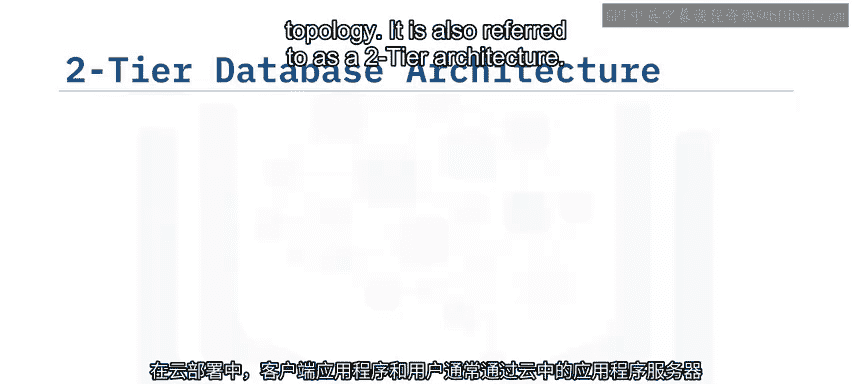

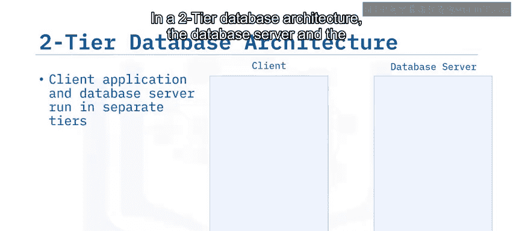

## 深入理解客户端-服务器拓扑

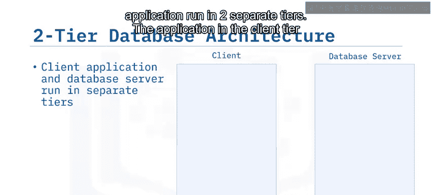

客户端-服务器拓扑也称为两层架构。在两层数据库架构中，数据库服务器和应用程序运行在两个独立的层级。

应用程序在客户端层通过某种数据库接口（例如API或框架）连接到数据库服务器，该接口可能依赖于编写应用程序的编程语言。数据库接口通过安装在客户端系统上的数据库客户端或API与数据库服务器通信。

服务器上的数据库管理系统软件（DBMS）包含多个层级，从高层次上可以分为数据访问层、数据库引擎层和数据库存储层。

数据访问层服务器包含用于不同类型客户端的接口，这些接口可以是行业标准API，如**JDBC**和**ODBC**，命令行处理器（CLP）接口，以及供应商特定或专有接口。

数据库服务器还包含一个引擎，用于编译查询、检索和处理数据，然后返回结果集。数据库存储或持久层是数据存储的地方，可能位于同一设备的本地存储上，也可能物理驻留在网络存储或专用存储设备上。

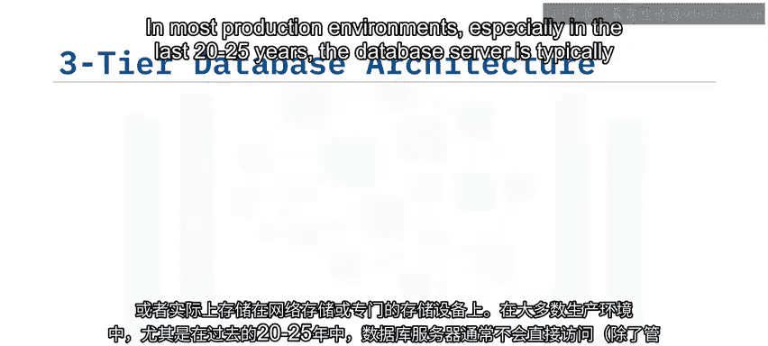

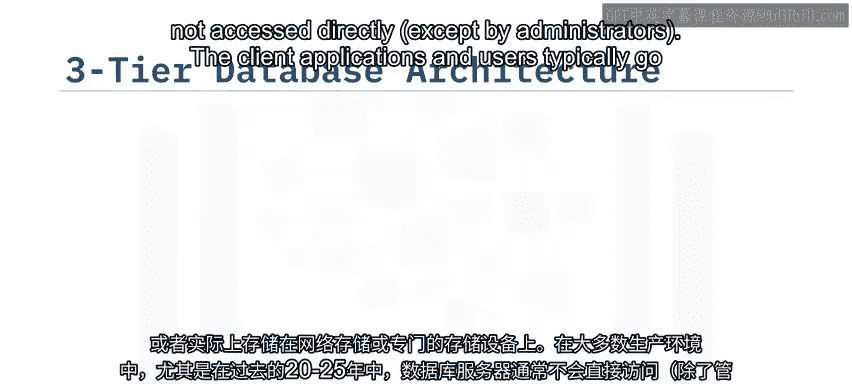

## 三层架构详解

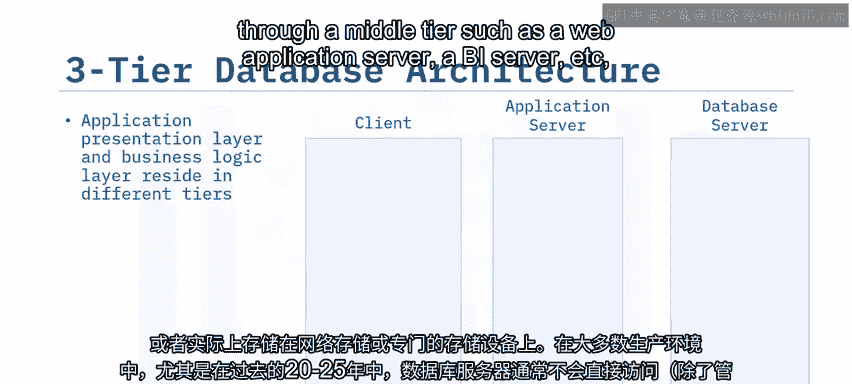

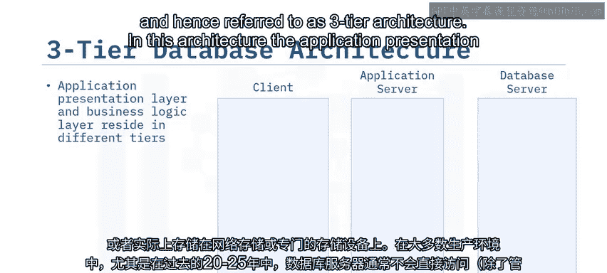

在大多数生产环境中，尤其是在过去20到25年里，数据库服务器通常不直接访问（管理员除外）。客户端应用程序和用户通常通过一个中间层（例如Web应用服务器、BI服务器等）进行访问，因此被称为三层架构。

在这种架构中，应用程序表示层和业务逻辑层驻留在不同的层级。表示层是最终用户与之交互的界面，可以是传统的桌面应用程序、Web浏览器或移动应用程序。客户端应用程序通过网络与应用服务器通信。应用服务器封装了应用程序和业务逻辑，并通过数据库API或驱动程序与数据库服务器通信。

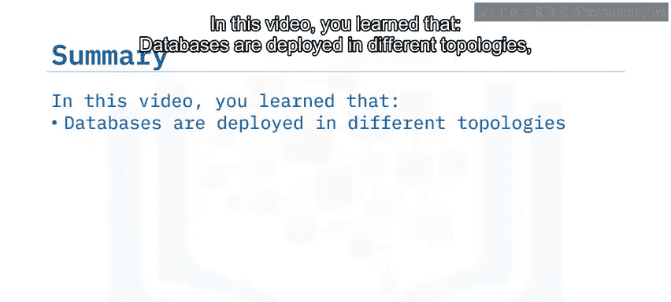

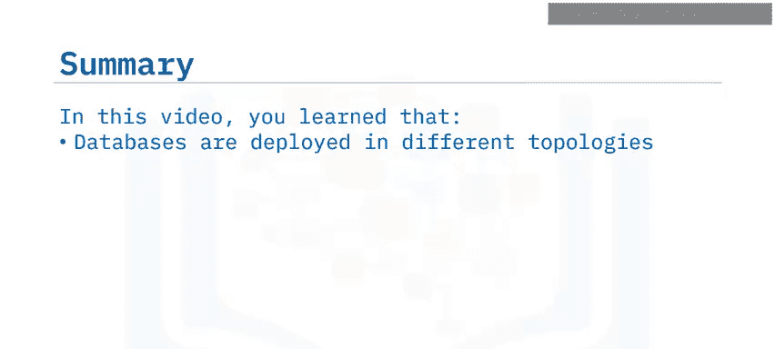

例如，假设客户端应用程序是一个互联网银行应用或手机银行应用。该应用连接到银行应用服务器，而银行应用服务器又与存储用户账户数据的银行数据库服务器连接。

## 总结

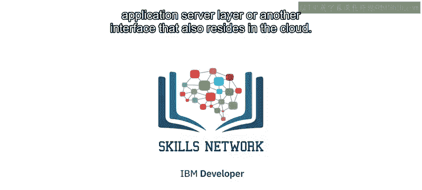

本节课我们一起学习了数据库的不同部署拓扑结构，了解了如何根据处理需求和访问要求选择最适合的架构。单层拓扑将数据库安装在用户的本地桌面上，适用于仅需单用户访问的小型数据库。两层数据库拓扑中，数据库驻留在远程服务器上，用户从客户端系统访问它。三层数据库拓扑中，数据库驻留在远程服务器上，用户通过应用服务器或中间层访问它。最后，在云部署中，数据库驻留在云端，用户通过同样驻留在云端的应用服务器层或其他接口访问它。