# 008：分布式体系结构与集群数据库 🗄️

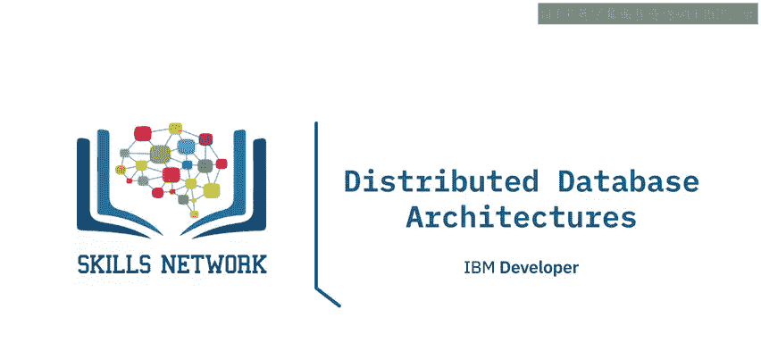

在本节课中，我们将要学习关系数据库管理系统（RDBMS）的分布式体系结构。我们将探讨如何利用多台机器组成的集群来构建数据库，以满足高可用性、可扩展性和处理大规模工作负载的需求。

## 分布式架构概述

之前我们探讨的架构中，数据库都驻留在单台服务器上。然而，对于关键或大规模的工作负载，当高可用性和/或可扩展性至关重要时，主流的关系数据库管理系统也提供分布式架构，利用机器集群来承载数据库。

分布式数据库架构的主要类型包括**共享磁盘架构**和**无共享架构**。后者可以采用**复制**或**分区**技术。在某些情况下，你还会发现结合了其中一种或多种技术，甚至使用专门硬件组件来实现高可用性和可扩展性的架构。

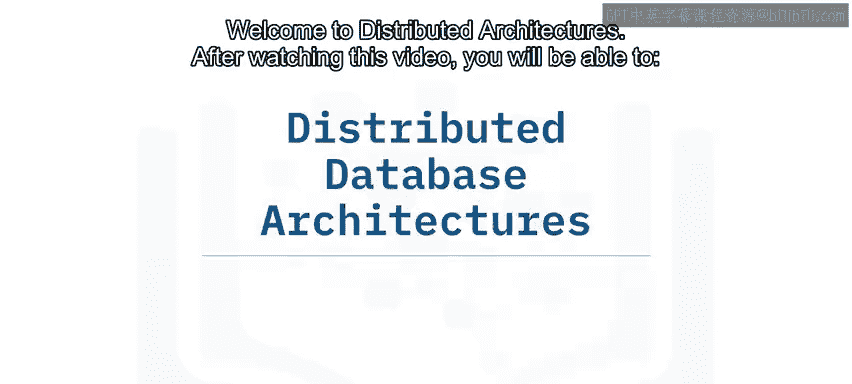

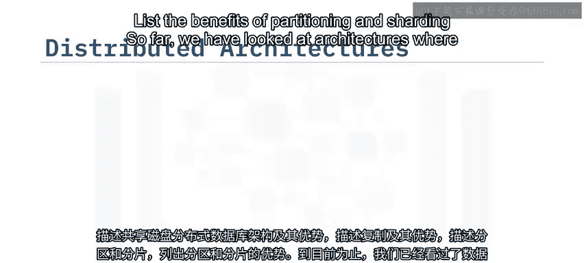

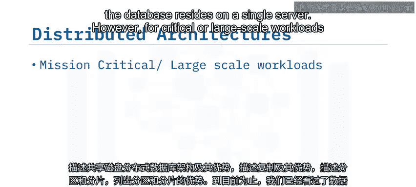

## 共享磁盘架构

在共享磁盘数据库架构中，多台数据库服务器并行处理工作负载，从而允许工作负载被更快地处理。

以下是共享磁盘架构的关键特点：

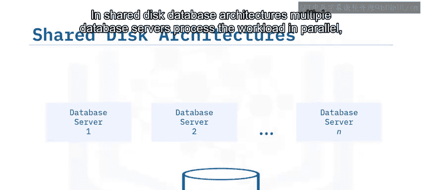

*   每台数据库服务器都连接到共享存储基础设施。
*   服务器之间通过高速互连彼此连接。
*   客户端工作负载可以分布到不同的数据库服务器上，从而实现可扩展性。
*   当其中一台服务器发生故障时，连接到它的客户端可以被重新路由到数据库集群中的其他服务器，从而实现高可用性。

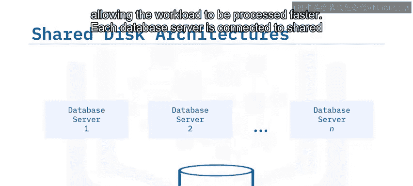

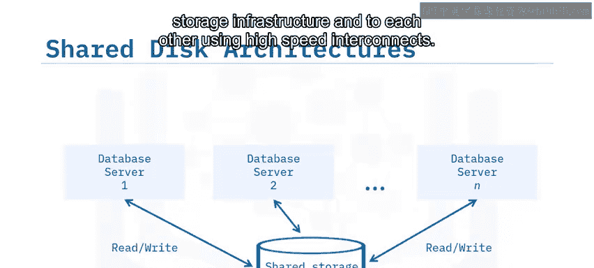

## 数据库复制

上一节我们介绍了共享磁盘架构，本节中我们来看看另一种实现高可用性和灾难恢复的技术：数据库复制。

数据库复制是一种技术，发生在数据库服务器上的更改会被复制到一个或多个数据库副本中。

以下是复制的两种主要类型及其作用：

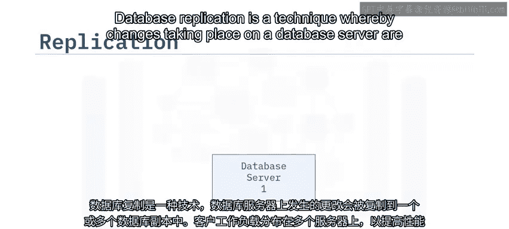

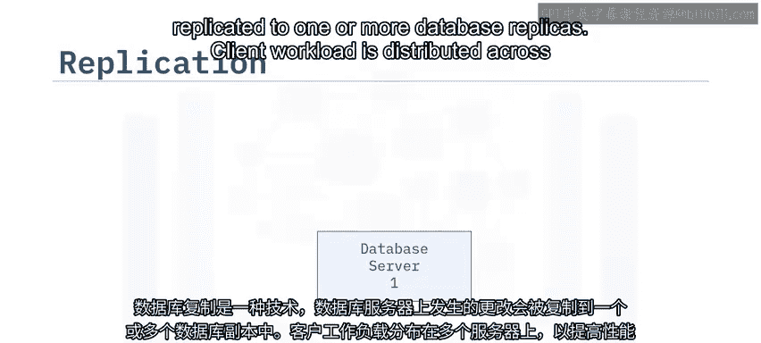

*   **高可用性副本**：当副本位于同一地理位置时，它被称为高可用性副本。当主数据库服务器发生故障（如软件或硬件故障）时，连接到它的客户端可以被重新路由到高可用性副本。
*   **灾难恢复副本**：为了应对站点级灾难（如整个数据中心因停电、火灾、地震或洪水而中断），可以在地理上分散的位置设置副本。这样，客户端就可以被路由到灾难恢复副本。

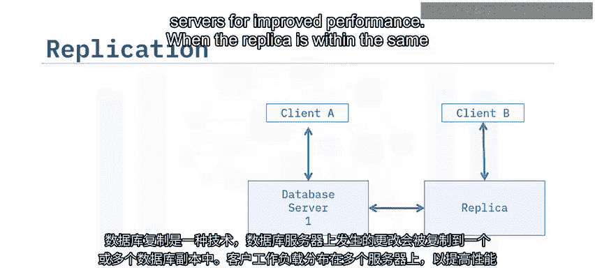

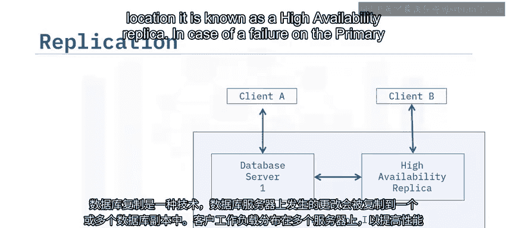

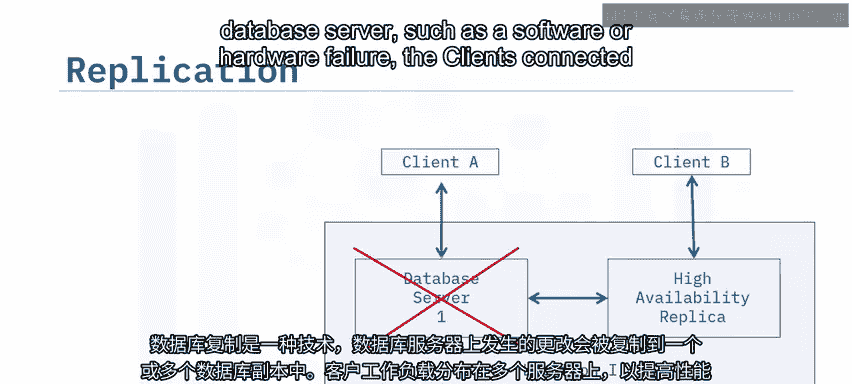

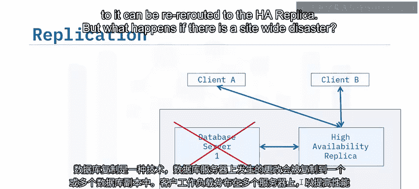

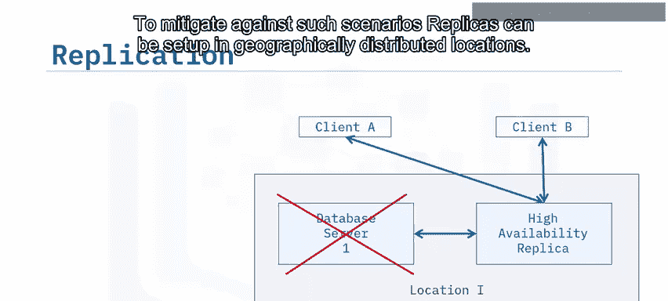

## 分区与分片

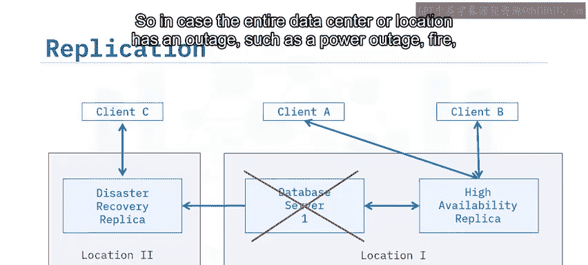

我们已经了解了复制如何提供数据冗余，现在我们来探讨另一种用于处理海量数据的技术：分区与分片。

你可以将需要包含极大量数据的表划分为多个逻辑分区，每个分区包含整体数据的一个子集。例如，按季度划分销售记录：`quarter1`， `quarter2` 等。

当这些分区被放置在集群中的独立节点上时，就称为**分片**。

以下是分片的核心机制：

*   每个分片拥有自己的计算资源（处理、内存和存储）来处理其数据子集或分区。
*   当客户端发出查询时，查询会在数据库的多个节点或分片上并行处理。
*   来自不同节点的查询结果会被综合起来，返回给客户端。
*   随着数据或查询工作负载的增加，可以向数据库集群添加额外的分片和节点，以增加并行处理能力并提升性能。

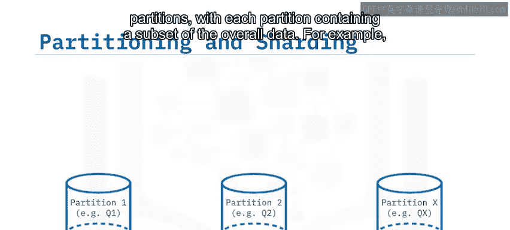

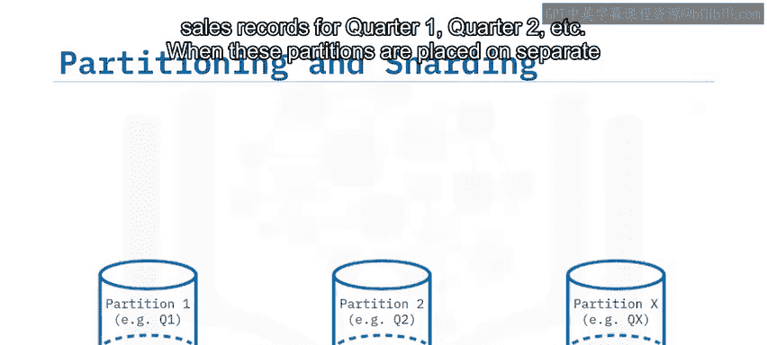

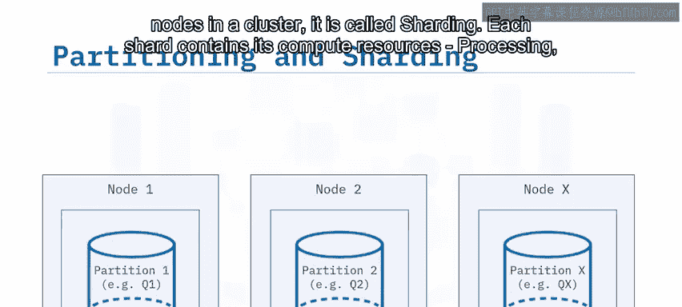

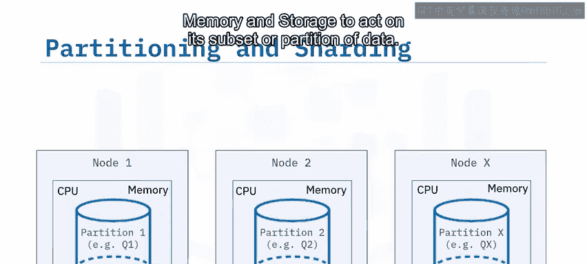

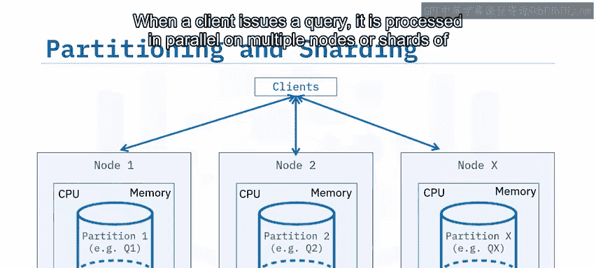

数据库分区和分片更常见于涉及海量数据的数据仓库和商业智能工作负载中。

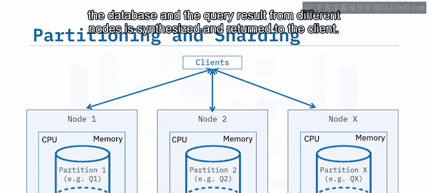

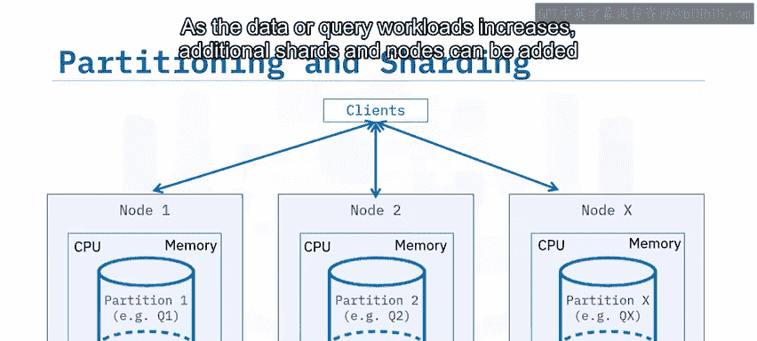

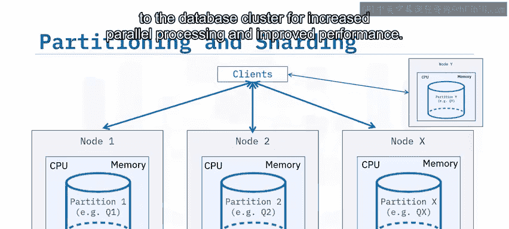

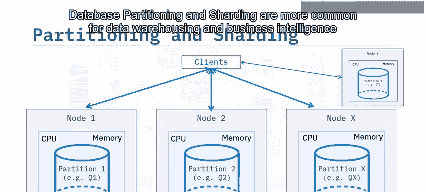

## 课程总结

本节课中，我们一起学习了关系数据库的分布式体系结构。

你了解到，在共享磁盘数据库架构中，多台数据库服务器并行处理工作负载，从而允许工作负载被更快地处理。

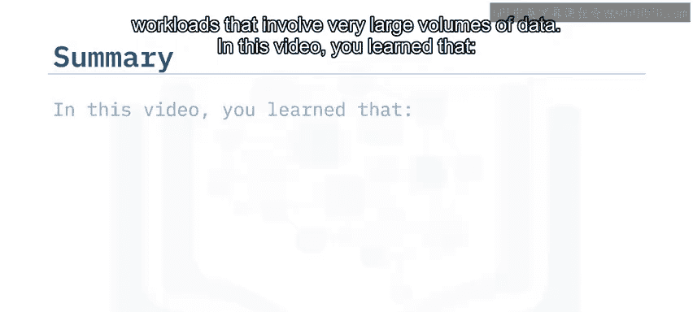

在数据库复制中，发生在数据库服务器上的更改会被复制到一个或多个数据库副本。位于单一地理位置的数据库复制提供了高可用性。当数据库副本存储在不同地理位置时，它提供了用于灾难恢复的数据副本。

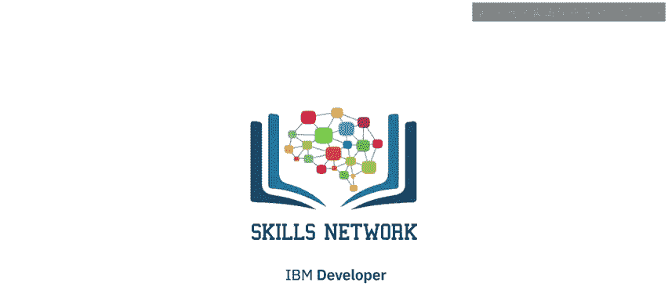

在分区技术中，超大的表被拆分到多个逻辑分区中。而在分片技术中，每个分区拥有自己的计算资源。