# 010：关系数据库产品简介 📚

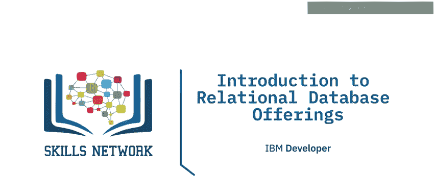

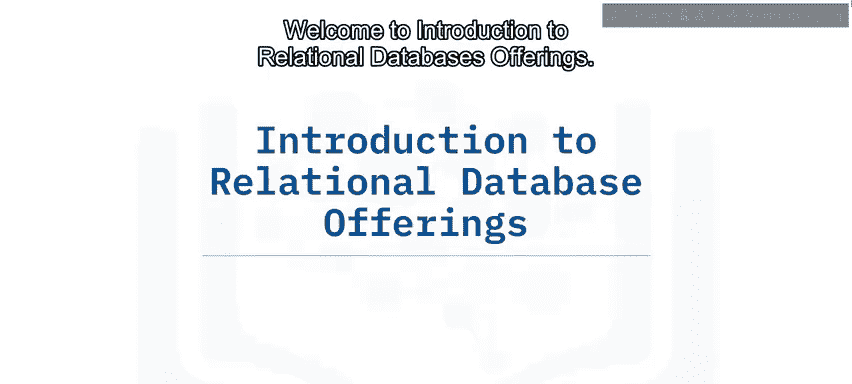

在本节课中，我们将要学习关系数据库的发展简史，了解主流商业与开源数据库产品，并探讨过去十年间开源与商业数据库的流行趋势，以及云数据库的兴起。

## 关系数据库简史 📜

上一节我们了解了关系数据库的基本概念，本节中我们来看看它的发展历程。

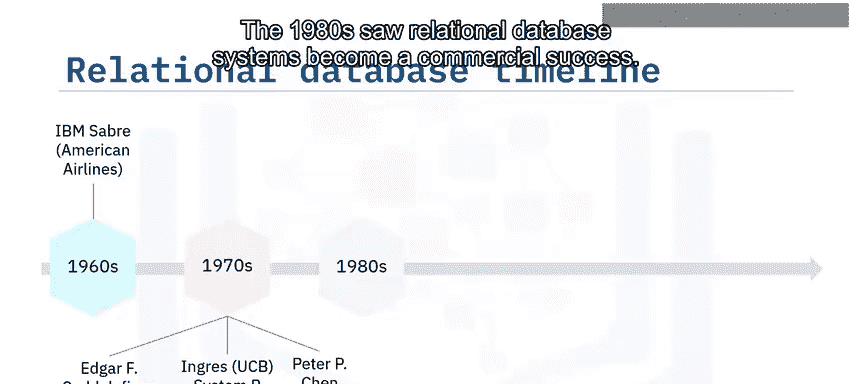

第一个可被识别为关系数据库的产品出现在20世纪60年代，即美国航空公司使用的IBM Saber座位预订系统。70年代初，埃德加·F·科德列出了定义关系数据库的12条规则。70年代末，加州大学伯克利分校开发的Ingress和IBM圣何塞研发的System R投入使用。1976年，陈品山提出了一种名为实体关系（ER）的新数据库模型。到了80年代，关系数据库系统取得了商业上的成功。

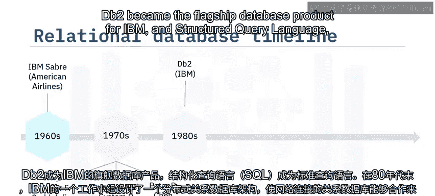

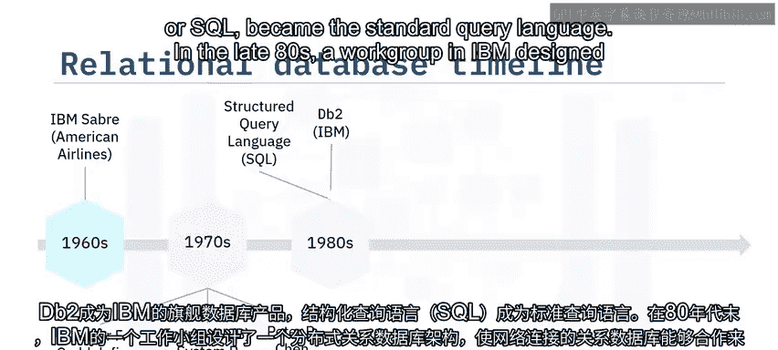

## 商业数据库的兴起 🏢

随着SQL成为标准查询语言，商业数据库产品开始主导市场。

DB2成为IBM的旗舰数据库产品，而结构化查询语言（SQL）成为了标准查询语言。80年代末，IBM的一个工作组设计了一种分布式关系数据库架构，使网络连接的关系数据库能够协作处理SQL请求。90年代初，包括Oracle Developer、PowerBuilder和VB在内的新应用开发客户端工具，以及ODBC、Excel和Access等个人生产力工具开始流行。90年代末，数据库行业呈指数级增长，普通桌面用户开始使用客户端-服务器数据库系统来访问包含遗留数据的计算机系统。一些最流行的关系数据库包括Oracle、Microsoft SQL Server和IBM DB2等巨头。

## 开源数据库的崛起 🐧

进入21世纪，开源数据库开始获得主流关注并取代了许多商业数据库。

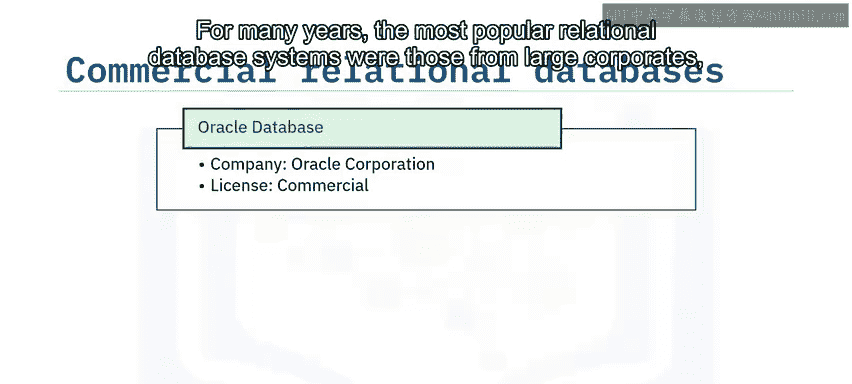

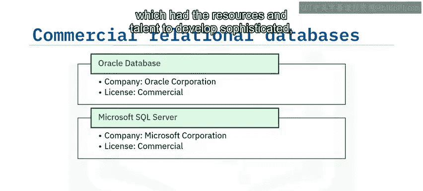

在2000年代后期，像MySQL、PostgreSQL和SQLite这样采用开源许可的关系数据库系统人气激增。开源数据库在多种许可类型下运作。

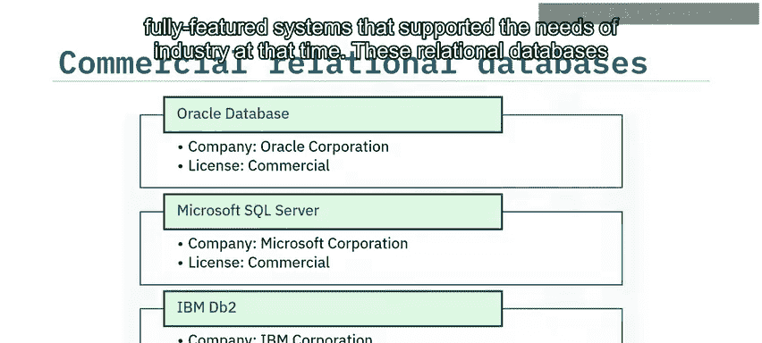

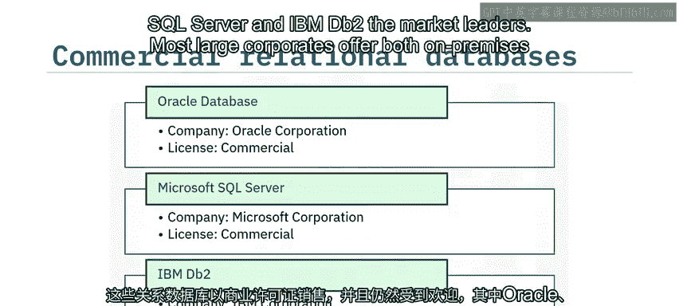

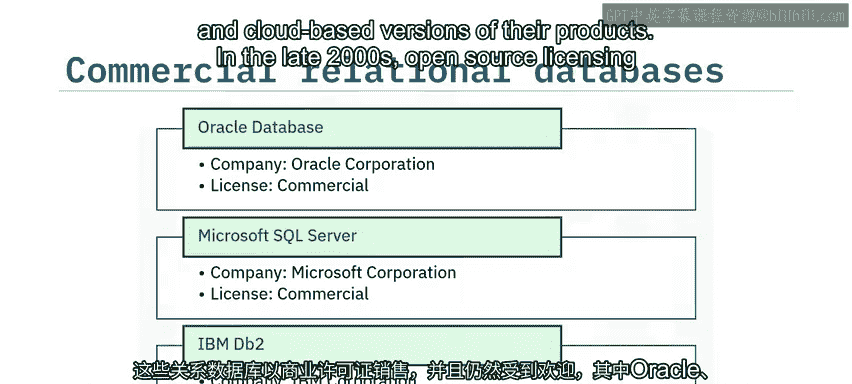

以下是几种流行的开源数据库示例：
*   **MySQL**：由Oracle公司出品，采用GPLv2许可。
*   **PostgreSQL**：由PostgreSQL全球开发组出品，采用自由开放源码的PostgreSQL许可。
*   **SQLite**：由D. Richard Hipp出品，属于公共领域。

## 数据库产品流行度分析 📊

行业分析机构DB-Engines每月评估不同类型数据库产品的流行度。

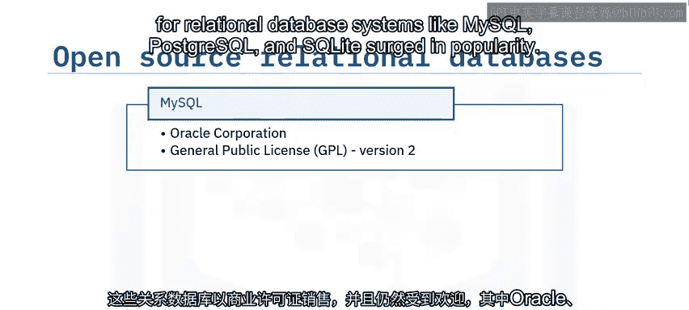

该列表显示了截至2021年2月最流行的10个关系数据库系统：
1.  Oracle
2.  MySQL
3.  Microsoft SQL Server
4.  PostgreSQL
5.  IBM DB2
6.  SQLite
7.  Microsoft Access
8.  MariaDB
9.  Hive
10. Microsoft Azure SQL Database

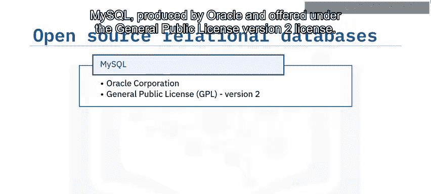

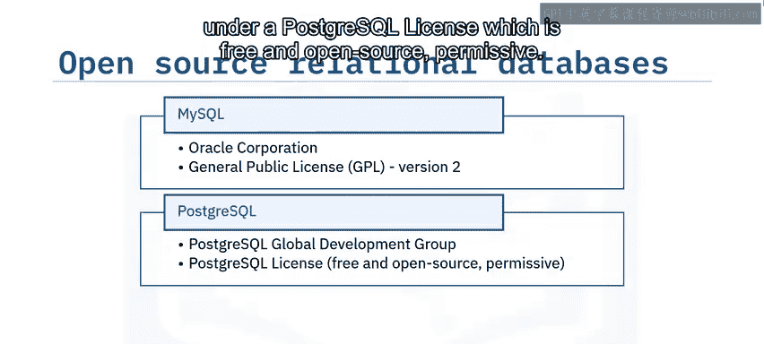

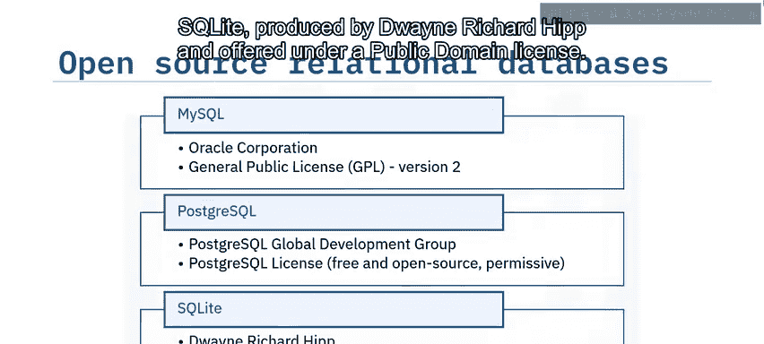

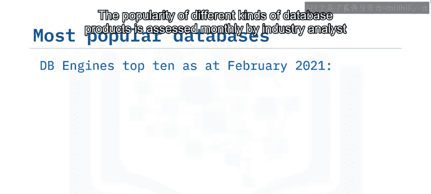

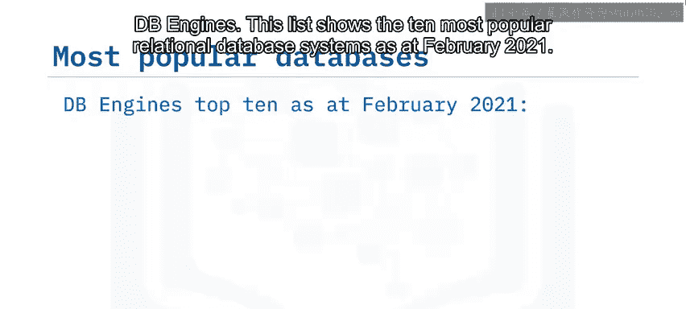

DB-Engines的排名基于多个因素的综合评估，包括网站在线提及频率、谷歌和必应搜索结果、谷歌趋势关注度、Stack Overflow等技术论坛讨论频率、招聘信息中的提及次数，以及LinkedIn等社交媒体资料中的出现频率。

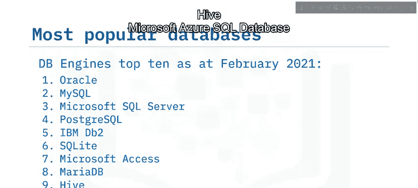

## 开源与商业数据库的趋势变化 📈

过去十年间，包括关系数据库在内的所有类型软件，其商业许可与开源许可的流行度发生了巨大变化。

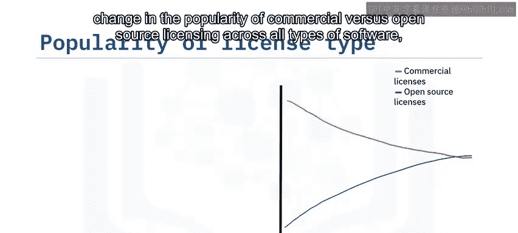

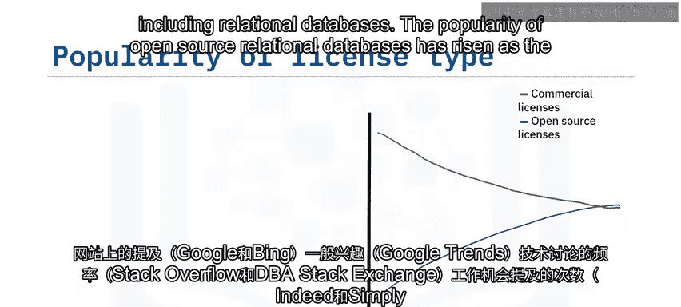

开源关系数据库的流行度上升，而商业数据库的流行度下降。2021年DB-Engines的一项研究发现，开源系统在总流行度得分中占50.1%，高于2013年的35.5%。

## 云数据库的兴起 ☁️

云数据库是通过云平台构建和访问的数据库服务。它具备传统数据库的许多功能，并增加了云计算的灵活性。

过去十年，云数据库的流行度稳步增长。这一趋势是由组织转向软件即服务（SaaS）模式以利用云优势（如增强的可扩展性）所驱动的。云数据库具有高度可扩展性，使组织能够处理数据分析所需的海量数据。

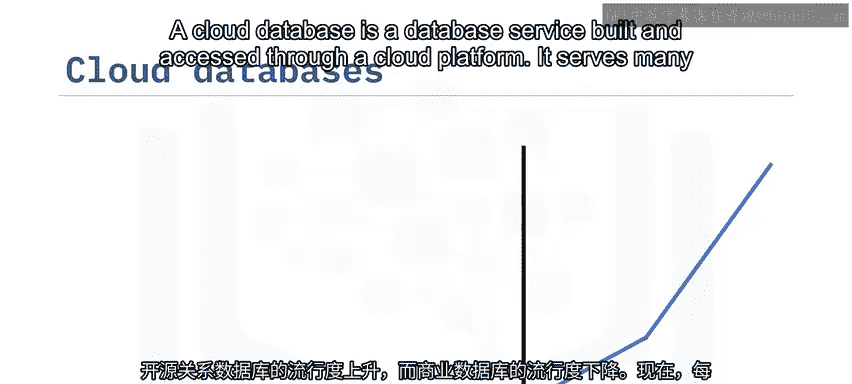

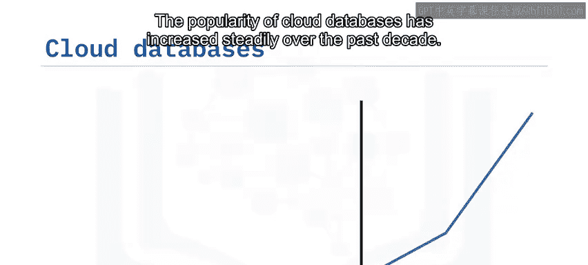

过去十年，云数据库的流行度增长了一倍多，且这一增长将持续。根据Gartner的预测，到2022年，75%的数据库将被部署或迁移到云平台。

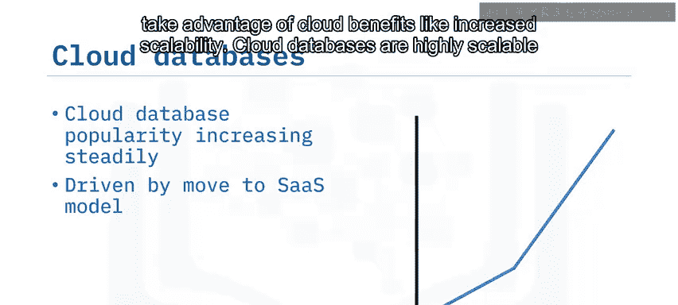

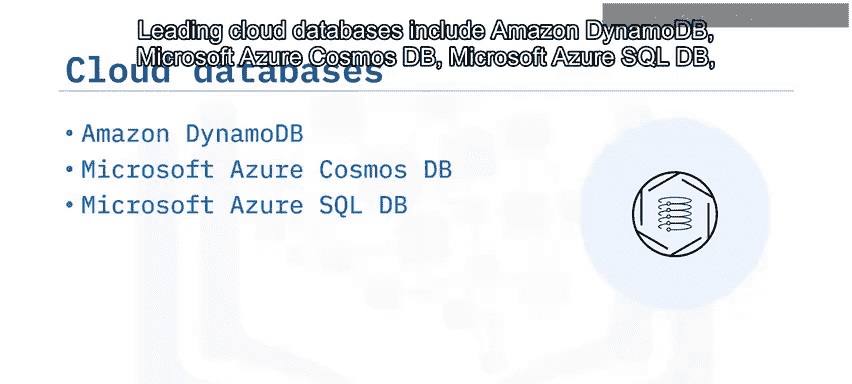

以下是领先的云数据库产品：
*   Amazon DynamoDB
*   Microsoft Azure Cosmos DB
*   Microsoft Azure SQL DB
*   Google BigQuery
*   Amazon Redshift

## 总结 ✨

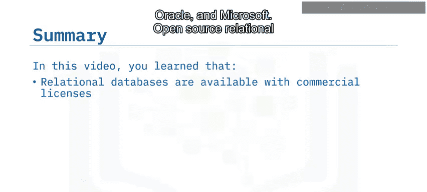

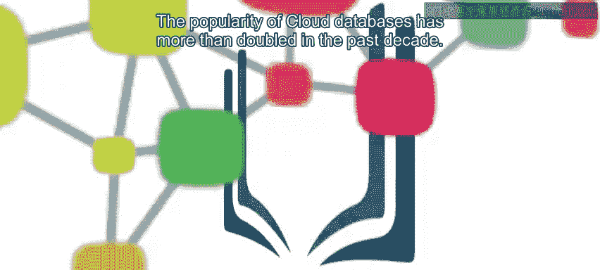

本节课中我们一起学习了关系数据库产品的演变。我们了解到，关系数据库既有来自IBM、Oracle和Microsoft等公司的商业许可版本，也有采用各种免费许可的开源版本。过去十年，开源关系数据库的流行度已上升至约50%，而云数据库的流行度更是增长了一倍多。理解这些产品及其发展趋势，对于选择适合特定需求的数据库解决方案至关重要。