# 011：DB2介绍 🗄️

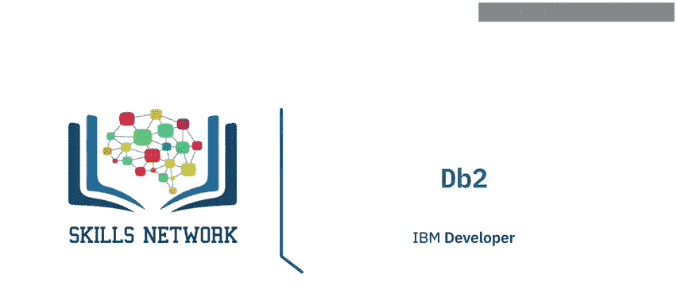

在本节课中，我们将学习IBM的DB2数据库。我们将了解DB2的历史、特性、产品家族、部署选项，以及它在云端的高可用性和可扩展性方案。

---

## DB2概述

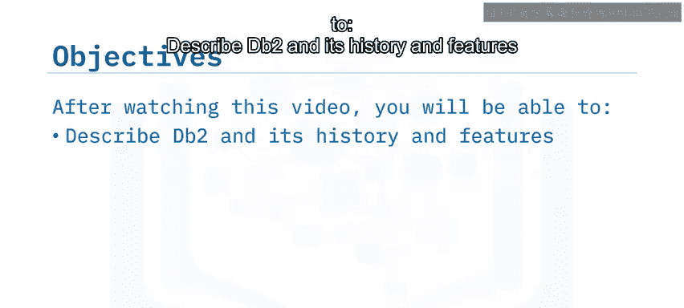

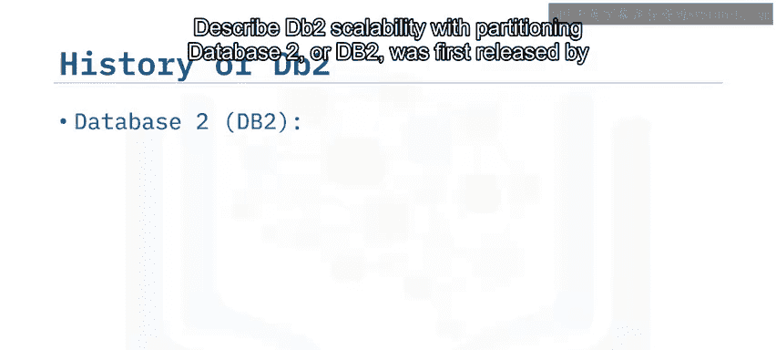

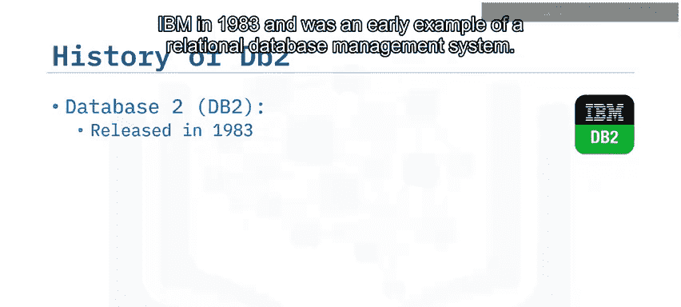

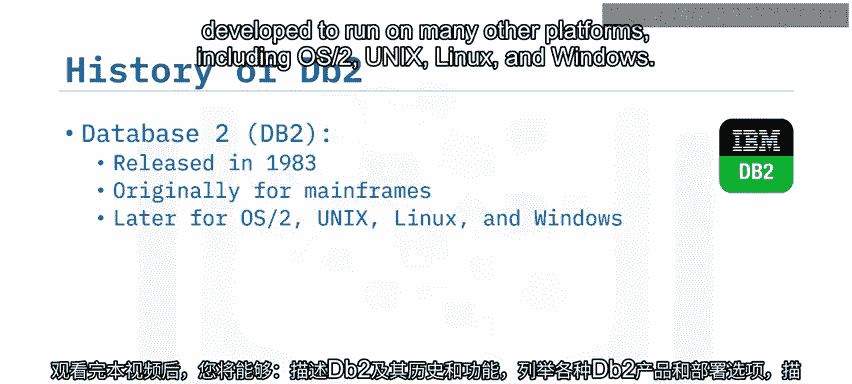

DB2，或称Database 2，是IBM在1983年首次发布的关系数据库管理系统（RDBMS）。它最初运行在IBM大型机上，但后来发展出可在多种操作系统上运行的版本，包括OS/2、Unix、Linux和Windows。

经过多次迭代，DB2现已发展成为一个完整的数据管理产品套件。

---

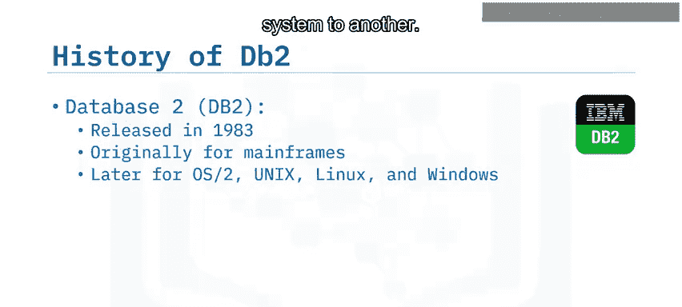

## DB2产品家族

DB2产品家族包含多个成员，以满足不同的数据管理需求。

以下是DB2产品家族的主要成员：

*   **DB2 Database**：一个功能强大的、企业级的本地部署RDBMS，专为OLTP（联机事务处理）优化。它支持Linux、Unix和Windows，并提供高性能、高可用性、可扩展性和弹性。
*   **DB2 Warehouse**：一个本地部署的数据仓库，提供高级数据分析、大规模并行处理（MPP）和机器学习功能。
*   **DB2 on Cloud**：一个完全托管的、基于云的SQL数据库，提供与本地DB2 Database相似的功能，包括性能、高可用性、可扩展性和弹性。
*   **DB2 Warehouse on Cloud**：一个完全托管的、弹性的、基于云的数据仓库，提供与本地DB2 Warehouse相似的功能。
*   **DB2 Big SQL**：一个基于Hadoop的SQL引擎，提供大规模并行处理和高级查询功能。它可以查询多种数据源，包括Hadoop HDFS、Web HDFS、RDBMS、NoSQL和其他对象存储。
*   **DB2 Event Store**：一个内存优化的数据库，用于摄取和分析事件驱动应用程序的流数据。它集成了IBM Watson Studio，为机器学习模型提供开发环境。
*   **DB2 for z/OS**：一个为IBM Z系统设计的企业数据服务器。它提供了一个关键任务数据解决方案，集成了分析、移动和云功能，支持数千客户和数百万用户。

这些产品都可以部署在IBM Cloud或Amazon Web Services上。

---

## DB2的评估与特性

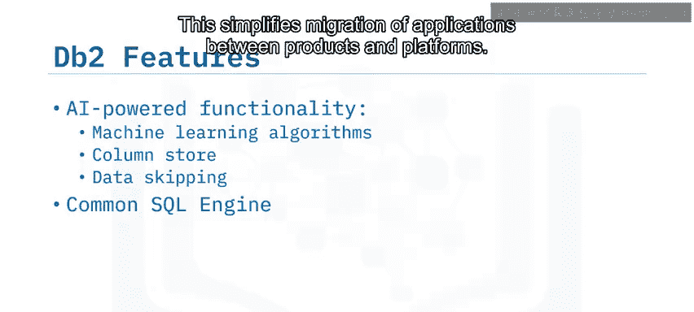

有多种方式可以免费评估DB2产品。

以下是主要的免费评估选项：

*   使用**DB2 Database社区版许可证**，有100GB的数据限制。
*   下载**DB2 Database的免费Docker镜像**。
*   在IBM Cloud上使用**DB2 on Cloud的免费轻量版计划**进行开发和评估。
*   使用**DB2 Warehouse企业版**和**DB2 Big SQL**的免费试用版。
*   免费使用**DB2 Warehouse on Cloud**，数据量上限为1GB。
*   下载**DB2 Event Store开发者版**的免费版本。

DB2产品利用AI驱动的功能来简化数据管理和查询。

以下是DB2的一些核心特性：

*   **机器学习优化查询**：使用机器学习算法提高查询效率和性能。
*   **列存储**：通过将查询定向到特定列，而不是处理整个数据表，来提高分析工作负载的性能并减少开销。
*   **数据跳过**：通过自动避免处理特定查询中不需要的数据来减少开销。
*   **通用SQL引擎**：DB2家族产品使用通用的SQL引擎，这意味着你可以编写一次查询，并确保它能在家族其他产品上运行，这简化了应用程序在不同产品和平台间的迁移。
*   **支持所有数据类型**：支持关系型、结构化和非结构化数据，使你能够访问所有企业数据以做出更好的业务决策。
*   **数据复制功能**：支持实现高可用性和灾难恢复解决方案。

---

## DB2的可扩展性

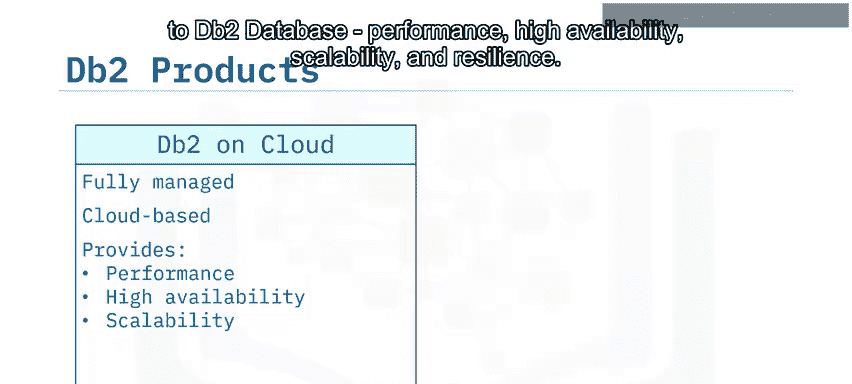

DB2通过多种方式提供可扩展性。

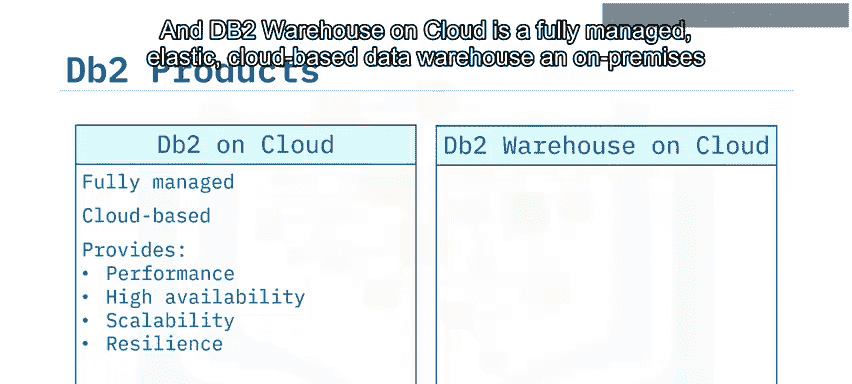

以下是DB2实现可扩展性的主要方法：

*   **短期峰值处理**：可以将本地存储和计算能力扩展到托管的云部署上。
*   **独立扩展**：在托管的云部署中，可以独立扩展计算能力和存储，只在需要时使用和支付额外资源。
*   **数据库分区**：在DB2 Warehouse中，可以使用数据库分区功能，将数据透明地分割到多个分区和服务器上，以最大化可用计算能力并实现大规模并行处理。

---

## Cloud Pak for Data平台

Cloud Pak for Data是一个完全集成的数据和AI平台，可用于处理和管理所有数据。它运行在Red Hat OpenShift容器中，因此可以部署在任何私有、公共或混合云上。

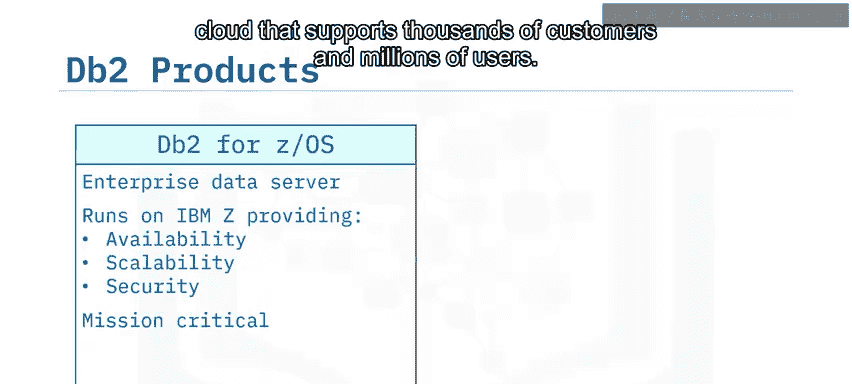

使用Cloud Pak for Data，你可以连接DB2或任何其他数据源，无论其存储在哪里。你可以使用Watson知识目录来组织数据，使用一系列分析服务来获取数据洞察，并使用Watson和其他服务将AI注入你的系统。

---

## DB2 on Cloud入门

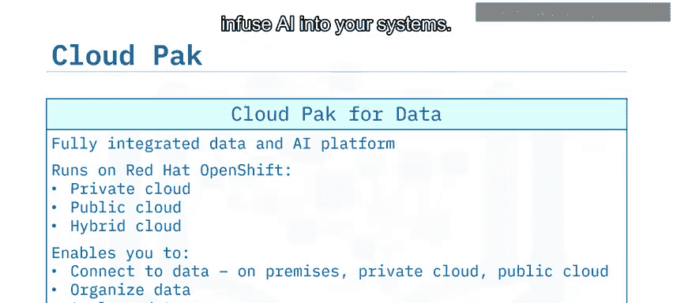

DB2 on Cloud是开始使用DB2的好方法。它提供三种计划：轻量版、标准版和企业版。

以下是DB2 on Cloud的三种计划：

*   **轻量版计划**：免费且无时间限制，意味着你可以在项目中使用它，而不用担心试用期结束。该计划限制为200MB数据和15个并发连接。
*   **标准版计划**：提供灵活的计算能力和存储扩展，以及内置的三节点高可用性集群。
*   **企业版计划**：提供一个专用的数据库实例，同样具有灵活的计算能力和存储扩展，以及内置的三节点高可用性集群。

DB2 on Cloud可以部署在IBM Cloud平台或Amazon Web Services上。运行后，你可以通过CLP+命令行界面、DB2 on Cloud图形用户界面控制台或标准API（如ODBC、JDBC和REST）来访问数据库。你还可以轻松地从Excel、CSV和文本文件加载数据，或从Amazon S3对象存储加载数据。

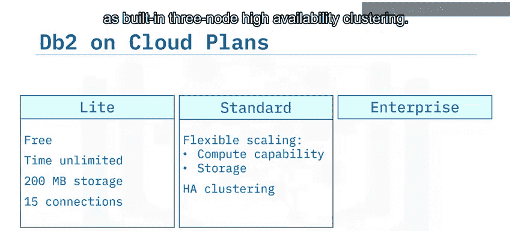

---

## DB2的高可用性

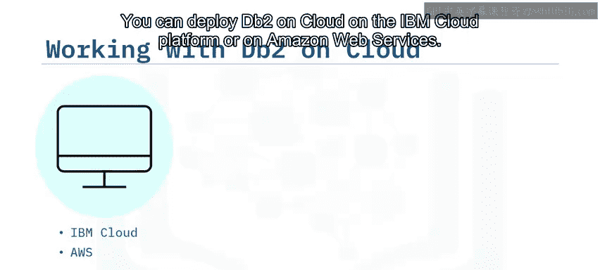

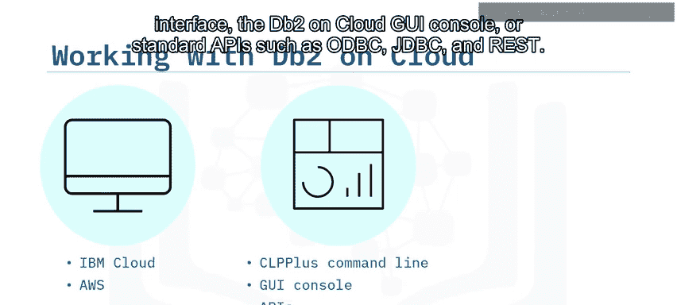

DB2提供高可用性灾难恢复（HADR）功能来支持高可用性系统。HDR将主数据库的更改复制到多个备用服务器。

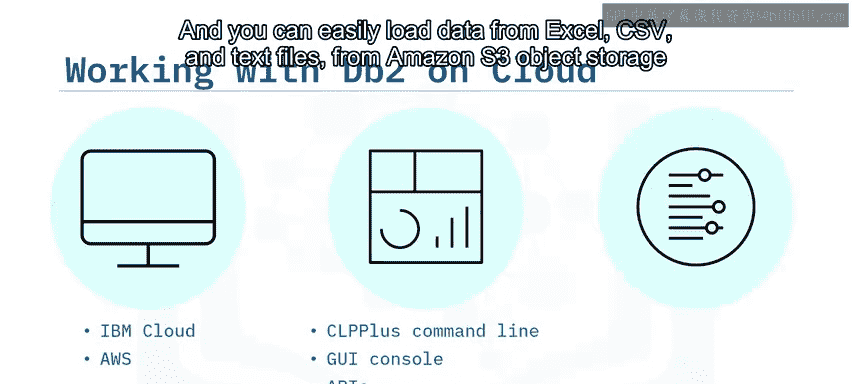

如果主数据库因任何原因（硬件、软件或网络问题）发生故障，你可以自动将其中一个备用数据库提升为主数据库，将客户端应用程序重定向到这个新的主数据库，并继续向组中的其他备用服务器复制数据。

当原始主数据库恢复在线时，它可以取代备用服务器的位置，或者被重新提升回主数据库位置。

---

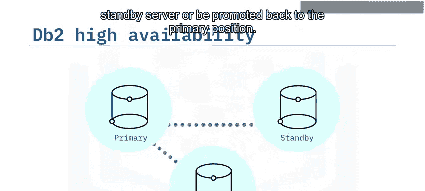

## DB2 Warehouse的可扩展性

DB2 Warehouse为商业智能工作负载提供大规模并行处理和数据分析。有时，你可能需要扩展系统的存储能力以满足峰值需求，或在需求低时降低成本。

DB2 Warehouse中的数据存储在数据节点中。要扩展存储容量，你只需要向部署中添加一个节点。分区及其工作负载会自动在新的节点设置中重新平衡。

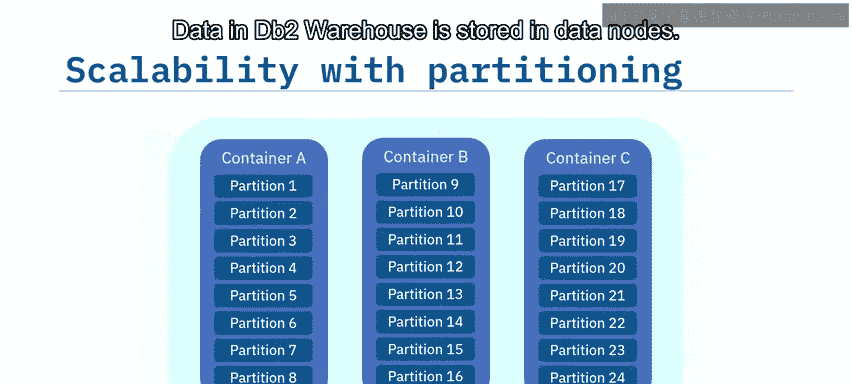

同样，要缩减规模，你只需要移除一个节点即可恢复到原始状态。

---

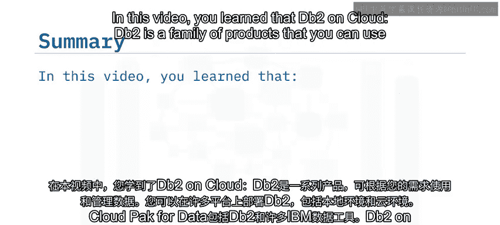

## 总结

本节课中，我们一起学习了DB2数据库家族。我们了解到DB2是一个产品家族，你可以根据需要以多种方式使用和管理数据。DB2可以跨多个平台部署，包括本地和云端。Cloud Pak for Data平台集成了DB2和许多IBM数据工具。DB2 on Cloud是一个完全托管的、基于云的SQL数据库，可以在IBM Cloud或AWS上运行。此外，DB2还提供了高可用性、灾难恢复和可扩展性功能。