# 012：MySQL入门 🐬

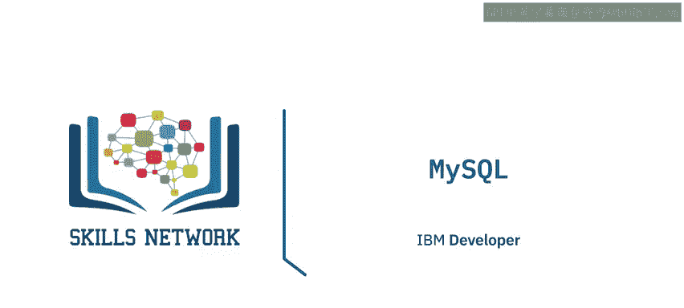

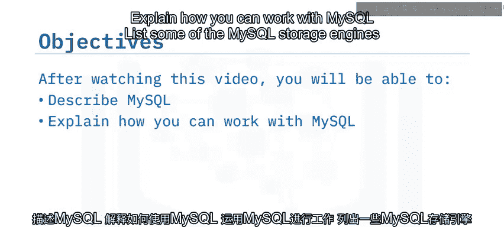

在本节课中，我们将要学习MySQL数据库管理系统。我们将了解MySQL的历史、核心特性、存储引擎以及其高可用性和可扩展性选项。通过本讲，你将能够描述MySQL，解释如何使用它，并理解其在不同场景下的应用。

## 概述 📋

MySQL最初由瑞典公司MySQL AB开发，并以联合创始人Monty Widenius的女儿“My”命名。该公司后来被Sun Microsystems收购，随后Sun Microsystems又被Oracle Corporation收购。MySQL的标志海豚名为“Sakila”，这个名字是在一次命名比赛中选出的。

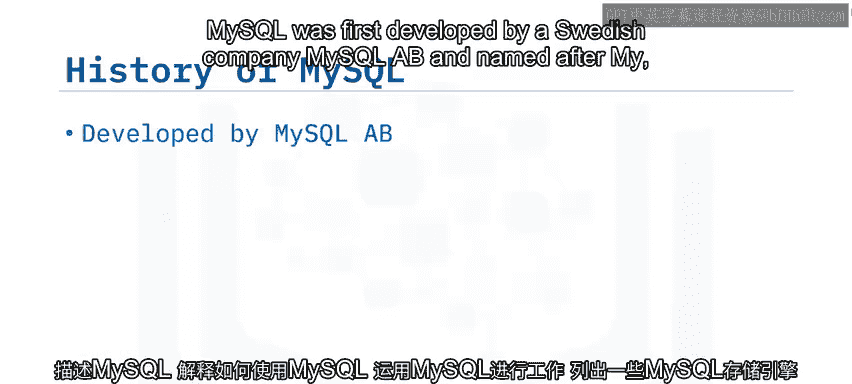

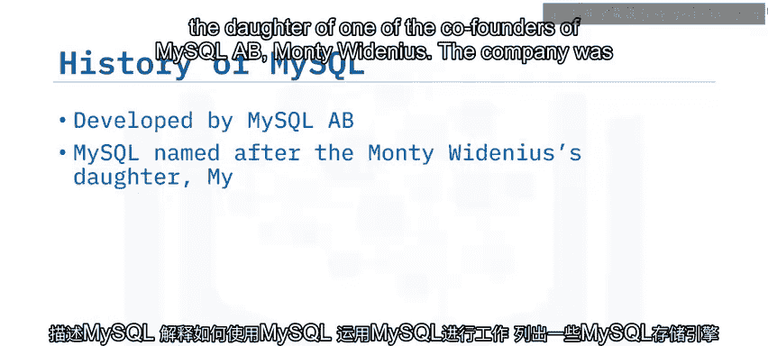

MySQL在20世纪90年代末和21世纪初迅速流行，部分原因是它成为LAMP技术栈（Linux操作系统、Apache Web服务器、MySQL数据库和PHP脚本语言）的关键组件，该技术栈在当时被广泛用于构建热门网站。

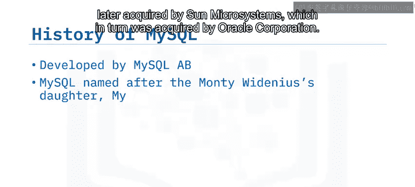

MySQL采用双许可证模式：开源GNU GPL许可证和商业许可证。由于采用GNU GPL许可证，MySQL是开源的。MySQL存在多个分支，其中最著名的是由部分原始开发者主导的MariaDB。

## MySQL的核心特性 ⚙️

MySQL是一个对象关系数据库管理系统。它是一个流行且维护成本低的数据库，提供多种版本和附加功能，包括用于高要求工作负载的集群版本。

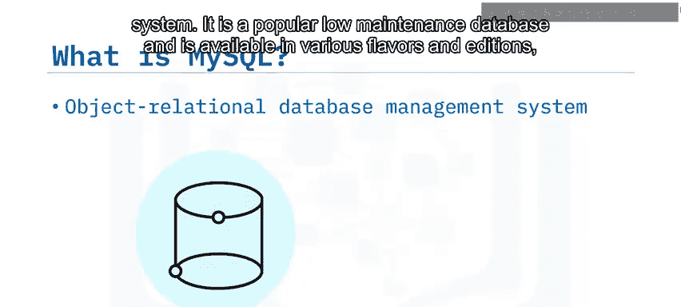

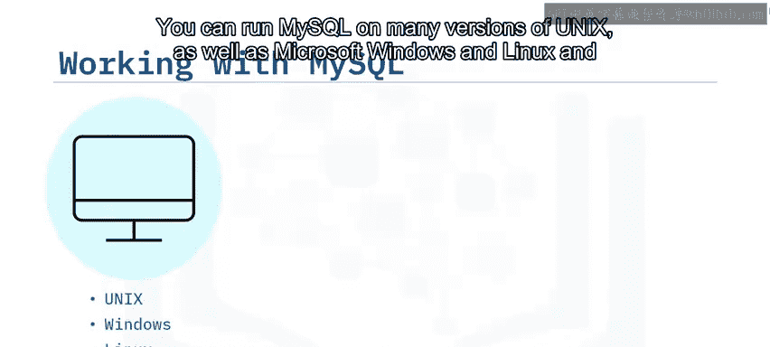

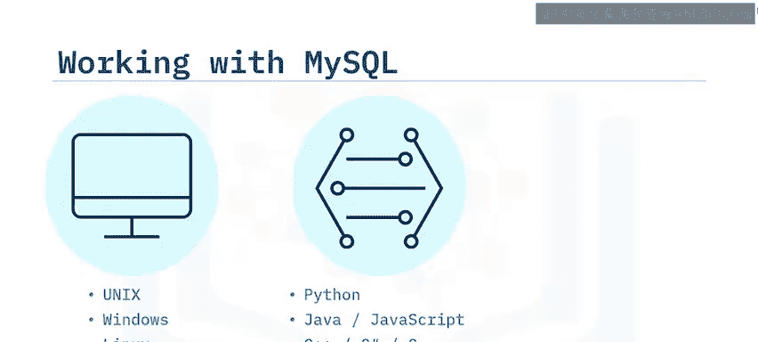

以下是MySQL的一些核心特性：

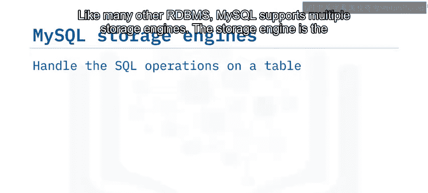

*   **跨平台支持**：你可以在多种Unix版本、Microsoft Windows和Linux上运行MySQL。
*   **多语言客户端支持**：你可以使用大多数现代编程语言为MySQL编写客户端应用程序。
*   **SQL语法兼容**：MySQL使用标准SQL语法，并拥有自己的扩展以提供额外功能，例如`LOAD DATA`语句可以快速将文本文件中的数据读入数据库表。
*   **数据类型支持**：MySQL主要处理关系型数据，但也支持JSON。

## MySQL存储引擎 🛠️

与许多其他RDBMS一样，MySQL支持多种存储引擎。存储引擎是处理表上SQL操作的组件，它定义了该表可以使用哪些功能。因此，你需要根据特定表的预期工作负载和需求来选择存储引擎。

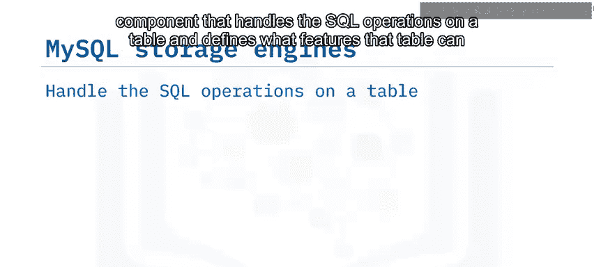

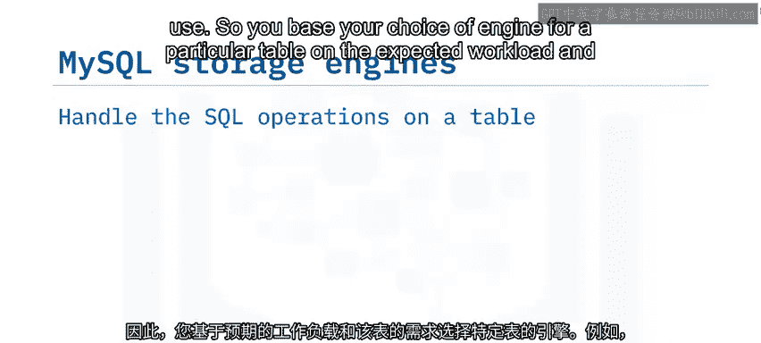

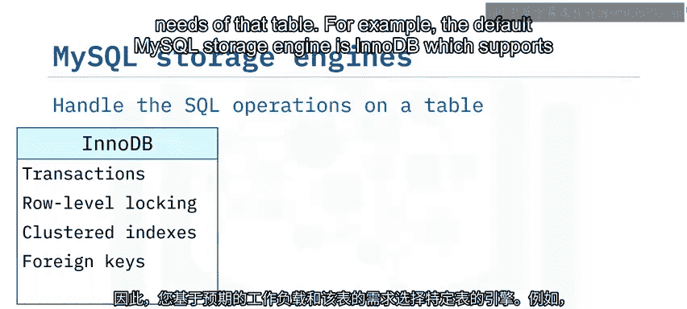

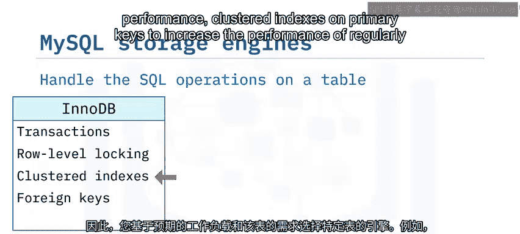

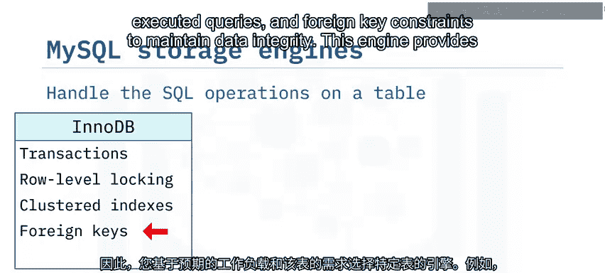

以下是MySQL中一些常见的存储引擎：

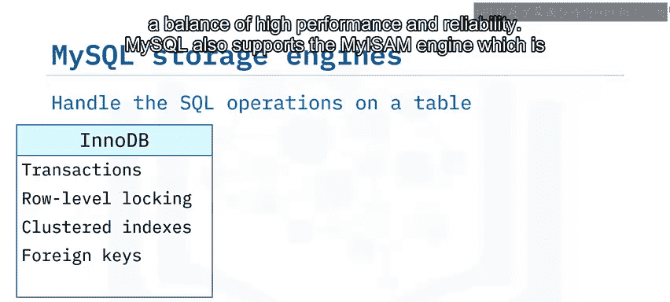

*   **InnoDB**：这是MySQL的默认存储引擎。它支持**事务**以确保数据一致性，支持**行级锁**以提高多用户性能，支持主键上的**聚簇索引**以提升常用查询的性能，并支持**外键约束**以维护数据完整性。该引擎在**高性能**和**可靠性**之间取得了平衡。
*   **MyISAM**：该引擎适用于主要进行读取操作、更新较少的场景，例如数据仓库或Web应用。它使用**表级锁**，这在读写混合的环境中会影响性能。
*   **NDB**：该引擎支持在集群中运行多个MySQL服务器实例，主要用于需要**高可用性**和**冗余**的应用程序。

## 高可用性与可扩展性 📈

MySQL支持高可用性和可扩展性。你可以使用**复制**技术在一个或多个副本上创建数据的副本。源数据库的数据变更也会在副本上执行。同一数据的多个副本意味着你可以在副本集之间分担读取负载，从而**提高可扩展性**。复制也**提高了可用性**，因为如果源数据库发生故障，你可以故障转移到使用其中一个副本。

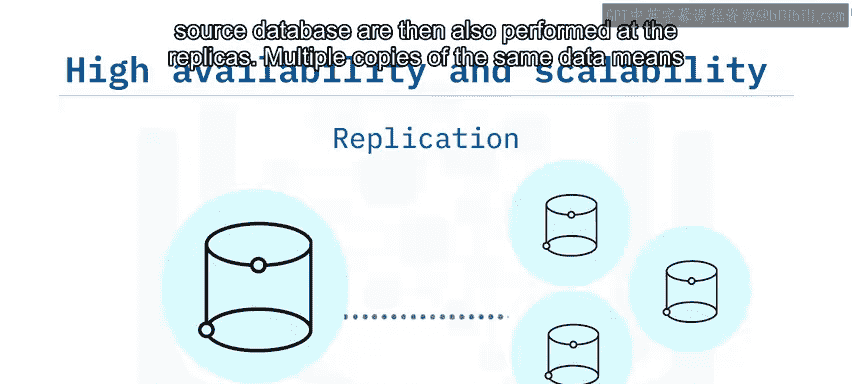

MySQL提供两种集群选项：

*   **基于InnoDB与组复制的集群**：此选项使用InnoDB存储引擎和组复制技术，允许你使用一个读写主服务器和多个辅助服务器。然后，你可以使用**MySQL Router**在多个服务器实例之间对客户端应用程序进行**负载均衡**。如果任何服务器发生意外停机，MySQL Router会将客户端应用程序重新连接到可用的服务器。
*   **MySQL集群版**：此选项使用NDB存储引擎来提供高可用和可扩展的解决方案。多个MySQL服务器节点访问一组数据节点（通常存储在内存中）。运行多个数据节点提供了**冗余**，从而在发生故障时提高了可用性；运行多个服务器节点则提供了**可扩展性**。

## 总结 🎯

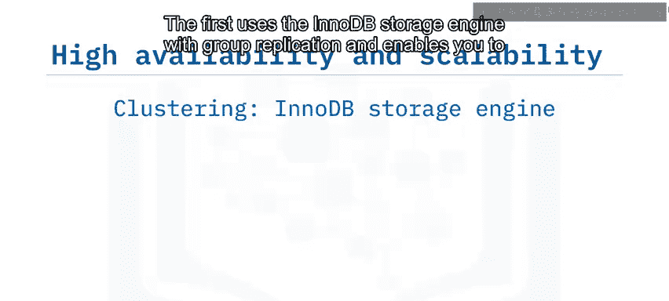

本节课中，我们一起学习了MySQL数据库管理系统。我们了解到：

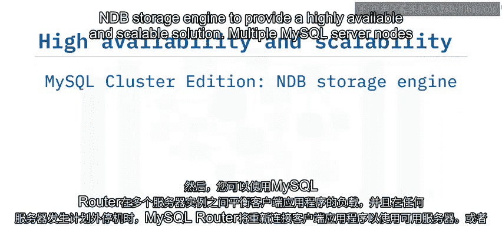

*   MySQL是一个对象关系数据库，提供多种版本。
*   它支持多种操作系统。
*   支持多种语言进行客户端应用开发。
*   支持关系型数据和JSON数据。
*   为不同的工作负载提供多种存储引擎。
*   提供了高可用性和可扩展性选项。

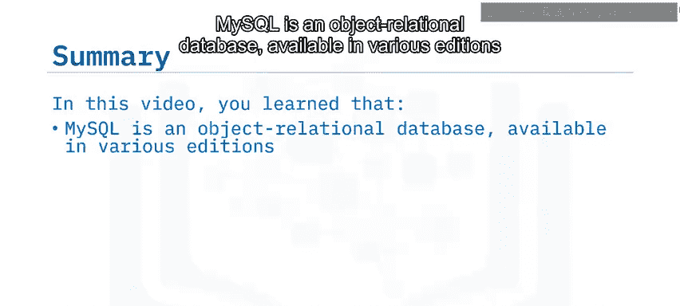

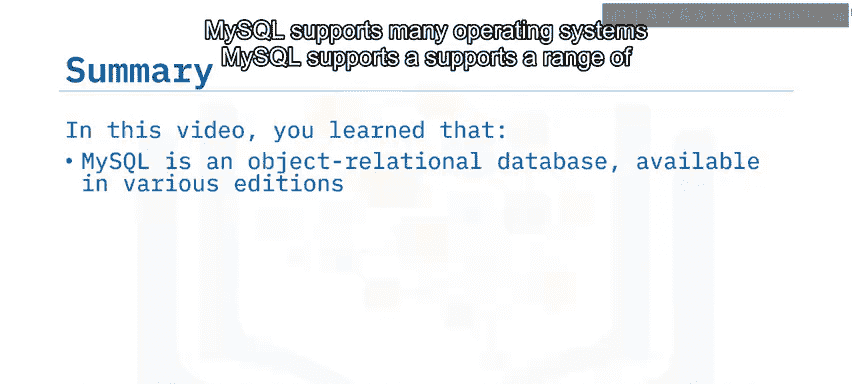

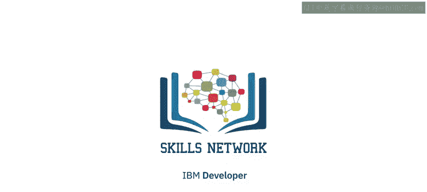

通过学习这些内容，你现在应该对MySQL有了一个基本的认识，并能够理解其在不同应用场景下的优势和配置方式。