# 013：PostgreSQL入门 🐘

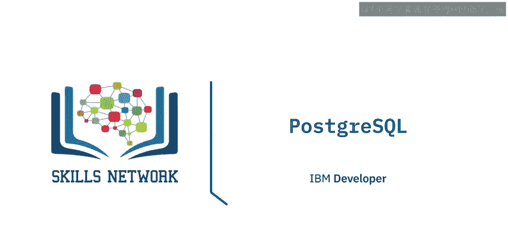

在本节课中，我们将要学习PostgreSQL。PostgreSQL是一个功能强大的开源对象关系型数据库管理系统。我们将了解它的起源、核心特性、支持的数据类型以及其高可用性和可扩展性功能。

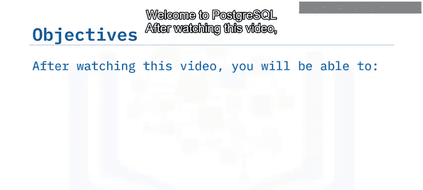

---

## PostgreSQL的起源与发展 📜

PostgreSQL起源于30多年前加州大学的Postgres项目。Postgres被广泛应用于许多研究和生产应用，覆盖了金融服务、航空和医疗等多个行业。1994年，开源版本Postgres 95发布，其中包含了一个SQL语言解释器。该项目很快更名为PostgreSQL，至今通常简称为Postgres。

你可以将其作为LAMP（Linux, Apache, MySQL, PHP/Python/Perl）或LAPP（Linux, Apache, PostgreSQL, PHP/Python/Perl）技术栈的一部分，用于Web应用和网站开发。此外，你还可以使用独立开发的扩展来增加功能，例如PostGIS用于地理和空间数据处理。

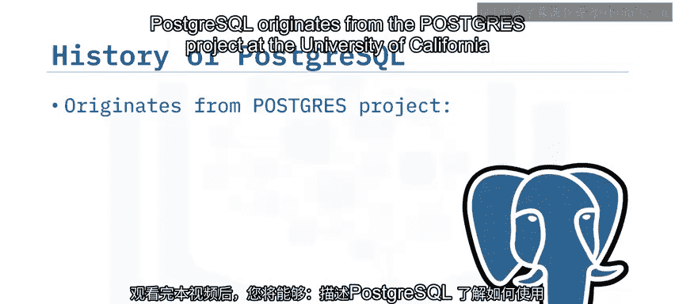

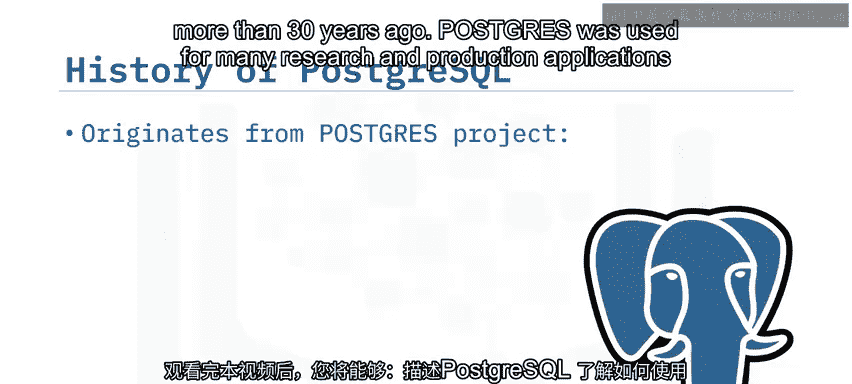

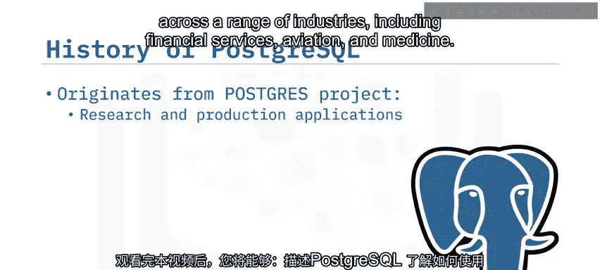

---

## 什么是PostgreSQL？ 💡

PostgreSQL是一个免费、开源的对象关系型数据库管理系统。

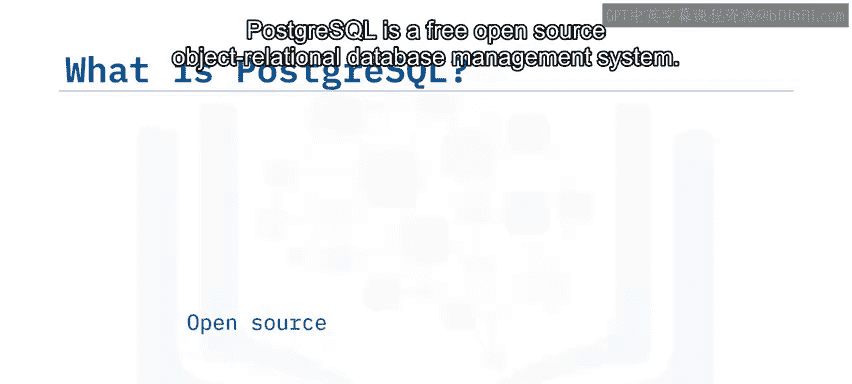

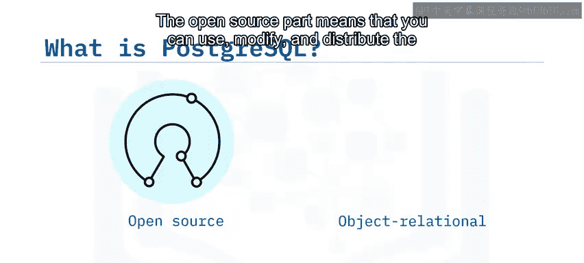

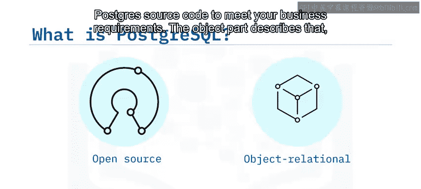

*   **开源**：意味着你可以使用、修改和分发PostgreSQL的源代码，以满足你的业务需求。
*   **对象关系型**：类似于面向对象编程语言，它支持**继承**和**重载**。你可以使用这些技术来简化设计并重用数据库对象。

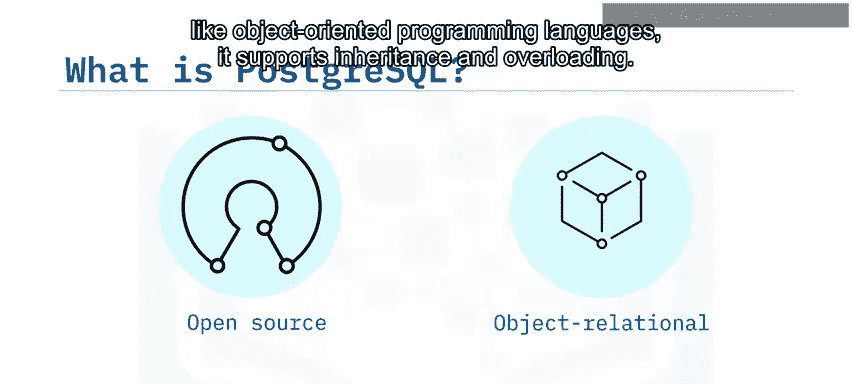

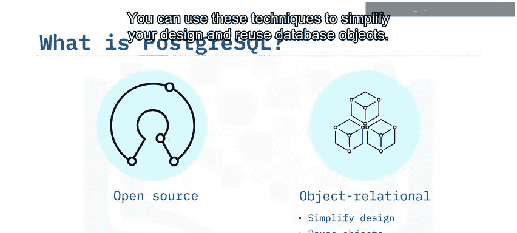

---

## PostgreSQL的核心特性与优势 ⚙️

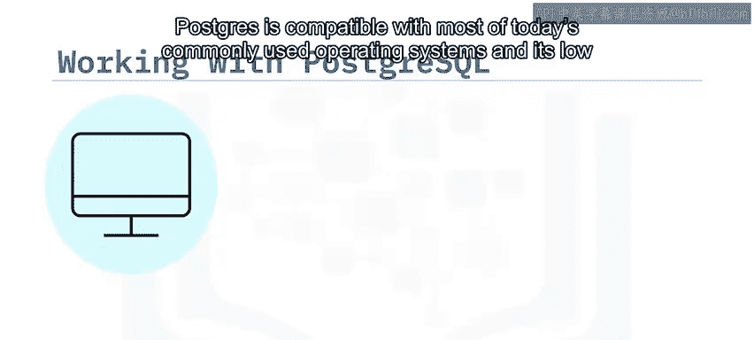

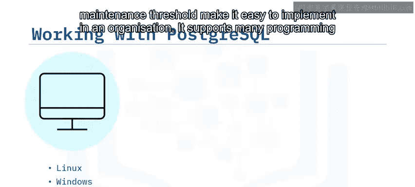

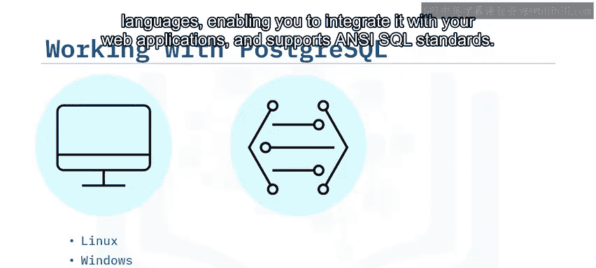

PostgreSQL兼容当今大多数常用操作系统，其低维护门槛使其易于在组织中实施。它支持多种编程语言，使你能够将其与Web应用程序集成，并支持ANSI SQL标准。

在使用PostgreSQL时，你可以使用所有标准的关系数据库结构，例如：
*   **键（Keys）**
*   **事务（Transactions）**
*   **视图（Views）**
*   **函数（Functions）**
*   **存储过程（Stored Procedures）**

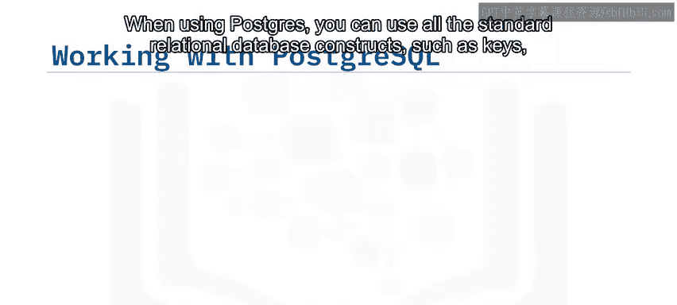

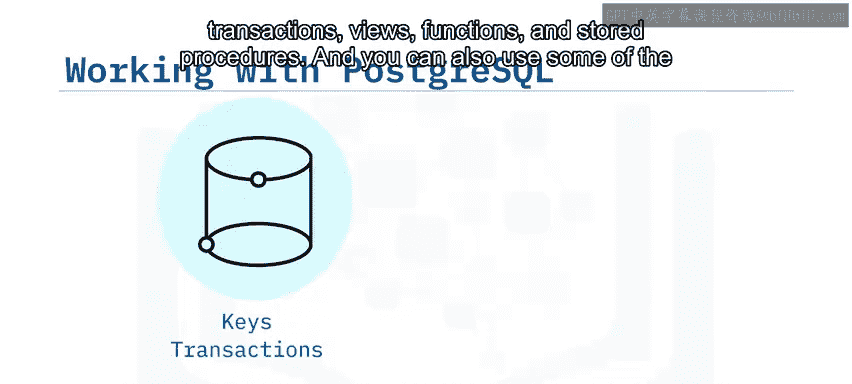

此外，你还可以使用一些NoSQL功能，例如：
*   **JSON**：用于处理结构化数据。
*   **HStore**：用于处理非层次化数据。

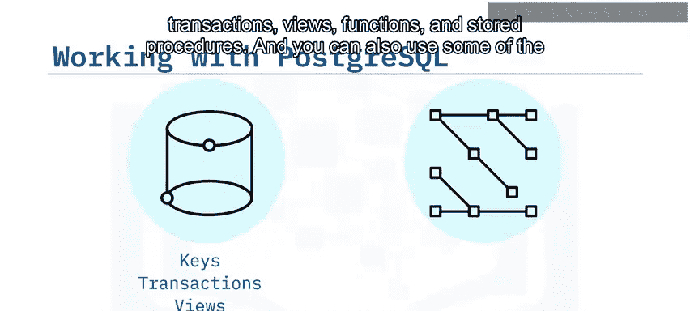

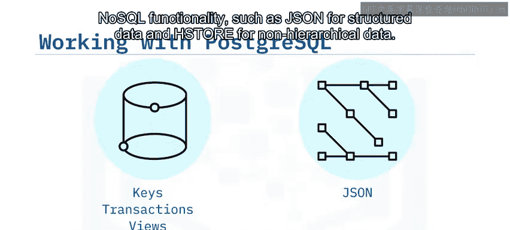

---

## PostgreSQL的高可用性与复制功能 🔄

PostgreSQL支持复制以实现高可用性。

它支持**两节点同步复制**。这会将你的数据副本存储在第二台服务器上，并将你对节点1所做的每个更改应用到节点2。然后，你可以在两个服务器之间分担读取负载。如果节点1发生故障，你可以启用节点2为所有客户端提供服务，直到节点1恢复运行。

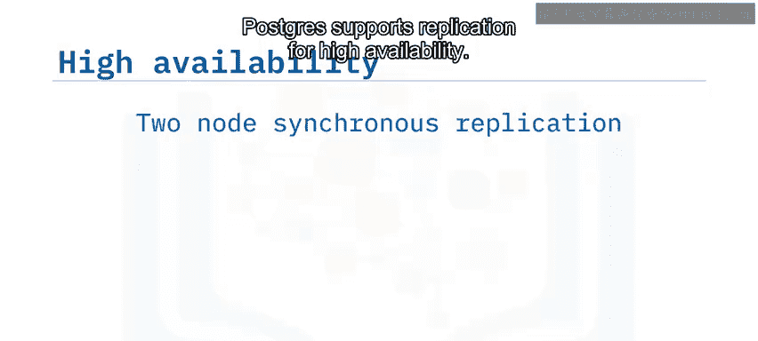

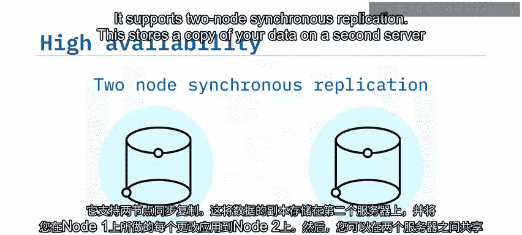

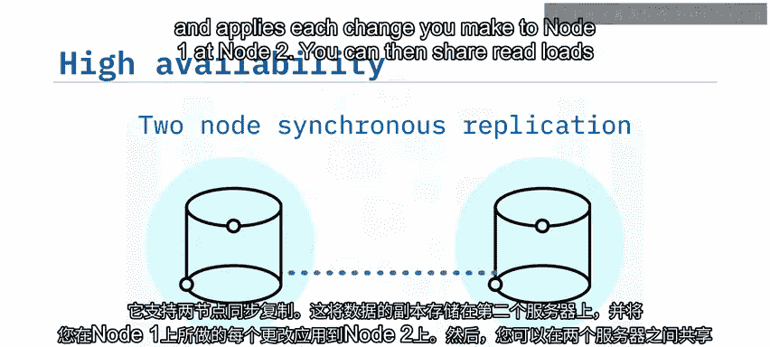

它还支持**多节点异步复制**，以实现高可用性和可扩展性。在这里，一个主节点将其更改分发到多个只读副本以实现可扩展性。同样，如果读写节点发生故障，你可以快速用其中一个只读副本替换它。

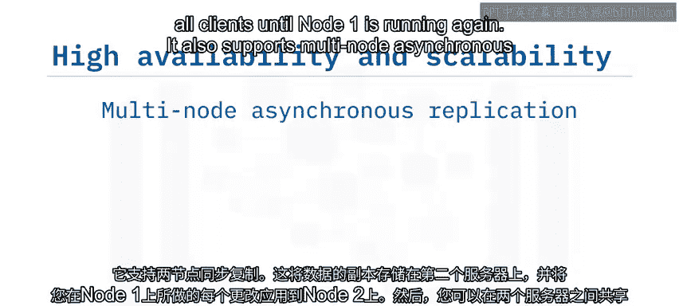

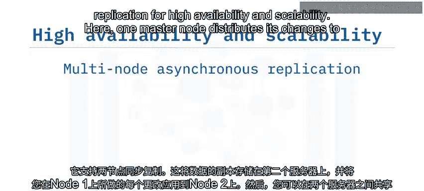

---

## 高级扩展功能：分区与分片 📊

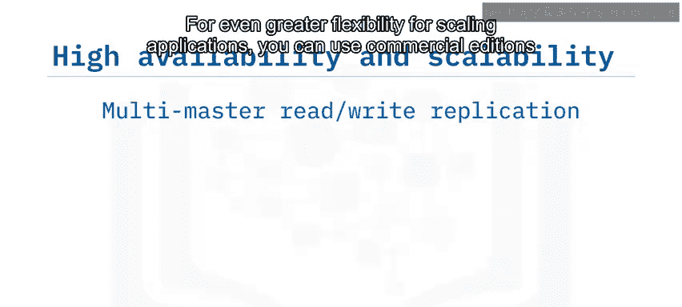

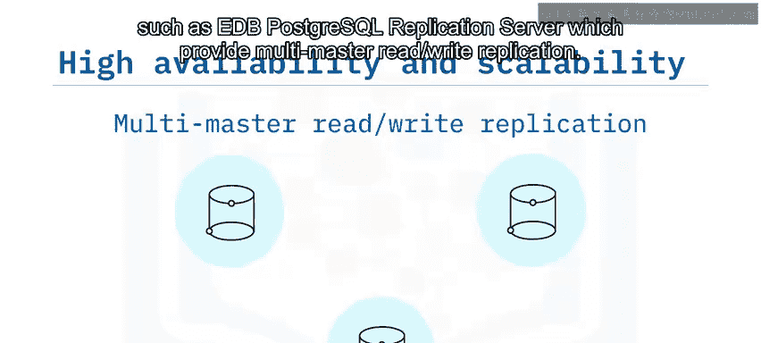

为了在扩展应用程序时获得更大的灵活性，你可以使用商业版本，例如EDB PostgreSQL复制服务器，它提供多主读写复制。这使你能够运行多个读写数据库，这些数据库之间相互复制更改。如果一个实例发生故障，用户可以轻松重定向到另一个实例，直到它再次可用。

近年来，PostgreSQL版本中添加了其他技术，以增强可扩展性和处理更大数据集的能力，包括：

*   **分区（Partitioning）**：使你能够将一个大表拆分成多个较小的部分或分区，以提高查询性能。
*   **分片（Sharding）**：使你能够跨多个远程服务器存储水平分区。

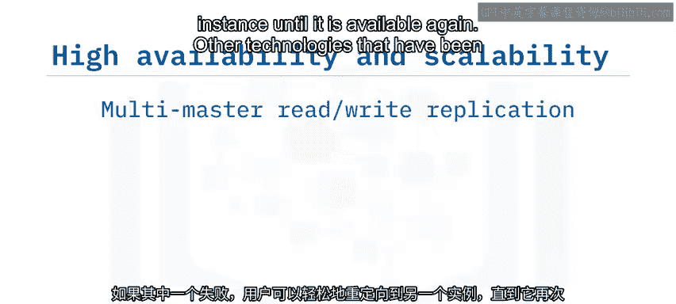

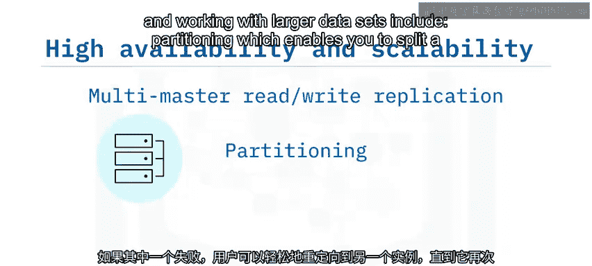

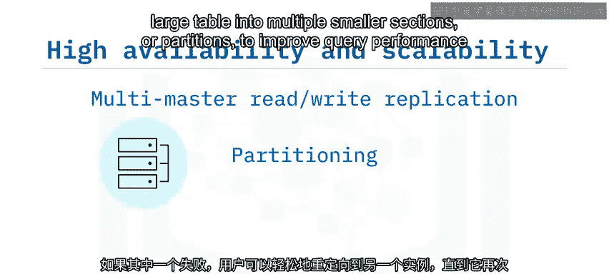

---

## 总结 📝

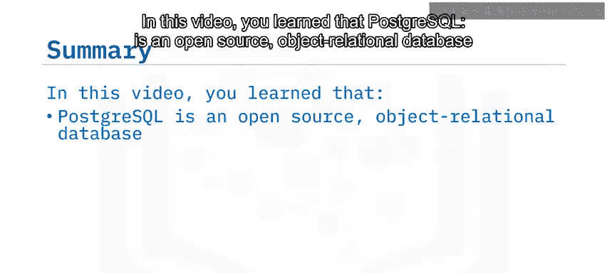

本节课中我们一起学习了PostgreSQL。我们了解到PostgreSQL是一个开源的对象关系型数据库。它支持多种语言用于客户端应用程序开发，支持关系型、结构化和非结构化数据，并且支持复制和分区以实现高可用性和可扩展性。