# 014：SQL语句类型 - DDL vs DML 🗂️


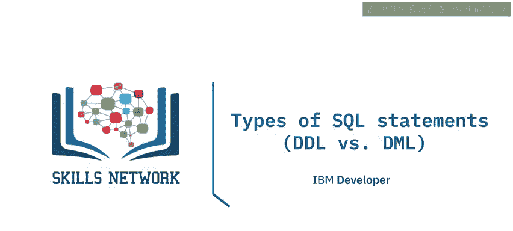

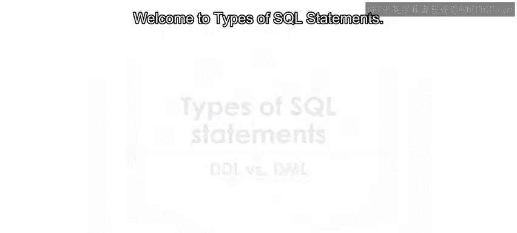

在本节课中，我们将学习SQL语句的两种主要类型：数据定义语言（DDL）和数据操作语言（DML）。你将能够区分这两种语句，并了解它们各自在关系数据库管理中的核心作用。

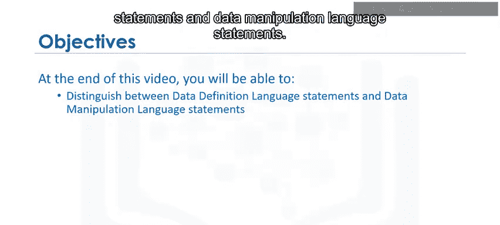

SQL语句用于与关系数据库中的实体（如表）、属性（即列）以及包含数据值的元组（即行）进行交互。

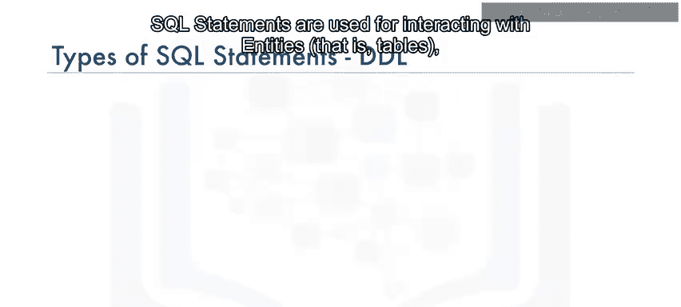

## 📝 SQL语句的两大类别


SQL语句主要分为两个不同的类别：数据定义语言（DDL）语句和数据操作语言（DML）语句。

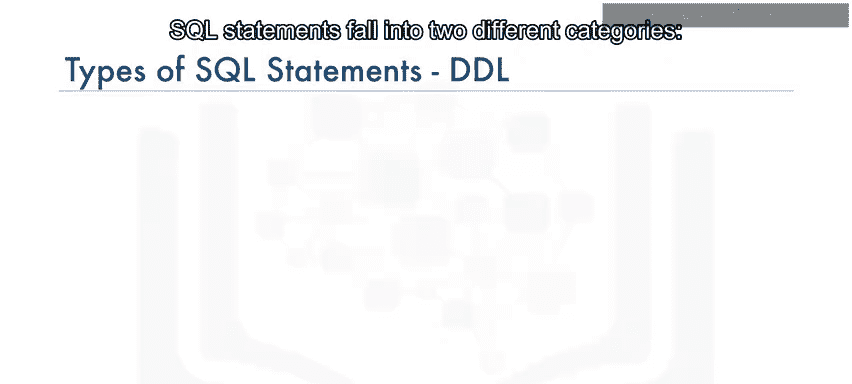

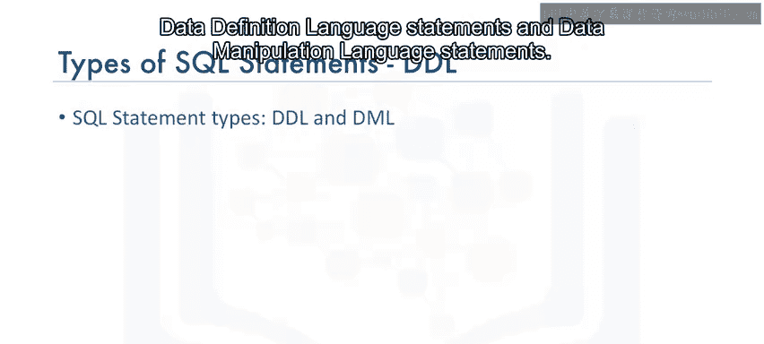

上一节我们介绍了SQL语句的基本用途，本节中我们来看看这两种类别的具体区别。

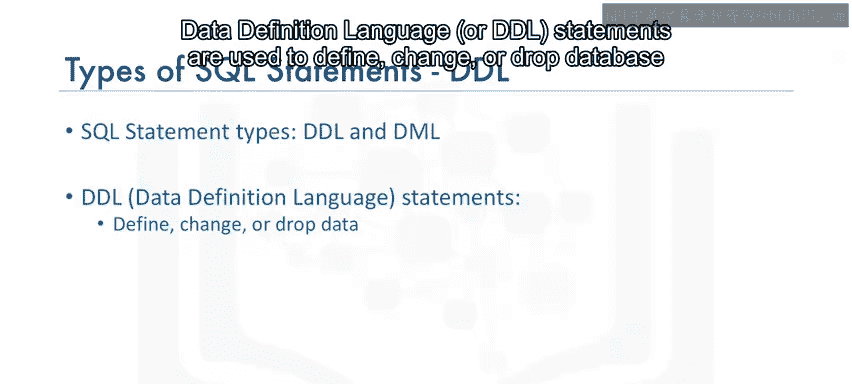


### 🏗️ 数据定义语言（DDL）

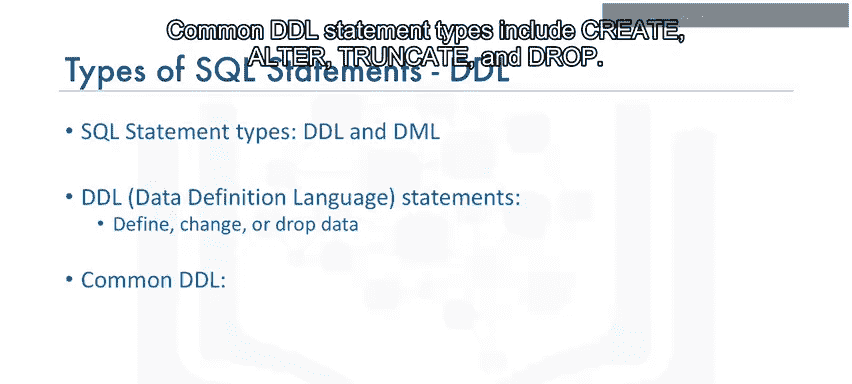

数据定义语言（DDL）语句用于定义、更改或删除数据库对象，例如表。

以下是常见的DDL语句类型：

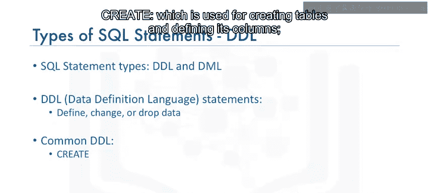

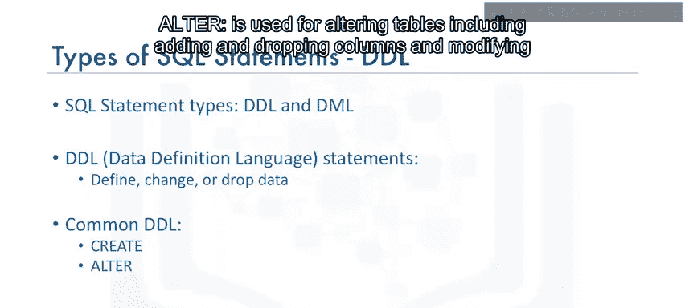

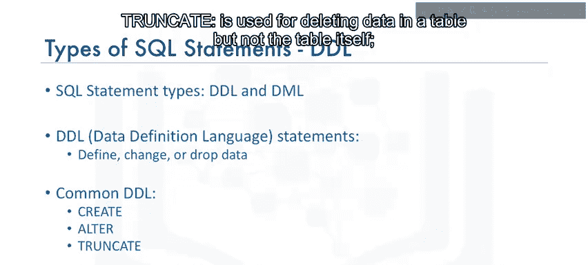

*   **CREATE**：用于创建表并定义其列。
    ```sql
    CREATE TABLE 表名 (列名1 数据类型, 列名2 数据类型, ...);
    ```
*   **ALTER**：用于修改表结构，包括添加和删除列，以及修改列的数据类型。
    ```sql
    ALTER TABLE 表名 ADD 列名 数据类型;
    ```
*   **TRUNCATE**：用于删除表中的所有数据，但保留表本身的结构。
    ```sql
    TRUNCATE TABLE 表名;
    ```
*   **DROP**：用于删除整个表。
    ```sql
    DROP TABLE 表名;
    ```

### 🔧 数据操作语言（DML）

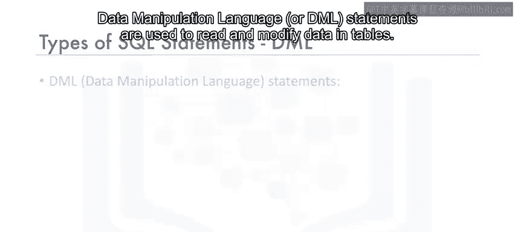

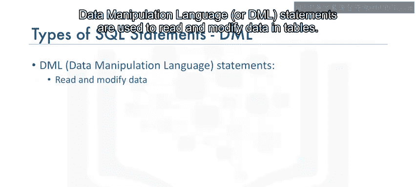

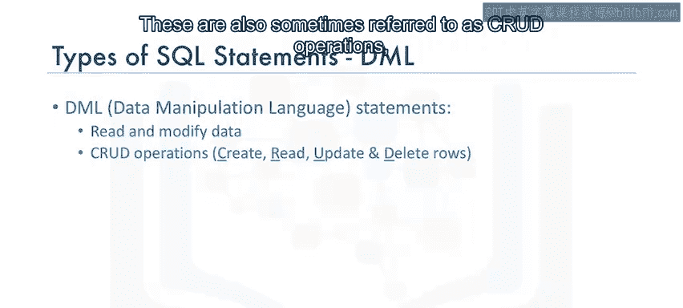

数据操作语言（DML）语句用于读取和修改表中的数据。这些操作有时也被称为CRUD操作，即对表中的行进行创建（Create）、读取（Read）、更新（Update）和删除（Delete）。

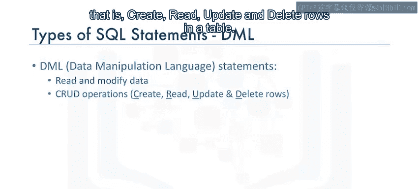

上一节我们了解了如何定义数据库结构，本节中我们来看看如何操作其中的数据。


以下是常见的DML语句类型：

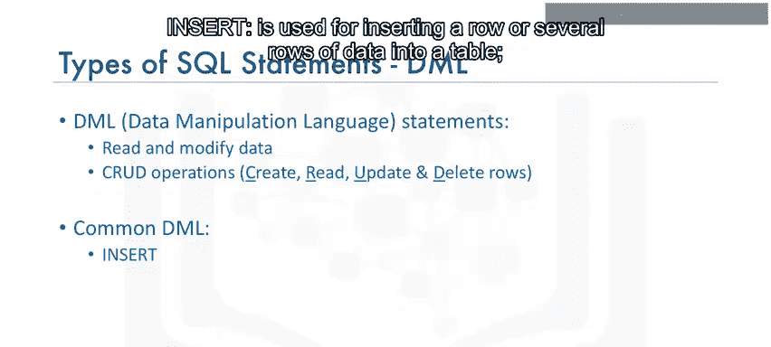

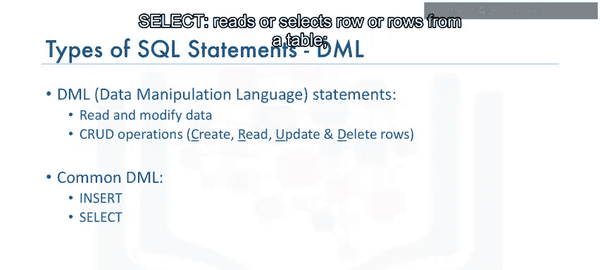

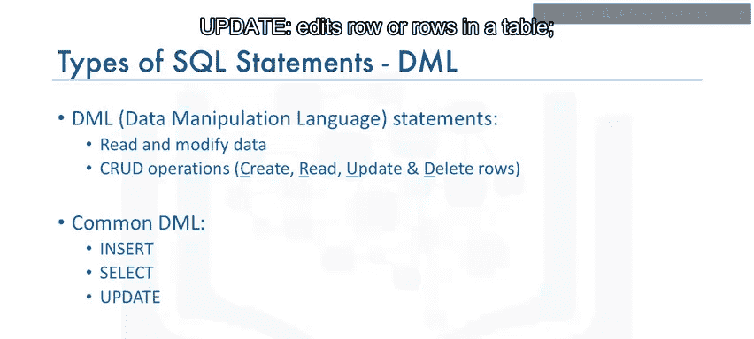

*   **INSERT**：用于向表中插入一行或多行数据。
    ```sql
    INSERT INTO 表名 (列1, 列2) VALUES (值1, 值2);
    ```
*   **SELECT**：用于从表中读取或选择一行或多行数据。
    ```sql
    SELECT * FROM 表名;
    ```
*   **UPDATE**：用于编辑表中的一行或多行数据。
    ```sql
    UPDATE 表名 SET 列名 = 新值 WHERE 条件;
    ```
*   **DELETE**：用于从表中删除一行或多行数据。
    ```sql
    DELETE FROM 表名 WHERE 条件;
    ```

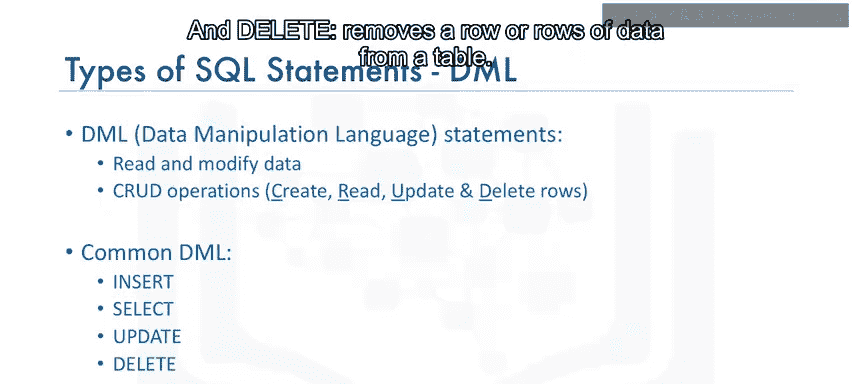

## 🎯 课程总结

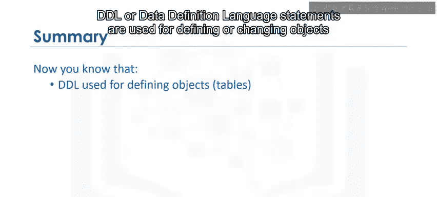

本节课中，我们一起学习了SQL语句的两种核心类型。
*   数据定义语言（DDL）语句用于定义或更改数据库中的对象（如表）。
*   数据操作语言（DML）语句用于操作或处理表中的数据。


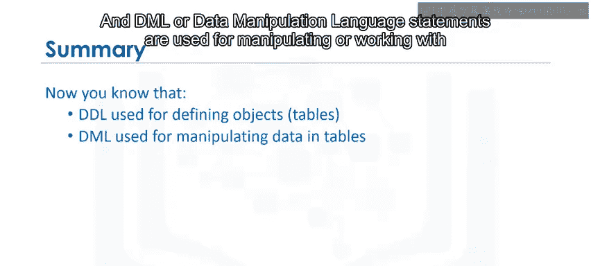


理解DDL和DML的区别是有效使用SQL管理和操作关系数据库的基础。