# 015：创建表

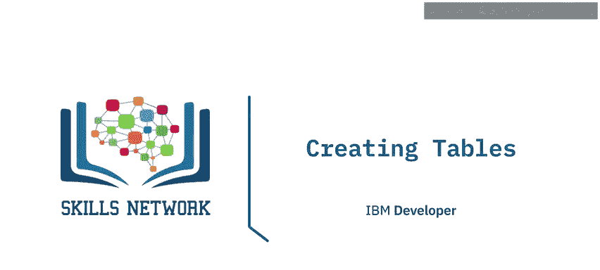

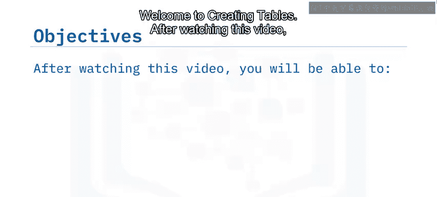

在本节课中，我们将学习如何在关系数据库中创建表。我们将了解创建表前的必要考虑因素，演示如何在图形界面（如 IBM DB2 on Cloud）中创建表，并解释如何在表创建后修改其结构。

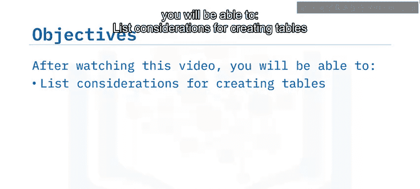

## 🧠 创建表前的考虑因素

在开始创建表之前，你需要准备好一些关键信息。

以下是创建表前需要考虑的几个要点：

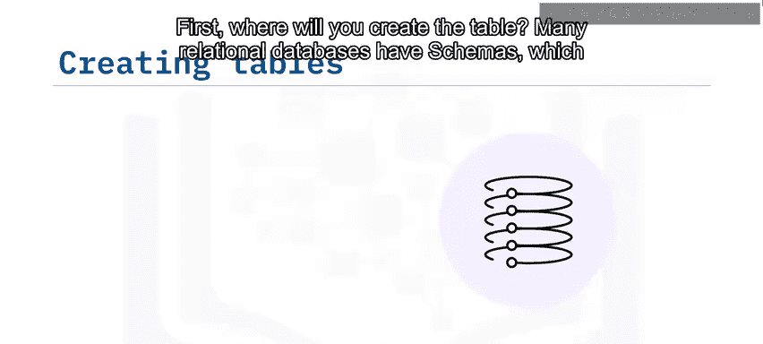

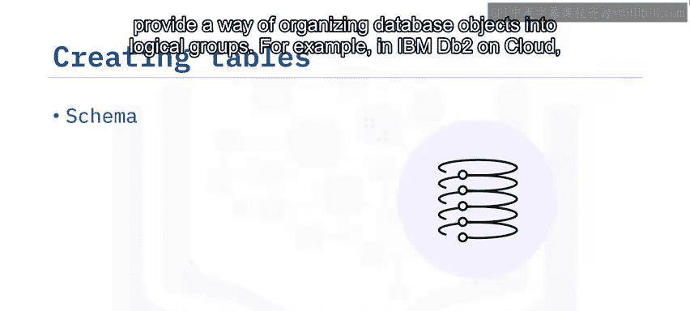

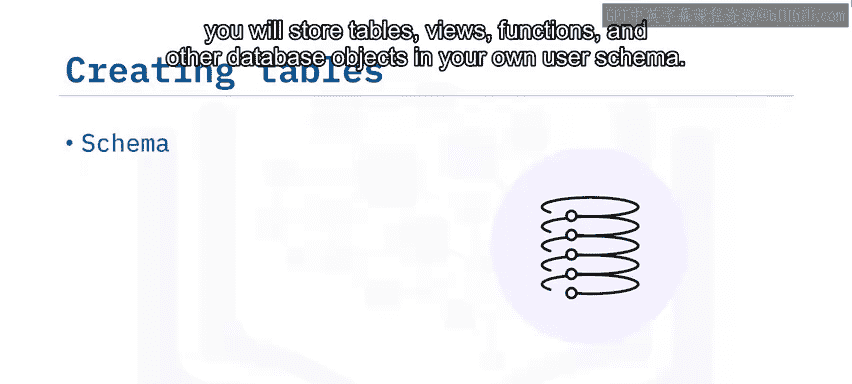

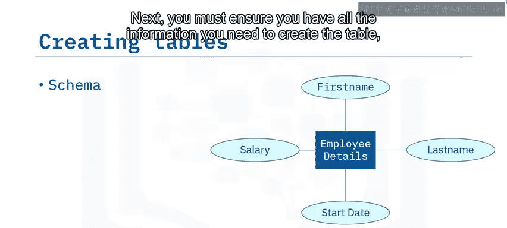

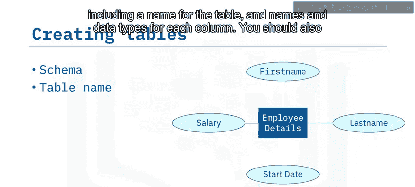

*   **表的存放位置**：许多关系数据库使用**模式（Schema）** 来将数据库对象（如表、视图、函数）组织成逻辑组。例如，在 IBM DB2 on Cloud 中，你的表将存储在你自己的用户模式中。
*   **表的基本信息**：你必须明确表名、每个列的名称及其**数据类型**。
*   **列的约束**：你需要考虑列是否允许重复值，或者是否允许 **NULL 值**。
*   **设计依据**：应使用你在数据库设计阶段创建的**实体关系图（ERD）** 来指导表的创建。

## 🛠️ 创建表的方法

上一节我们介绍了创建表前的准备工作，本节中我们来看看创建表有哪些不同的方法。

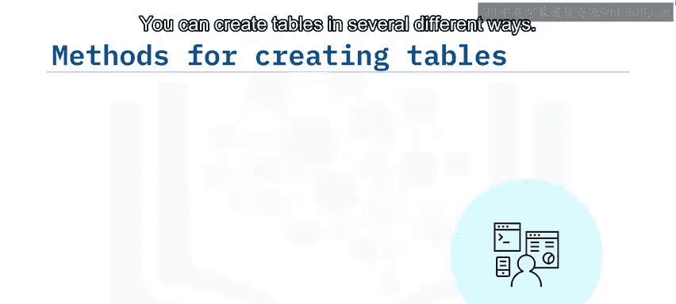

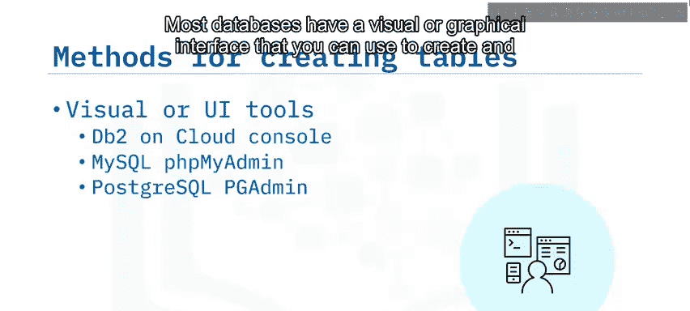

以下是三种常见的创建表的方式：

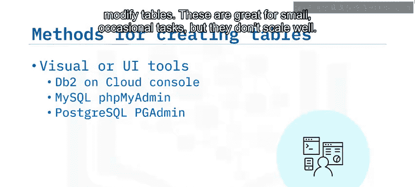

*   **图形界面（GUI）**：大多数数据库都提供可视化的图形界面来创建和修改表。这种方式适用于小型或临时的任务，但扩展性不佳。
*   **SQL 语句**：你可以使用 **`CREATE TABLE`** SQL 语句来创建表。这种方式可以将创建过程写入脚本文件，有助于在创建多个表时实现自动化。
*   **管理 API**：一些数据库提供了管理 API，允许以编程方式创建和管理数据库。

本视频中的示例基于 DB2 on Cloud 控制台，但类似的概念也适用于其他数据库。

## 📝 在 DB2 on Cloud 中创建表

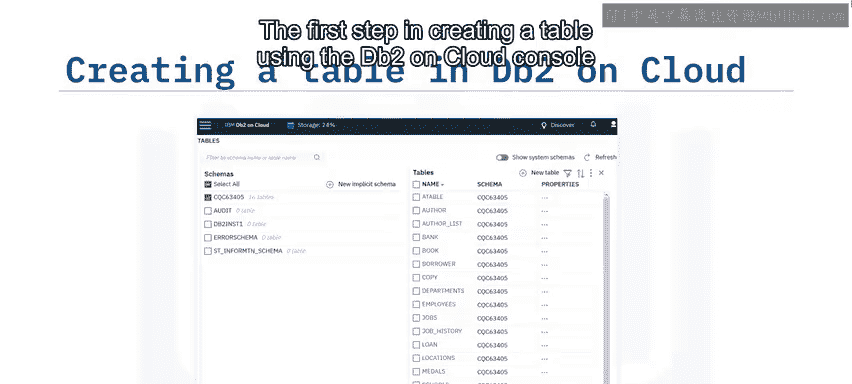

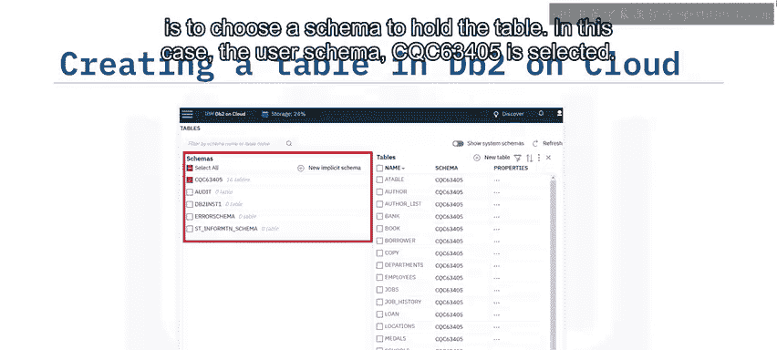

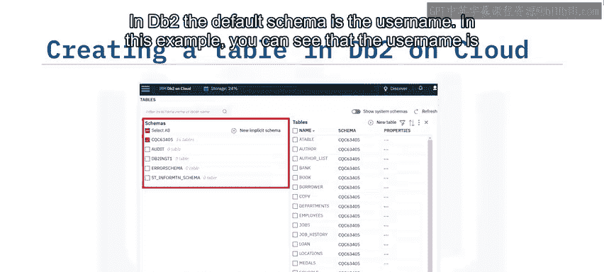

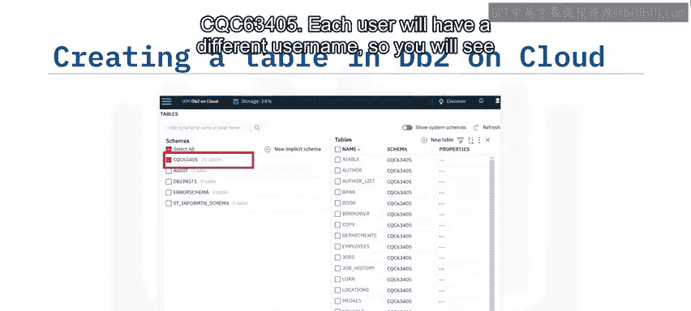

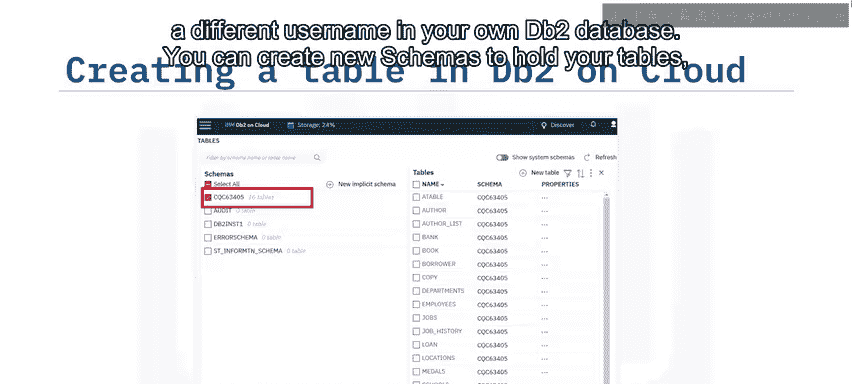

了解了创建表的方法后，我们将通过一个具体的例子，学习如何在 DB2 on Cloud 的图形界面中逐步创建一张表。

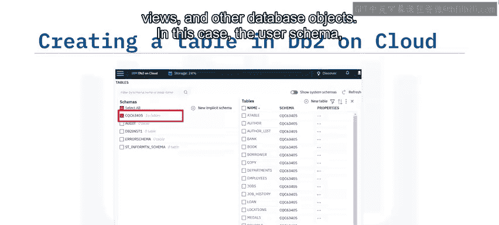

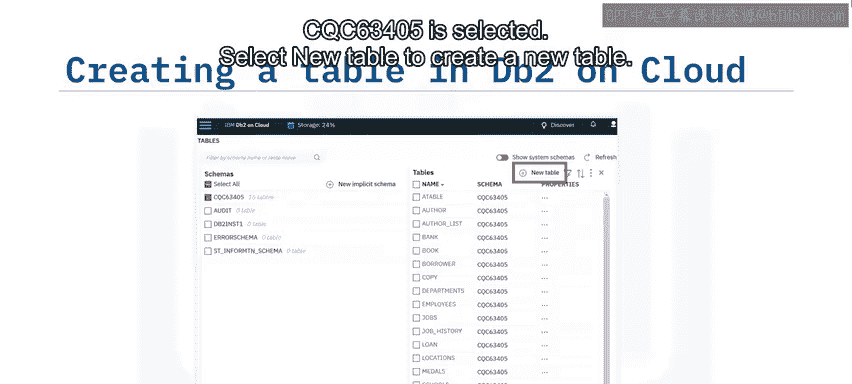

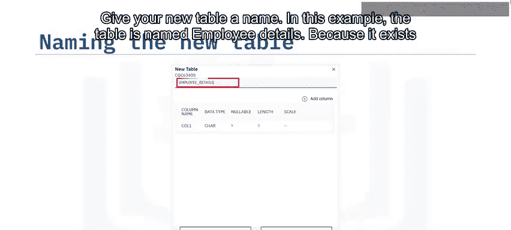

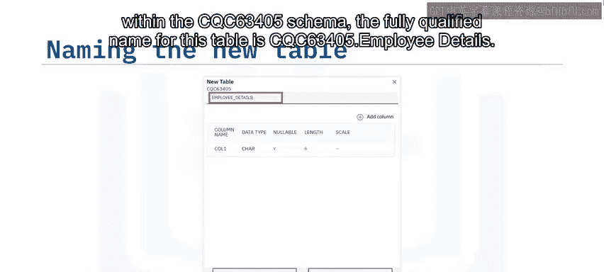

1.  **选择模式**：首先，选择一个模式来存放新表。在 DB2 中，默认模式是用户名。本例中，选择的用户模式是 `CQC63405`。每个用户将拥有不同的用户名。
2.  **创建新表**：点击“新建表”来创建一张新表。
3.  **命名表**：为新表指定一个名称。例如，将表命名为 `employee_details`。由于它位于 `CQC63405` 模式中，该表的**完全限定名**是 `CQC63405.employee_details`。
4.  **定义列**：新表默认有一列。你可以重命名该列，并从列表中选择一个**数据类型**为其设置类型。
5.  **添加更多列**：使用“添加列”按钮继续添加列，直到构建出完整的表结构。记住为每一列指定数据类型。
6.  **设置列属性**：你还可以指定列是否接受 **NULL 值**，并根据数据类型指定长度和小数位数。
7.  **完成创建**：最后，点击“创建”按钮。

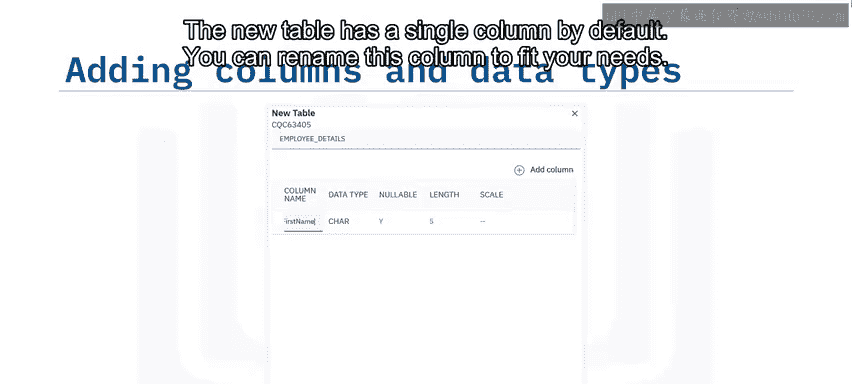

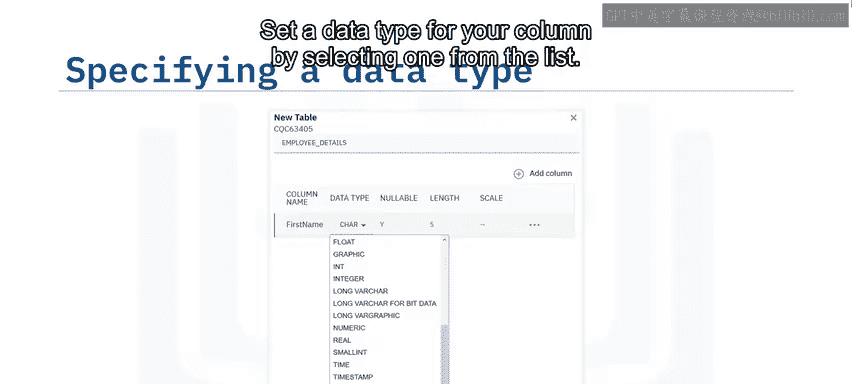

## 🔧 表创建后的操作

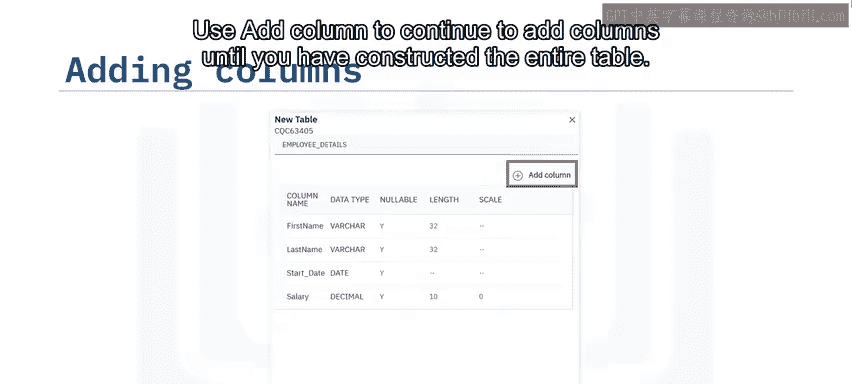

表创建完成后，你还可以对它进行多种操作。

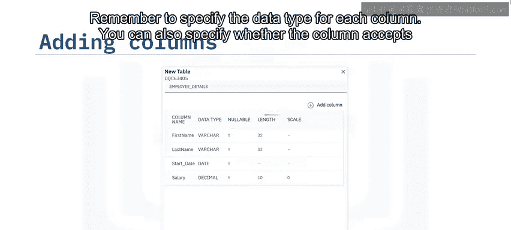

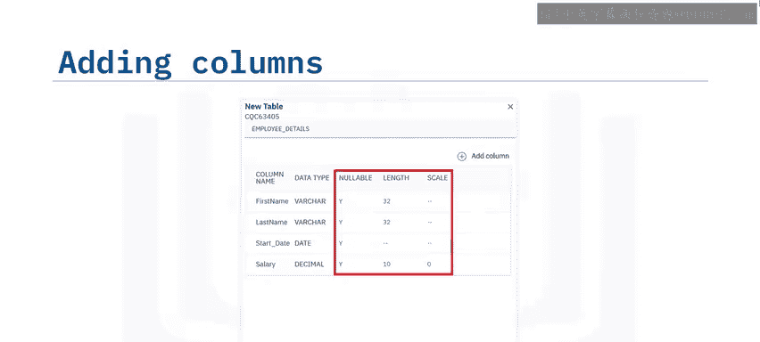

以下是创建表后可以执行的一些常见操作：

*   **删除表**：可以删除或丢弃（Drop）该表。
*   **生成 SQL 代码**：可以生成用于执行 **`SELECT`**、**`INSERT`**、**`UPDATE`**、**`DELETE`** 等操作的 SQL 代码。
*   **修改表结构**：可以**修改（Alter）** 表，例如添加新列、设置约束或以其他方式更改表结构。
*   **查看依赖关系**：可以查看该表所依赖的数据库对象。

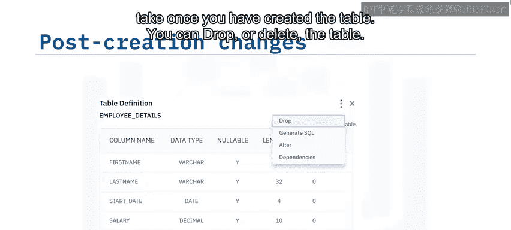

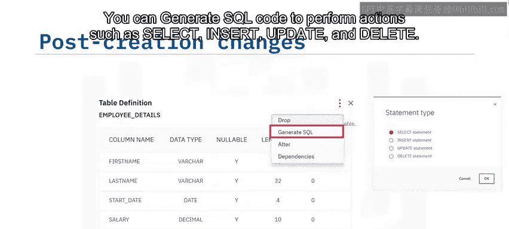

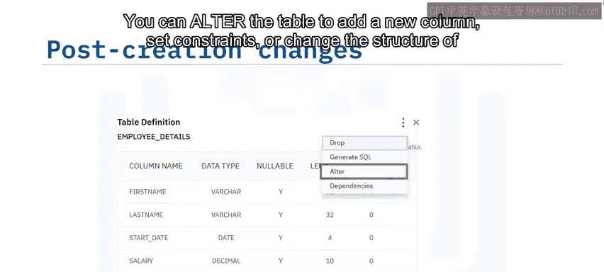

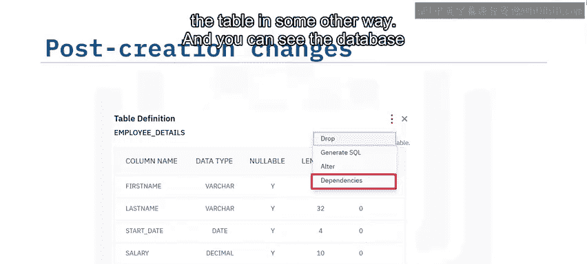

## 📖 课程总结

本节课中我们一起学习了关系数据库中创建表的核心知识。

我们了解到，许多关系数据库管理系统（RDBMS）使用**模式**来包含表、视图、函数等对象。大多数 RDBMS 都提供图形用户界面（GUI）来创建表，同时也可以使用 **`CREATE TABLE`** 等 SQL 语句来创建。在表创建后，如果需要添加列、更改数据类型或添加主键/外键，可以通过 **`ALTER TABLE`** 语句来修改表的结构。