# 016：CREATE TABLE 语句


在本节课中，我们将学习如何使用 `CREATE TABLE` 语句在关系数据库中创建表。你将了解如何将实体名称和属性转换为数据库中的表和列，并掌握该语句的基本语法和关键组成部分。

---

## 🛠️ CREATE TABLE 语句概述


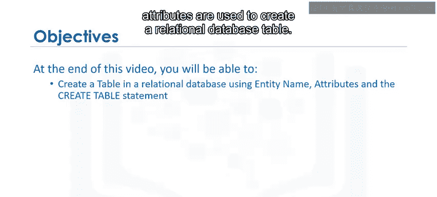


`CREATE TABLE` 是最常见的数据定义语言（DDL）语句之一，用于在数据库中创建新表。其基本语法结构如下：

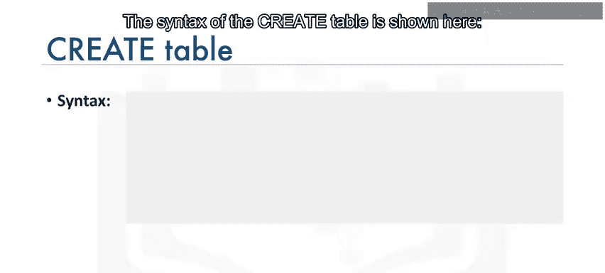

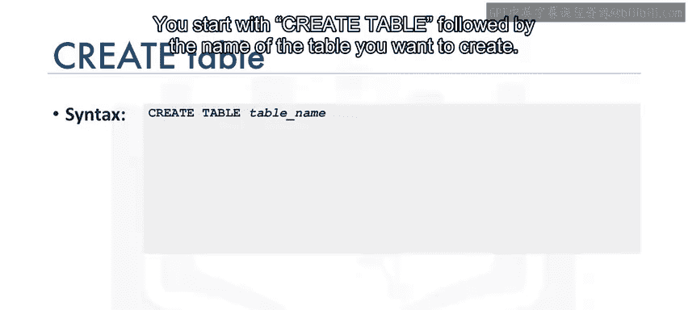

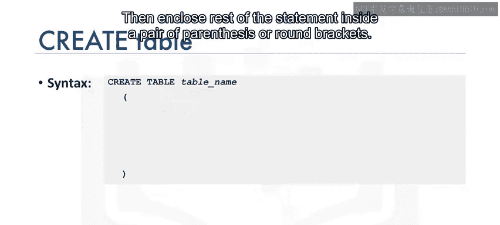

```sql
CREATE TABLE table_name (
    column1_name data_type [constraints],
    column2_name data_type [constraints],
    ...
);
```

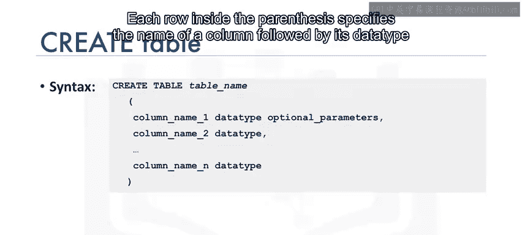

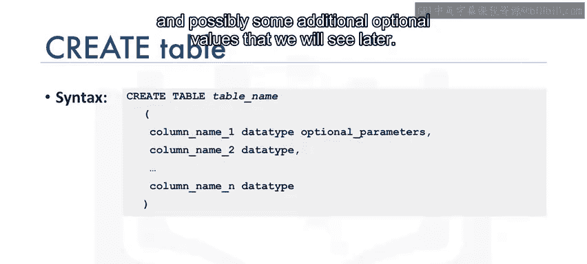

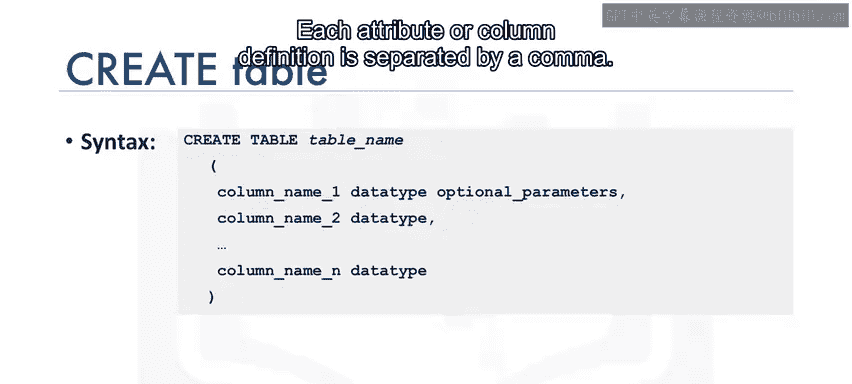

语句以 `CREATE TABLE` 开头，后跟要创建的表名。其余部分用一对圆括号括起来。括号内的每一行定义一个列，包括列名、数据类型，以及可选的约束（如主键、非空等）。每个列定义之间用逗号分隔。

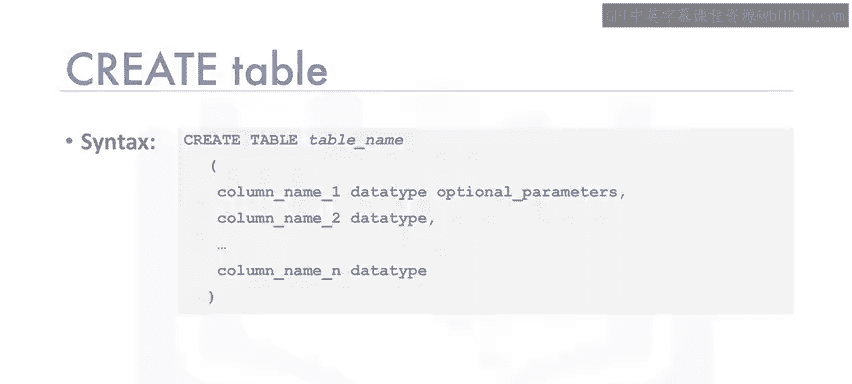

---

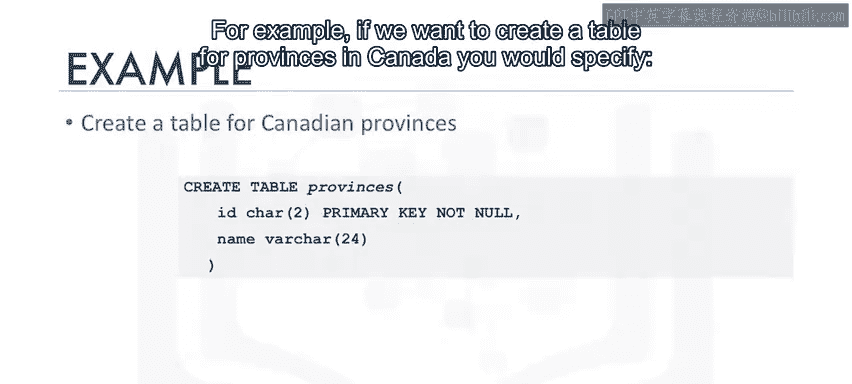

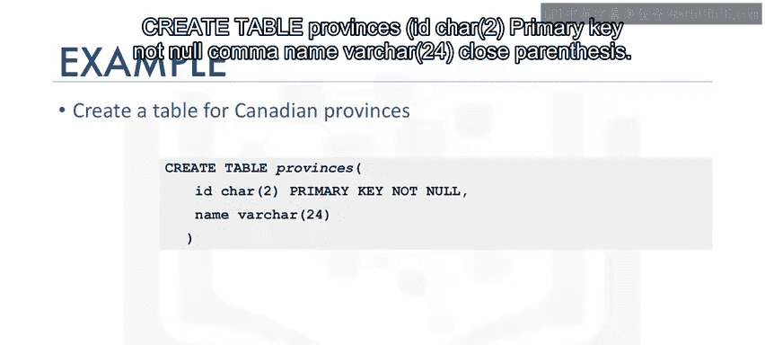

## 📝 基础示例：创建省份表

为了更好地理解，我们先看一个简单的例子。假设我们要为加拿大的省份创建一个表。

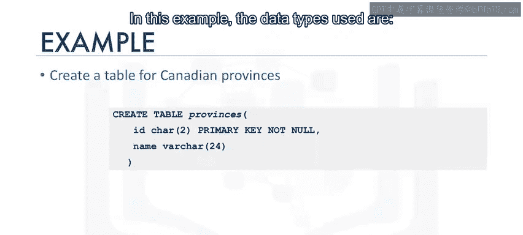

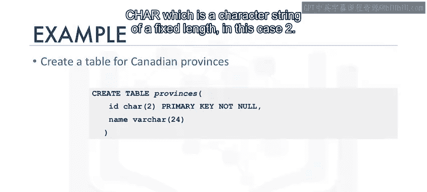

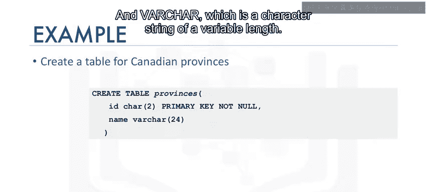

以下是创建该表的SQL语句：

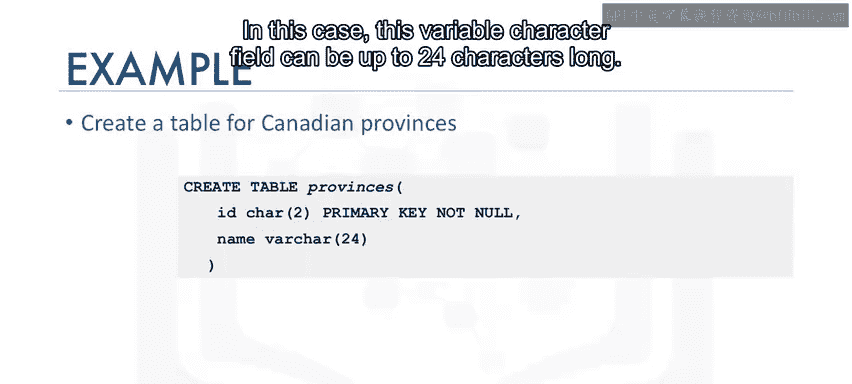

```sql
CREATE TABLE provinces (
    ID CHAR(2) PRIMARY KEY NOT NULL,
    name VARCHAR(24)
);
```

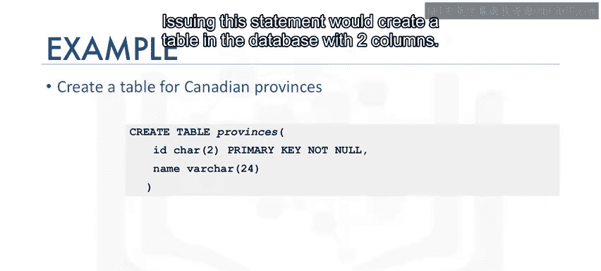

在这个例子中：
*   `ID` 列的数据类型是 `CHAR(2)`，表示它是一个固定长度为2的字符串，用于存储省份缩写（如AB, BC）。
*   `name` 列的数据类型是 `VARCHAR(24)`，表示它是一个可变长度字符串，最多可存储24个字符，用于存储省份全名（如Alberta, British Columbia）。
*   `ID` 列被指定为 `PRIMARY KEY`（主键）并带有 `NOT NULL`（非空）约束。

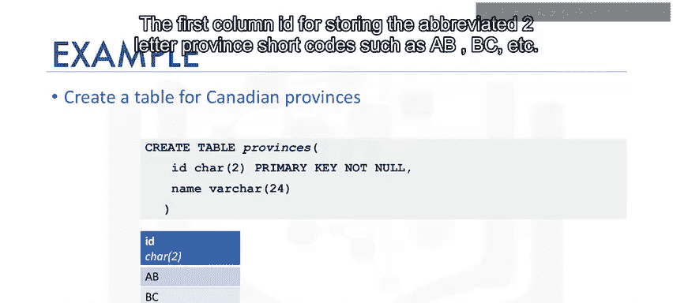

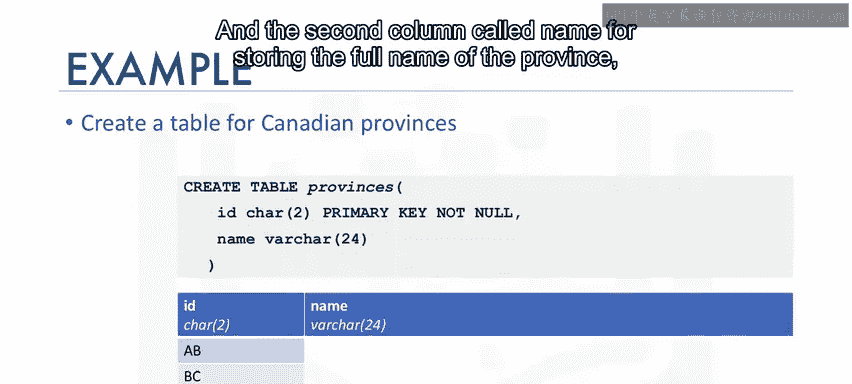

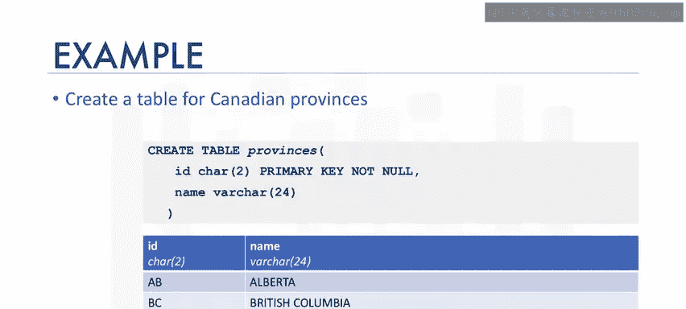

执行此语句后，数据库中将创建一个包含两列的 `provinces` 表。

---

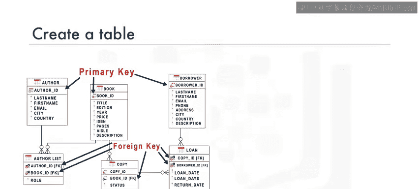

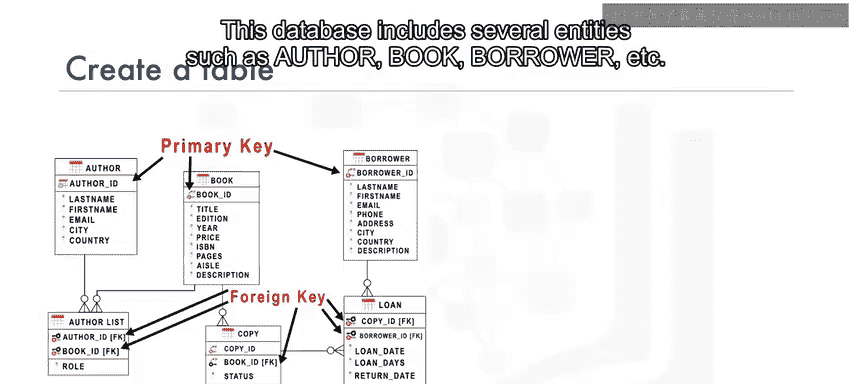

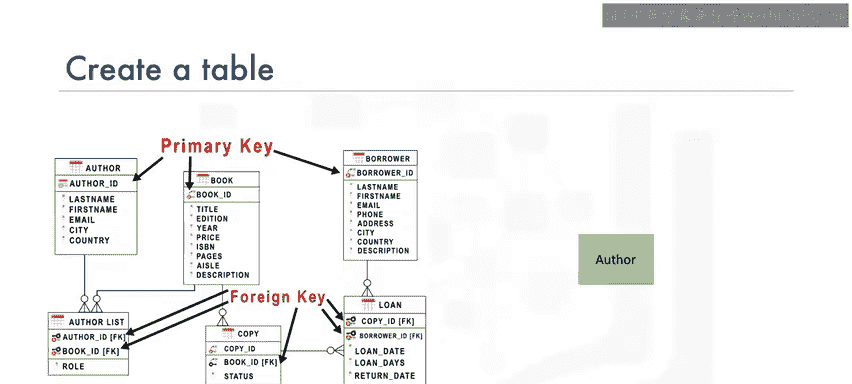

## 📚 进阶示例：创建图书馆数据库的作者表

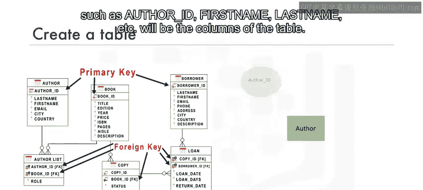

上一节我们介绍了基础语法，本节中我们来看看一个更贴近实际应用的例子。我们将基于一个图书馆数据库来创建 `author`（作者）表。

该表将包含以下属性（列）：
*   `author_id`：作者ID，设为主键。
*   `last_name`：姓氏。
*   `first_name`：名字。
*   `email`：电子邮件。
*   `city`：城市。
*   `country`：国家。

以下是创建 `author` 表的完整SQL语句：

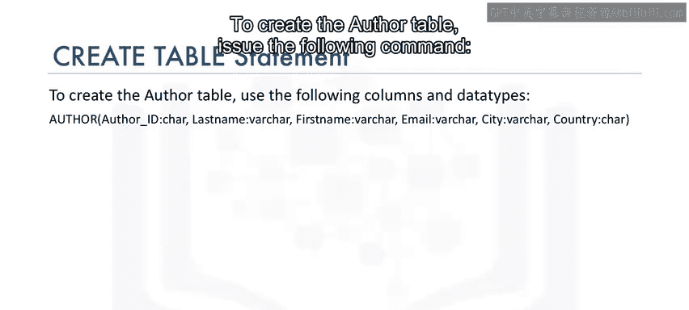

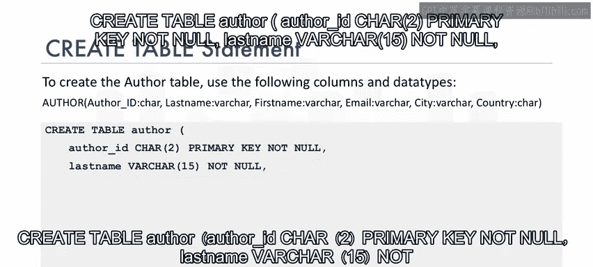

```sql
CREATE TABLE author (
    author_id CHAR(2) PRIMARY KEY NOT NULL,
    last_name VARCHAR(15) NOT NULL,
    first_name VARCHAR(15) NOT NULL,
    email VARCHAR(40),
    city VARCHAR(15),
    country CHAR(2)
);
```

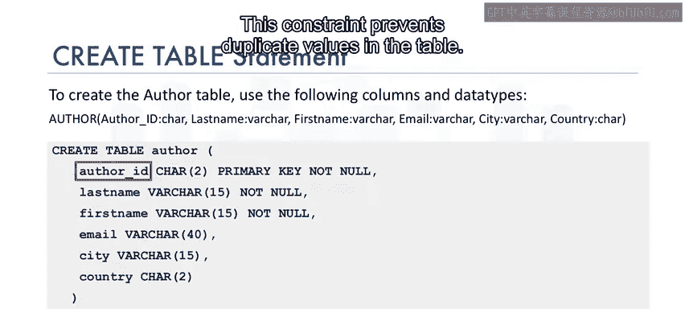

在这个语句中，我们应用了几个重要的概念：
1.  **主键约束**：`author_id CHAR(2) PRIMARY KEY NOT NULL` 将 `author_id` 列设为主键。这确保了表中每一行都能被唯一标识，且该列不允许出现重复值或空值。
2.  **非空约束**：`last_name` 和 `first_name` 列都带有 `NOT NULL` 约束。这意味着这些字段在插入数据时必须包含值，不能为空，因为作者必须拥有姓名。
3.  **可变长度字符**：`VARCHAR` 类型用于存储长度可能变化的数据，如姓名、邮箱等，括号内的数字指定了最大允许长度。


---

## ✅ 课程总结


本节课中我们一起学习了 `CREATE TABLE` 语句的核心用法。我们了解到：
*   `CREATE TABLE` 是用于在数据库中创建新表的DDL语句。
*   其语法核心是定义表名和包含在圆括号内的列定义列表。
*   每个列定义需要指定**列名**和**数据类型**（如 `CHAR`, `VARCHAR`）。
*   可以为核心列添加**约束**，例如 `PRIMARY KEY`（主键）和 `NOT NULL`（非空），以保证数据的完整性和准确性。

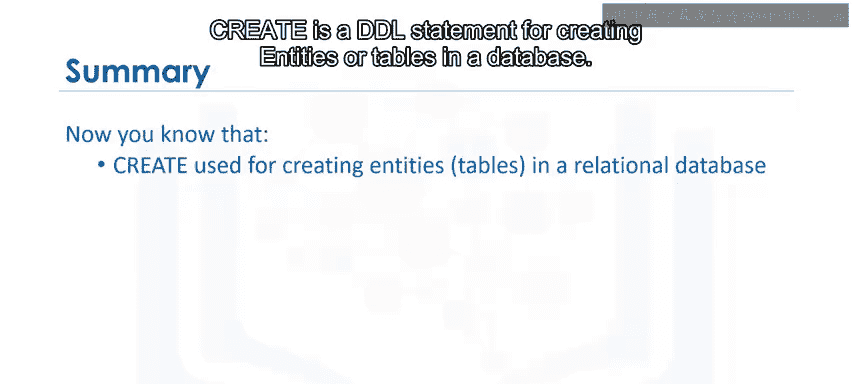


通过创建“省份表”和“作者表”的实例，我们实践了如何将实体和属性转化为具体的数据库表结构。掌握 `CREATE TABLE` 语句是构建任何关系数据库的第一步。