# 017：ALTER、DROP 和 TRUNCATE 表 🗂️


在本节课中，我们将学习如何修改和删除数据库中的表。具体来说，我们将掌握三个核心SQL语句：`ALTER TABLE`、`DROP TABLE` 和 `TRUNCATE TABLE`。这些语句用于改变表结构、删除整个表或清空表中的所有数据。

观看本视频后，你将能够描述这些语句的作用，解释其语法，并在查询中使用它们。`ALTER TABLE` 语句用于向表中添加或删除列、修改列的数据类型、添加或删除键以及约束。

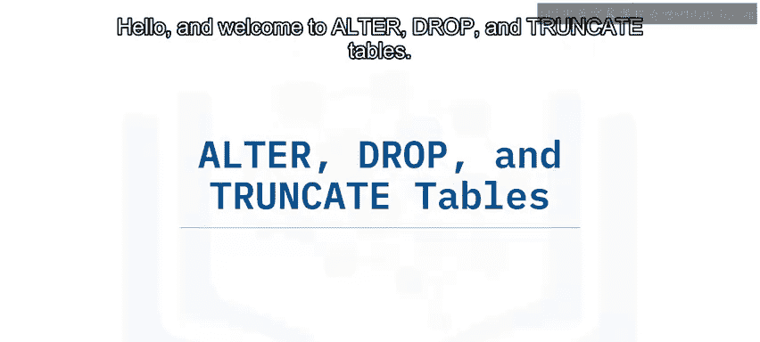

---

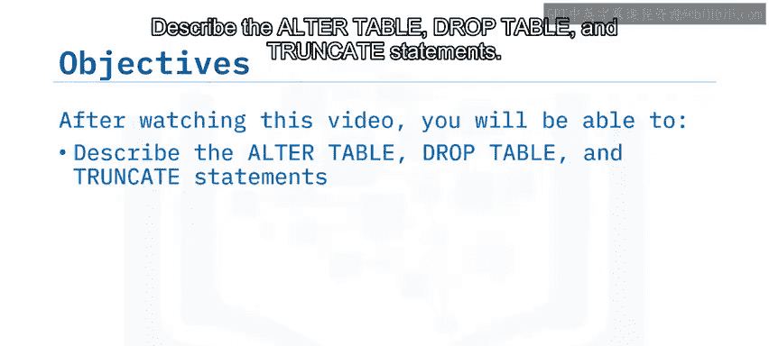

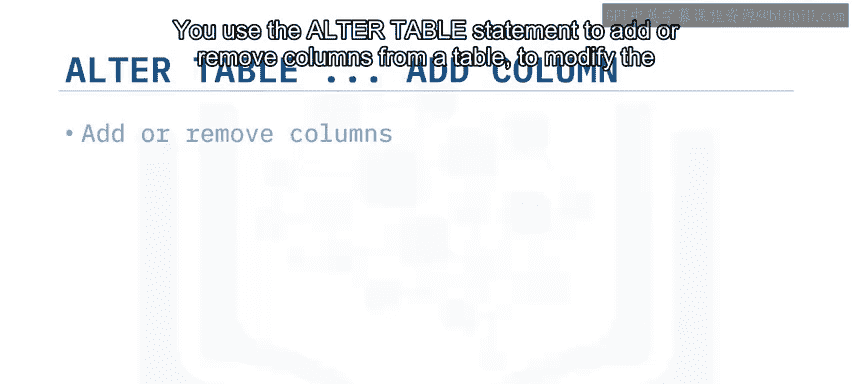

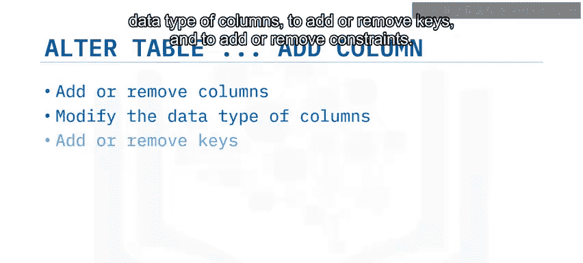

## ALTER TABLE 语句

`ALTER TABLE` 语句用于更改现有表的结构。其基本语法与 `CREATE TABLE` 语句不同，它不使用括号来包裹参数。语句中的每一行都指定了你希望对表进行的一项更改。

以下是 `ALTER TABLE` 语句的基本语法：
```sql
ALTER TABLE table_name
ADD COLUMN column_name data_type;
```

例如，为了在图书馆数据库的 `author` 表中添加一个用于存储作者电话号码的列，可以使用以下语句：
```sql
ALTER TABLE author
ADD COLUMN telephone_number BIGINT;
```
在这个例子中，列的数据类型是 `BIGINT`，它可以容纳长达19位的数字。

---


### 修改列的数据类型

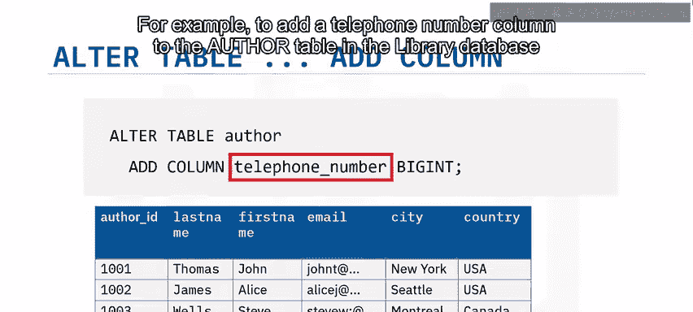

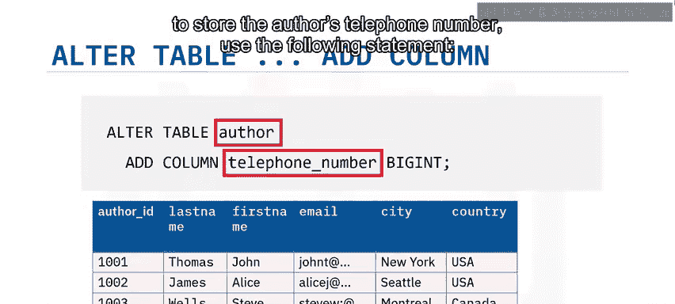

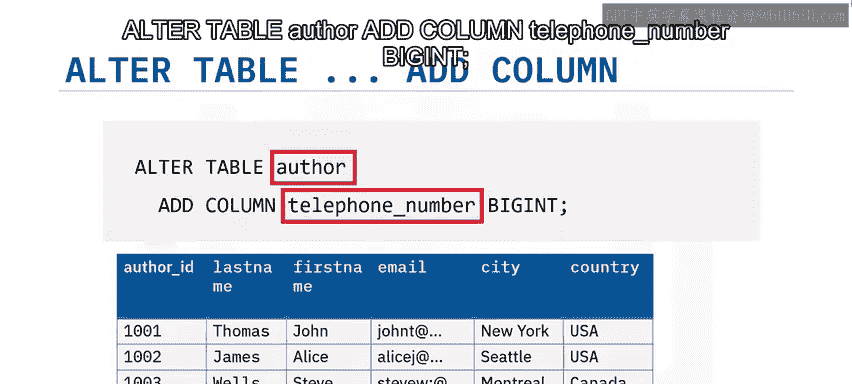

你也可以使用 `ALTER TABLE` 语句来修改列的数据类型。为此，需要使用 `ALTER COLUMN` 子句，并为列指定新的数据类型。

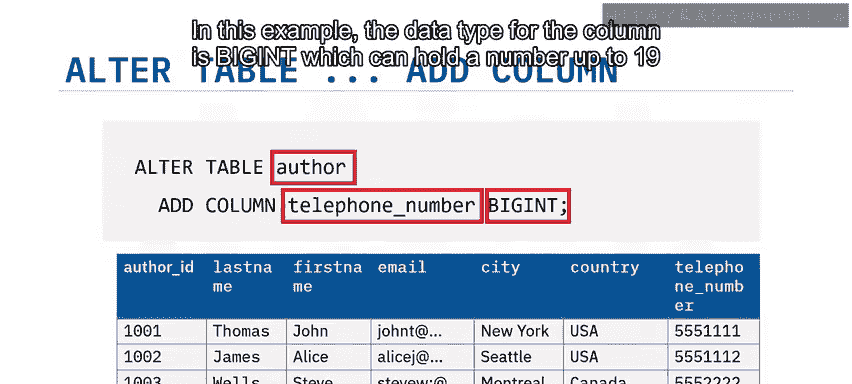

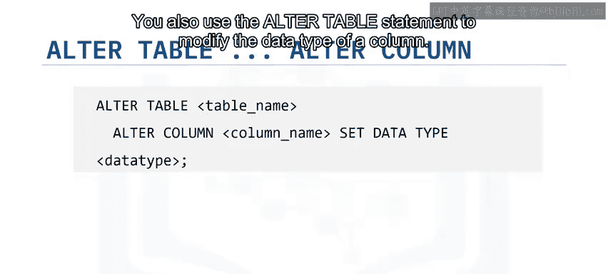

例如，使用数字数据类型存储电话号码意味着你不能将括号、加号或破折号作为号码的一部分。为了克服这个问题，可以将列的数据类型改为 `CHAR`。

以下代码展示了如何修改 `author` 表：
```sql
ALTER TABLE author
ALTER COLUMN telephone_number
SET DATA TYPE CHAR(20);
```

**需要注意的是**，修改包含现有数据的列的数据类型可能会引发问题，特别是当现有数据与新数据类型不兼容时。例如，如果列中已包含非数字数据，尝试将列从 `CHAR` 类型更改为数字类型将会失败。你会看到错误提示，并且该语句不会执行。

---

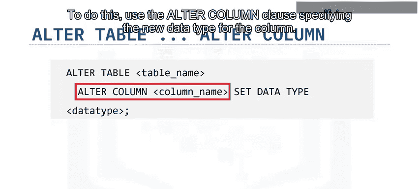

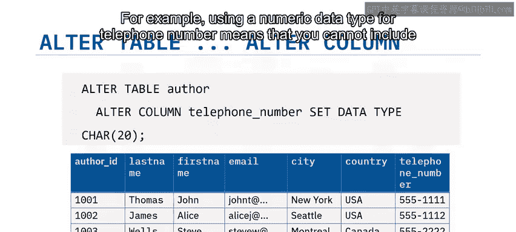

### 删除列

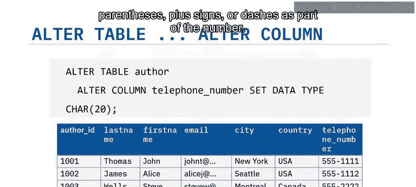

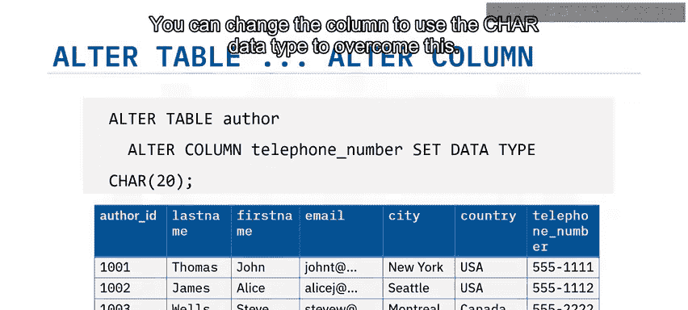

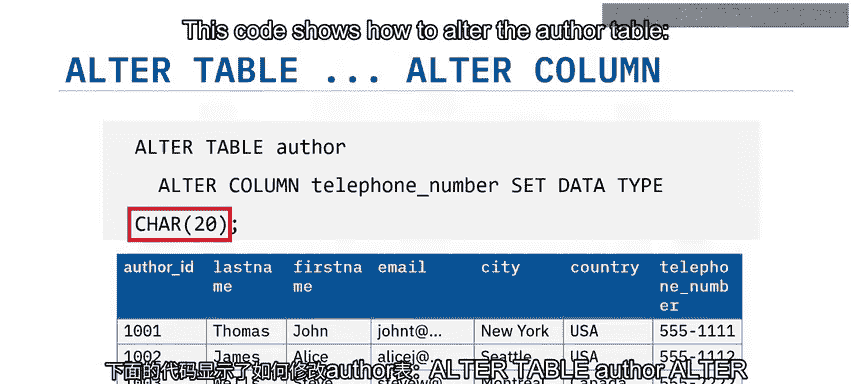

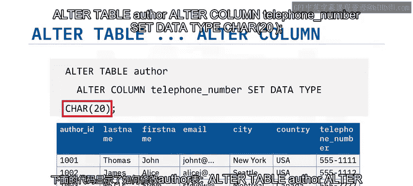

如果你的需求发生变化，不再需要某个额外的列，你可以再次使用 `ALTER TABLE` 语句，这次配合 `DROP COLUMN` 子句来删除该列。

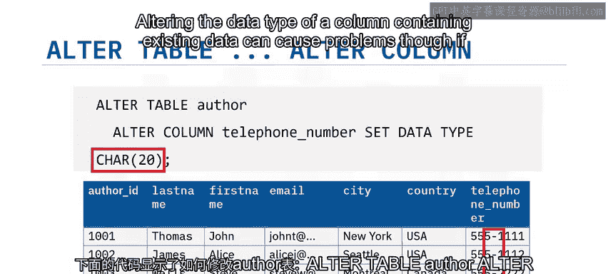

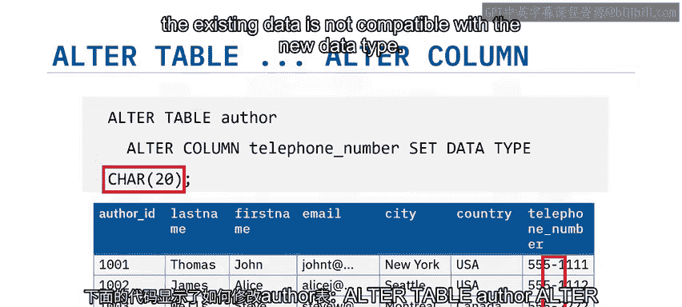

操作如下所示：
```sql
ALTER TABLE author
DROP COLUMN telephone_number;
```

---

## DROP TABLE 语句

与使用 `DROP COLUMN` 从表中删除列类似，你可以使用 `DROP TABLE` 语句从数据库中删除整个表。默认情况下，如果你删除一个包含数据的表，数据将随表一起被删除。

`DROP TABLE` 语句的语法非常简单：
```sql
DROP TABLE table_name;
```

例如，要删除 `author` 表，你可以使用以下语句：
```sql
DROP TABLE author;
```

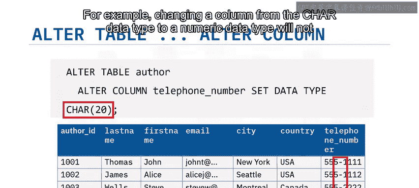

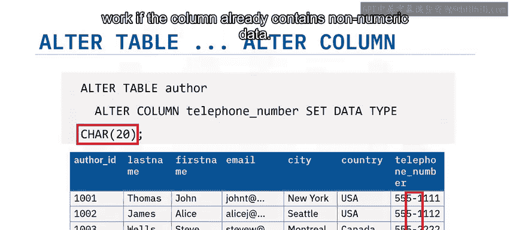


---

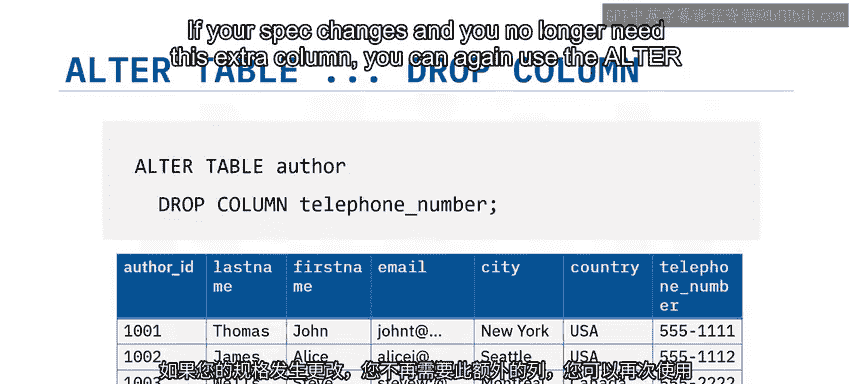

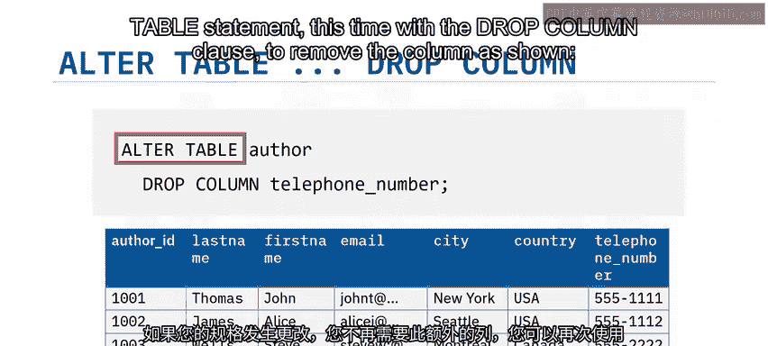

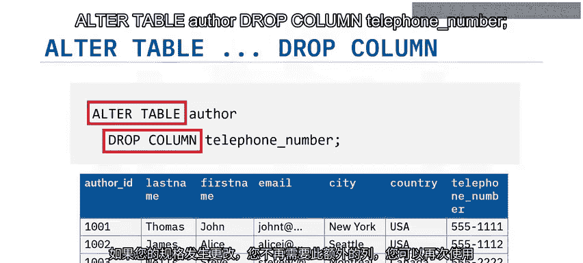

## TRUNCATE TABLE 语句

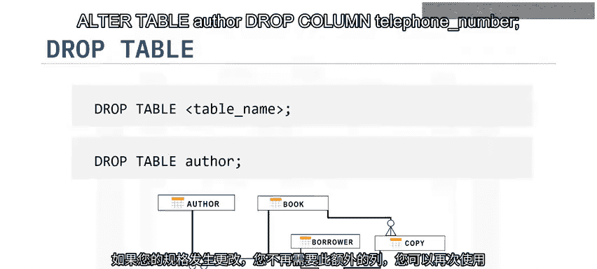

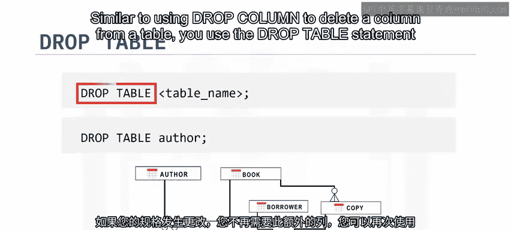

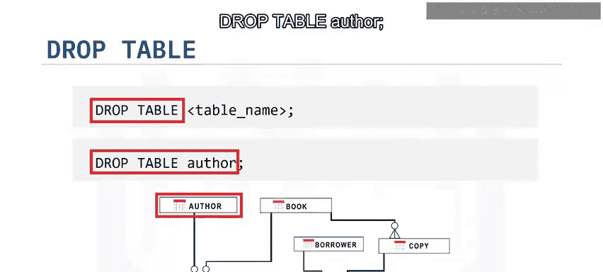

有时，你可能只想删除表中的数据，而不是删除表本身。虽然你可以使用不带 `WHERE` 子句的 `DELETE` 语句来实现，但通常使用 `TRUNCATE TABLE` 语句会更快速、更高效。

`TRUNCATE TABLE` 语句用于删除表中的所有行。其语法如下：
```sql
TRUNCATE TABLE table_name IMMEDIATE;
```
这里的 `IMMEDIATE` 指定立即处理该语句，且操作无法撤销。

因此，要清空 `author` 表，你可以使用以下语句：
```sql
TRUNCATE TABLE author IMMEDIATE;
```

---

## 总结

本节课我们一起学习了三个重要的数据定义语言（DDL）语句：

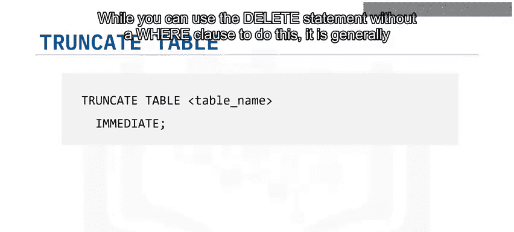

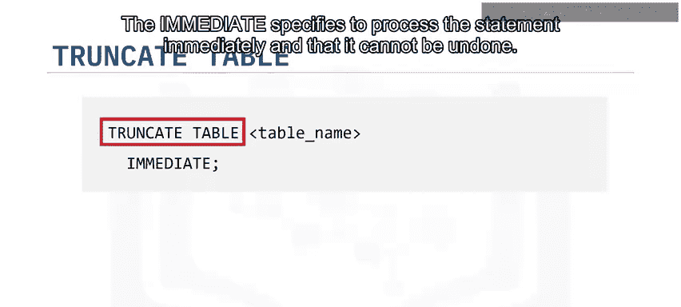

*   **`ALTER TABLE` 语句**：用于更改现有表的结构，例如添加、修改或删除列。
*   **`DROP TABLE` 语句**：用于删除数据库中的现有表。
*   **`TRUNCATE TABLE` 语句**：用于删除表中的所有数据行。

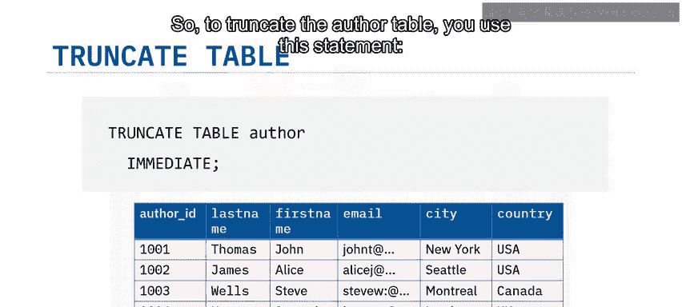


掌握这些语句将帮助你在管理数据库时灵活地调整结构并清理数据。