# 018：数据移动实用程序 📂

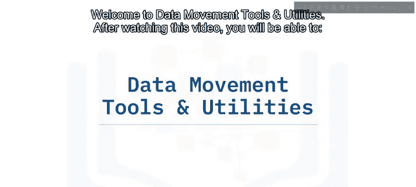

在本节课中，我们将学习数据移动工具和实用程序。学完本课后，你将能够识别需要数据移动的场景，列举关系数据库中用于数据移动的各种工具和实用程序，并理解备份与恢复、导入与导出以及加载工具之间的区别和适用场景。

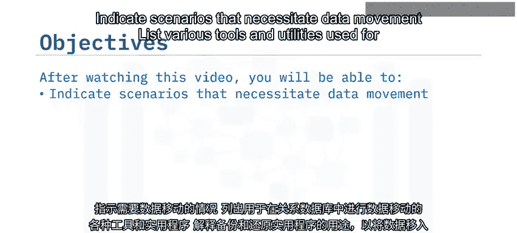

数据工程师和数据库管理员经常需要将数据移入或移出现有数据库。这可能是出于多种原因。

上一节我们介绍了数据移动的必要性，本节中我们来看看具体有哪些工具和实用程序。

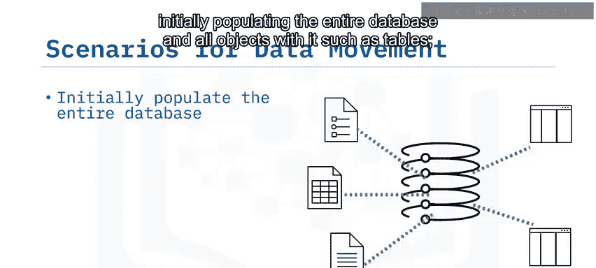

每个数据库都有其自己的数据移动工具，但它们大致可以分为三类：备份与恢复、导入与导出以及加载。让我们逐一了解。

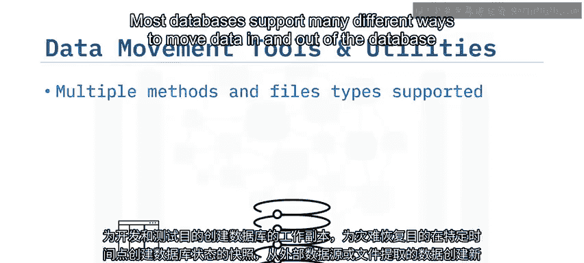

## 备份与恢复 🔄

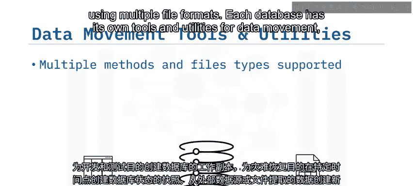

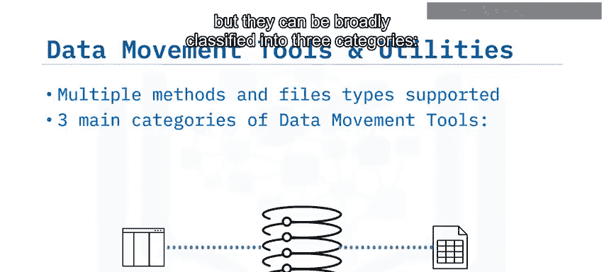

在数据库之间移动数据的一种方法是执行备份和恢复操作。备份操作会创建一个或多个文件，其中封装了所有数据库对象及其数据。恢复操作则从备份文件中创建原始数据库的精确副本。

备份和恢复操作会保留数据库中的所有对象，包括模式、表、视图、用户定义的数据类型、函数、存储过程、表约束、触发器、安全设置、对象之间的关系，当然还有所有表中的数据。

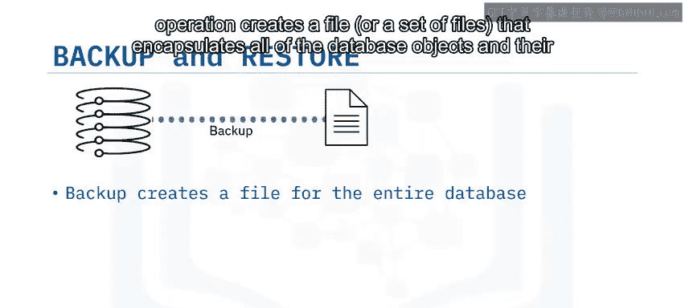

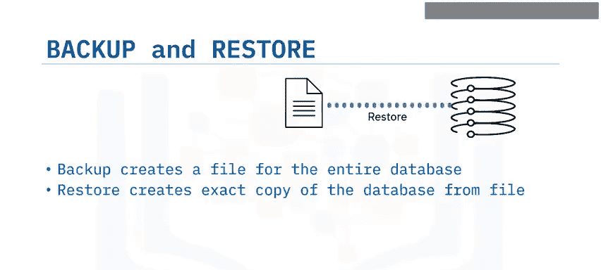

备份通常定期进行，目的是为生产数据库保留副本，用于灾难恢复。备份和恢复操作也可用于创建数据库的额外副本，以供开发和测试之用。

## 导入与导出 📤📥

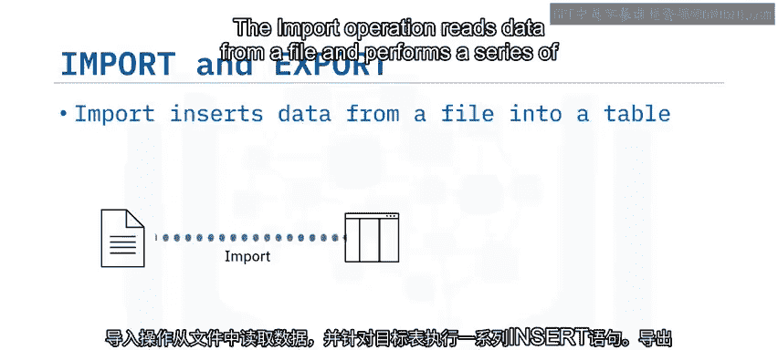

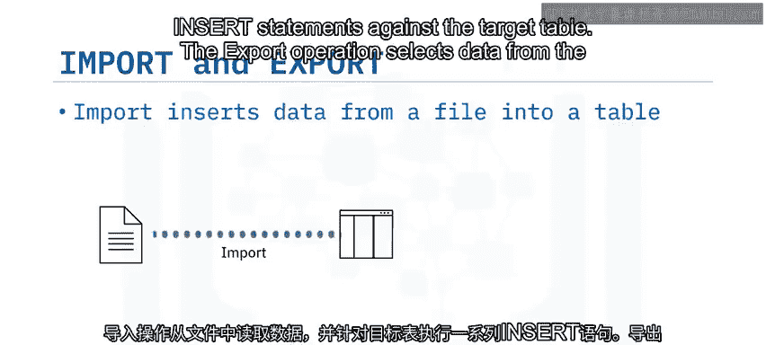

导入操作从文件中读取数据，并对目标表执行一系列插入语句。

导出操作从指定表中选择数据，并将其保存到目标文件中。

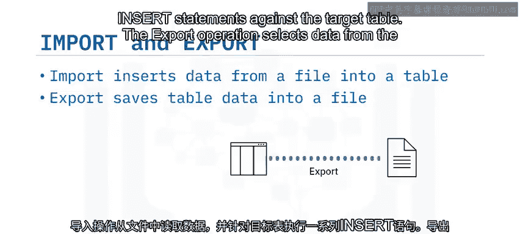

根据数据库的不同，导入和导出操作可以通过多种界面执行。大多数数据库至少提供一个命令行实用程序。某些数据库的管理工具也支持导入和导出。在某些情况下，图形或Web管理工具会为这些操作提供可视化界面。此外，还有第三方工具允许对许多不同的数据库管理系统执行这些操作。

以下是数据库支持的常用文件格式：

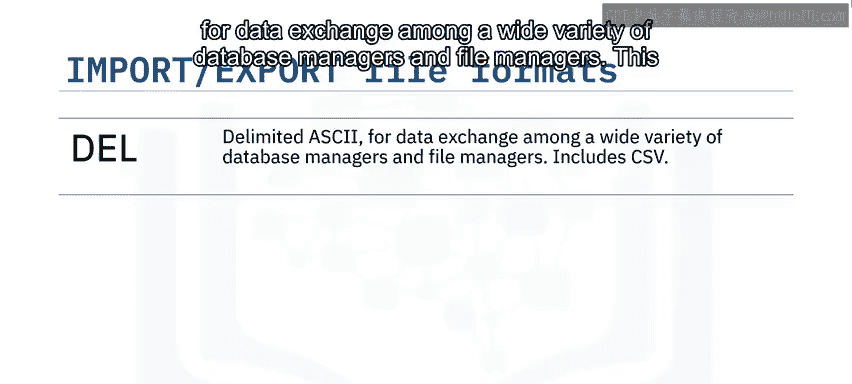

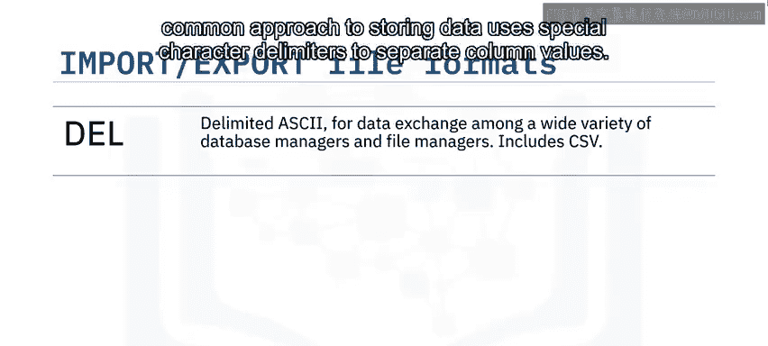

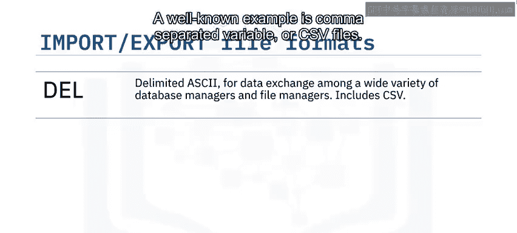

*   **DEL 或定界 ASCII**：用于在各种数据库管理器和文件管理器之间进行数据交换。这种方法使用特殊字符分隔符来分隔列值。一个众所周知的例子是逗号分隔变量或 CSV 文件。
*   **ASC 或非定界 ASCII**：用于从创建具有对齐列数据的平面文本文件的其他应用程序导入或加载数据。
*   **PC/IXF**：集成交换格式的 PC 版本。PC/IXF 是数据库表的结构化描述，包含内部表的外部表示。
*   **JSON**：随着 JSON 和 RESTful Web 服务的普及，一些数据库和第三方工具也开始支持与 JSON 文件之间的数据导入和导出。

让我们看一些在不同界面中执行导入和导出操作的例子。在 DB2 中，命令行导入和导出实用程序允许你键入文件名、文件格式、表名，以及可选的用于导入和导出数据的消息文件。请注意，DB2 中的导出实用程序允许你指定 SQL 查询，以便在需要时仅导出指定表中的数据子集。

作为一个简单导出的例子，让我们看看如何在 DB2 控制台中将表导出为 CSV 文件。在你的模式中，选择要导出的表，选择该表，然后点击“查看数据”，选择“导出”按钮，点击“导出为 CSV”。你可以指定名称和位置来保存 CSV 文件。

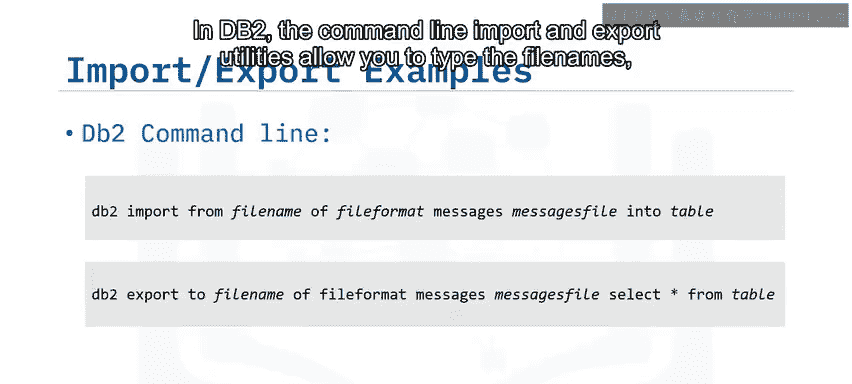

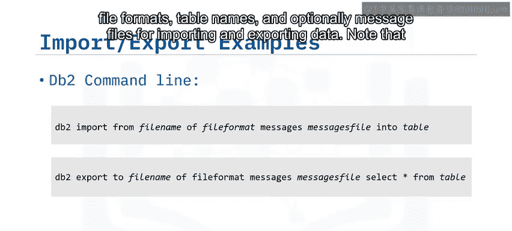

## 加载工具 ⚡

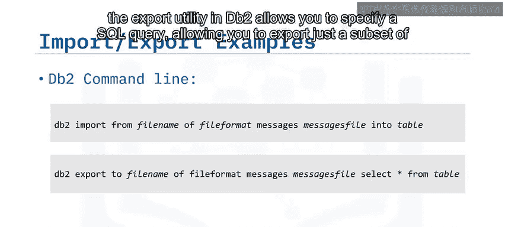

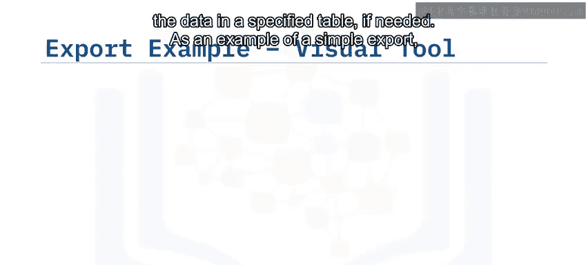

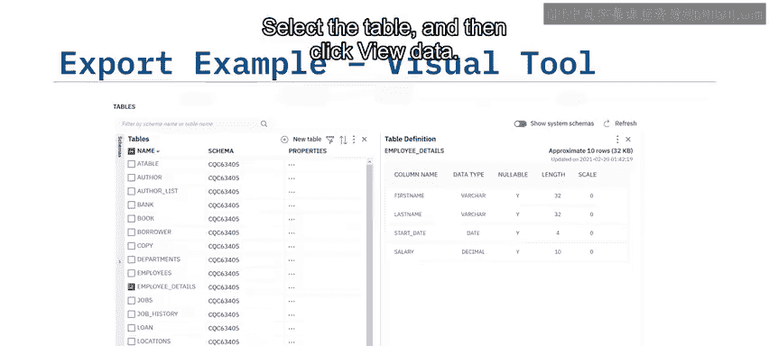

作为导入实用程序的替代方案，一些数据库提供了加载实用程序。加载实用程序比导入实用程序更快，因为它直接将格式化页面写入数据库，而导入实用程序则执行一系列 SQL 插入语句。

然而，它不执行参照完整性或表约束检查。因此，如果你需要这些额外的检查，可能更倾向于使用导入实用程序。加载实用程序也可能绕过数据库日志记录，这也有助于提高性能。对于较小的表，导入可能效果很好，但当涉及非常大的数据量时，加载实用程序是首选。

你可以从命令行激活 DB2 导入实用程序，或通过应用程序调用其 API，甚至可以使用可视化数据库管理工具。

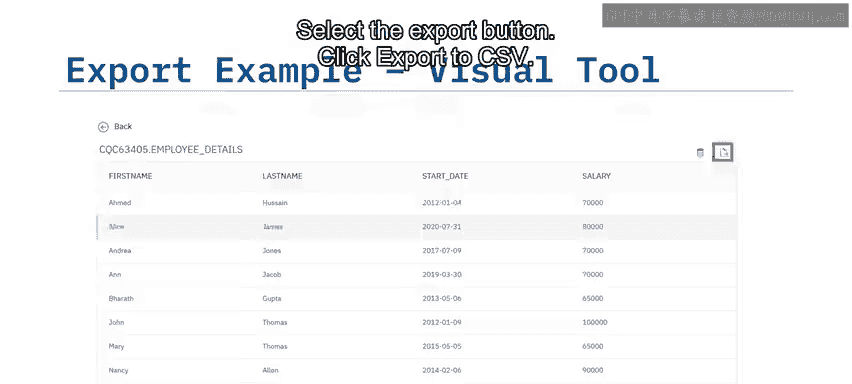

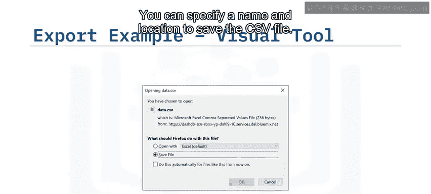

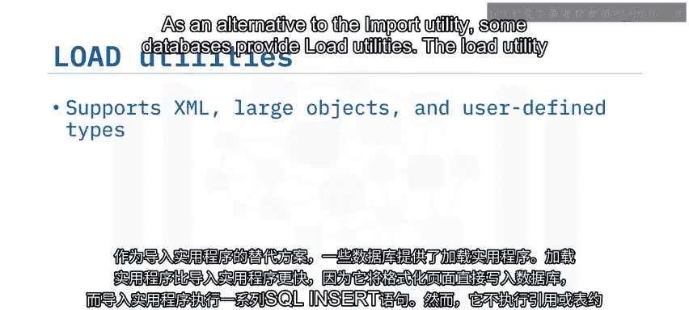

## 总结 📝

本节课中，我们一起学习了数据移动的相关知识。我们了解到，数据移动对于初始填充数据库和表、添加或追加数据以及为开发测试或灾难恢复制作副本是必需的。

备份和恢复实用程序用于创建和恢复整个数据库的副本，包括表、视图、约束及其数据等所有对象。导入实用程序支持从 DEL、CSV、ASC 和 IXF 等不同格式将数据插入到特定表中。导出实用程序支持将特定表中的数据保存为 CSV 等各种格式。加载实用程序支持高性能地将数据插入到指定表中，对于处理大量数据非常有用。