# 019：加载数据 📥

在本节课中，我们将要学习如何向数据库表中高效地加载大量数据。你将了解何时使用数据加载功能，可以加载哪些数据源，以及如何在DB2 Web控制台中通过四个步骤完成数据加载过程。

上一节我们介绍了数据库的基本操作，本节中我们来看看如何批量导入数据。

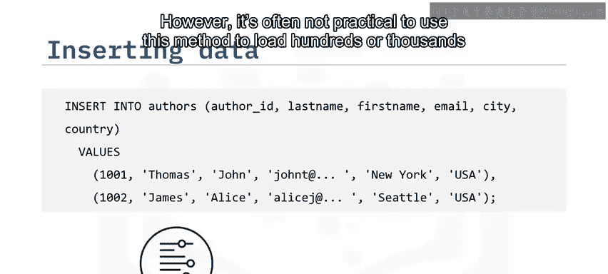

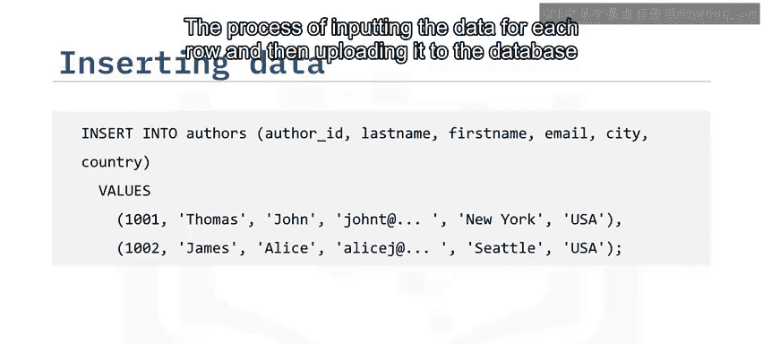

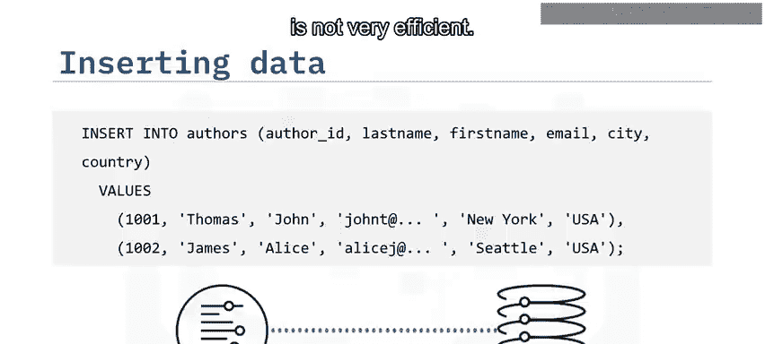

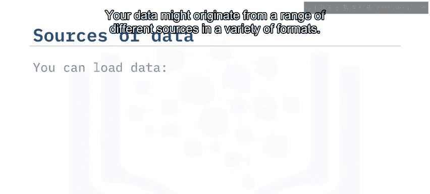

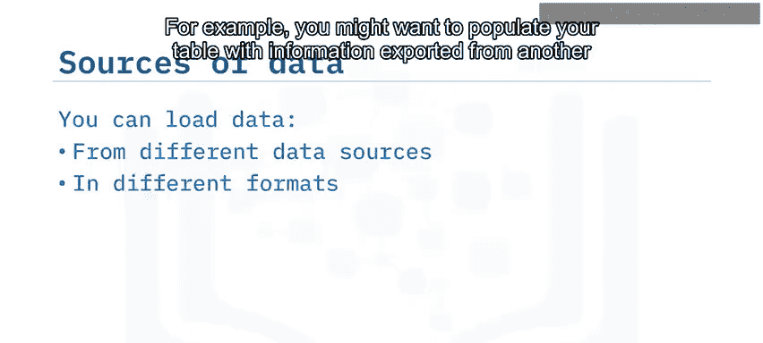

使用 `INSERT` 这样的SQL语句向表中添加数据，对于少量行或在开发和测试数据库系统时可能适用。然而，当需要加载成百上千行数据时，逐行输入并上传到数据库的方法效率低下，并不实用。

因此，大多数关系数据库管理系统（RDBMS）都提供了一种方法，能够快速、高效且可扩展地将大量数据直接加载到表中。

你的数据可能来自各种不同的来源和格式。例如，你可能希望用以下数据填充你的表：
*   从另一个数据库导出到分隔文本文件（如CSV）的信息。
*   从定制应用程序输出的对象数据。

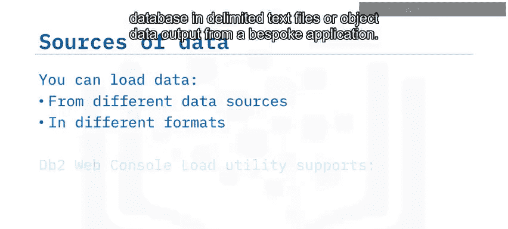

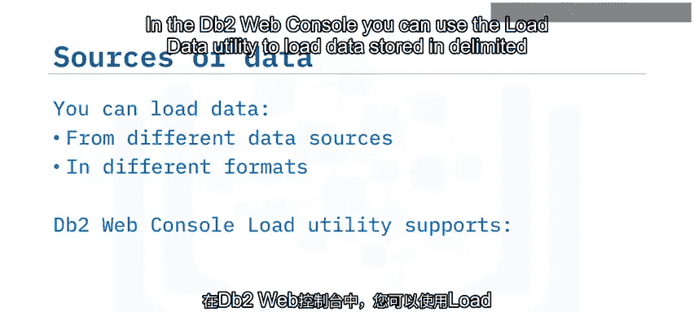

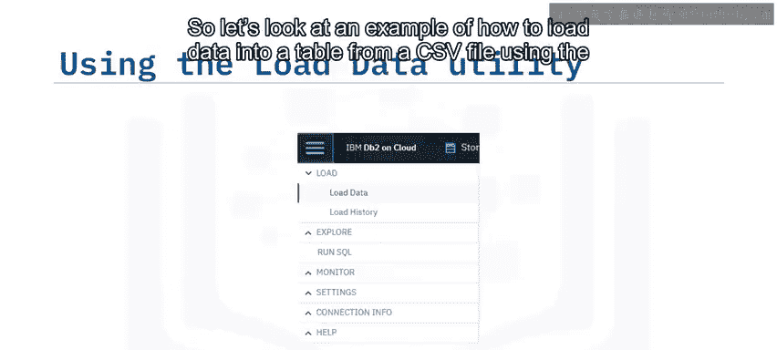

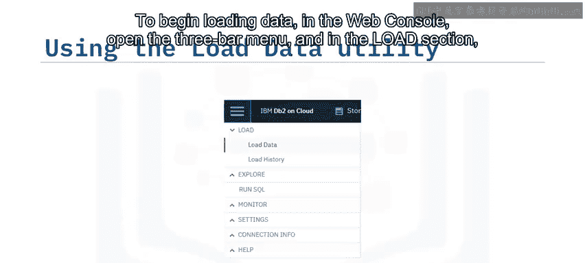

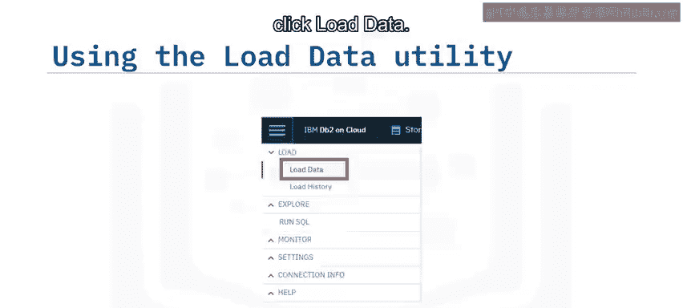

在DB2 Web控制台中，你可以使用“加载数据”工具来加载存储在以下位置的数据：
*   本地计算机上的分隔文本文件。
*   Amazon Web Services的S3对象存储。
*   IBM的云对象存储。

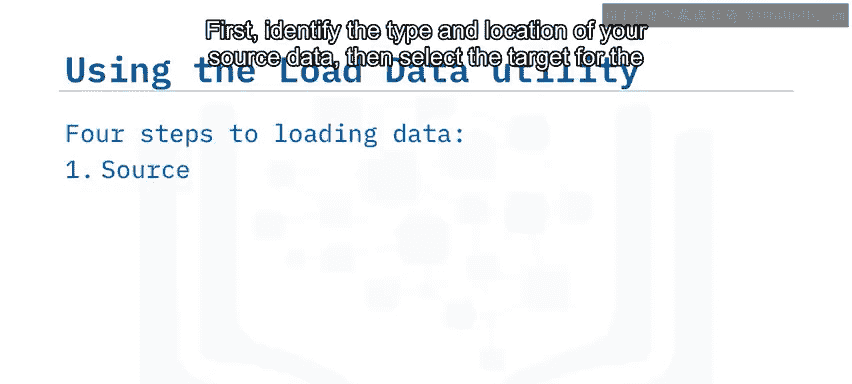

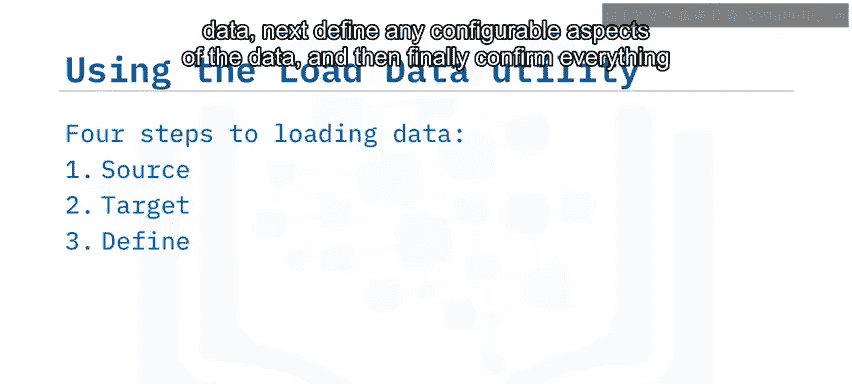

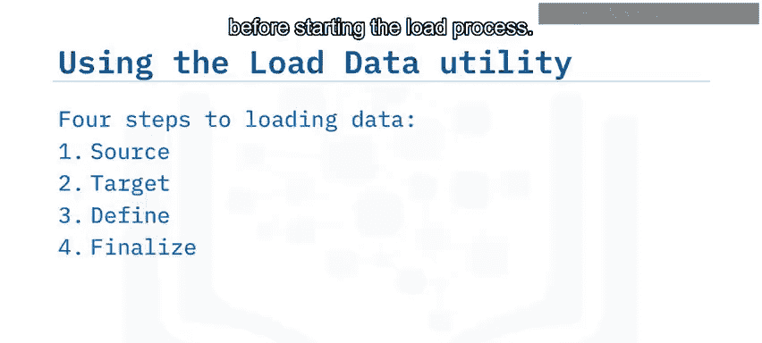

接下来，让我们通过一个例子，看看如何使用DB2 Web控制台从CSV文件加载数据到表中。

以下是开始加载数据需要遵循的四个步骤：

1.  **识别源数据**：在“源”页面，选择现有数据的位置，并输入该存储类型所需的任何身份验证信息。
    *   例如，对于IBM云对象存储中的数据，你需要提供COS身份验证端点、访问密钥和秘密访问密钥。
    *   而对于本地存储的CSV文件，你只需指定要上传的文件。

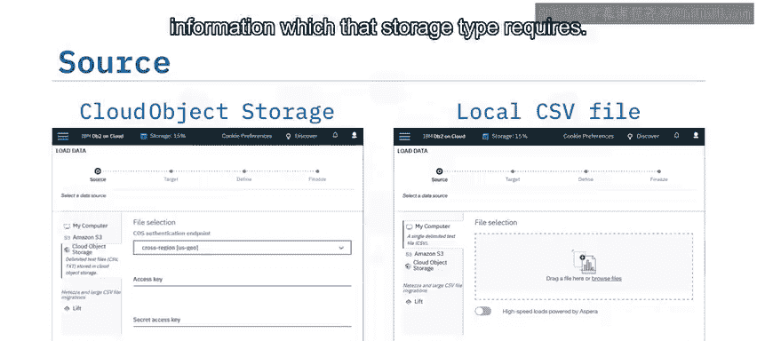

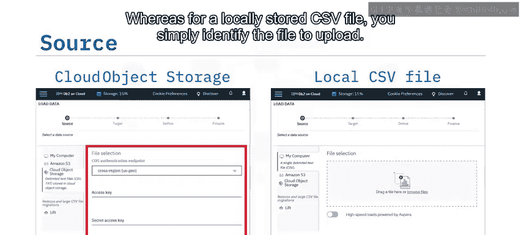

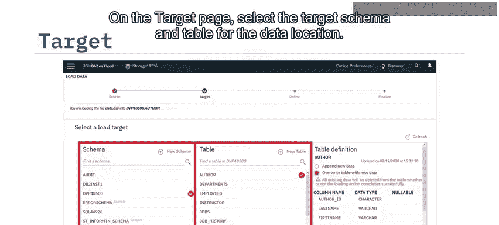

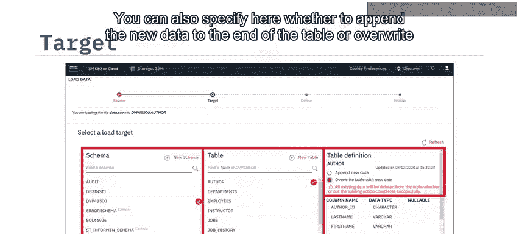

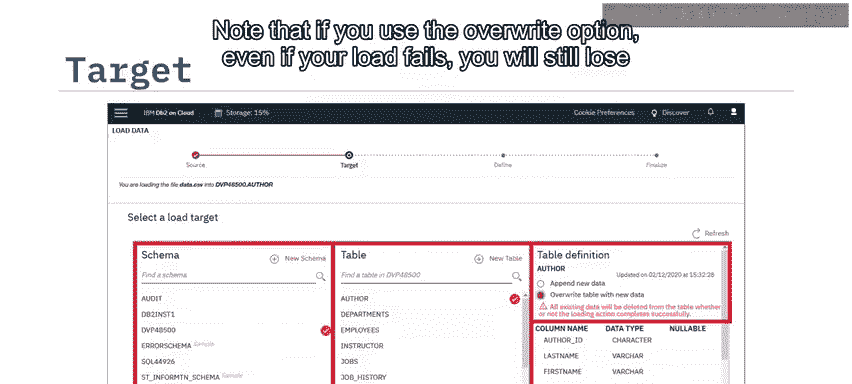

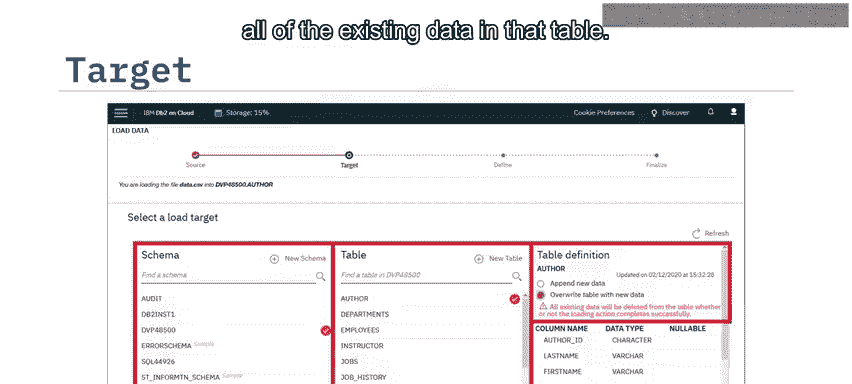

2.  **选择目标**：在“目标”页面，为数据选择目标模式和表。你还可以在此处指定是将新数据追加到表的末尾，还是用新数据覆盖现有数据。
    *   请注意，如果选择覆盖选项，即使加载失败，该表中所有现有数据也将丢失。
    *   或者，你可以点击“新建表”，将数据加载到一个全新的表中，并使用新数据的格式来定义列的数据类型。

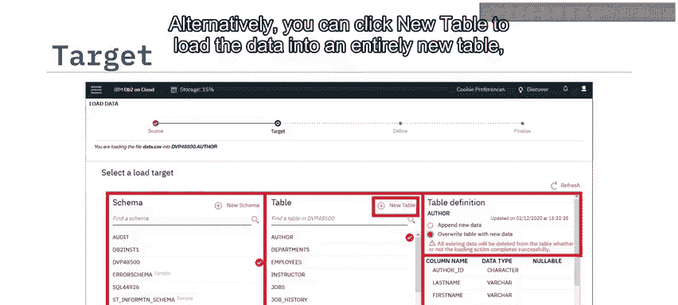

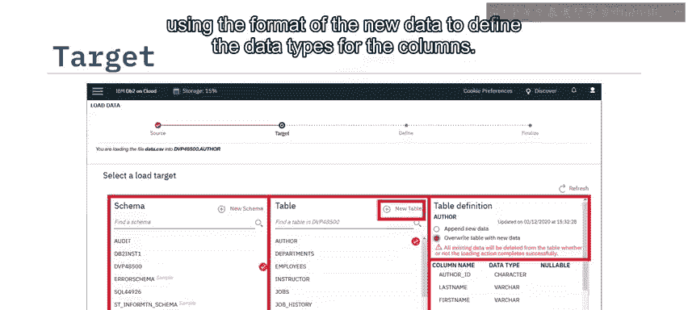

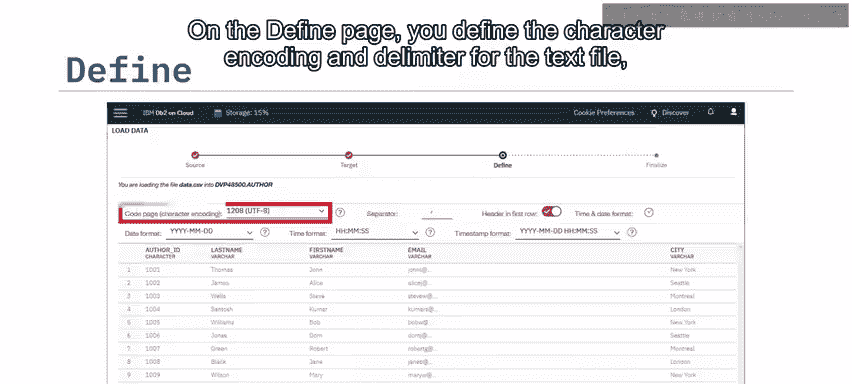

3.  **定义数据格式**：在“定义”页面，定义文本文件的字符编码和分隔符，第一行是否包含列标题，以及使用何种时间和日期格式。

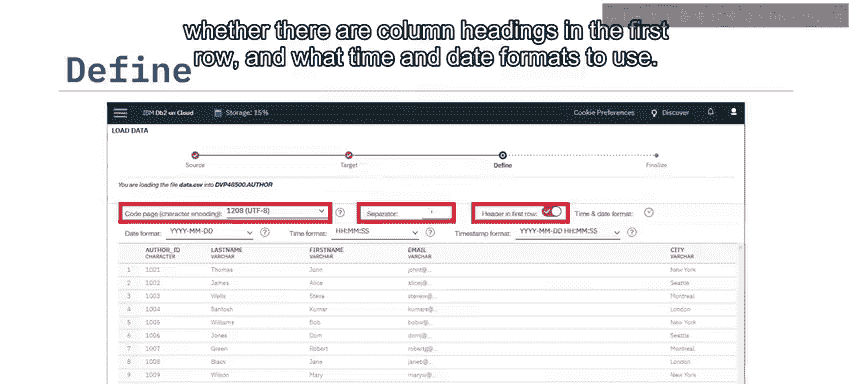

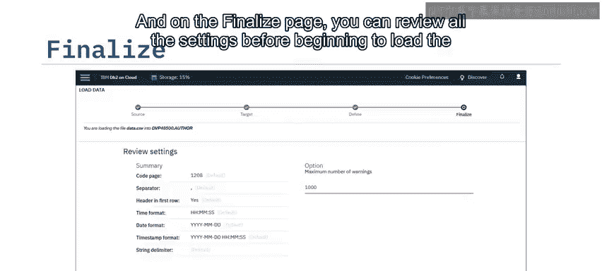

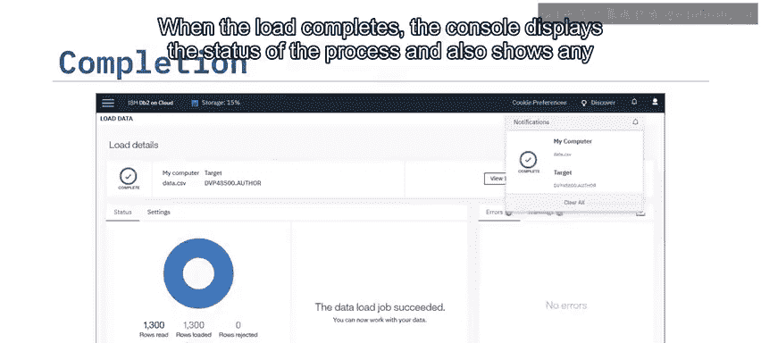

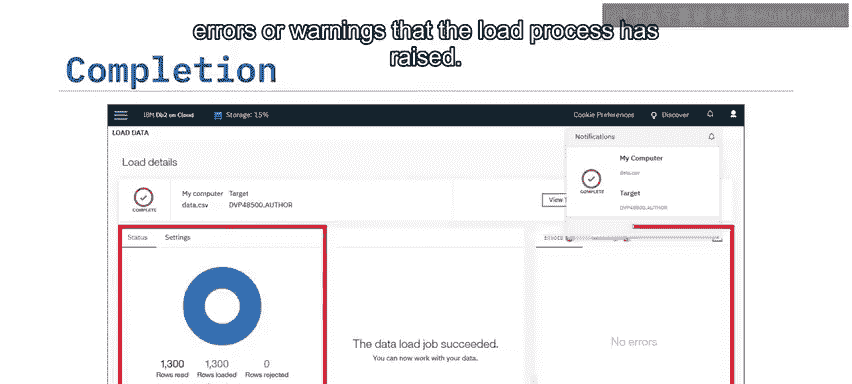

4.  **确认并开始加载**：在“最终确定”页面，你可以在开始加载数据前查看所有设置。加载完成后，控制台将显示该过程的状态，并显示加载过程引发的任何错误或警告。

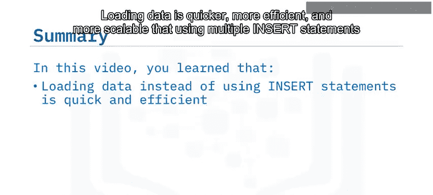

本节课中我们一起学习了数据加载。你了解到，与使用多个`INSERT`语句相比，加载数据更快、更高效且更具扩展性。你可以从多种数据源加载数据，包括分隔文本文件和云对象存储。而“加载数据”工具是DB2 Web控制台中一个简单易用的界面。