# 021：主键与外键 🔑


在本节课中，我们将要学习关系数据库中两个核心概念：主键和外键。我们将了解它们的作用、如何创建它们，以及它们如何共同定义表与表之间的关系。

## 概述

主键和外键是关系数据库设计的基石。主键用于唯一标识表中的每一行数据，而外键则用于建立表与表之间的链接。理解并正确使用它们，是构建高效、无冗余数据库的关键。

## 什么是主键？ 🗝️

主键用于唯一标识表中的每一行。在某些表中，主键的选择很直观，因为它是一个自然存在的唯一属性。例如，一本书的`book_id`或一名员工的`employee_id`。

如果表中没有现成的唯一属性，你可以添加一个新列作为主键。或者，如果两个属性的组合能唯一标识每一行，你也可以创建一个跨越这两列的复合主键。例如，当员工在其工作地点内有唯一标识符时，你可以使用`site_id`和`employee_id`的组合。

**请注意**：每个表只能有一个主键。


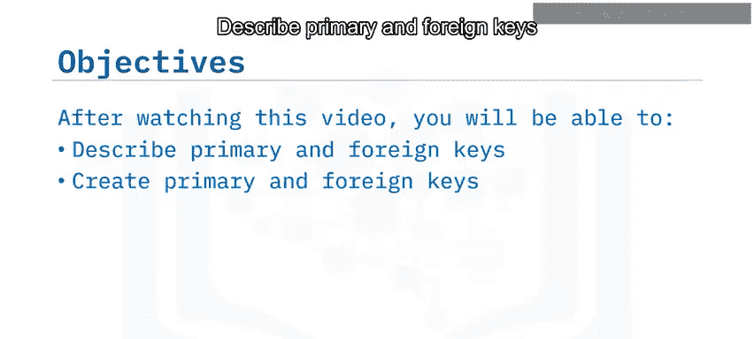

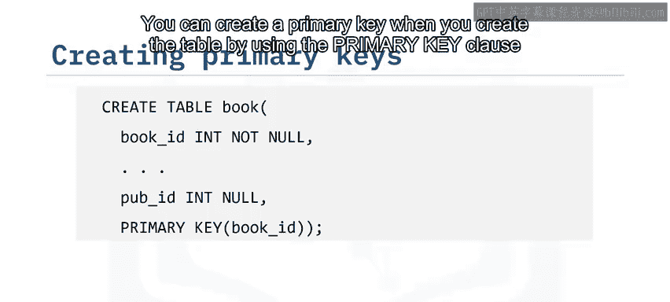

### 如何创建主键

以下是创建主键的两种主要方法。

#### 1. 在创建表时定义主键

你可以在使用`CREATE TABLE`语句建表时，通过`PRIMARY KEY`子句来定义主键。在括号内指定作为主键的列名。

```sql
CREATE TABLE 表名 (
    列1 数据类型,
    列2 数据类型,
    PRIMARY KEY (列名)
);
```

#### 2. 为已存在的表添加主键

你也可以使用`ALTER TABLE`语句的`ADD PRIMARY KEY`子句，为已存在的表添加主键。同样，在括号内指定列名。

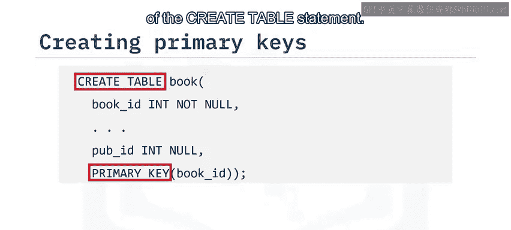

```sql
ALTER TABLE 表名
ADD PRIMARY KEY (列名);
```

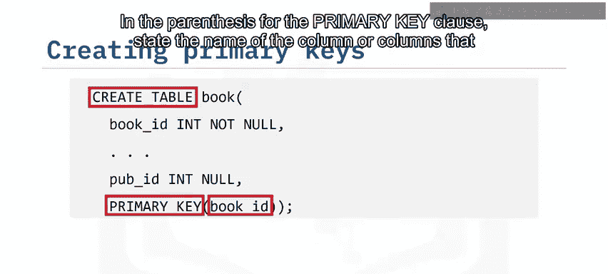

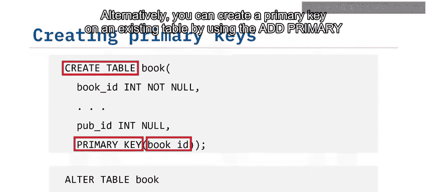

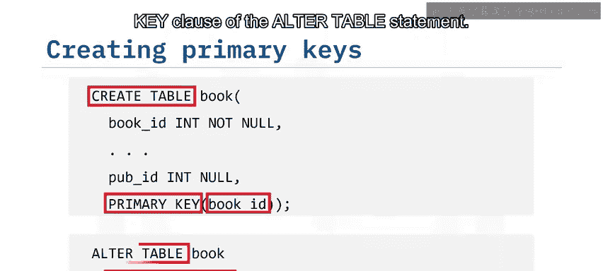

## 什么是外键？ 🔗

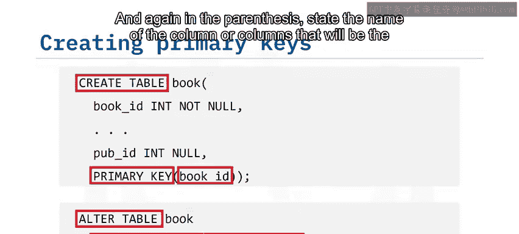

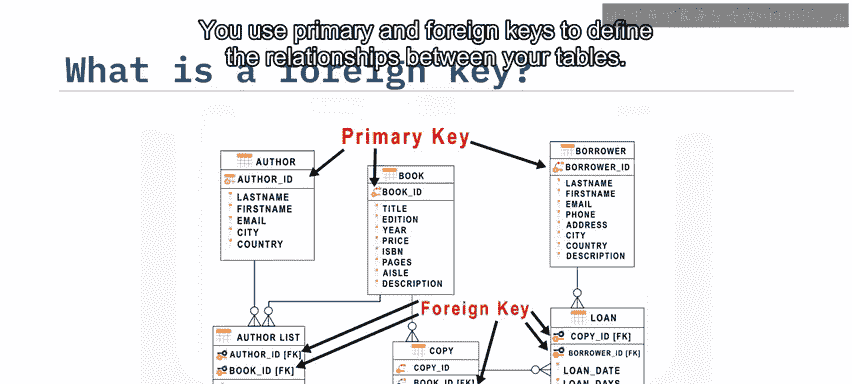

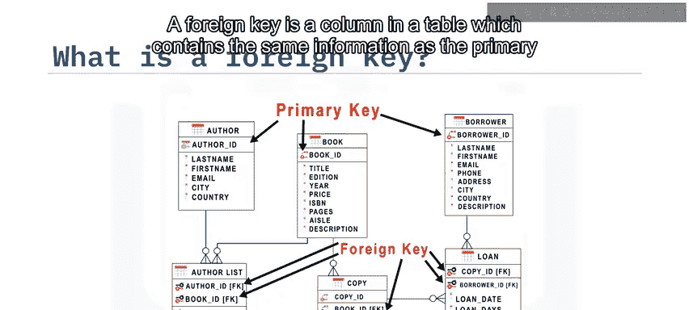

上一节我们介绍了主键，本节中我们来看看外键。外键用于定义表之间的关系。

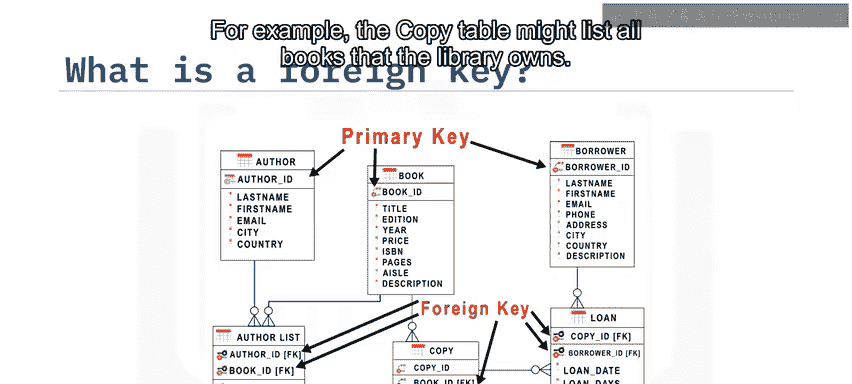

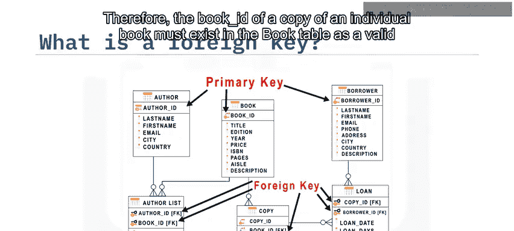

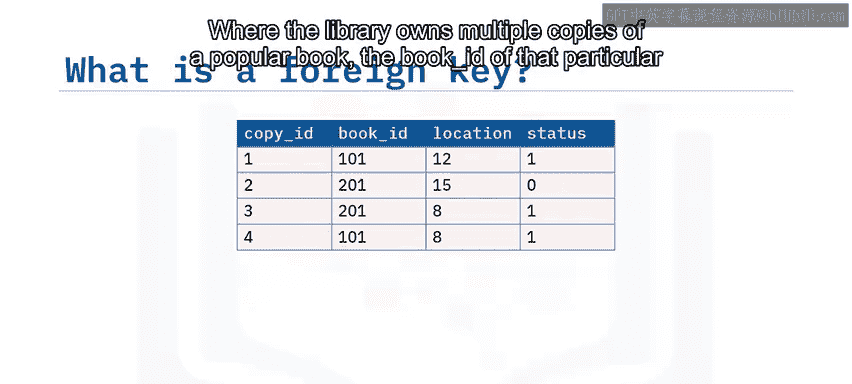

外键是一个表中的列，它包含的信息与另一个表中的主键相同。例如，一个`copy`表可能列出了图书馆拥有的所有书籍副本。因此，`copy`表中每本书的`book_id`必须在`book`表中作为一个有效的图书ID存在。如果图书馆拥有多本热门书籍的副本，那么该特定书籍的`book_id`会在`copy`表中出现多次。


你可以指定，每当向`copy`表添加一行时，所使用的`book_id`必须已经存在于`book`表中。这确保了数据的引用完整性。

### 如何创建外键

与主键类似，你可以在建表时或之后创建外键。

#### 1. 在创建表时定义外键

使用`CREATE TABLE`语句中的`CONSTRAINT ... FOREIGN KEY`子句。在括号内指定作为外键的列，然后使用`REFERENCES`关键字指明它链接到的目标表及其主键列。

```sql
CREATE TABLE 子表名 (
    列1 数据类型,
    外键列 数据类型,
    CONSTRAINT 约束名 FOREIGN KEY (外键列)
    REFERENCES 父表名 (父表主键列)
);
```

#### 2. 定义外键约束规则

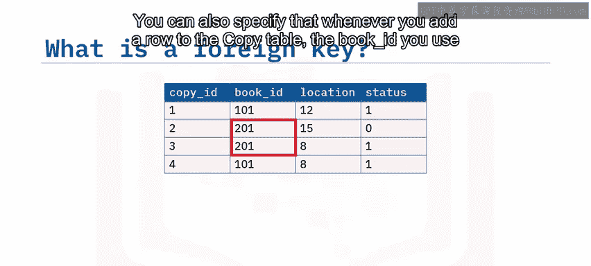

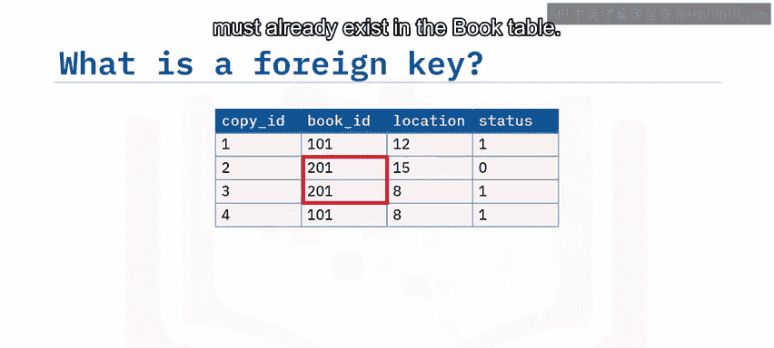

你还可以使用`ON UPDATE`和`ON DELETE`规则子句，来定义当父表（拥有主键的表）中的行被更新或删除时应采取的操作。

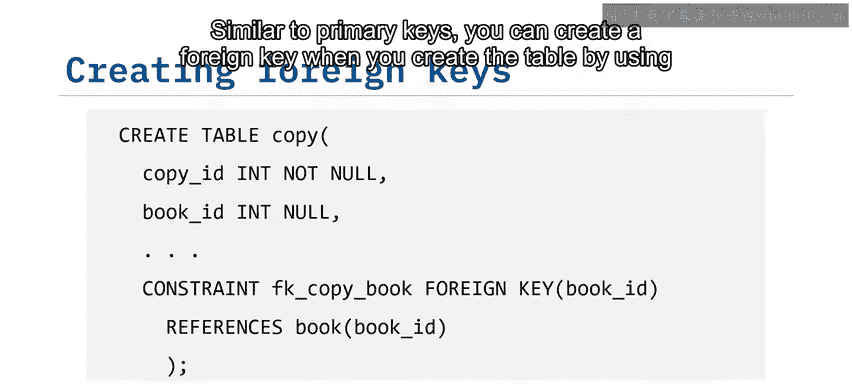

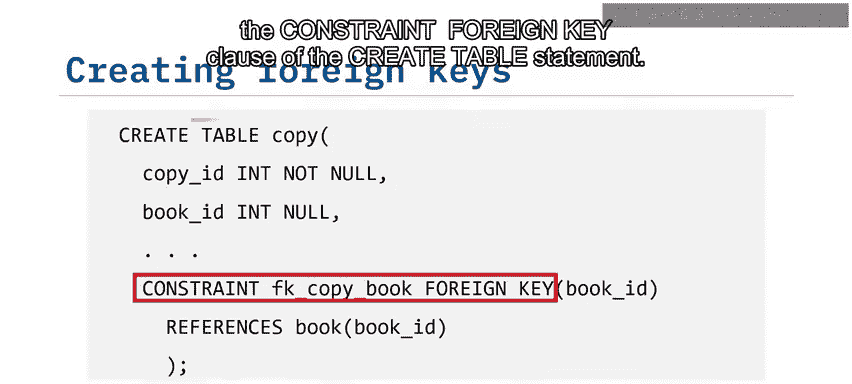

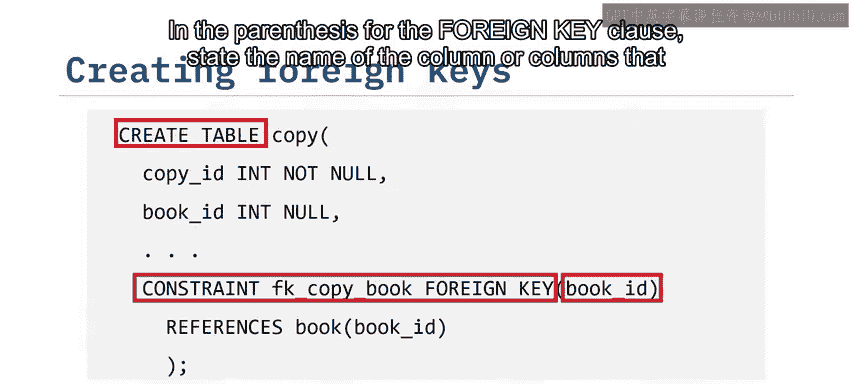

以下是可用的规则：

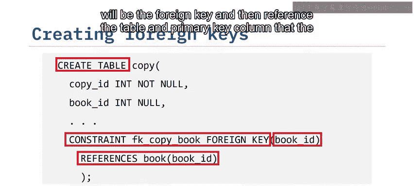

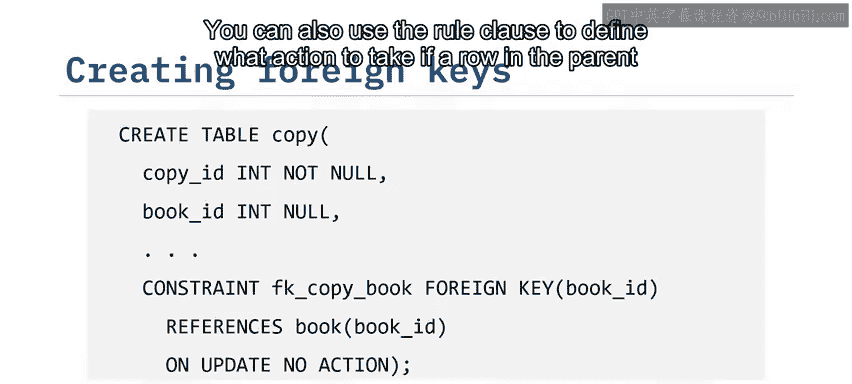

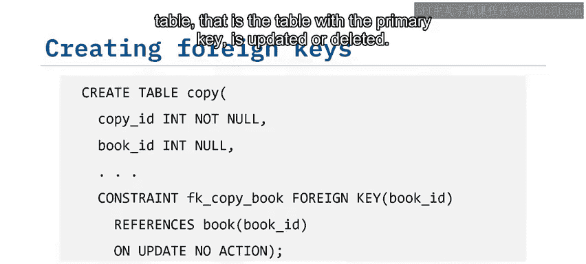

*   **NO ACTION**：不采取任何特殊操作。如果子表中存在关联记录，对父表的更新或删除操作可能会失败。
*   **CASCADE**：级联操作。当父表中的记录被删除时，自动删除子表中的所有相关记录；当父表的主键更新时，自动更新子表中所有相关外键的值。
*   **SET NULL**：当父表中的记录被删除或更新时，将子表中相关记录的外键列设置为`NULL`。

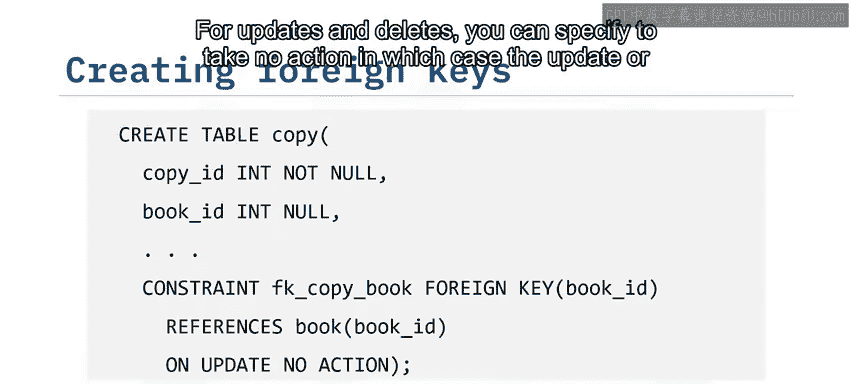

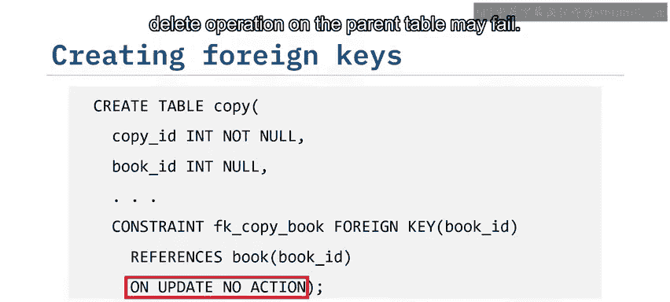

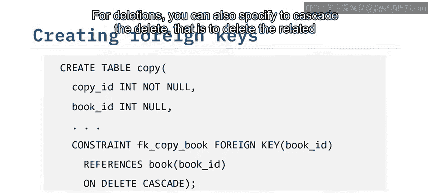

```sql
CREATE TABLE 子表名 (
    列1 数据类型,
    外键列 数据类型,
    CONSTRAINT 约束名 FOREIGN KEY (外键列)
    REFERENCES 父表名 (父表主键列)
    ON DELETE CASCADE
    ON UPDATE NO ACTION
);
```

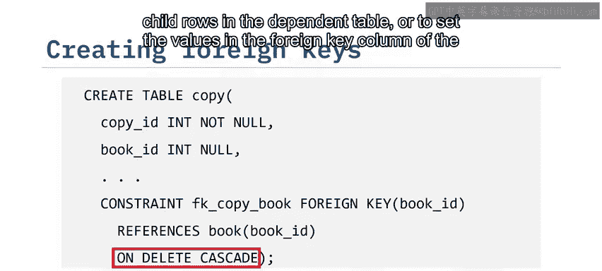

## 总结

本节课中，我们一起学习了关系数据库中的主键和外键。


*   你可以使用**主键**来强制表中每一行的唯一性。
*   **外键**是一个表中的列，它包含与另一个表中主键相同的信息。
*   你可以使用主键和外键在表之间创建关系，从而构建出结构清晰、数据一致的关系型数据库。

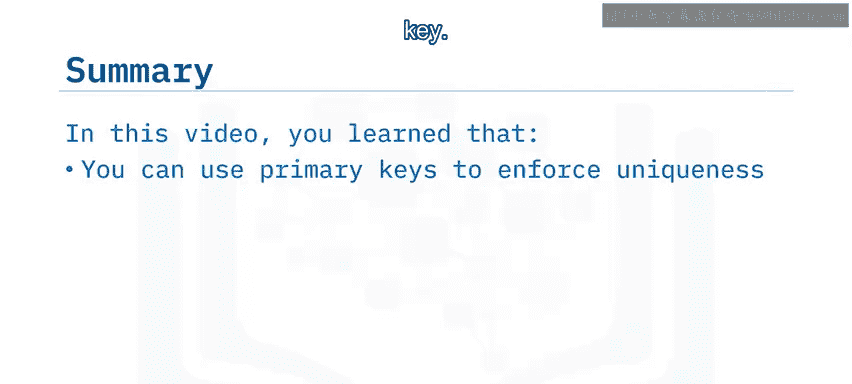


掌握这些概念是成为合格数据工程师的重要一步。