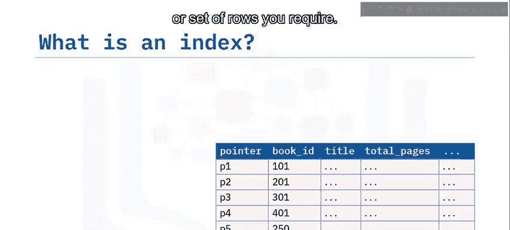
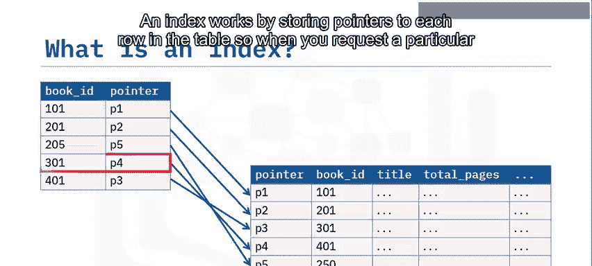
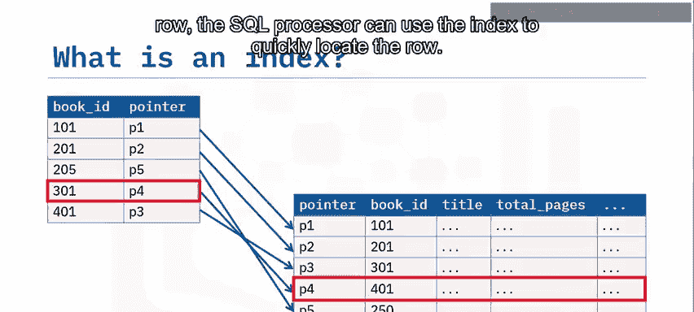
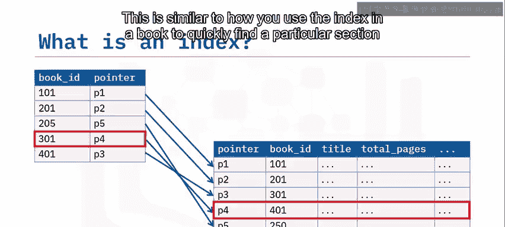
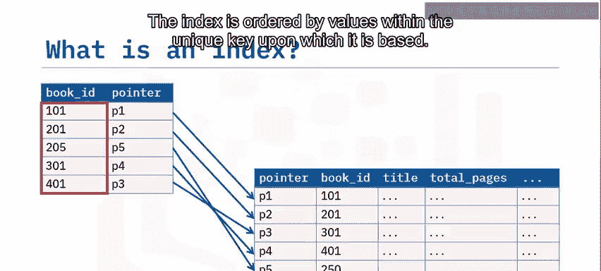
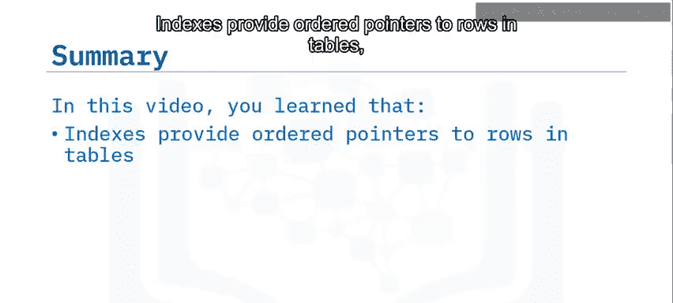

# 022：索引概述


在本节课中，我们将要学习数据库索引。我们将了解索引是什么，如何创建索引，以及使用索引的优缺点。


## 什么是索引？🔍

上一节我们介绍了数据在表中的存储方式。通常，向表中添加数据时，数据会被追加到表的末尾。然而，这并非绝对保证，数据本身没有固有的顺序。

因此，当您从表中选择特定行时，处理器必须依次检查每一行，直到找到您想要的那一行。在大型表上，这可能成为一种非常缓慢的定位行的方法。

此外，当您选择多行时，除非在SELECT语句中指定排序顺序，否则它们可能以无序状态返回。因为您经常希望以特定顺序返回行或选择连续行的子集，所以可以在表上创建索引，以便轻松定位所需的特定行或行集。

索引的工作原理是存储指向表中每一行的指针。当您请求特定行时，SQL处理器可以使用索引快速定位该行。这类似于您使用书籍的索引来快速找到书中特定部分的方式。索引基于其建立的唯一键内的值进行排序。

## 如何创建索引？⚙️



默认情况下，当您在表上创建主键时，会自动在该键上创建一个索引。但您也可以在经常被搜索的列上创建自己的索引。







使用 `CREATE INDEX` 语句来定义索引，指定索引名称、其唯一性以及要基于的表和列。



```sql
CREATE INDEX index_name ON table_name (column_name);
```

以下是创建索引的步骤：
1.  确定需要频繁查询的列。
2.  使用 `CREATE INDEX` 语句。
3.  指定索引名称和对应的表及列。

## 索引的优点与缺点 ⚖️

索引为数据库用户提供了许多好处，但也存在一些缺点。让我们分别来看一下。


### 索引的优点


索引提供了以下主要优势：

*   **提高SELECT查询性能**：当在已索引的列上进行搜索时，索引提供了定位匹配搜索条件的行的快速路径，结果返回速度比必须检查表中每一行时要快。
*   **减少数据排序需求**：如果您经常需要按特定顺序获取行，使用索引可以消除在定位行之后再进行排序的需要。
*   **保证行唯一性**：如果在创建索引时使用 `UNIQUE` 子句，您可以确保更新和插入操作不会在该列中创建重复条目，而无需承担必须对照表中每一行进行检查的开销。

### 索引的缺点

然而，索引也有一些缺点：

*   **占用磁盘空间**：您创建的每个索引都会占用磁盘空间，就像添加索引会增加书籍的页数一样。
*   **降低INSERT、UPDATE和DELETE查询的性能**：因为索引表中的行是根据索引排序的，所以添加或删除行可能比在非索引表中花费更长时间。

您应该只在从优势中获得的收益大于从劣势中遭受的损失时才创建索引。例如，在一个很少插入或更新行，但经常在SELECT查询和WHERE子句中使用的表上创建索引是合适的。


如果您在一个表上创建许多索引，实际上可能会抵消性能优势，就像为书中的每个单词都建立索引会导致一个无用的索引一样。


## 总结 📝

本节课中我们一起学习了数据库索引的核心概念。

您了解到：
*   索引为表中的行提供了有序的指针。
*   索引可以提高SELECT查询的性能。
*   索引可能会降低INSERT、UPDATE和DELETE查询的性能。




合理创建和使用索引是优化数据库查询性能的关键技术之一。