# 023：数据库规范化 📊

在本节课中，我们将要学习数据库规范化的概念和过程。规范化是数据库设计中的一项关键技术，旨在通过减少数据冗余和提高数据一致性来优化数据库结构。我们将依次介绍第一范式、第二范式和第三范式，并通过实例说明如何将一个非规范化的表逐步规范化。

---

## 概述

当你在数据库中记录数据时，例如记录书店的书籍信息，不可避免地会出现数据不一致和重复信息的情况。这种重复会导致在更新数据时产生额外的工作和不一致性，因为你必须在多个地方进行修改。规范化就是通过组织数据来减少冗余数据的过程，通常通过将较大的表拆分为多个相关的表来实现。

规范化有助于加快事务处理速度，因为你只需在规范化的数据库上执行一次更新、添加和删除操作。它还能提高数据完整性，因为它减少了数据在一处被修改而另一处未被修改的可能性。

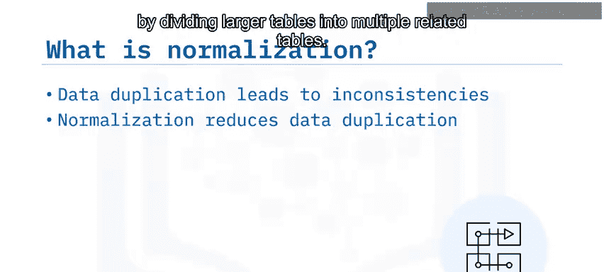

在开始规范化过程时，重要的是要认识到，你需要专注于规范化每个表，直到达到所需的范式级别。规范化通常会导致创建更多的表，一旦所有表都规范化了，你就得到了一个规范化的数据库。

有多种规范化形式，大多数数据工程师需要熟悉第一范式、第二范式和第三范式。

---

## 第一范式（1NF）📝

要使一个表符合第一范式，必须满足两个条件：**每一行必须是唯一的**，并且**每个单元格只能包含一个单一的值**。第一范式也简称为 **1NF**。

让我们看看如何规范化一个简单的表。在这个例子中，`book` 表包含一些关于书籍的基本信息，包括书名、格式和作者。为了满足第一范式的要求，每个单元格必须包含一个单一的值，而不是一个列表。在这个例子中，你可以看到一本书的所有格式都列在了同一个单元格里。

**原始表（不符合1NF）示例：**

| Book_ID | Title                | Formats          | Author       |
|---------|----------------------|------------------|--------------|
| 401     | Patterns of Software | Paperback, Hardback | Richard P. Gabriel |

为了规范化这个表，你可以添加额外的行，并将《Patterns of Software》的两种格式拆分到各自的行中。

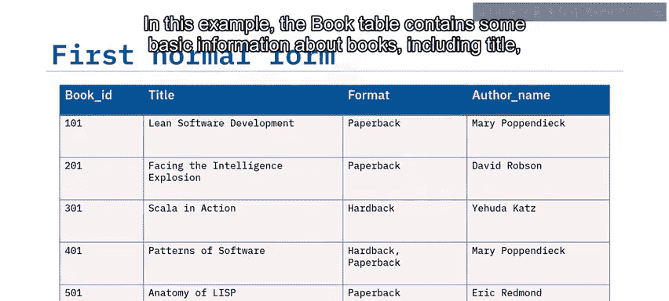

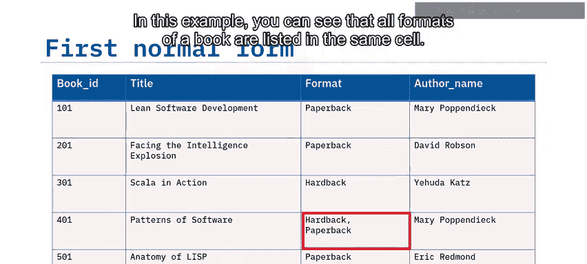

**规范化后的表（符合1NF）：**

| Book_ID | Title                | Formats   | Author       |
|---------|----------------------|-----------|--------------|
| 401     | Patterns of Software | Paperback | Richard P. Gabriel |
| 401     | Patterns of Software | Hardback  | Richard P. Gabriel |

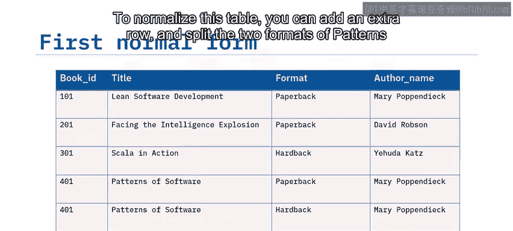

现在，表中的每个单元格都只有一个条目。因此，该表符合第一范式。

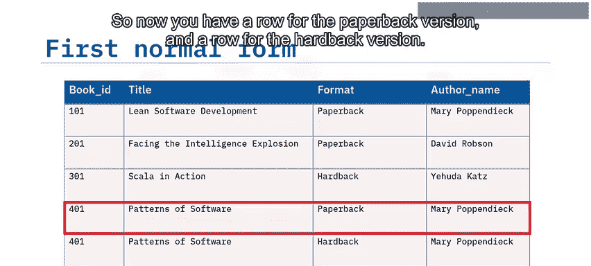

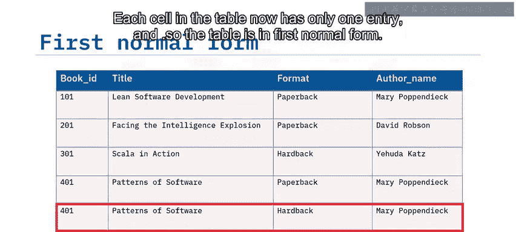

---

## 第二范式（2NF）🔗

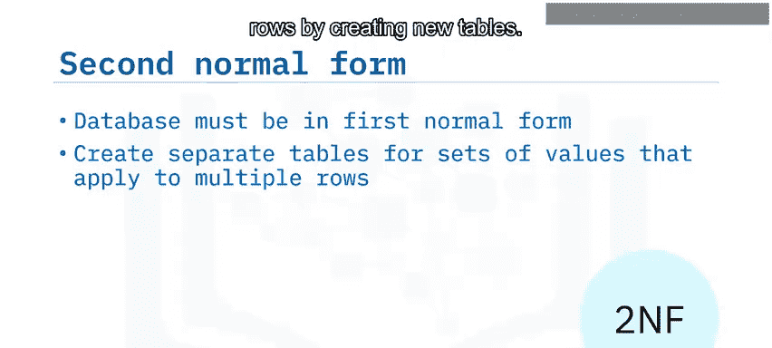

要使数据库符合第二范式，它必须首先满足第一范式。

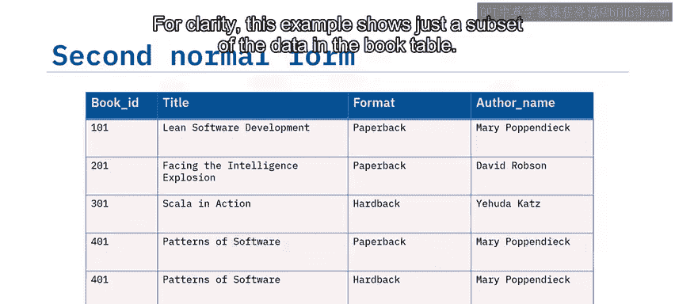

第二范式规定，你应该通过创建新表来分离那些适用于多行数据的值组。第二范式也简称为 **2NF**。

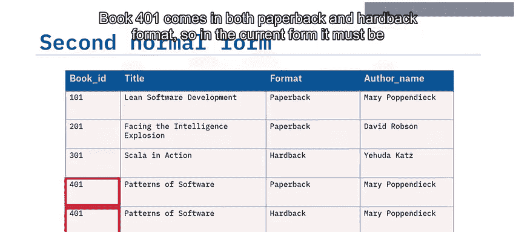

为了清晰起见，这个例子只展示了 `book` 表中的一部分数据。书ID为401的书有平装和精装两种格式，因此在当前形式下，它必须被列出两次，每种格式一次。

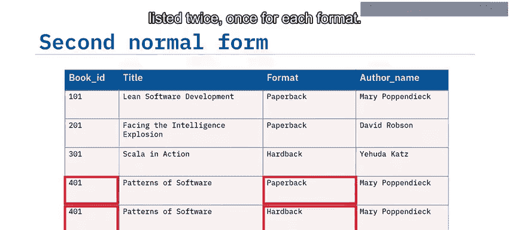

**当前表（符合1NF，但不符合2NF）示例：**

| Book_ID | Title                | Formats   | Author       |
|---------|----------------------|-----------|--------------|
| 401     | Patterns of Software | Paperback | Richard P. Gabriel |
| 401     | Patterns of Software | Hardback  | Richard P. Gabriel |

在这种情况下，“格式”列包含的值适用于引用书ID 401的两行，因此存在数据重复。为了满足第二范式的要求，并为书ID 401实现只有一行，你可以拆分 `book` 表，使书的格式信息与书名、作者等不相关的信息分离开。

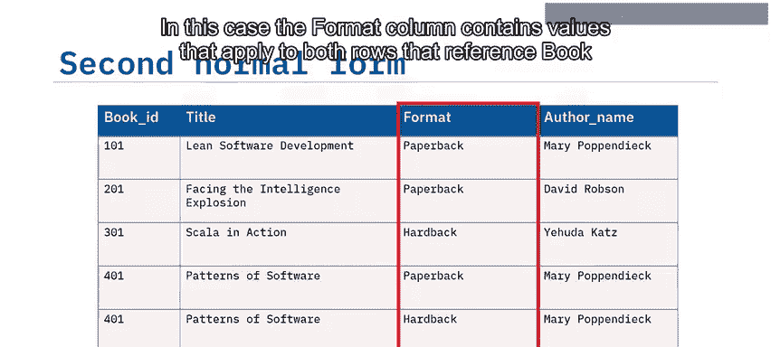

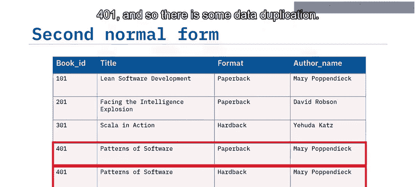

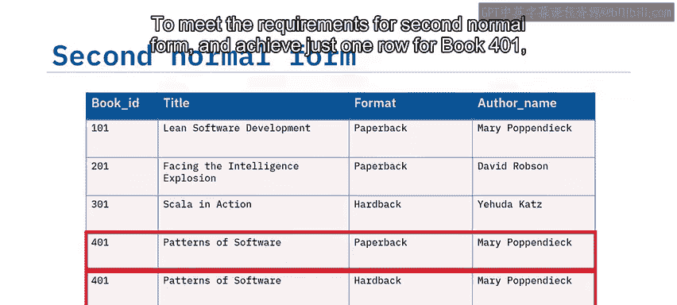

**拆分后的表：**

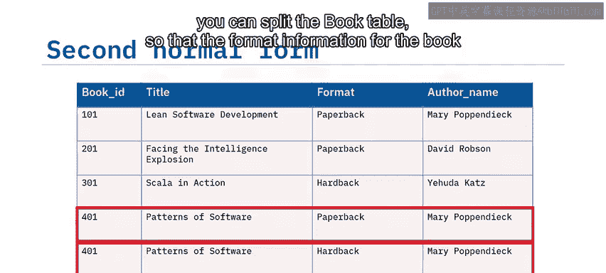

**book表：**
| Book_ID | Title                | Author       |
|---------|----------------------|--------------|
| 401     | Patterns of Software | Richard P. Gabriel |

**format表：**
| Book_ID | Formats   |
|---------|-----------|
| 401     | Paperback |
| 401     | Hardback  |

每个结果表都符合第一范式。为了维护两个表之间的关系，需要确定一个表的主键，该主键将作为另一个表的外键使用。在我们的例子中，`Book_ID` 对每本书都是唯一的，因此你可以将其设为 `book` 表的主键，并作为外键包含在 `format` 表中。现在，你可以使用它来链接两个表，以查找每本唯一书籍的不同格式。

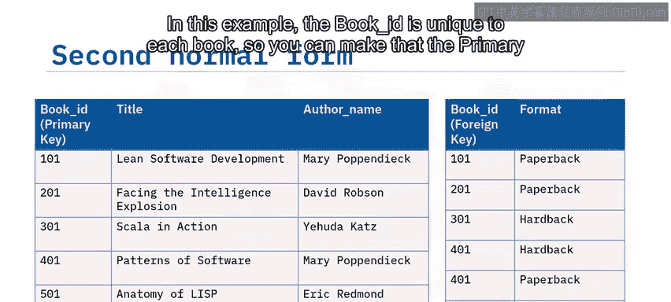

---

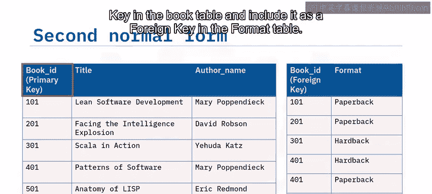

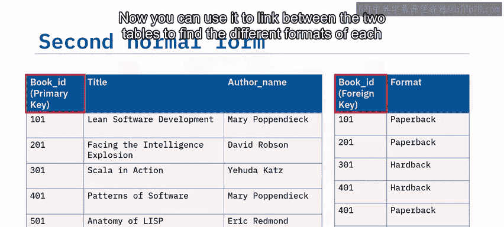

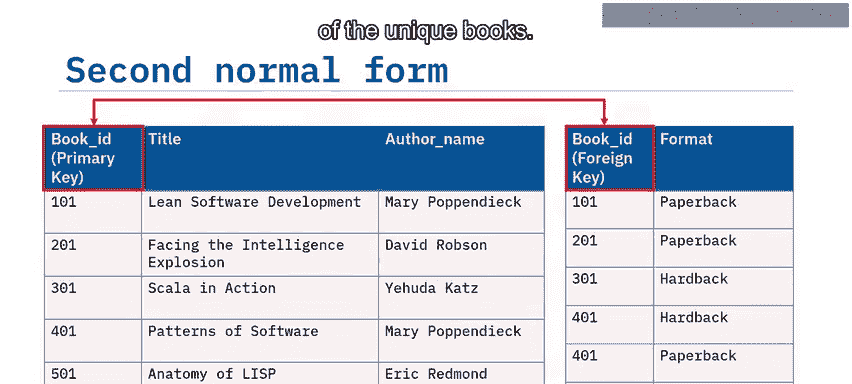

## 第三范式（3NF）🎯

要满足第三范式的要求，数据库必须已经符合第一范式和第二范式。

接下来，你必须消除任何不依赖于键的列。第三范式也简称为 **3NF**。

让我们考虑一些关于书籍的额外数据：出版商和书籍的发货地。每个出版商都从他们自己所在地的仓库发货书籍。因此，书籍的发货地取决于出版商，而不是书ID。所以，`book` 表不符合第三范式，因为“发货地”数据不依赖于主键。

**不符合3NF的book表示例：**

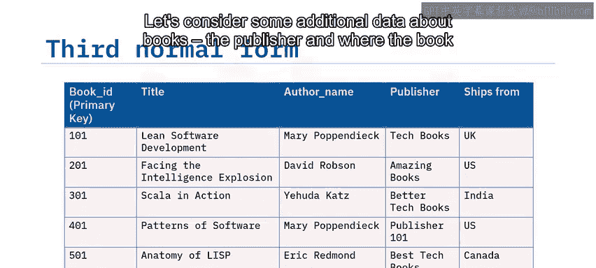

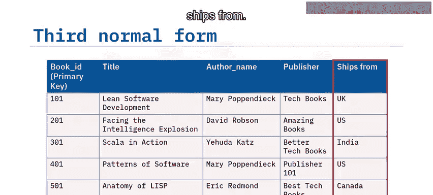

| Book_ID | Title                | Author       | Publisher | Ships_From |
|---------|----------------------|--------------|-----------|------------|
| 401     | Patterns of Software | Richard P. Gabriel | ACM Press | New York   |

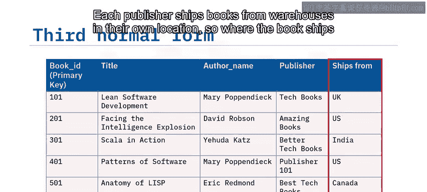

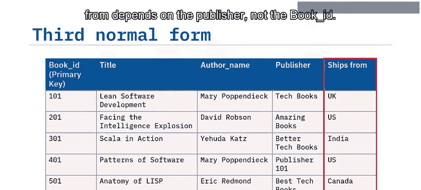

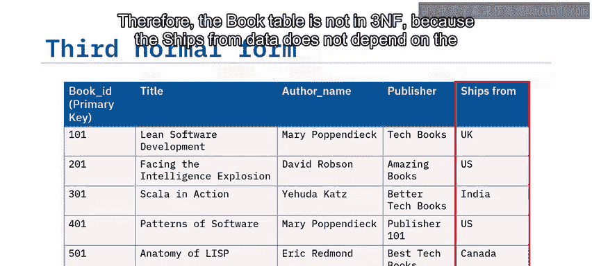

为了满足第三范式的要求，你必须将出版商和发货地信息分离到一个独立的 `publisher` 表中。

**规范化后的表：**

**book表（符合3NF）：**
| Book_ID | Title                | Author       | Publisher_ID |
|---------|----------------------|--------------|--------------|
| 401     | Patterns of Software | Richard P. Gabriel | 1            |

**publisher表（符合3NF）：**
| Publisher_ID | Publisher  | Ships_From |
|--------------|------------|------------|
| 1            | ACM Press  | New York   |

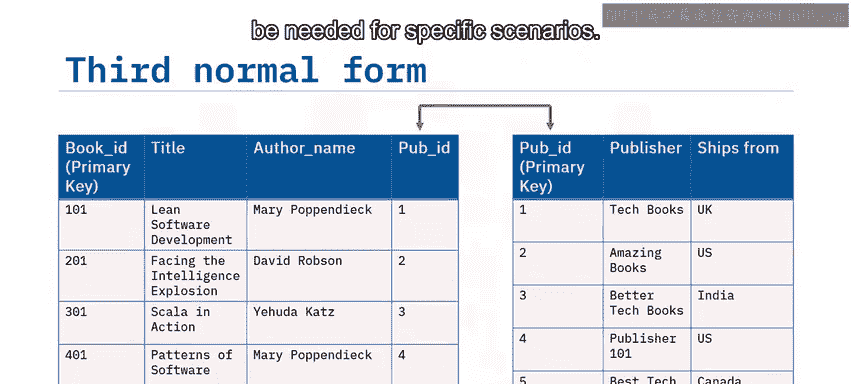

现在两个表都符合第三范式，这也是大多数关系数据库所达到的程度。此外，还有更高的范式，例如**巴斯-科德范式**，它是第三范式的扩展，以及第四和第五范式，这些可能用于特定的场景。

---

## 规范化在OLTP与OLAP系统中的不同应用

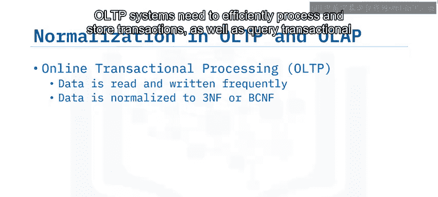

在事务处理系统（OLTP）中，数据被频繁地读取和写入，通常需要将数据规范化到第三范式。OLTP系统需要高效地处理和存储事务，以及查询事务数据，将数据规范化到第三范式有助于数据库高效地处理和存储单个事务。

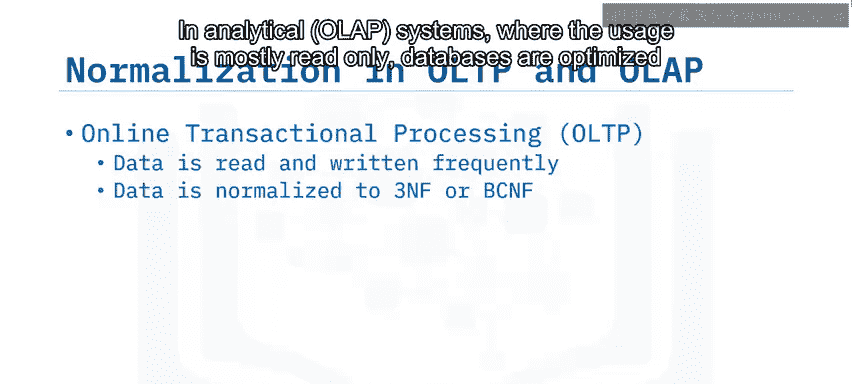

在分析系统（OLAP）中，使用方式主要是只读的，数据库针对读取性能而非写入完整性进行了优化。因此，在数据被加载到分析系统（如数据仓库）之前，可能已经进行了一些**反规范化**，使其处于较低的范式级别。在数据仓库中，数据工程师关注的是性能，而处理更少的表可能对性能有益。

---

## 总结

在本节课中，我们一起学习了数据库规范化的核心概念。我们了解到，规范化可以减少数据冗余并提高数据一致性。

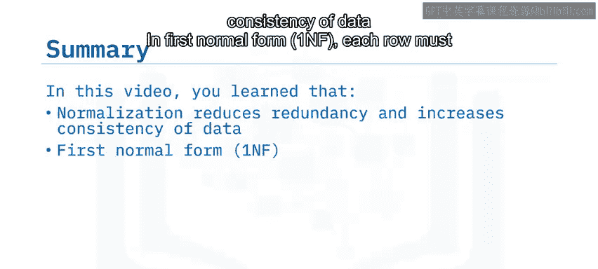

具体来说：
*   在第一范式中，每一行必须是唯一的，每个单元格必须只包含一个单一的项目。
*   在第二范式中，你必须为适用于多条记录的值组创建独立的表。
*   在第三范式中，你需要消除任何不依赖于键的列。

我们还探讨了规范化在OLTP和OLAP系统中的不同应用场景。掌握这些范式是设计高效、可靠关系数据库的基础。