# 024：关系模型约束详解

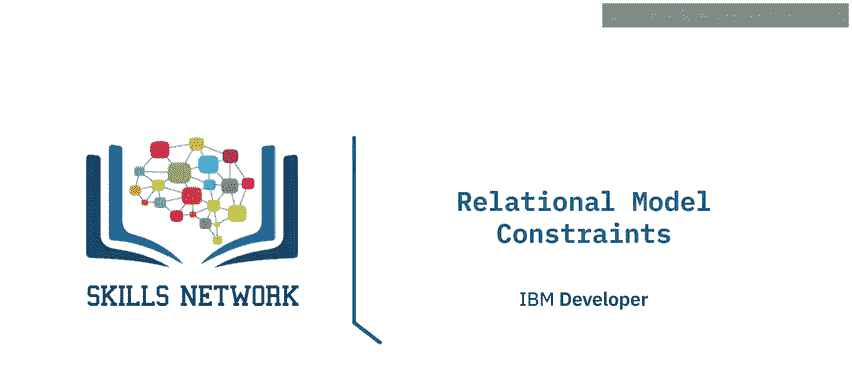

在本节课中，我们将要学习关系数据库模型中的六种核心约束。约束是用于实施业务规则、确保数据完整性的重要机制。理解这些约束对于设计和维护高质量的关系数据库至关重要。

上一节我们介绍了关系模型的基础概念，本节中我们来看看如何通过具体的约束规则来保证数据的准确性和一致性。

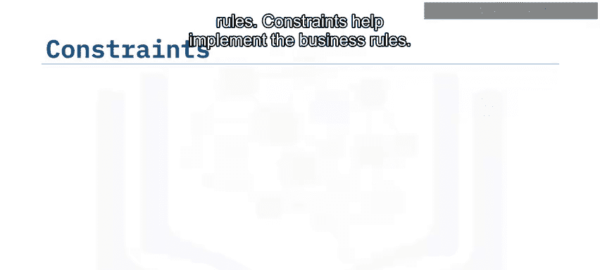

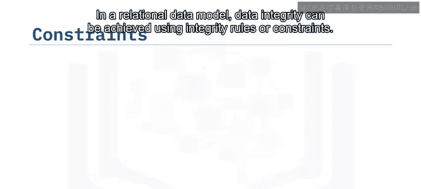

## 🔑 实体完整性约束

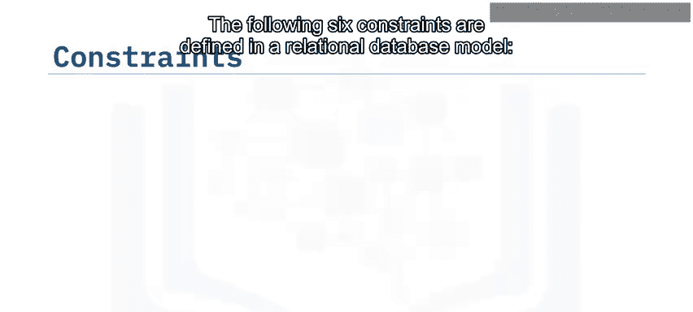

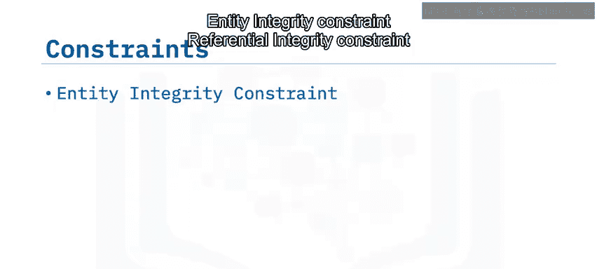

为了识别关系中的每个元组，关系必须有一个主键。主键是用于唯一标识表中每个元组或行的值。这就是实体完整性约束，有时也称为主键约束或唯一约束。该约束能防止表中出现重复值，通常通过索引来实现。

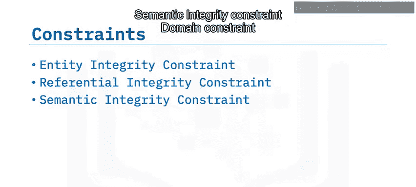

实体完整性约束规定：**参与关系主键的任何属性都不允许接受空值（NULL）**。空值表示该值未知。在主键中，不能存在未知的值。

例如，在 `作者（author）` 关系中，`作者ID（author_ID）` 是主键。它标识了关系中的每个元组。`作者ID A1` 对应来自多伦多的作者 Raoul Chong。如果将 A1 的值替换为 NULL，你仍然可以识别作者是 Raoul Chong。然而，如果你也将 `作者ID A4` 替换为 NULL，现在你就无法知道哪个 NULL 值对应哪个元组了。因此，实体完整性约束确保了主键属性的非空性。

## 🔗 参照完整性约束

参照完整性约束定义了表之间的关系，并确保这些关系保持有效。数据的有效性通过主键和外键的组合来强制执行。

如前所述，一本书要存在，必须至少由一位作者撰写。参照完整性约束确保了这种依赖关系的正确性。例如，`书籍（book）` 表中的 `作者ID` 外键必须引用 `作者（author）` 表中实际存在的主键值，不能引用一个不存在的作者ID。

## 🧠 语义完整性约束

语义完整性约束涉及数据含义的正确性。

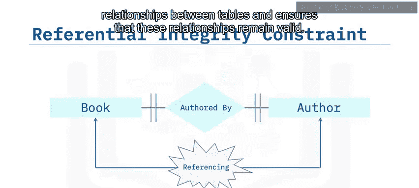

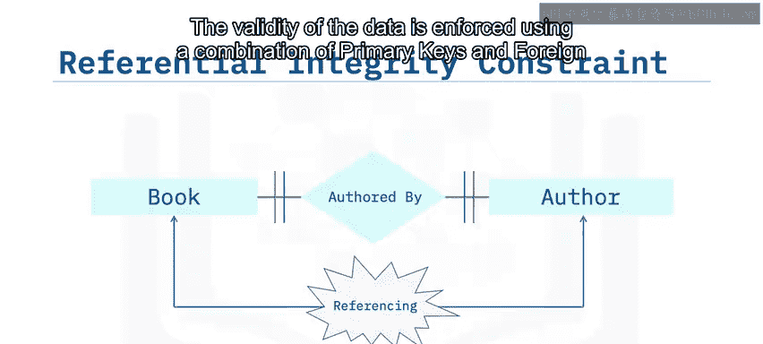

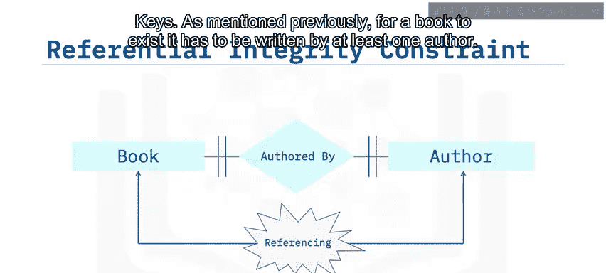

例如，在 `作者（author）` 关系中，如果 `城市（city）` 属性包含一个无意义的垃圾值而不是“Toronto”，那么这个垃圾值没有任何实际意义。语义完整性约束关注的就是数据的正确含义。

## 🎯 域约束

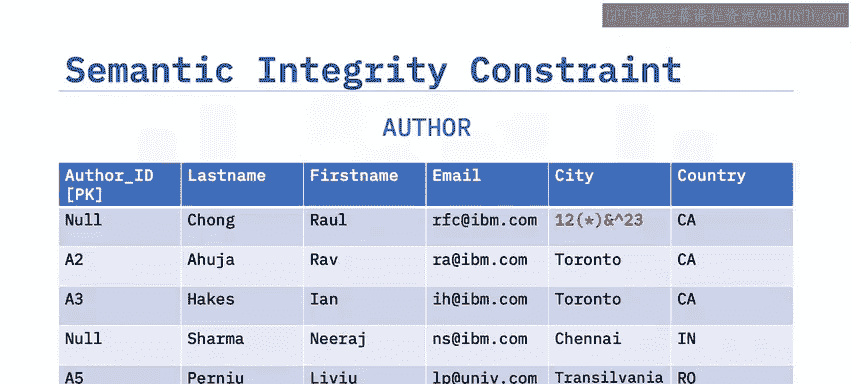

域约束规定了给定属性允许的取值范围。

例如，在 `作者（author）` 关系中，`国家（country）` 属性必须包含一个两位字母的国家代码，如 CA 代表加拿大，IN 代表印度。如果为 `国家` 属性输入了数字值 34 而不是两位字母代码，那么值 34 就没有任何意义。域约束确保了属性值在预定义的、有意义的集合内。

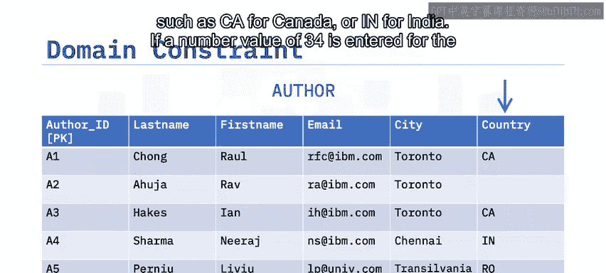

## 🚫 空值约束

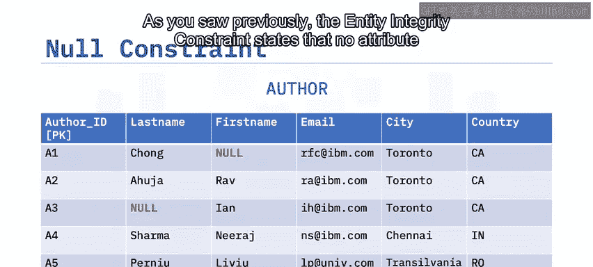

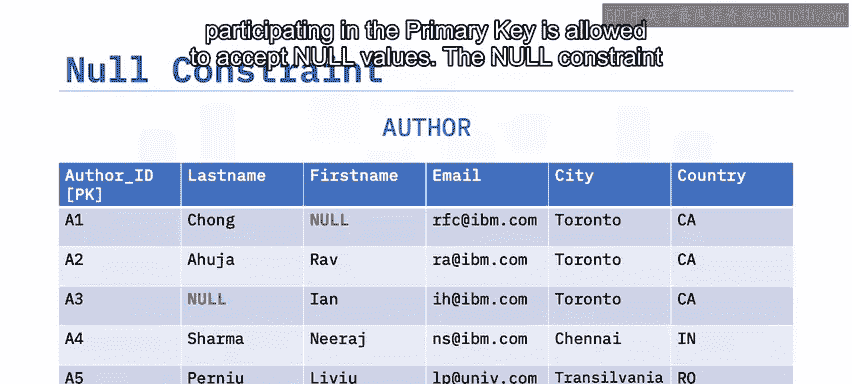

正如前面所见，实体完整性约束规定主键属性不能为空；而空值约束则指定**某些属性的值不能为 NULL**。

例如，在 `作者（author）` 关系中，如果 `姓氏（last_name）` 或 `名字（first_name）` 包含空值，就很难正确识别作者。在此例中，名字和姓氏的属性值不能为空，作者必须拥有姓名。

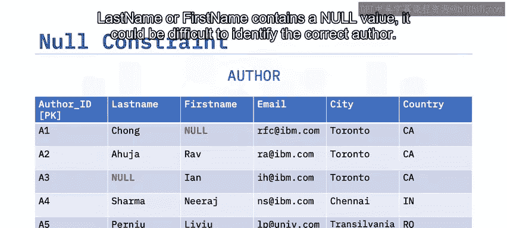

## ✅ 检查约束

最后，检查约束通过限制关系属性可接受的值来强制实施域完整性。

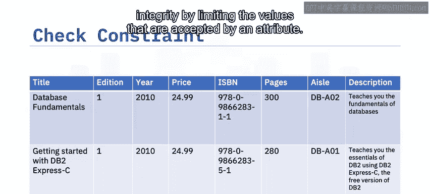

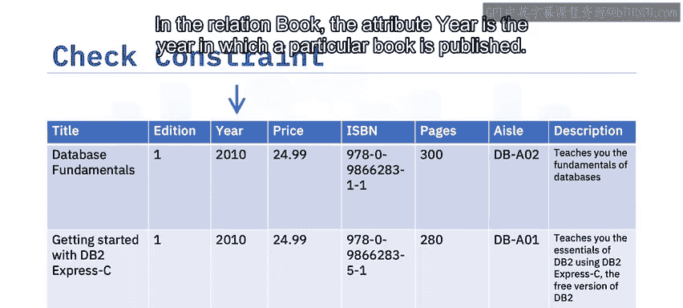

在 `书籍（book）` 关系中，属性 `年份（year）` 表示特定书籍的出版年份。如果当前仍是 2010 年，那么出现一个大于当前年份的年份值是没有意义的。检查约束将通过限制 `年份` 属性可接受的值来强制实施域完整性，例如确保 `year <= 2010`。

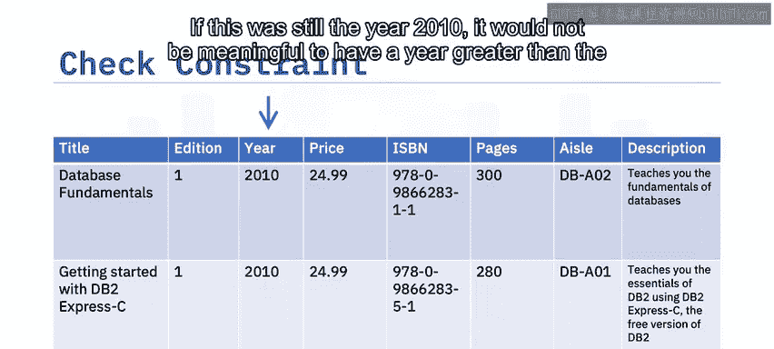

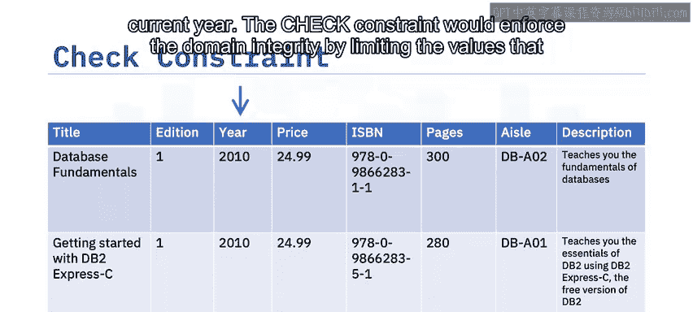

以下是关系数据库中定义的六种约束的总结列表：

*   **实体完整性约束**：确保主键是唯一标识每个元组的值，且主键属性不允许为空。
*   **参照完整性约束**：定义表间关系，并通过主外键确保关系有效。
*   **语义完整性约束**：确保数据具有正确的含义。
*   **域约束**：规定属性允许的取值范围。
*   **空值约束**：规定特定属性的值不能为空。
*   **检查约束**：通过特定条件限制属性可接受的值。

---

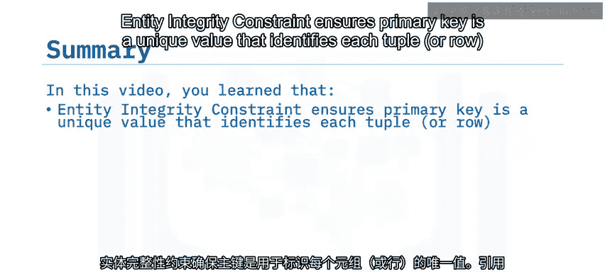

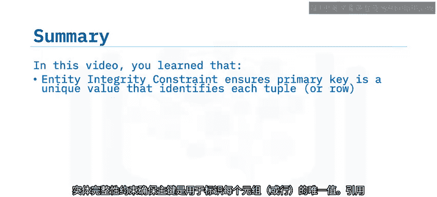

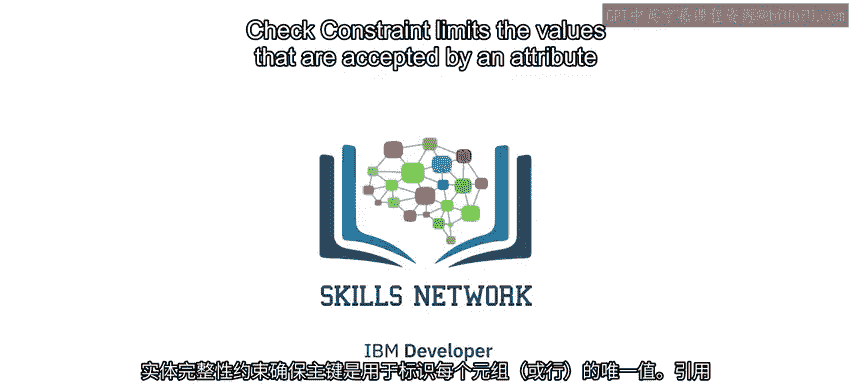

本节课中我们一起学习了关系模型中的六种关键约束：实体完整性、参照完整性、语义完整性、域约束、空值约束和检查约束。这些约束共同作用，为数据库中的数据定义了必须遵守的规则，是保障数据准确性、一致性和业务逻辑正确性的基石。理解并正确应用这些约束，是成为一名合格数据工程师或数据库管理员的重要一步。