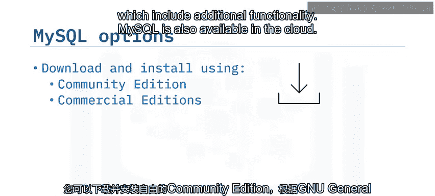
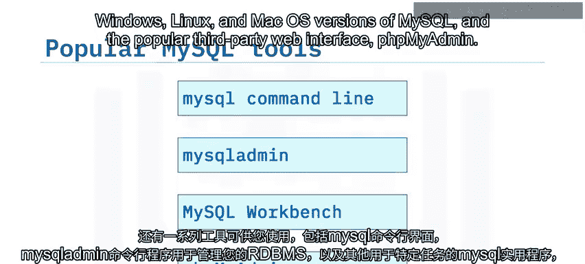
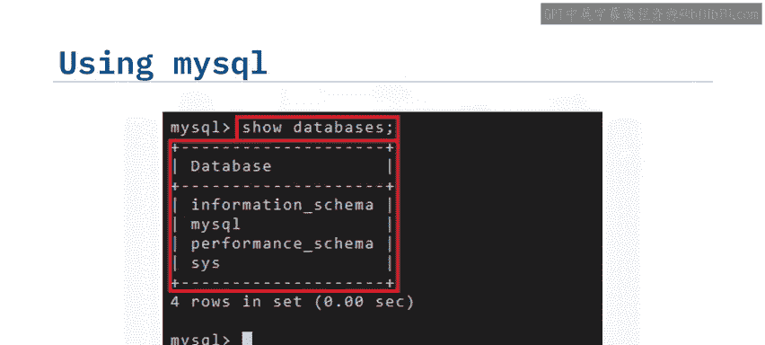
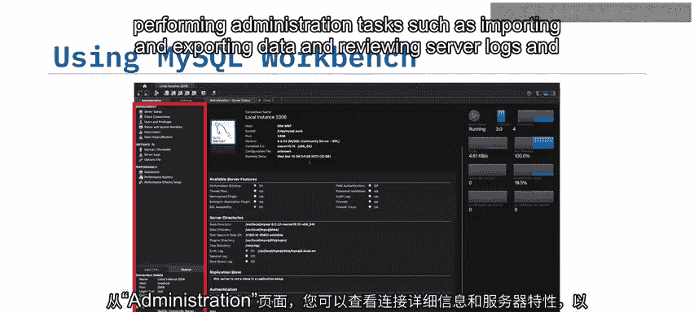
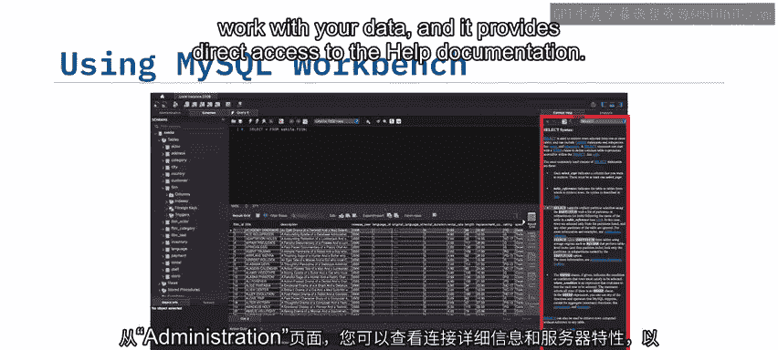
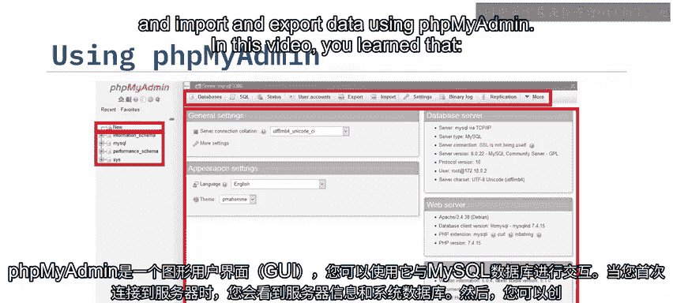
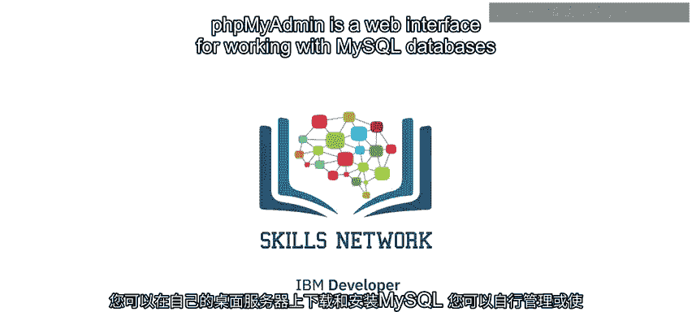

# 025：MySQL入门 🚀

在本节课中，我们将要学习MySQL的基础知识，包括其用途以及一些常用的工具。MySQL是一个流行的开源关系数据库管理系统（RDBMS）。通过本课，你将能够解释MySQL的使用方式，并描述一些流行的MySQL工具。

---

## 什么是MySQL？ 🗄️

MySQL是一个流行的开源关系数据库管理系统（RDBMS）。MariaDB是由MySQL的一些原始开发者创建的一个分支版本。MySQL提供了多种方式来满足不同需求。

以下是获取和使用MySQL的主要方式：

*   **社区版**：你可以根据GNU通用公共许可证下载并安装免费的社区版，并将其嵌入到你自己的应用程序中。
*   **商业版**：你可以购买、下载并安装包含额外功能的商业版本，例如标准版、企业版和集群版。
*   **云服务**：MySQL也可以在云上使用。你可以通过虚拟机镜像或容器进行自我管理，也可以使用托管服务，例如IBM Cloud、Amazon RDS for MySQL、Azure Database for MySQL或Google Cloud SQL for MySQL。

---



## 常用MySQL工具 🛠️

有多种工具可以帮助你管理和操作MySQL数据库。上一节我们介绍了MySQL的基本概念，本节中我们来看看这些实用的工具。

以下是几种主要的MySQL工具：

*   **MySQL命令行界面**：用于与MySQL服务器和数据交互的命令行工具。
*   **MySQL Admin**：一个用于管理RDBMS的命令行程序，以及其他用于特定任务的MySQL实用程序。
*   **MySQL Workbench**：一个适用于Windows、Linux和Mac OS的桌面应用程序。
*   **PHPMyAdmin**：一个流行的第三方Web界面。



---

### MySQL命令行界面 💻

MySQL命令行界面使你能够向MySQL服务器和数据发出命令。这些命令可以直接在提示符下以交互方式输入，也可以从你在命令提示符下调用的文本文件中读取。

此截图展示了以交互方式运行 `SHOW DATABASES;` 命令，以列出当前可用的数据库。



```sql
SHOW DATABASES;
```

在批处理模式下运行时，你可以指定一个文件来存储任何输出消息以供后续使用。

---

### MySQL Workbench 🖥️



MySQL Workbench是一个可视化数据库设计工具，它将SQL开发、管理、数据库设计、创建和维护集成到一个统一的MySQL数据库系统开发环境中。



在管理页面，你可以查看连接详情和服务器功能，并执行管理任务，例如导入和导出数据，以及查看服务器日志和性能报告。

---

### PHPMyAdmin 🌐

PHPMyAdmin是一个图形化的Web界面，你可以用它来与你的MySQL数据库进行交互。当你首次连接到服务器时，会看到服务器信息和系统数据库。然后，你可以创建自己的用户数据库，并使用不同的选项卡与它们进行交互。



以下是你可以通过PHPMyAdmin执行的主要操作：

*   创建数据库和表。
*   加载和查询数据。
*   导入和导出数据。

---

## 总结 📝



本节课中我们一起学习了MySQL的入门知识。你了解到，你可以在自己的桌面和服务器上下载并安装MySQL。你可以在云端进行自我管理或使用MySQL的托管服务。MySQL和MySQL Admin是用于数据库管理的命令行界面。MySQL Workbench是一个用于设计、开发和管理MySQL数据库的桌面应用程序。而PHPMyAdmin则是一个用于操作MySQL数据库的Web界面。