# 026：在MySQL中创建数据库和表 🗄️


在本节课中，我们将学习如何在MySQL中创建数据库和表。我们将介绍两种主要方法：使用命令行界面和使用图形用户界面工具PHPMyAdmin。通过本课的学习，你将能够掌握创建数据库、定义表结构以及编辑表定义的基本技能。

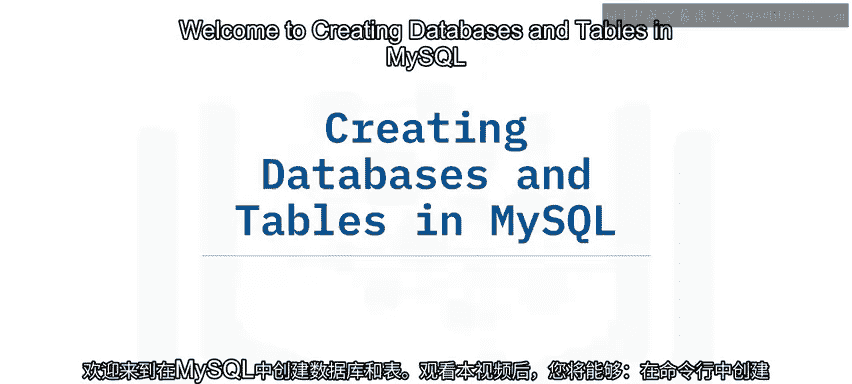

---

## 创建数据库和表的方法概述

与许多关系数据库管理系统（RDBMS）一样，你可以在MySQL中使用命令行界面、图形用户界面或API调用来创建数据库和表。本视频将演示如何使用命令行和PHPMyAdmin用户界面来执行这些任务。你将看到如何先创建数据库，再创建表，然后如何定义和编辑该表中的列。

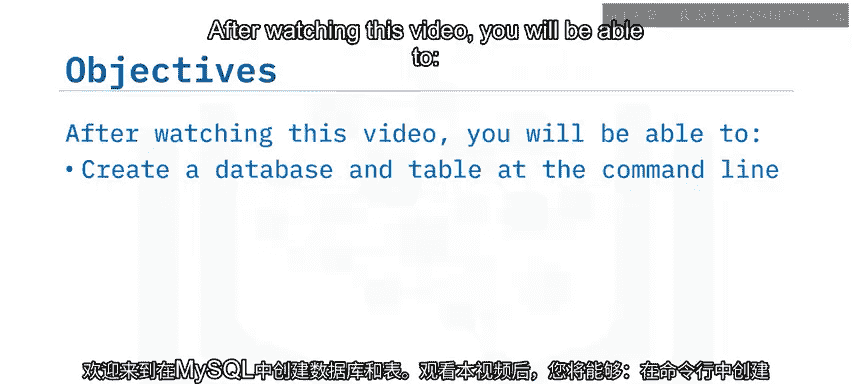

---

## 使用命令行界面创建

你可以在MySQL命令行中执行命令来创建数据库对象。

以下是使用命令行创建数据库和表的基本步骤：

1.  使用 `CREATE DATABASE` 命令创建数据库。
2.  使用 `CREATE TABLE` 命令创建表，并指定列名和数据类型。
3.  使用 `DESCRIBE` 命令显示新创建表的结构。

**示例代码：**
```sql
CREATE DATABASE company_db;
USE company_db;
CREATE TABLE employee_details (
    id INT,
    name VARCHAR(100),
    department VARCHAR(50),
    hire_date DATE
);
DESCRIBE employee_details;
```

---

## 使用PHPMyAdmin创建

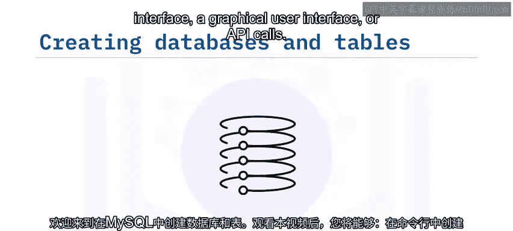


PHPMyAdmin是一个流行的、带有Web界面的可视化工具，用于操作MySQL。

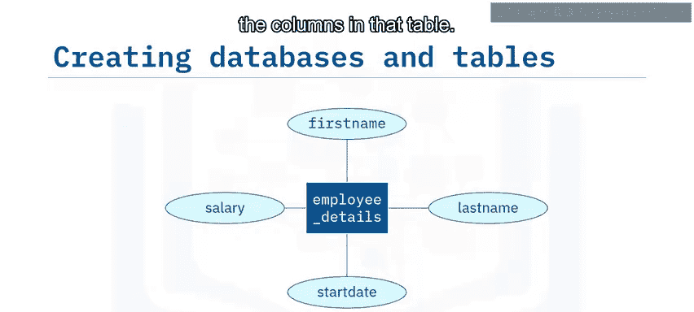

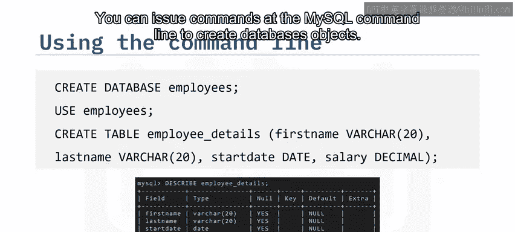

上一节我们介绍了命令行方法，本节中我们来看看如何使用图形化工具完成同样的任务。

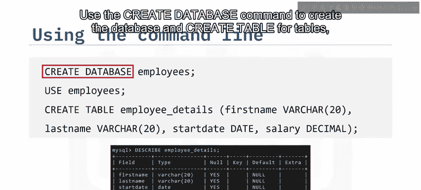

### 创建数据库

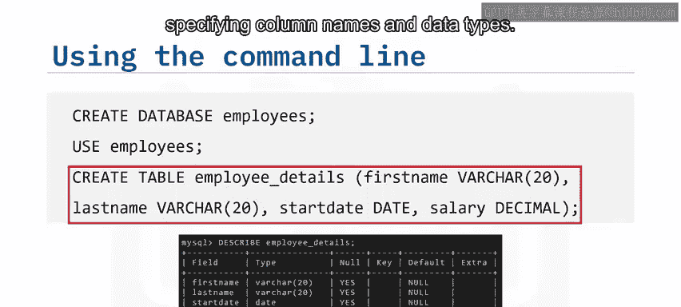

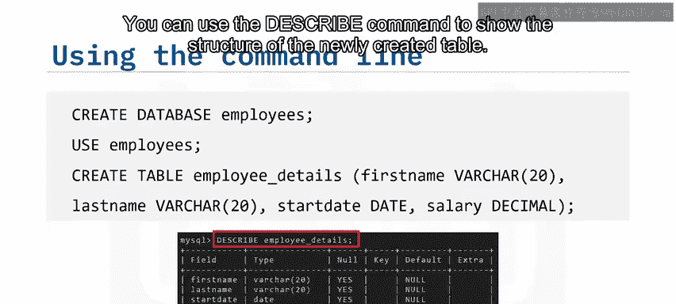

以下是使用PHPMyAdmin创建数据库的步骤：


1.  在左侧窗格的树形视图中，点击“新建”。
2.  在“数据库”选项卡中，输入新数据库的名称。
3.  可以选择为数据选择编码。
4.  点击“创建”。

这将创建数据库，该数据库现在会显示在窗口左侧的数据库树形视图中，并会打开“创建表”选项卡。

### 创建表

要创建表，请按以下步骤操作：

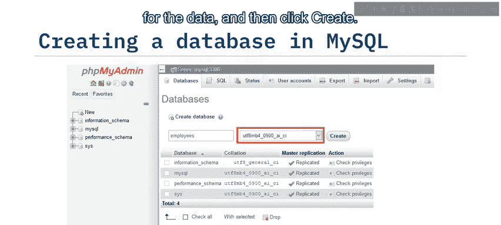

1.  在“创建表”选项卡中，输入表名（例如 `employee_details`）。
2.  选择表的列数。
3.  点击“执行”。

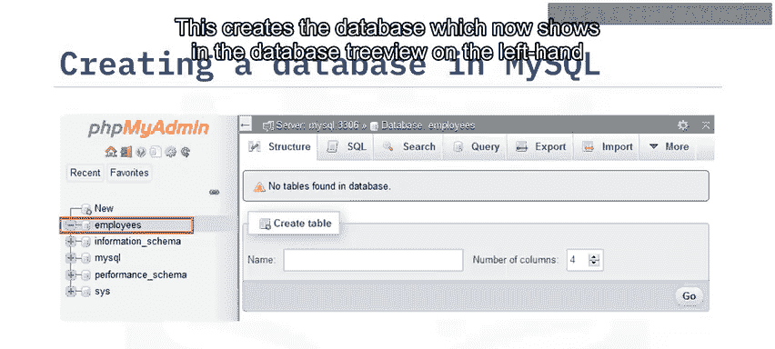

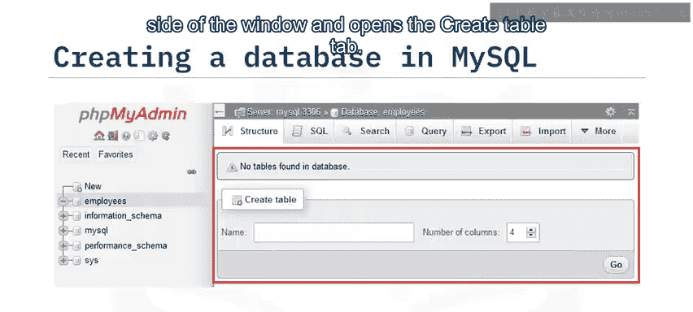

在下一步中，你将定义表的列。

### 定义列

以下是定义表列的具体操作：

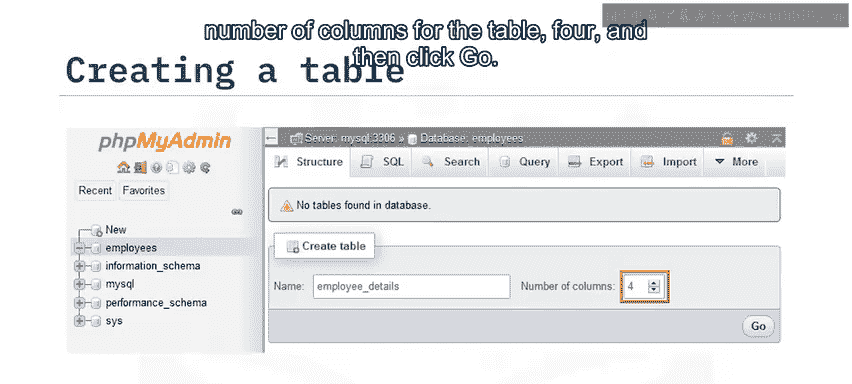

1.  为每一列输入名称。
2.  选择数据类型。
3.  如果与该数据类型相关，则输入长度值。
4.  点击“保存”。

之后，你将看到数据库中新表结构的摘要。在这里，你可以编辑列。

### 编辑表结构

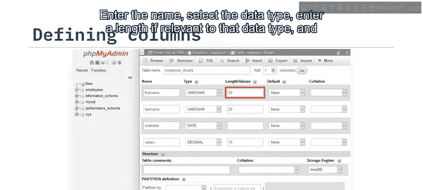

创建表后，你可以对其进行修改。以下是可进行的操作：

*   编辑现有列。
*   删除列。
*   移动列的位置。
*   规范化表。
*   如果需要，还可以添加更多列。

---

## 总结

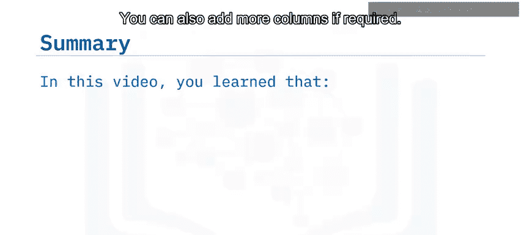

本节课中我们一起学习了在MySQL中创建数据库和表的两种主要方法。


你了解到，可以使用命令行界面、图形用户界面或API调用来创建数据库和表。PHPMyAdmin提供了一个易于使用的界面来创建数据库、表和列，并且你可以在创建表之后添加和修改列。