# 027：在MySQL中加载数据 📥


在本节课中，我们将学习如何向MySQL数据库和表中填充数据。你将了解如何使用备份与恢复功能、如何手动插入少量数据，以及如何通过导入/导出功能高效地处理大量数据。


---

## 概述

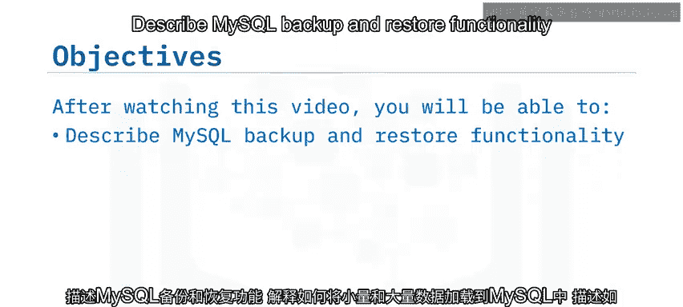

作为数据工程师或数据库管理员，经常需要向数据库和表填充数据。一种方法是备份一个包含所需数据的现有数据库，并将其恢复到新的目标位置。

上一节我们介绍了数据库的基本操作，本节中我们来看看具体的数据填充方法。

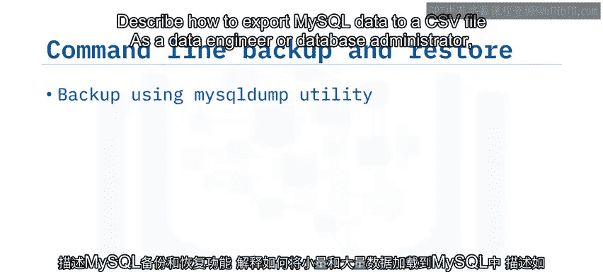


---

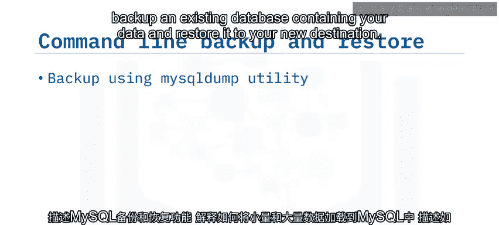

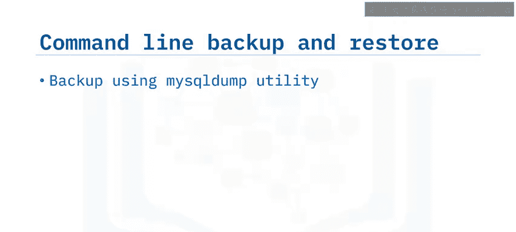

## 使用 `mysqldump` 进行备份与恢复 🔄

你可以使用 `mysqldump` 工具将数据库备份到一个 `.sql` 文件，该文件包含了重建数据库内容所需的所有SQL语句。

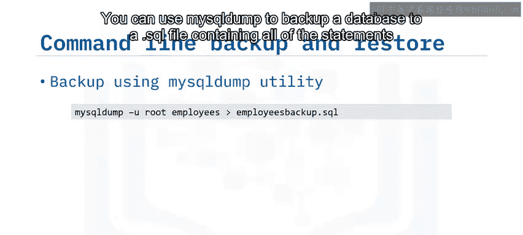

其最简单的用法如下所示：

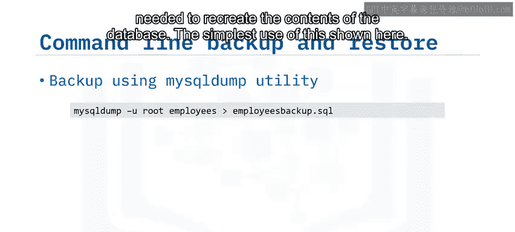

```bash
mysqldump -u username -p database_name > backup_file.sql
```


在这个命令中：
*   `-u` 参数指定用户名。
*   `database_name` 是要备份的数据库名称。
*   `backup_file.sql` 是用于创建备份的文件名。

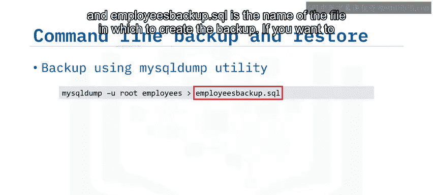

如果你只想备份特定的表，可以在数据库名后列出这些表的名称。

要恢复备份文件，可以使用 `mysql` 命令以类似的方式操作：

```bash
mysql -u username -p database_name < backup_file.sql
```

这会运行备份文件中的所有SQL语句，从而在目标数据库中重新创建对象并恢复数据。

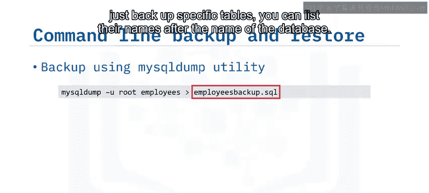

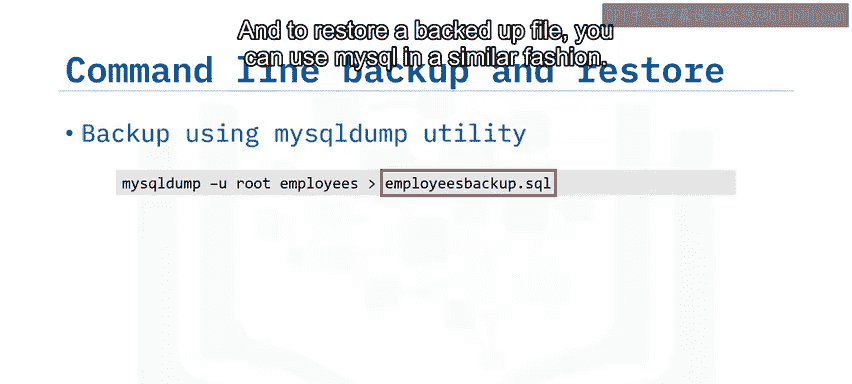

请注意：
*   符号 `>` 表示输出到 `.sql` 文件（即备份）。
*   符号 `<` 表示从文件输入到数据库（即恢复）。

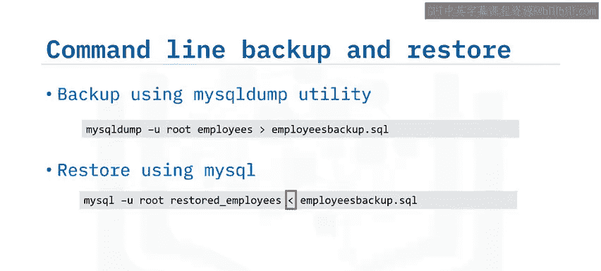

如果你已经位于MySQL命令行提示符下，可以使用 `source` 命令来恢复转储文件：

```sql
source backup_file.sql;
```

此方法也可用于从文件执行SQL脚本。

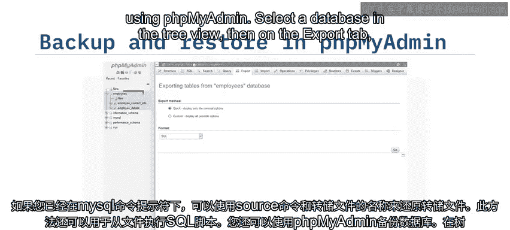

---

## 使用 phpMyAdmin 进行备份与恢复 🖥️

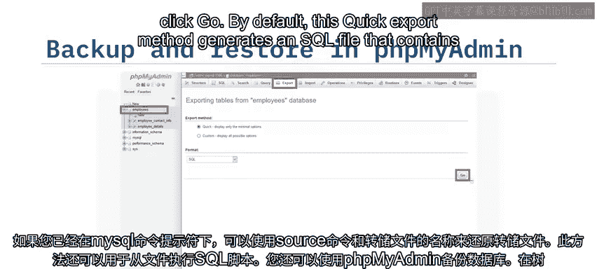

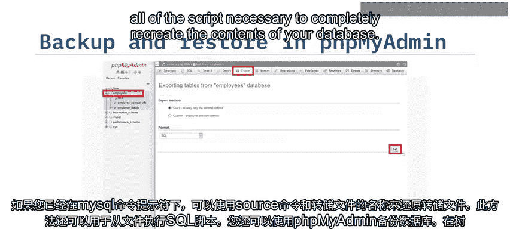

你也可以使用图形化管理工具phpMyAdmin来备份数据库。

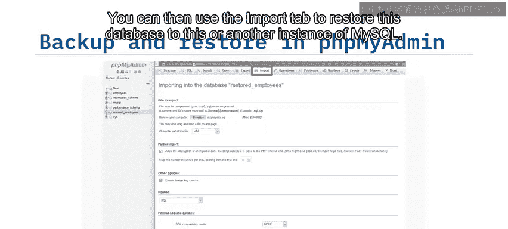

以下是操作步骤：
1.  在树形视图中选择一个数据库。
2.  点击“导出”选项卡。
3.  点击“执行”按钮。

默认情况下，这种快速导出方法会生成一个SQL文件，其中包含完全重建数据库内容所需的所有脚本。然后，你可以使用“导入”选项卡将此数据库恢复到此MySQL实例或另一个实例中。

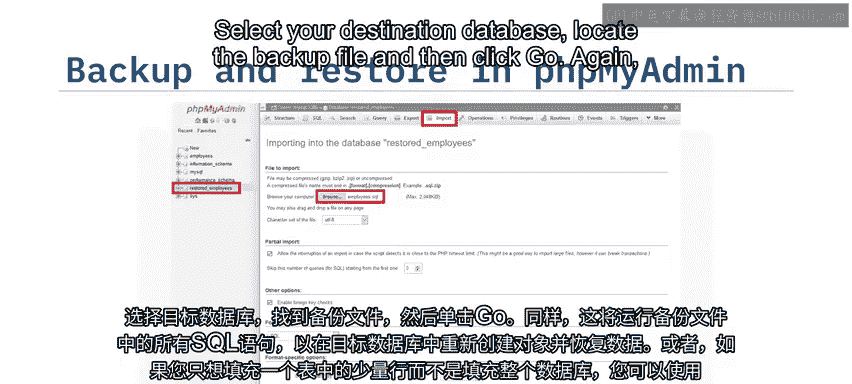

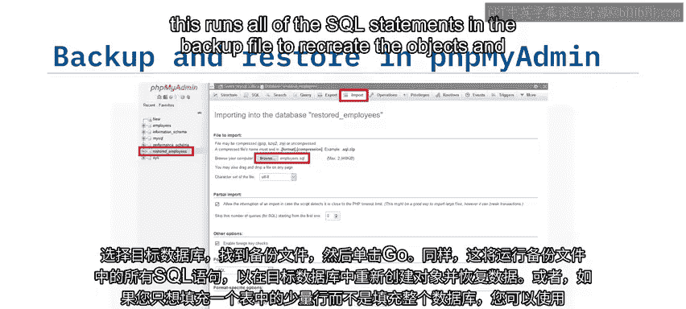

以下是恢复步骤：
1.  选择你的目标数据库。
2.  点击“导入”选项卡。
3.  定位备份文件。
4.  再次点击“执行”按钮。


这将运行备份文件中的所有SQL语句，以在目标数据库中重新创建对象并恢复数据。

---


## 手动插入少量数据 ✍️


如果你只想向单个表中填充少量数据，而不是整个数据库，可以使用phpMyAdmin工具手动输入行或运行SQL `INSERT` 语句。

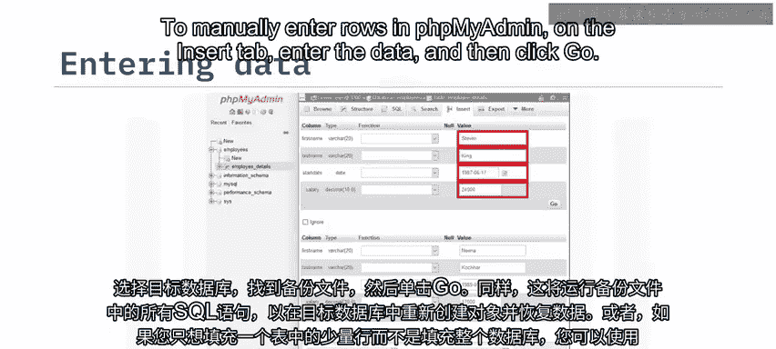

在phpMyAdmin中手动输入行的步骤如下：
1.  选择目标表。
2.  点击“插入”选项卡。
3.  输入数据。
4.  点击“执行”按钮。

默认情况下，你可以一次输入两行数据，但可以根据需要增加或减少此数量。向表中输入数据后，你可以在“浏览”选项卡中查看这些数据。

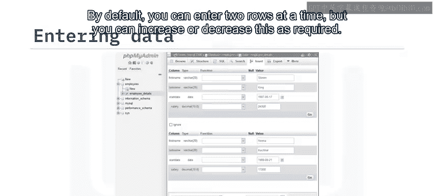

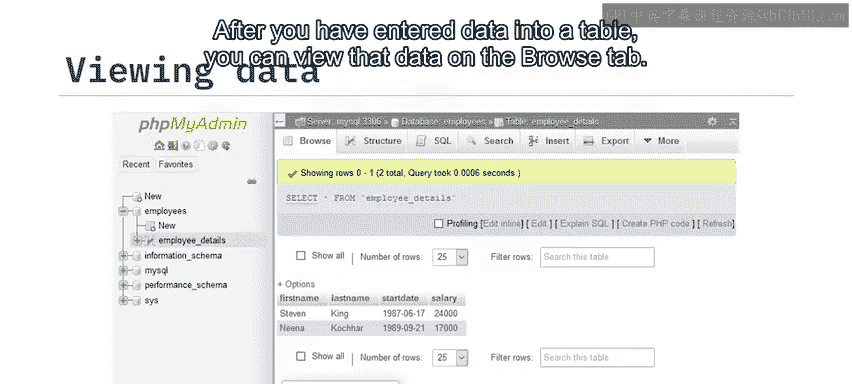

手动输入行和运行单独的SQL语句适用于少量数据。但是，如果要加载大量行，你会发现导入功能更易于使用且速度更快。

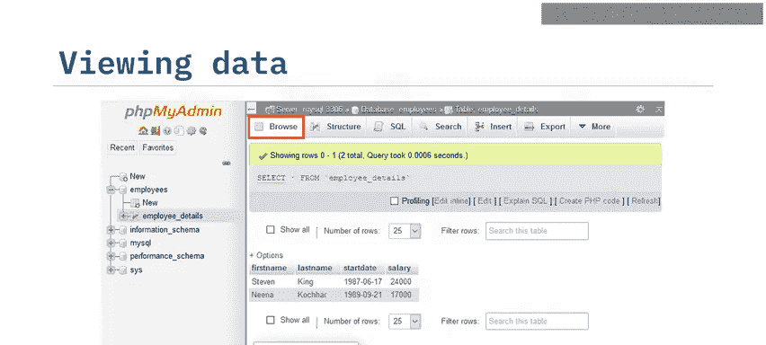

---

## 导入大量数据 📁

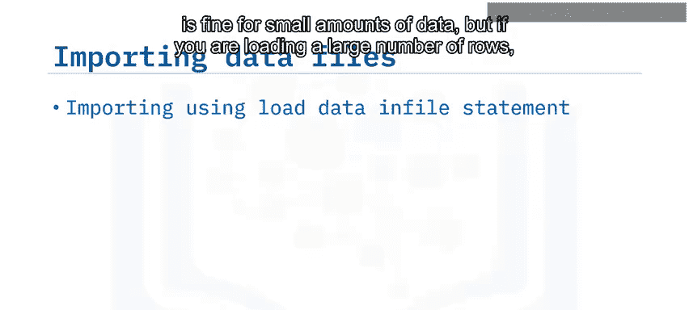

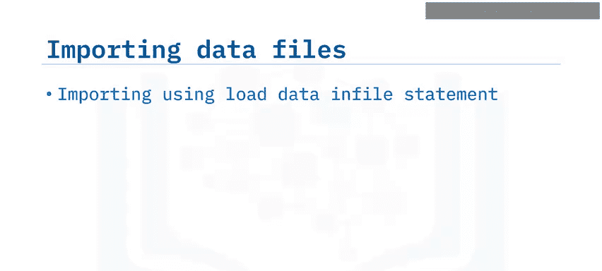

你可以使用 `LOAD DATA INFILE` SQL语句将CSV文件的内容导入到现有的MySQL表中。

或者，可以使用 `mysqlimport` 实用程序，传入表所在的数据库名称和CSV文件名：

```bash
mysqlimport -u username -p database_name data_file.csv
```

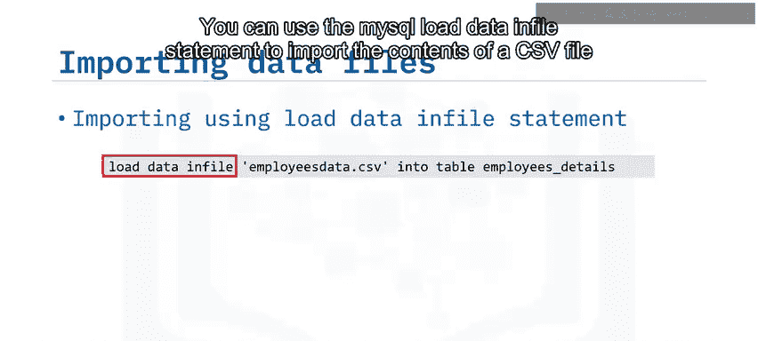

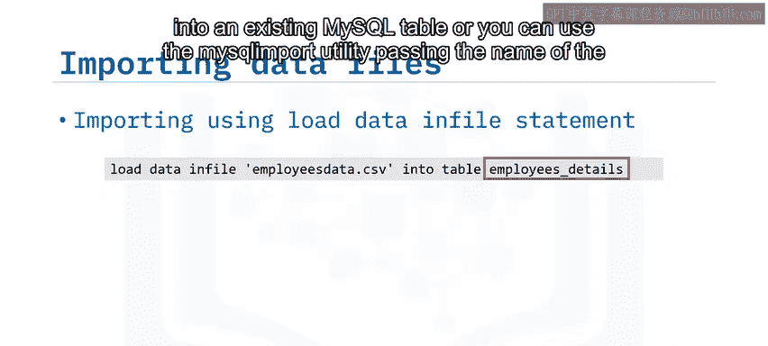

表名是从CSV文件的名称推断出来的，因此你必须确保文件名与表名完全匹配。

此外，phpMyAdmin为向表中导入数据提供了可视化界面。

使用phpMyAdmin导入数据的步骤如下：
1.  选择目标表。
2.  点击“导入”选项卡。
3.  点击“选择文件”按钮来选择你的文件。
4.  检查格式和选项是否已根据数据文件正确确定。
5.  点击“执行”按钮。

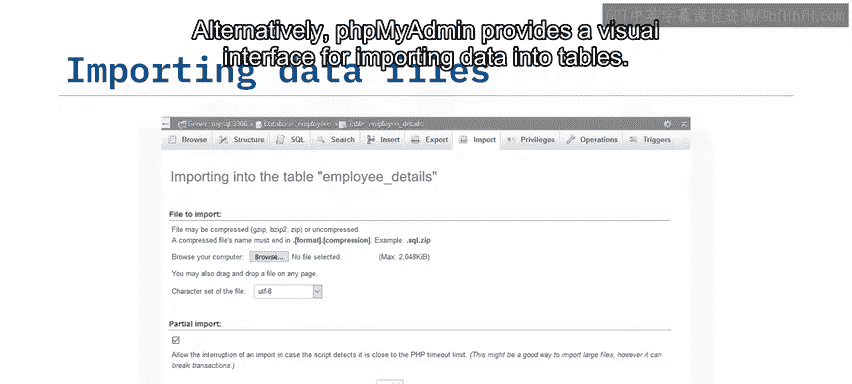

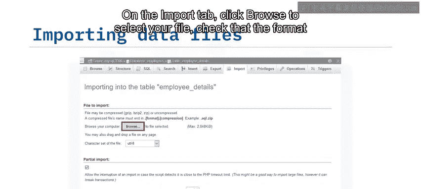

使用此方法，你一次最多可以导入2兆字节的数据。

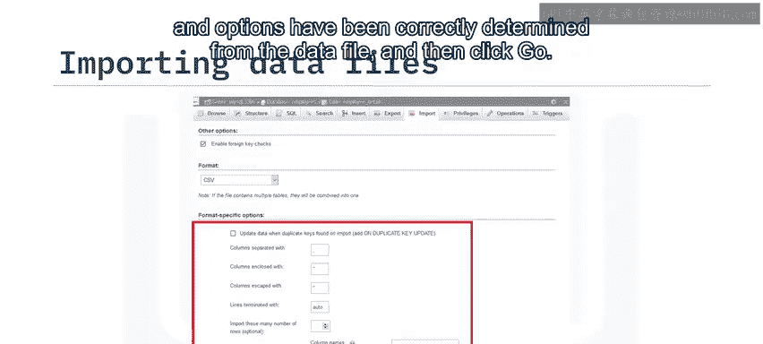

---

## 导出数据到CSV文件 📤

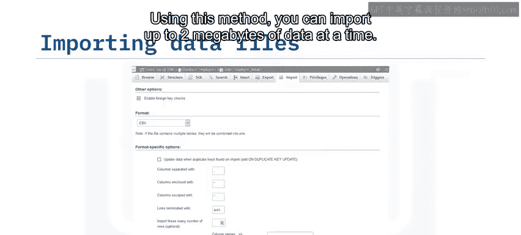

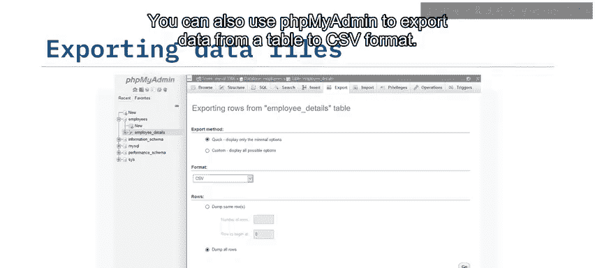

你也可以使用phpMyAdmin将表中的数据导出为CSV格式。

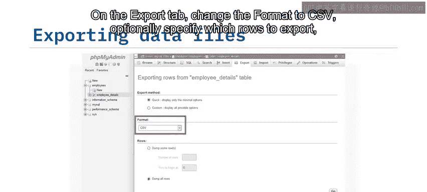

以下是操作步骤：
1.  选择要导出的表。
2.  点击“导出”选项卡。
3.  将格式更改为CSV。
4.  （可选）指定要导出的行。
5.  点击“执行”按钮。

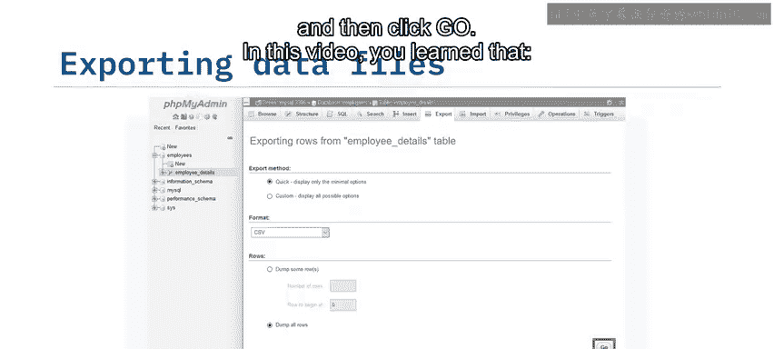

---

## 总结

本节课中我们一起学习了向MySQL填充数据的多种方法。


你了解到，可以在命令行和phpMyAdmin中使用备份与恢复功能来填充整个数据库。对于少量数据，可以使用phpMyAdmin手动插入。而对于大量数据，则可以在命令行和phpMyAdmin中使用导入和导出功能来高效地填充表格或将其数据保存到文件中。