# 028：在MySQL中使用键和约束 🔑

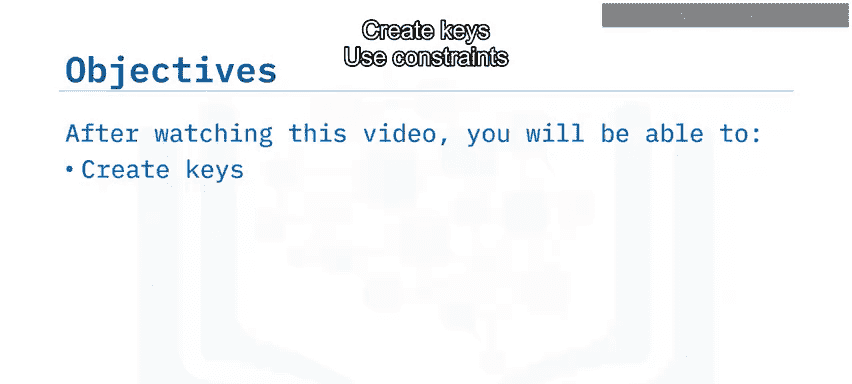

在本节课中，我们将学习如何在MySQL数据库中创建和使用键与约束。键和约束是确保数据完整性、一致性和建立表间关系的重要工具。

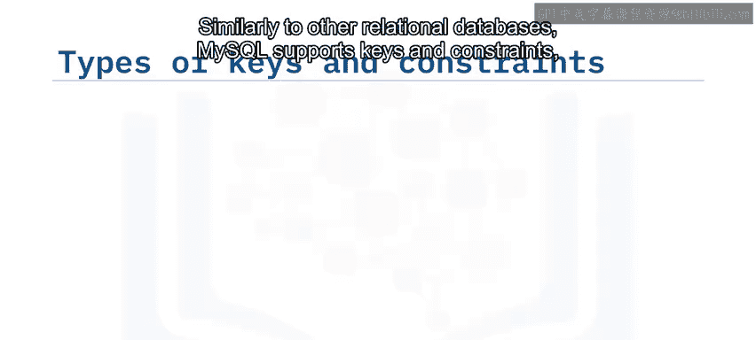

## 概述

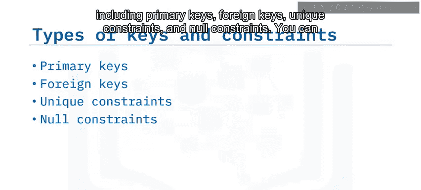

与其他关系型数据库类似，MySQL支持多种键和约束，包括**主键**、**外键**、**唯一约束**和**非空约束**。你可以在创建表时定义它们，也可以在之后添加。本教程将使用流行的可视化工具PHPMyAdmin Web界面来演示如何创建和使用这些键与约束。

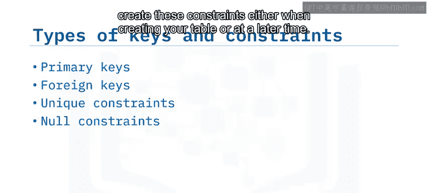

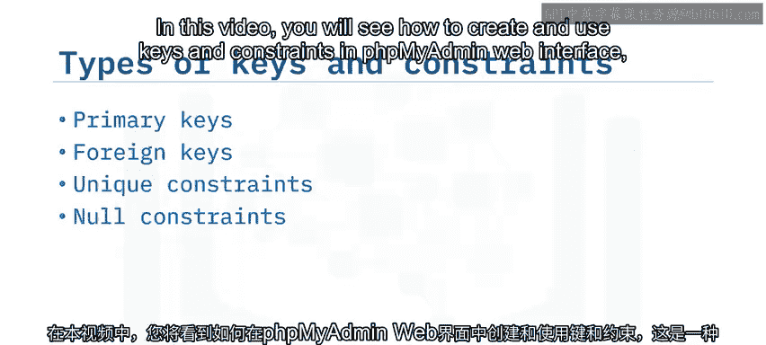

## 创建主键

主键可以定义在单个列上，也可以定义在多个列的组合上。主键列不能包含空值（NULL），并且键定义会强制该列或列组合的值具有唯一性。创建主键会自动在构成主键的列上创建一个索引。

在PHPMyAdmin中创建表时，可以通过以下步骤为列创建主键：
1.  为列添加一个类型为“PRIMARY”的索引。
2.  点击“执行”按钮进行确认。

如果你想将另一列也包含在主键中，只需为该列也添加一个主索引即可。完成后，你会在列名旁边看到一个主键图标，并且在表上会有一个名为“PRIMARY”的索引。

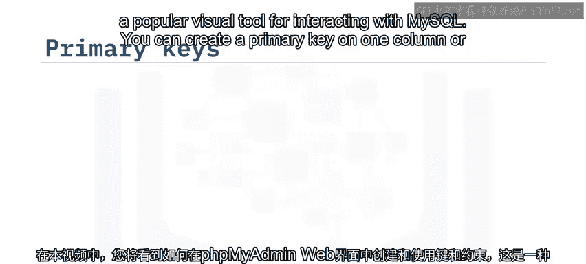

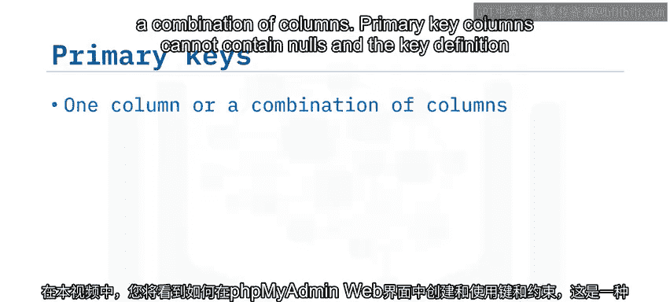

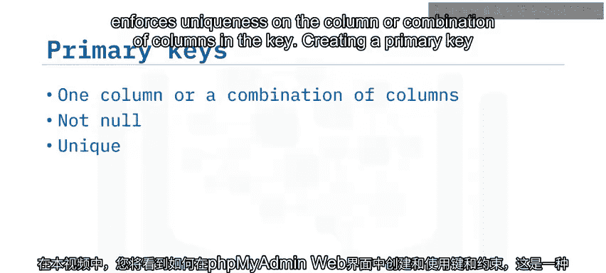

通常，表中会有一个现有列符合主键的要求，例如员工表中的员工ID列。

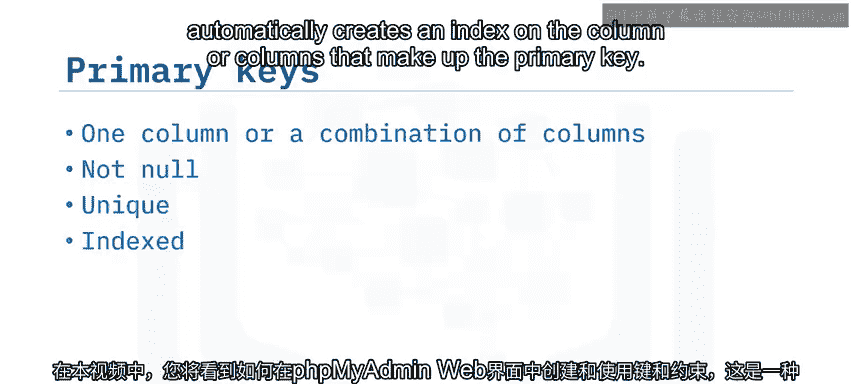

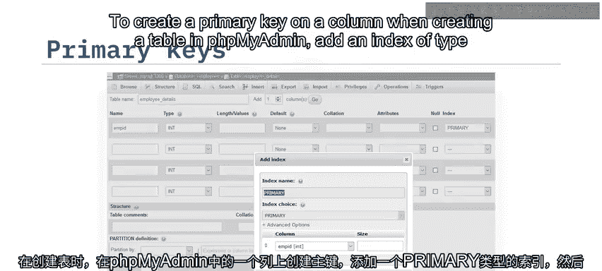

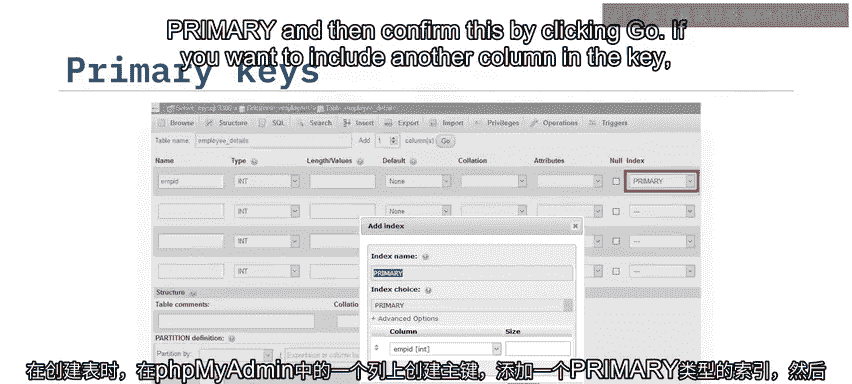

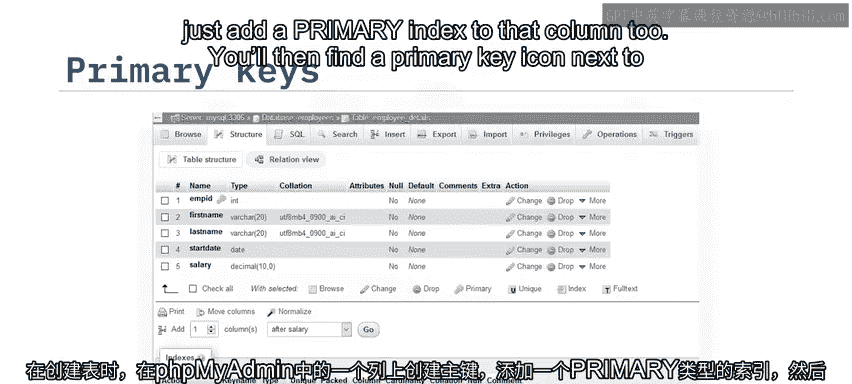

## 使用自增属性

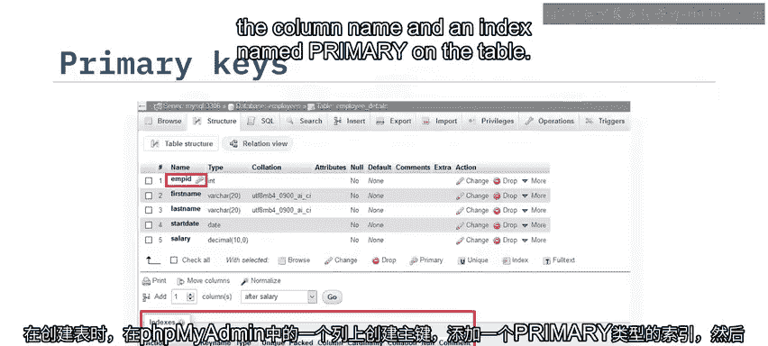

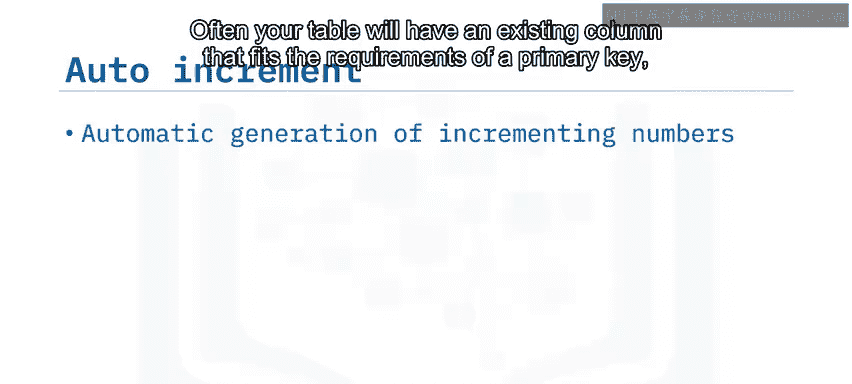

然而，在其他场景下，你可能希望为添加到表中的每一行自动生成一个ID号。列的**自增**属性可以实现此功能。与键一样，你可以在创建表时设置它，也可以在之后设置。

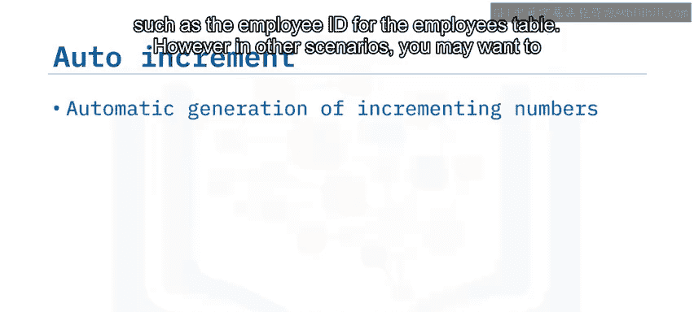

在“创建表”或“结构”选项卡上，为你作为主键的列选中“A_I”（自动递增）复选框，然后点击“保存”。现在，当你向表中添加数据时，数据库引擎会自动为员工ID列生成递增的条目。

## 创建外键

你还可以创建外键来关联不同表中的数据。例如，你可以在`employee_details`表中使用员工ID列，通过创建外键链接到`employee_contact_info`表中的员工ID列。

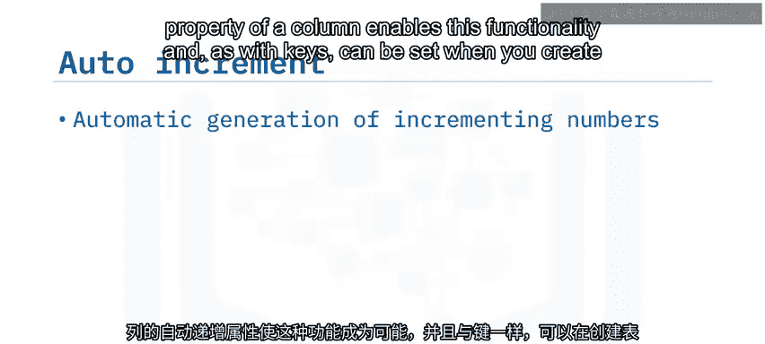

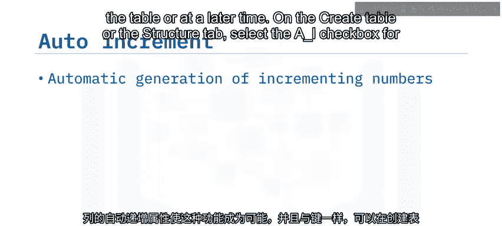

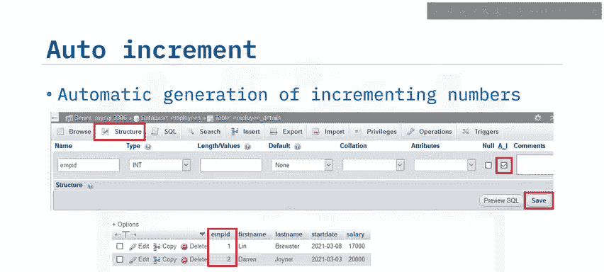

在“结构”选项卡的“关联视图”中创建外键：
1.  输入外键的名称。
2.  标识定义此外键的列。
3.  你还可以指定当相关行被删除或更新时要采取的操作。

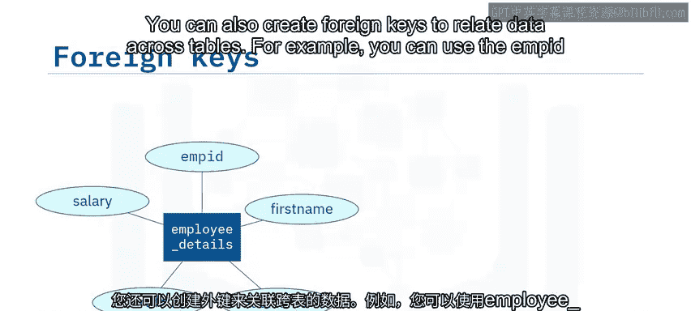

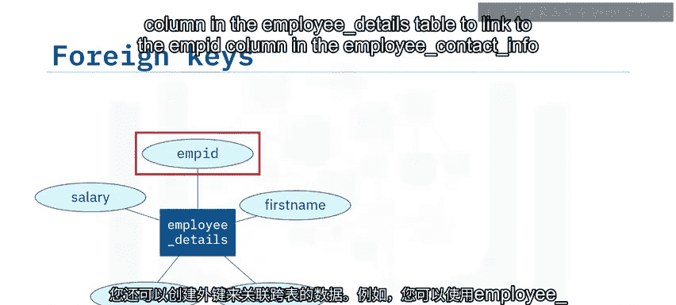

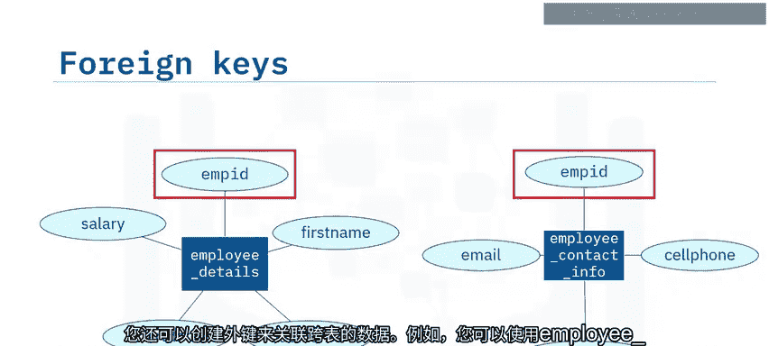

与主键一样，底层索引现在也会默认显示在“结构”选项卡上。

## 管理非空与唯一约束

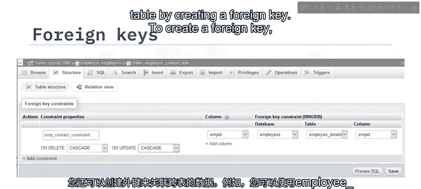

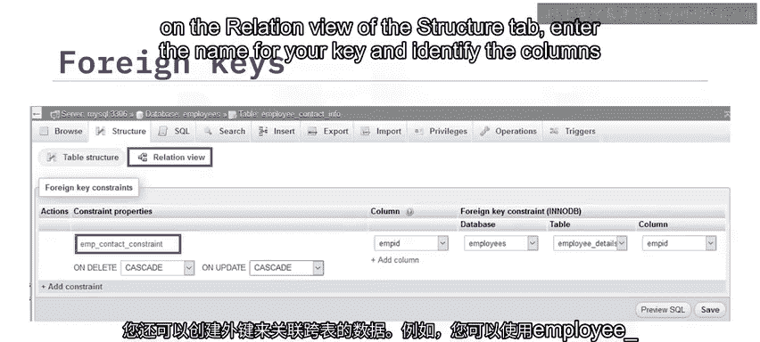

默认情况下，在PHPMyAdmin中创建MySQL表时，列被定义为“NOT NULL”（非空）。你可以在创建表时更改此设置，也可以通过修改列定义来更改。

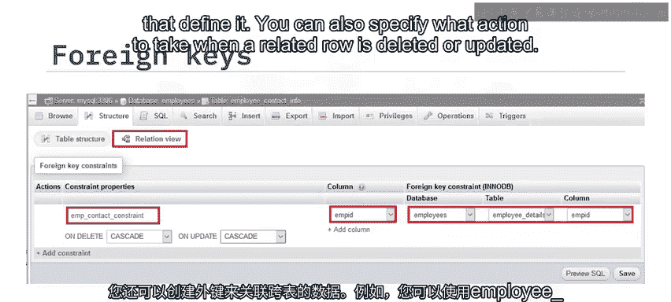

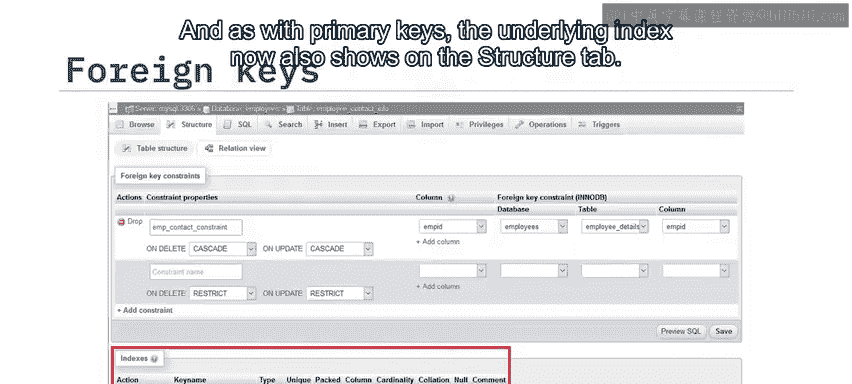

例如，要允许在“开始日期”和“薪水”列中输入空值，请选中这些列的“Null”复选框。保持员工ID、名字和姓氏的“Null”复选框为空，可确保这些列需要输入数据。

为确保每位员工的电子邮件地址是唯一的，你可以使用**唯一约束**。在“结构”选项卡上，点击相关列的“更多”链接，然后点击“唯一”。

## 总结

本节课中，我们一起学习了MySQL中键与约束的核心用法：
*   通过在**一个或多个列**上定义**主索引**来创建主键。
*   使用**自增**属性在列中自动生成顺序数字数据。
*   创建外键时，可以定义**ON DELETE**和**ON UPDATE**操作。
*   MySQL列默认是**NOT NULL**的。
*   可以将列配置为仅接受**唯一**值。

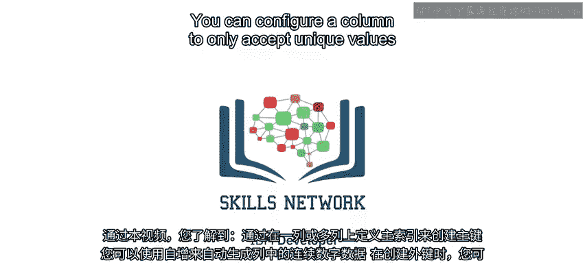

掌握这些概念对于设计和维护结构良好、数据可靠的关系数据库至关重要。