# 029：PostgreSQL入门指南 🐘

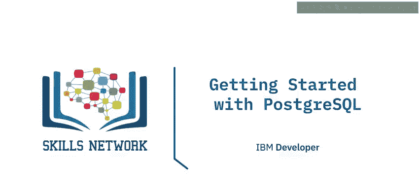

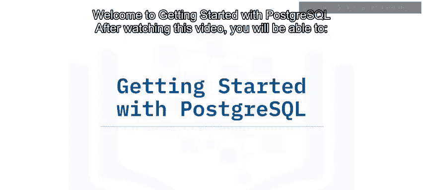

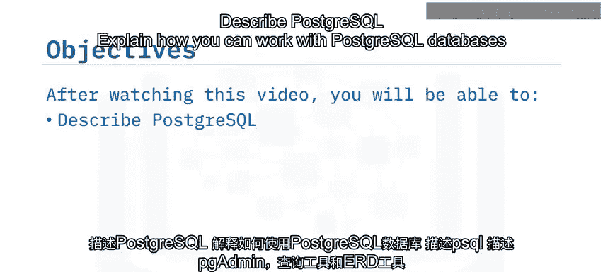

在本节课中，我们将学习PostgreSQL的基础知识，包括其特点、使用方式以及相关工具。通过本节内容，你将能够描述PostgreSQL，解释如何使用PostgreSQL数据库，并了解PSQL和PG Admin等工具的功能。

---

PostgreSQL是一个开源的**对象-关系数据库管理系统**，以其可靠性、灵活性以及对关系型和非关系型数据类型的支持而享有盛誉。PostgreSQL是**OLTP（联机事务处理）**、**数据分析**和**地理信息系统**的流行数据库选择。

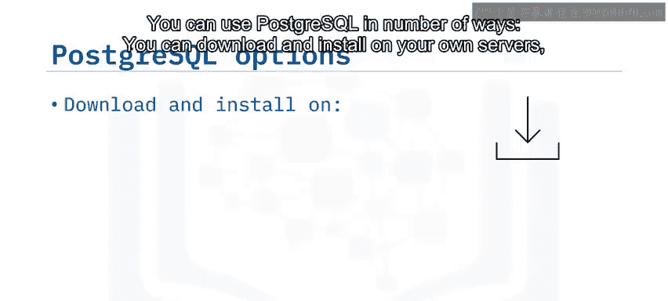

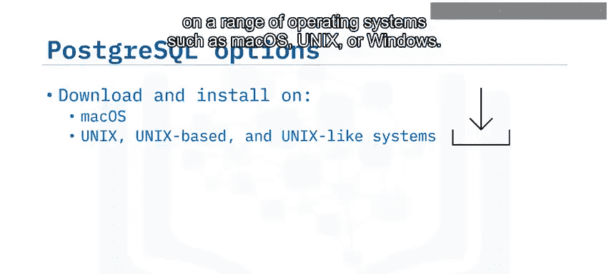

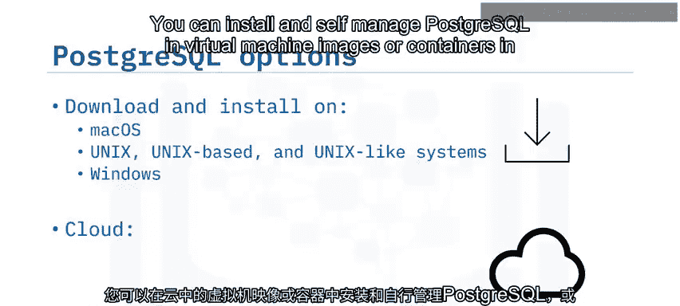

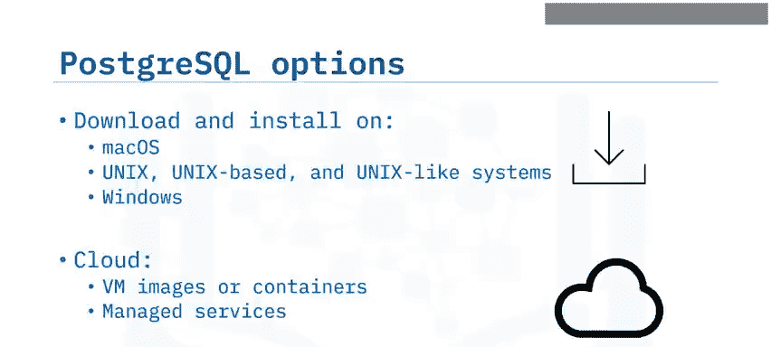

你可以通过多种方式使用PostgreSQL：可以在自己的服务器上下载并安装，支持的操作系统包括**Mac OS**、**Unix**或**Windows**；也可以在云端的虚拟机镜像或容器中安装并自行管理PostgreSQL；或者使用托管服务，例如**IBM Cloud Databases for PostgreSQL**、**Amazon RDS**、**Google Cloud SQL for PostgreSQL**、**EnterpriseDB Cloud**或**Microsoft Azure for PostgreSQL**。

---

上一节我们介绍了PostgreSQL的基本概念和使用方式，本节中我们来看看连接PostgreSQL数据库的各种工具。

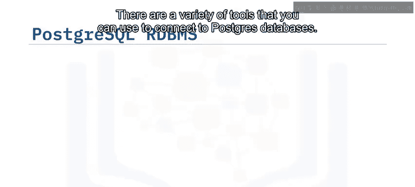

以下是几种常用的工具：

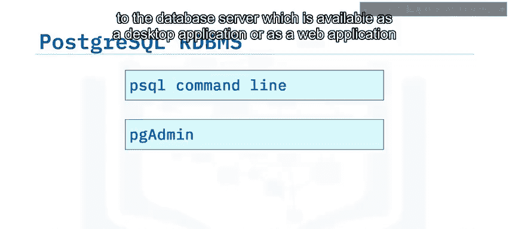

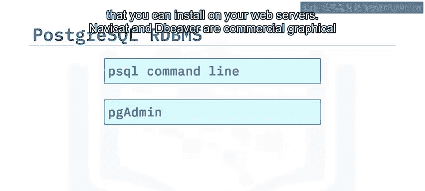

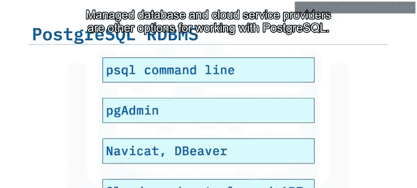

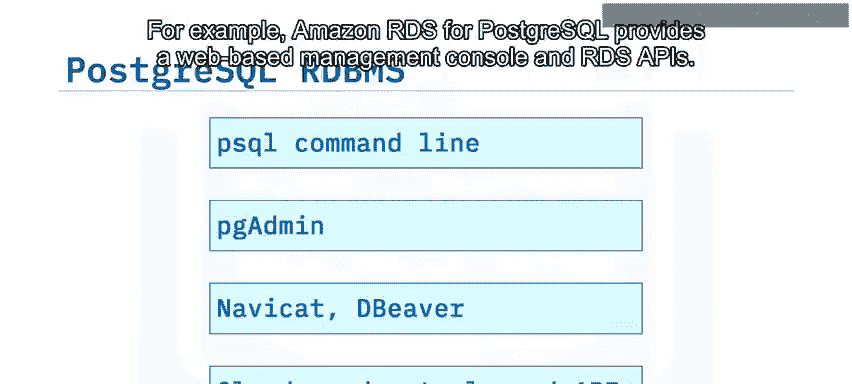

*   **PSQL**：为PostgreSQL提供命令行界面。
*   **PG Admin**：提供数据库服务器的开源图形界面，可作为桌面应用程序或安装在Web服务器上的Web应用程序使用。
*   **Navicat**和**DBeaver**：是可用于访问PostgreSQL、MySQL和其他类型数据库的商业图形界面选项。
*   **托管数据库和云服务提供商**：是使用PostgreSQL的其他选择。例如，Amazon RDS for PostgreSQL提供了基于Web的管理控制台和RDS API。

**PSQL**是一个交互式命令行工具，可用于处理PostgreSQL数据库。你可以运行交互式查询并查看数据库中对象的信息。

这里的截图显示了`library`和`postgres`用户数据库，以及PostgreSQL在创建新数据库时用作模板的内部`template0`和`template1`数据库。

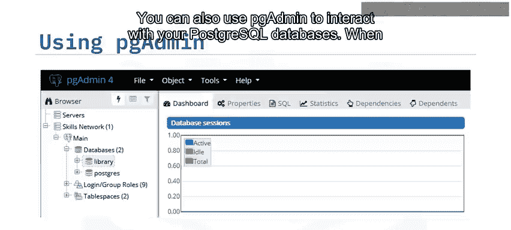

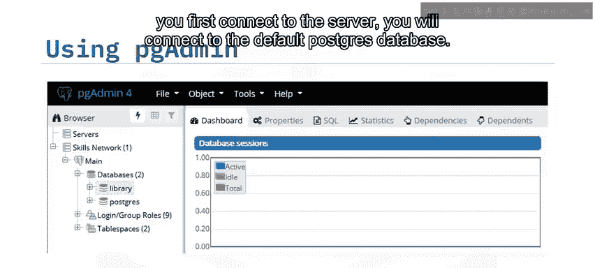

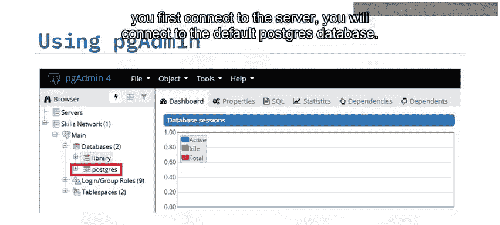

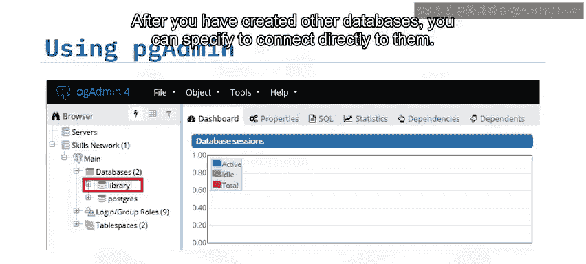

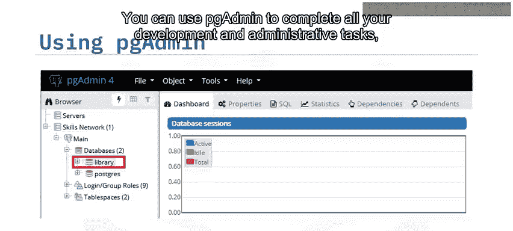

你也可以使用**PG Admin**与PostgreSQL数据库进行交互。首次连接到服务器时，你将连接到默认的`postgres`数据库。创建其他数据库后，可以指定直接连接到它们。你可以使用PG Admin完成所有开发和行政任务，包括创建数据库和表、加载数据、查询数据、编写存储过程和函数、管理数据库对象、管理安全性和监控使用情况。

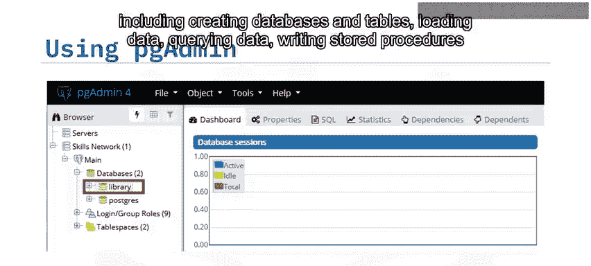

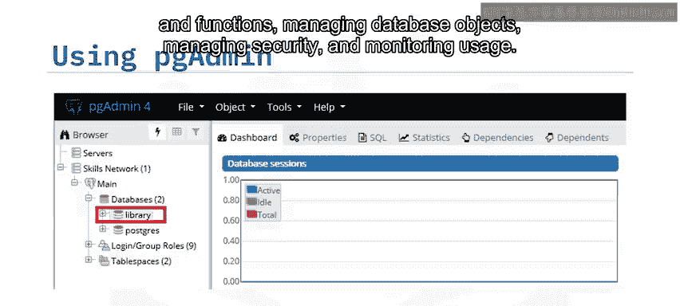

---

上一节我们介绍了PSQL和PG Admin的基本功能，本节中我们来看看PG Admin中的两个核心工具：查询工具和ERD工具。

PG Admin包含**查询工具**，可用于运行SQL命令并在上方窗格中查看或与其结果进行交互。你可以在此处键入或粘贴SQL查询，结果将显示在下方。如果结果可编辑，你可以使用此区域编辑数据库。你还可以使用选项卡查看查询计划的解释、服务器消息以及此下方窗格中的异步服务器通知。

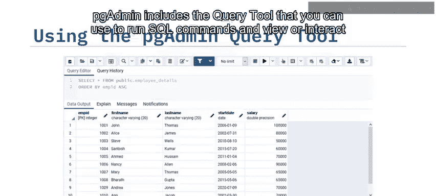

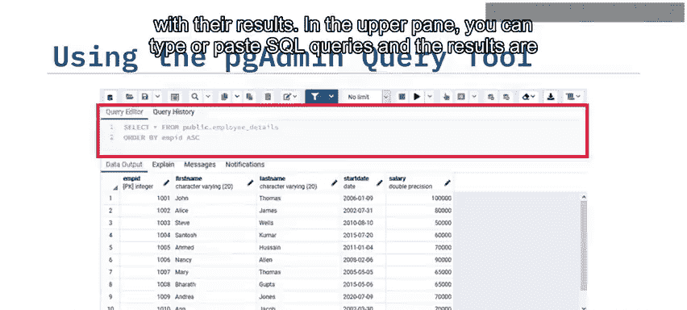

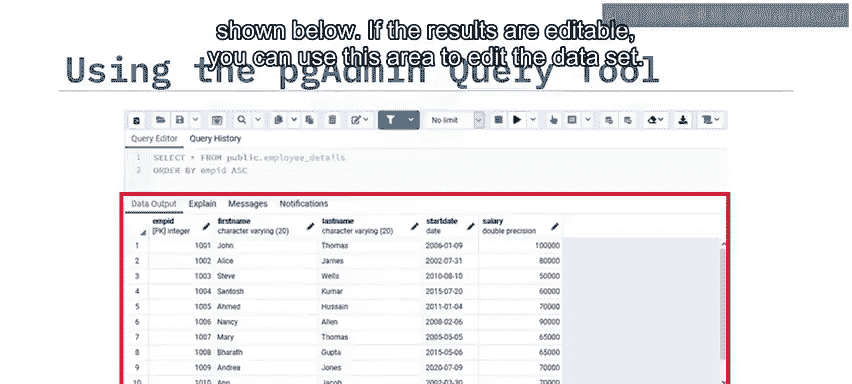

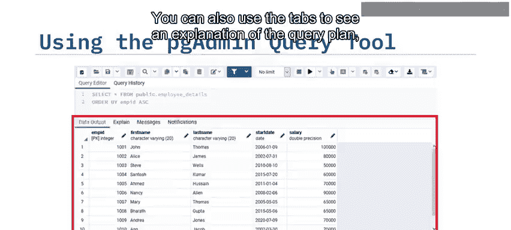

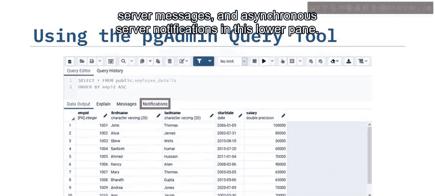

PG Admin还包含一个**ERD工具**，可用于为现有数据库创建ERD，或创建新的ERD并生成用于创建底层数据库对象的SQL语句。要从现有数据库创建实体关系图，请右键单击数据库，然后点击“生成ERD”。该工具会审查你的数据库结构并生成可视化图表，展示数据库中的表及其之间的关系。你可以在工具中重新组织表、添加、编辑和删除关系、添加注释以及生成SQL语句。

---

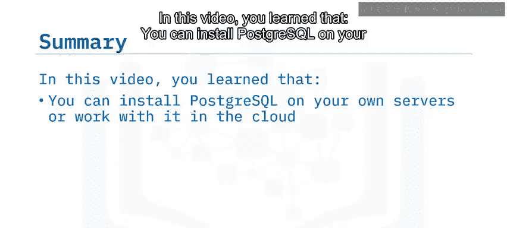

在本节课中，我们一起学习了PostgreSQL的基础知识。你了解到可以在自己的服务器上安装PostgreSQL，也可以在云端使用它。PSQL为PostgreSQL服务器提供了命令行界面，而PG Admin是PostgreSQL流行的数据库管理工具，它包含对象导航、查询工具和ERD工具。