# 030：在 PostgreSQL 中创建数据库和加载数据 🗄️➡️📥


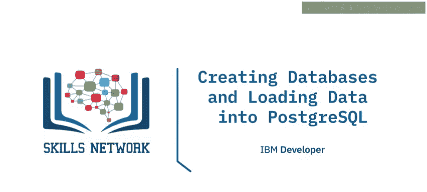


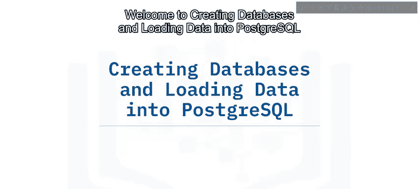

欢迎学习在 PostgreSQL 中创建数据库和加载数据。


在本节课中，我们将要学习如何在命令行和使用 PG Admin 图形界面创建数据库和表，如何备份和恢复数据库，以及如何向表中导入和导出数据。


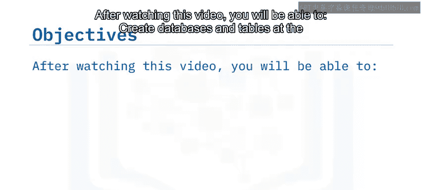


与许多关系数据库管理系统一样，你可以通过命令行界面、图形用户界面或 API 调用来创建 PostgreSQL 数据库和表，并加载数据。


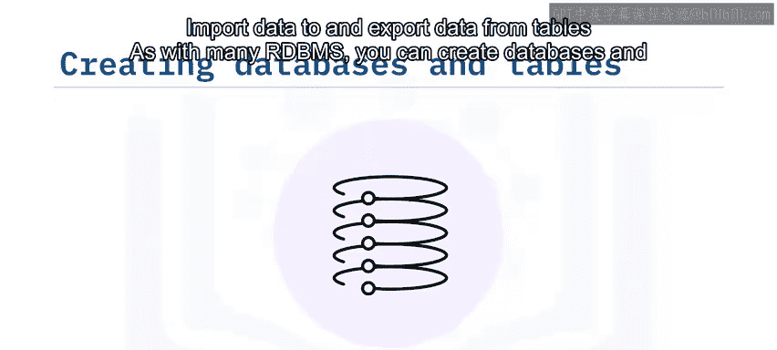


在本视频中，你将看到如何使用 PSQL 命令行界面和 PG Admin 图形用户界面来执行这些任务。你将看到如何创建数据库，然后创建表并定义和编辑表中的列，最后你将看到如何将数据加载到数据库中。


## 使用 PSQL 命令行工具

上一节我们介绍了创建数据库的多种方式，本节中我们来看看如何使用 PSQL 命令行工具。


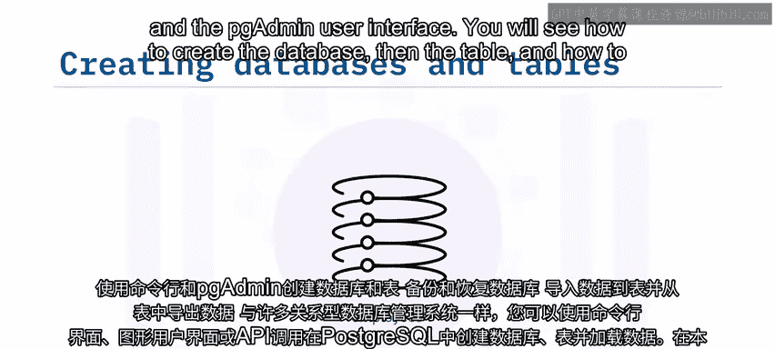


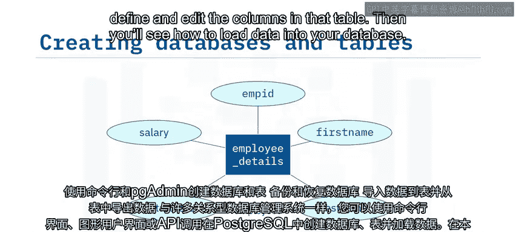


你可以使用 PSQL 来发出命令，以创建数据库对象并与之交互。使用 `CREATE DATABASE` 命令创建数据库，使用 `CREATE TABLE` 命令创建表并指定列名和数据类型。你可以使用 `\d` 命令来显示新创建表的结构。

创建数据库后，你可能希望将数据加载到其中。在命令行中，你可以使用 PSQL 来恢复之前使用 `pg_dump` 备份的数据库。只需指定目标数据库的名称和转储文件的名称。这将重新创建表以及任何其他数据库对象，并恢复创建转储文件时存在的数据。

以下是相关命令示例：

```sql
-- 创建数据库
CREATE DATABASE my_database;

-- 连接到数据库
\c my_database

-- 创建表
CREATE TABLE employee_details (
    id INT PRIMARY KEY,
    name VARCHAR(100),
    department VARCHAR(50)
);

-- 显示表结构
\d employee_details

-- 从转储文件恢复数据库
psql my_database < backup_file.sql
```


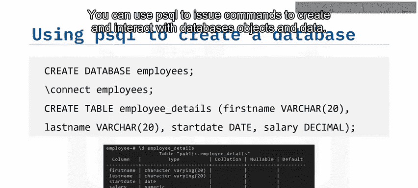

## 使用 PG Admin 图形界面

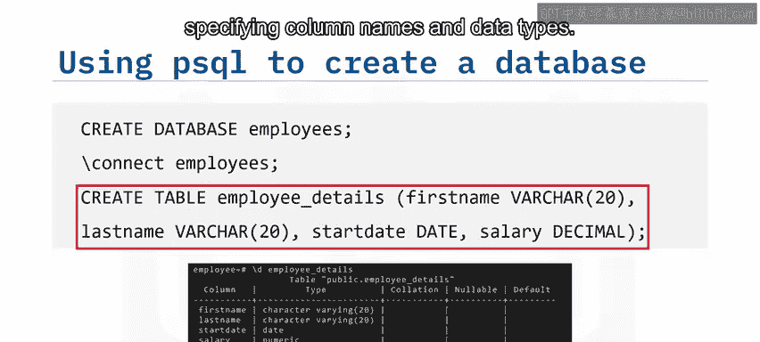

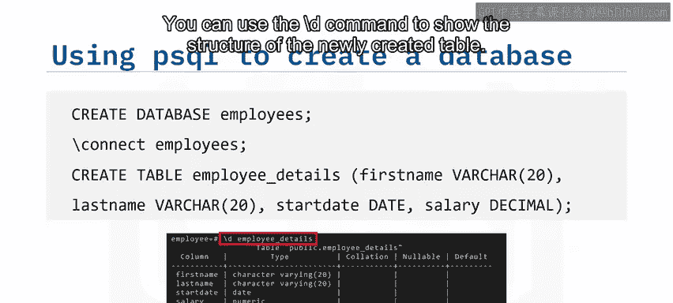

了解了命令行操作后，我们来看看更直观的图形界面操作。


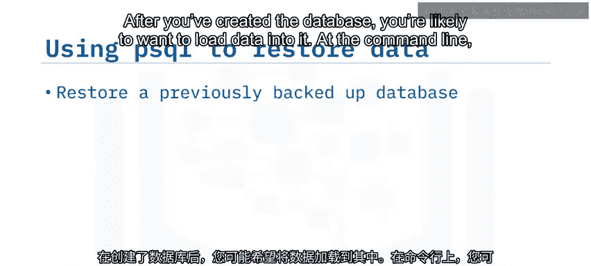


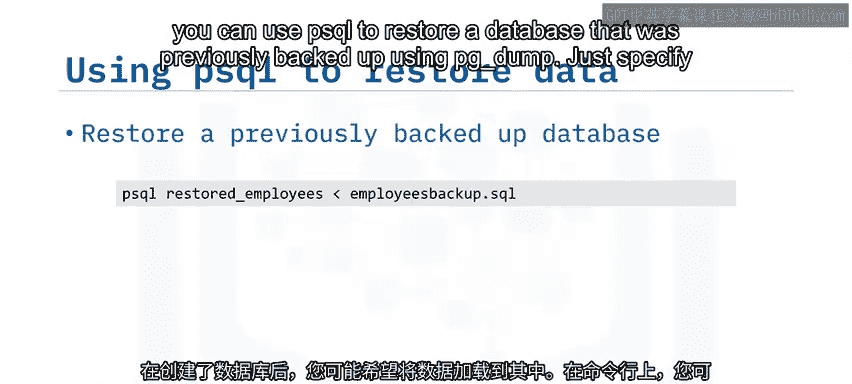

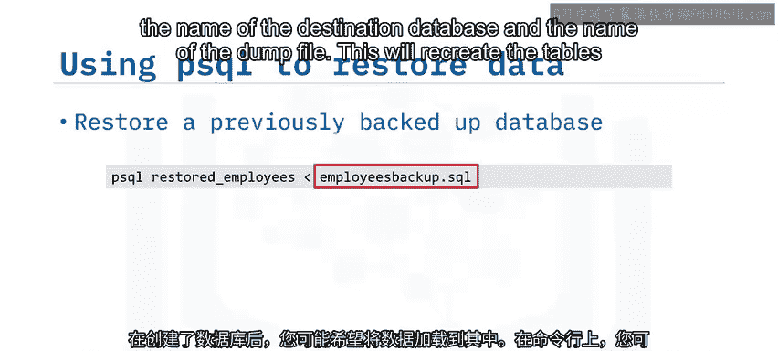


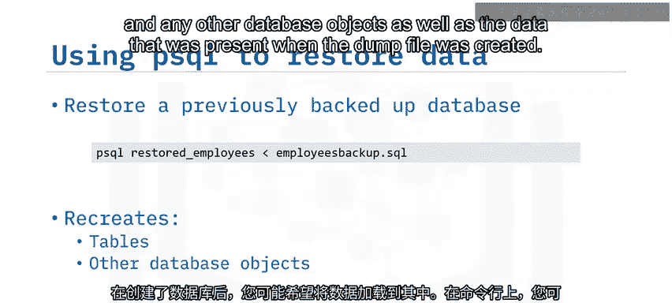


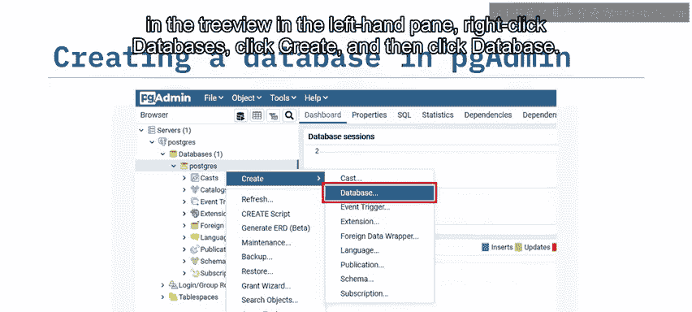


PG Admin 是一个基于 Web 的可视化工具，可用于操作 PostgreSQL。要在左侧树状视图中创建数据库，请右键单击“数据库”，点击“创建”，然后点击“数据库”。


输入新数据库的名称，然后点击“保存”。如果你想从转储文件恢复整个数据库，请在树状视图中选择要恢复到的数据库，点击“恢复”，然后在恢复对话框中输入转储文件的位置。这将运行该文件中包含的 SQL 语句，以在当前数据库中重新创建数据库对象和数据。


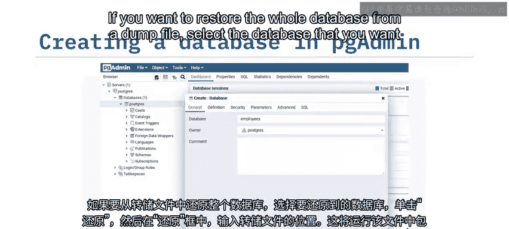

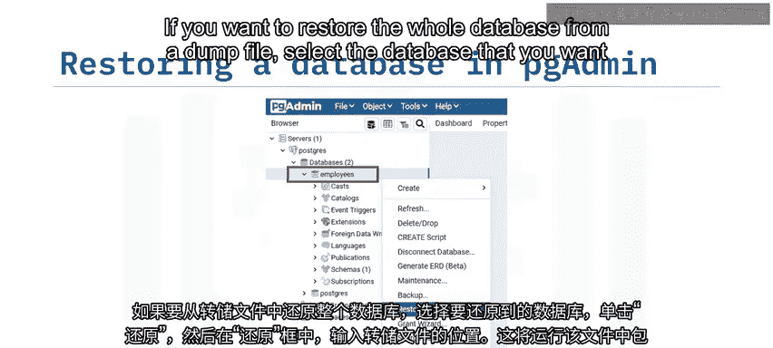

## 在 PG Admin 中创建表和导入数据

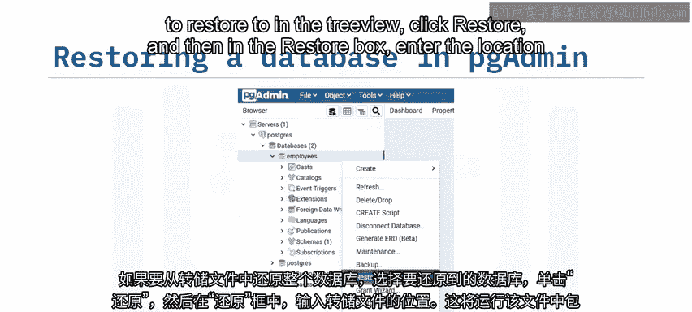

创建好数据库后，下一步是创建表并填充数据。


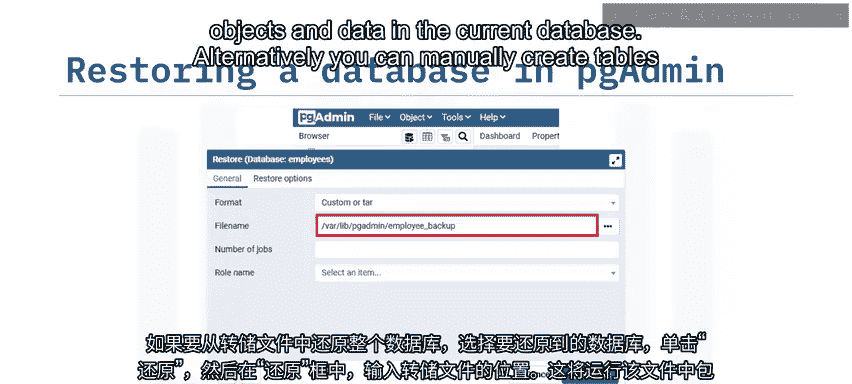


或者，你可以使用 PG Admin 手动创建表。在树状视图中，右键单击“表”，点击“创建”，然后点击“表”。在“常规”页面输入表的名称（例如 `employee_details`），然后在“列”选项卡中输入列的详细信息，最后点击“保存”。之后，你将在树状视图窗格的“表”部分看到你的表和列。

从这里，你可以使用导入/导出功能将数据加载到新表中。


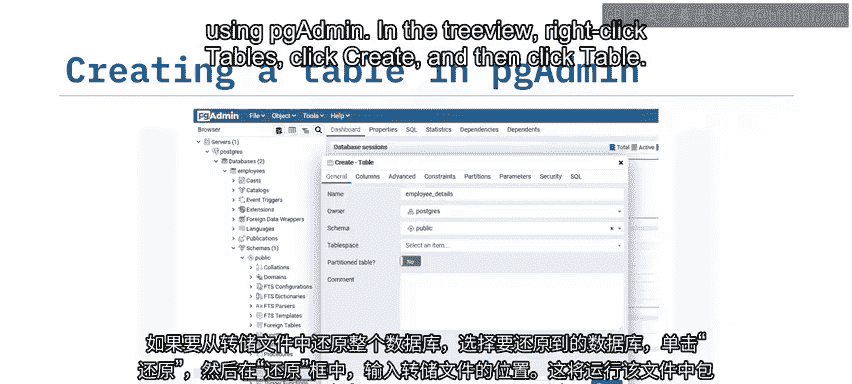

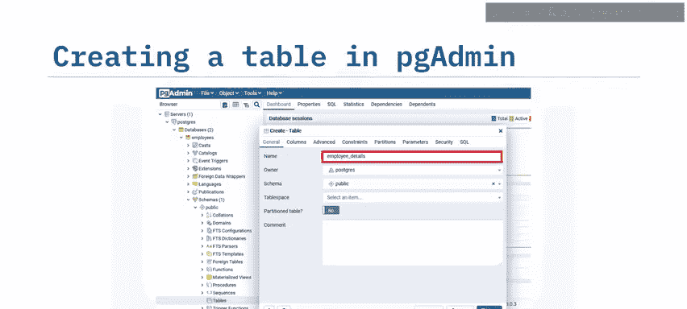


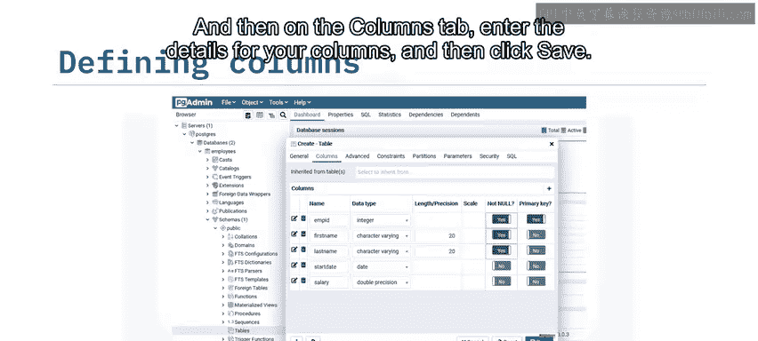

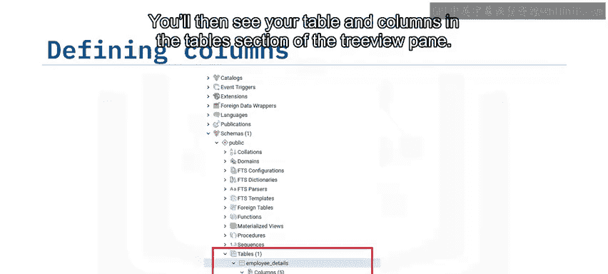


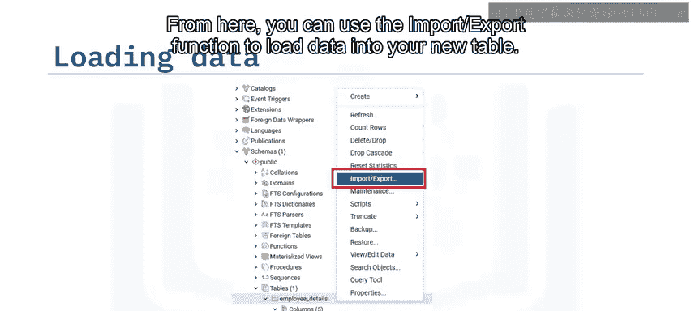


在“导入/导出数据”对话框中，选择“导入”，然后输入数据文件的位置和文件名。如果你从 CSV 文件加载数据，则无需指定分隔符，因为这是 CSV 文件的默认选项。然后，你可以使用“查看/编辑数据”选项来查看加载的数据。这将运行一个 SQL 查询来显示所选表中的数据。


## 导出数据与备份数据库

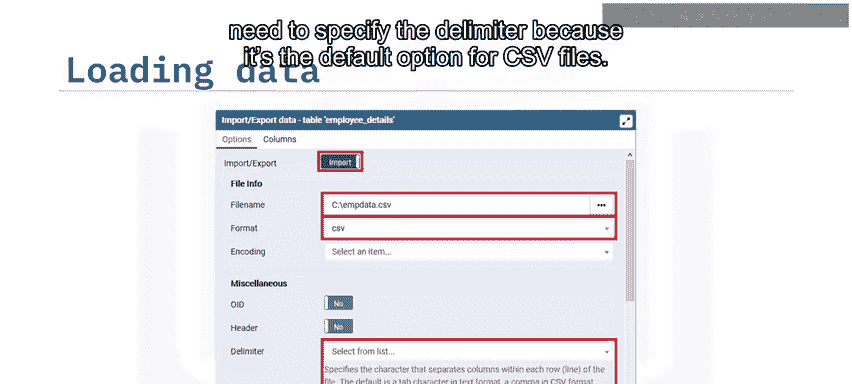

除了导入，我们还需要掌握如何导出数据和进行完整备份。


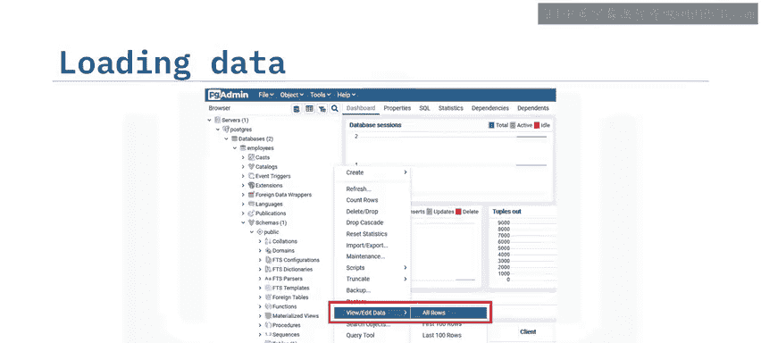

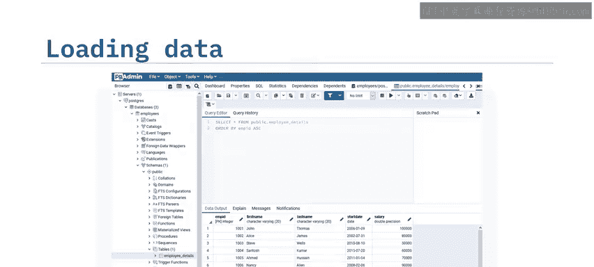


你也可以使用导入/导出功能将数据库中现有的数据导出为 CSV 文件以供其他地方使用。CSV 是默认格式，因此你只需指定文件名并点击“确定”即可。

如果你想备份整个数据库，可以使用 `pg_dump` 实用程序。其语法与使用 PSQL 恢复数据类似：指定数据库名称和转储文件的文件名。默认情况下，`pg_dump` 会创建一个包含描述数据库中所有对象和数据的脚本的 SQL 文件。

以下是相关命令示例：

```bash
# 备份整个数据库到 SQL 文件
pg_dump my_database > my_database_backup.sql

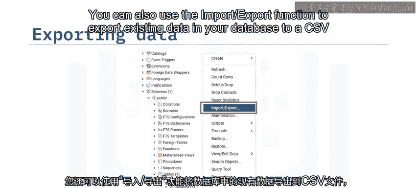

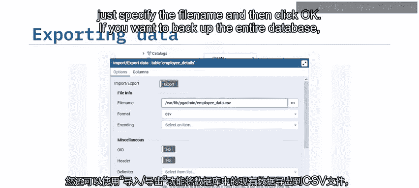

# 备份到自定义格式的压缩归档文件
pg_dump -Fc my_database > my_database_backup.dump
```


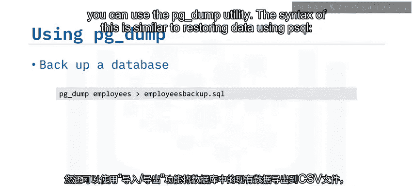


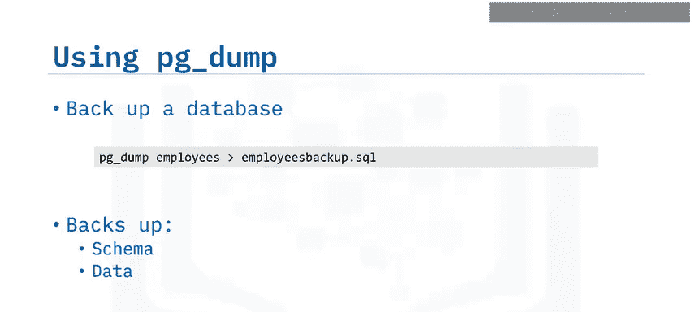


你还可以通过自定义命令将输出改为压缩归档文件。默认情况下，`pg_dump` 会备份数据库中的整个模式和数据。


## 总结


本节课中我们一起学习了创建 PostgreSQL 对象的多种工具，包括 PSQL 命令行实用程序和 PG Admin。我们学习了如何使用 `pg_dump` 备份数据库以及使用 PSQL 恢复它们。最后，我们还学习了如何使用 PG Admin 的导入/导出工具向表中加载数据以及从表中导出数据。