# 031：视图（Views）👁️


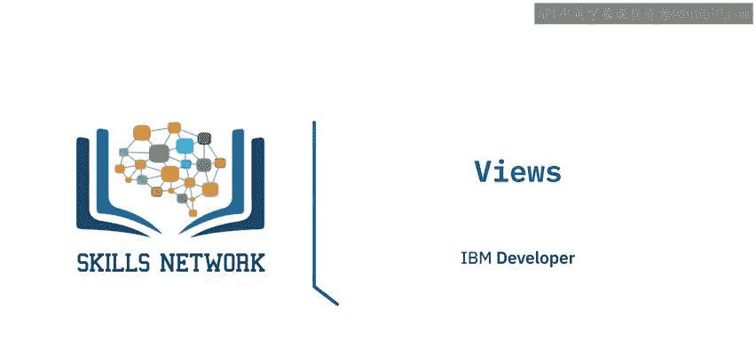

在本节课中，我们将要学习数据库中的“视图”概念。我们将了解什么是视图，如何创建和使用视图，以及物化视图与普通视图的区别。

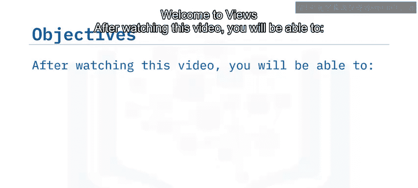

## 什么是视图？

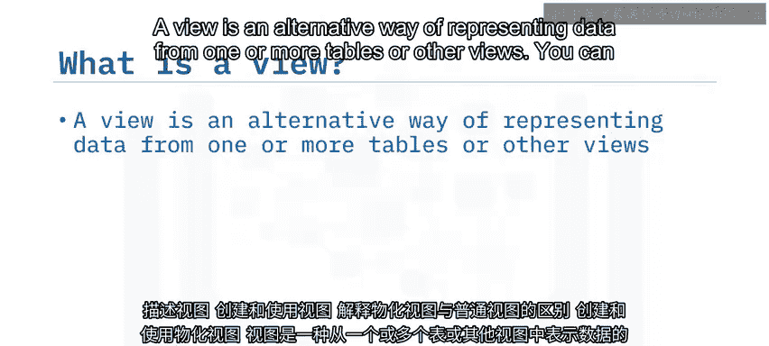

视图是一种表示一个或多个表（或其他视图）中数据的替代方式。你可以像与表交互一样与视图交互，根据需要插入、更新和删除数据。

视图是限制对敏感数据的访问、简化数据检索以及减少对底层表访问的有效方法。例如，你可以创建一个视图，仅包含来自两个表的“姓名”和“邮箱”列。这样，用户就可以轻松访问这些数据，而无需知道数据存储在不同的表中，也无需获得访问表中敏感薪资信息的权限。

## 如何创建和使用视图？

在PgAdmin中，视图在模式（Schema）内创建。以下是创建视图的步骤：

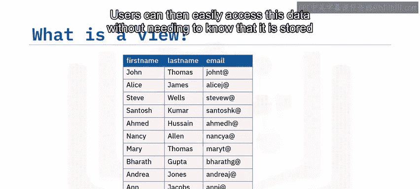

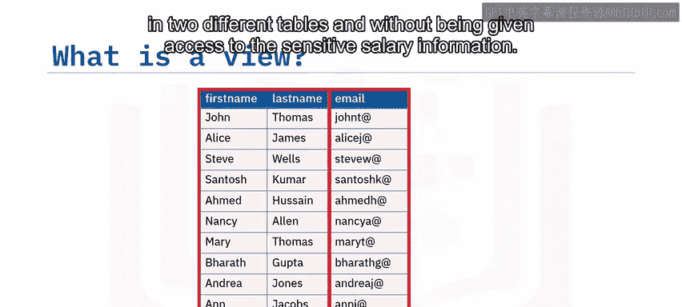

1.  在左侧的树形视图中，右键点击“Views”。
2.  点击“Create”，然后点击“View”。
3.  这将打开“Create view”对话框。首先需要为视图命名。
4.  在“Code”页面，输入定义该视图的SQL代码。
5.  点击“Save”。

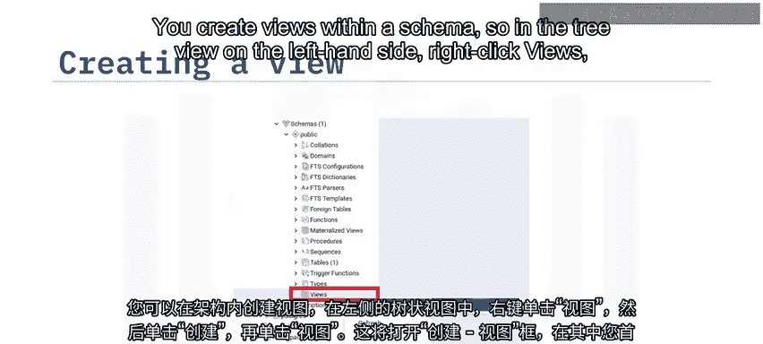

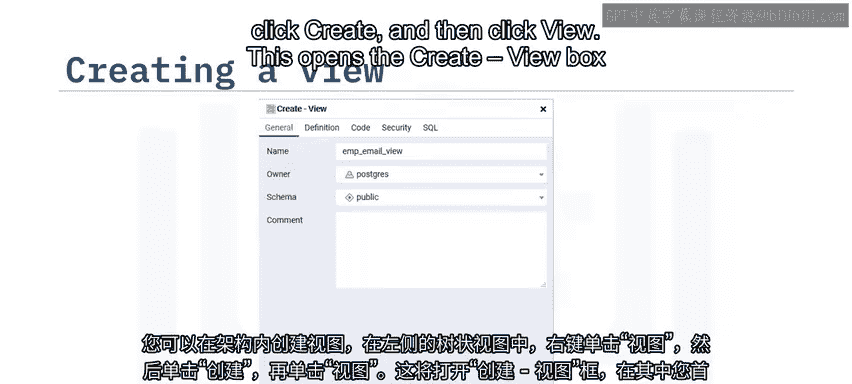

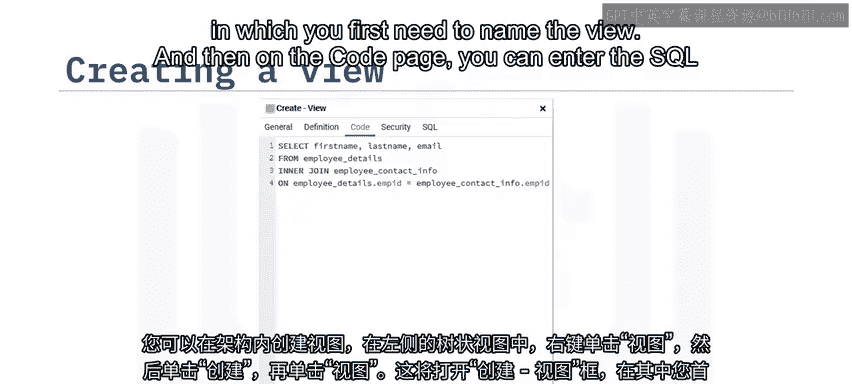

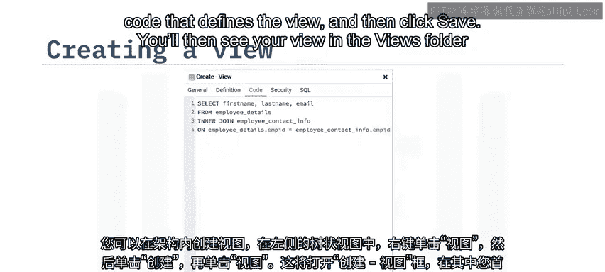

之后，你将在“Views”文件夹中看到你的视图。你可以展开视图以显示其中包含的列。

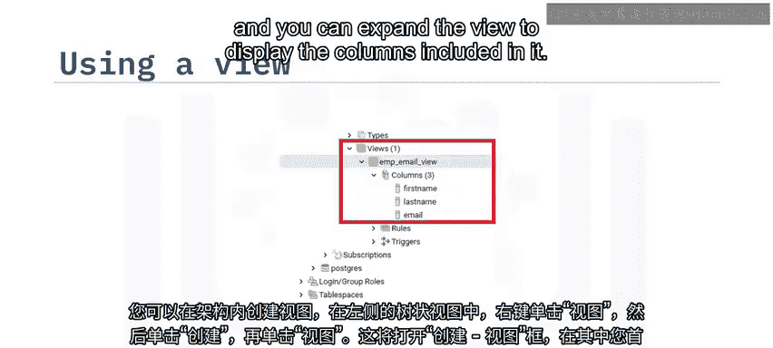

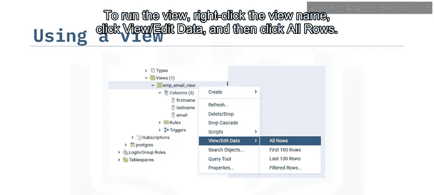

要运行视图，请右键点击视图名称，选择“View/Edit Data”，然后点击“All Rows”。你将看到视图中包含的所有行。

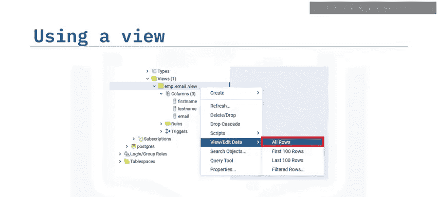

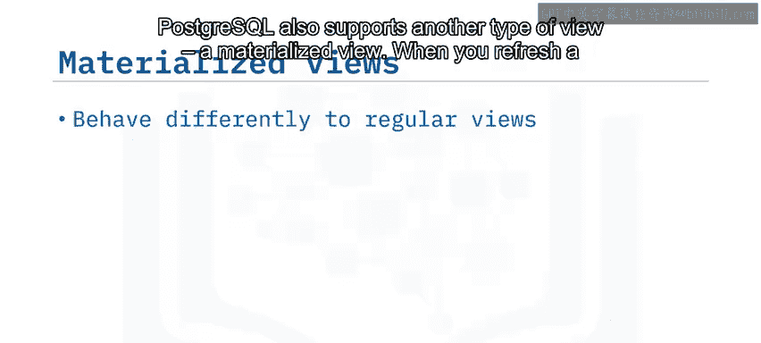

## 什么是物化视图？

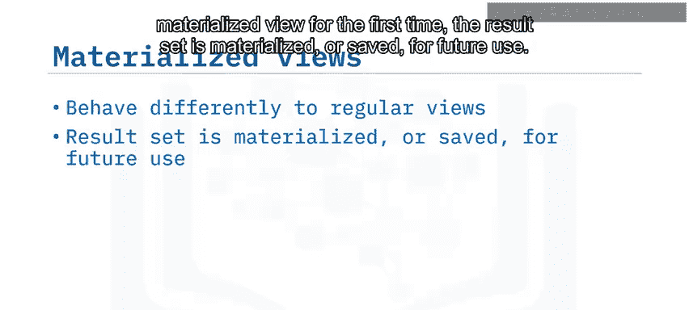

PostgreSQL还支持另一种类型的视图，称为物化视图。

当你首次刷新物化视图时，其结果集会被“物化”或保存以供将来使用。这种物化意味着你只能查询数据，而不能更新或删除它。然而，这也提高了未来查询该视图的性能，因为结果集已经准备就绪，通常存储在内存中。

## 如何创建和使用物化视图？

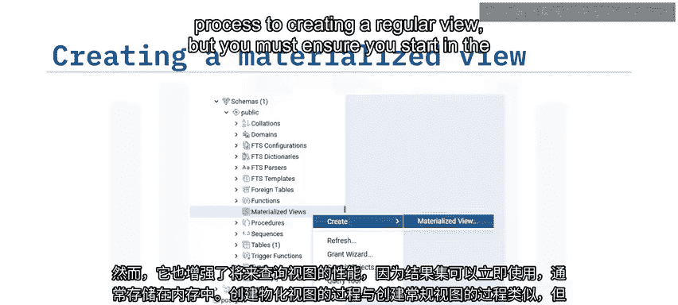

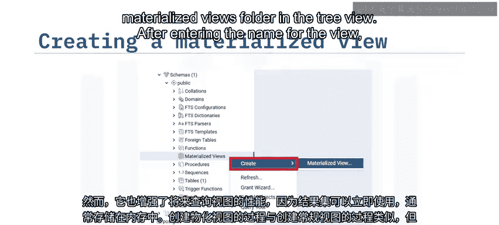

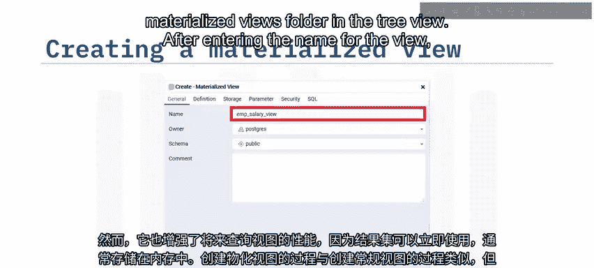

创建物化视图的过程与创建常规视图类似，但你必须确保从树形视图中的“Materialized Views”文件夹开始操作。

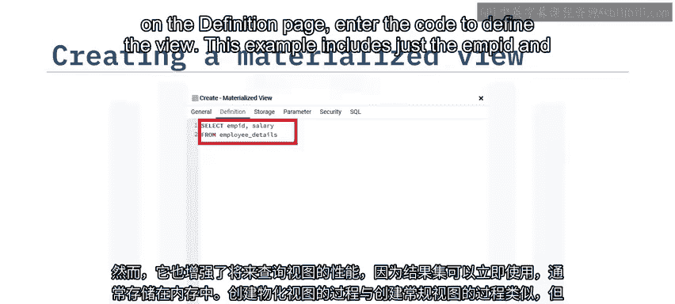

以下是具体步骤：

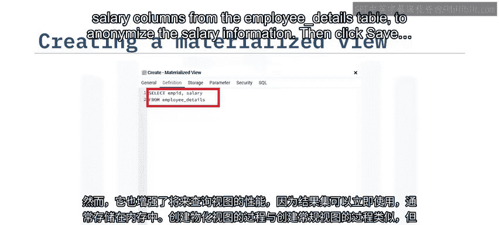

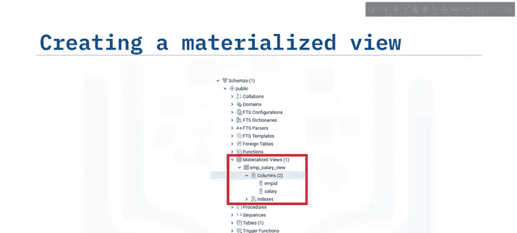

1.  在“Definition”页面输入视图名称后，输入定义视图的代码。例如，以下代码仅从 `employ_details` 表中包含“员工ID”和“薪资”列，以匿名化薪资信息：
    ```sql
    SELECT employee_id, salary FROM employ_details;
    ```
2.  点击“Save”，物化视图就会被添加到文件夹中。

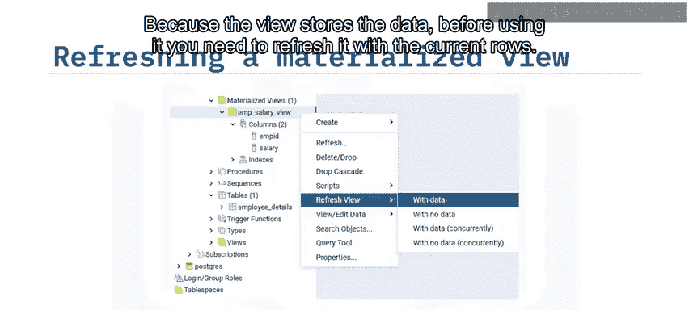

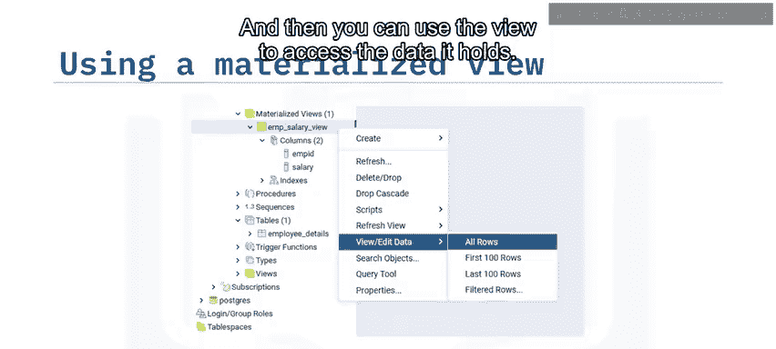

由于物化视图在使用前存储了数据，因此你需要用当前行来刷新它。之后，你就可以使用该视图来访问其中保存的数据。你可以随时刷新视图中的数据，以使用底层表中的数据来更新它。

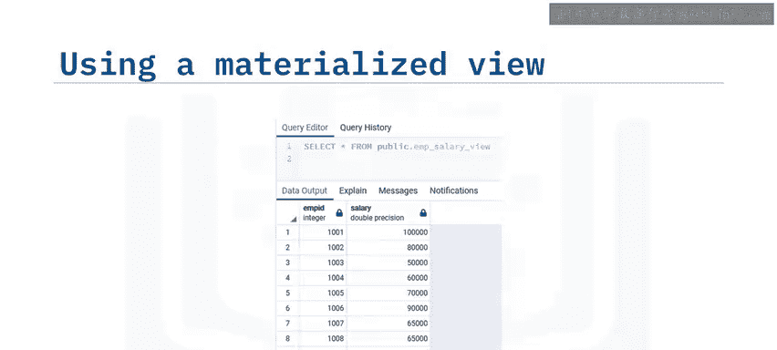

## 课程总结

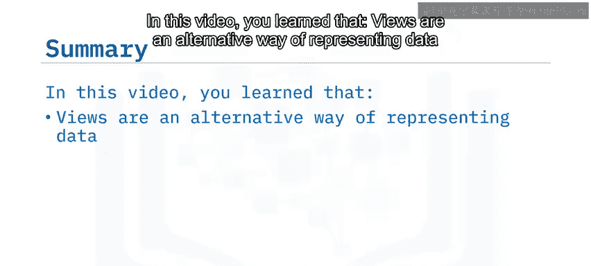

本节课中我们一起学习了数据库视图的相关知识。

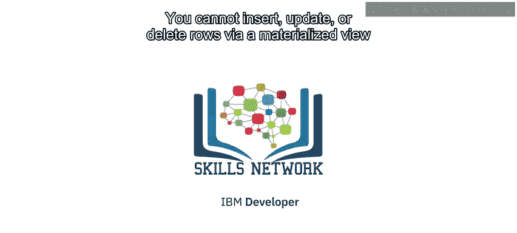

*   视图是表示数据的一种替代方式。
*   你可以使用视图来限制对敏感数据的访问并简化数据检索。
*   物化视图会存储结果集，以便后续更快地访问。
*   你无法通过物化视图插入、更新或删除行。