# 001：数据科学SQL入门 🚀

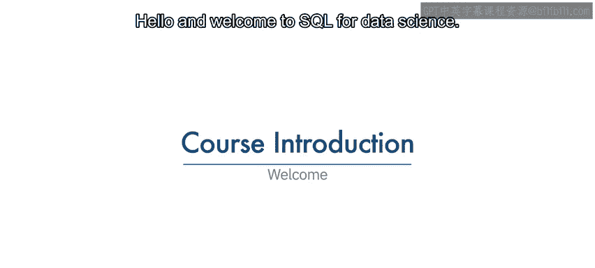

在本课程中，我们将学习SQL（结构化查询语言）及其在数据科学领域的基础应用。SQL是与数据库进行通信的强大语言，是数据科学家必备的核心技能之一。掌握SQL不仅能提升你的专业形象，还能帮助你更高效地访问和分析存储在关系数据库中的数据。

---

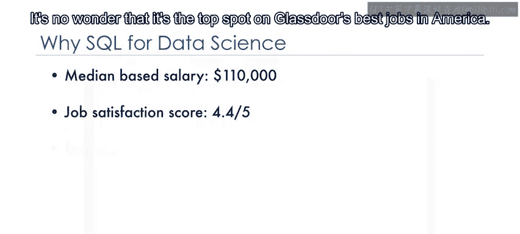

## 数据科学家的市场需求与SQL的重要性 💼

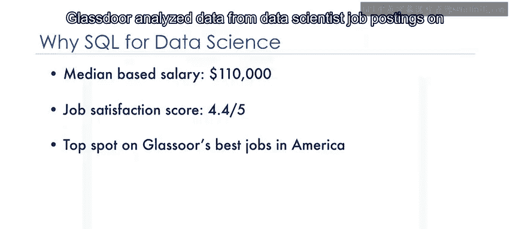

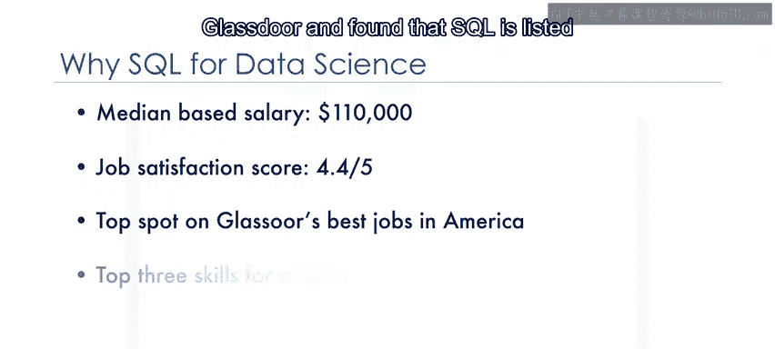

数据科学家的市场需求很高。根据数据，该职位的平均年薪为10万美元，工作满意度评分为4.4分（满分5分）。这使其成为Glassdoor评选的美国最佳职位榜首。

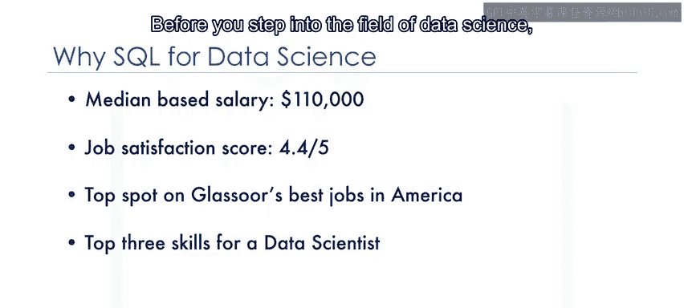

Glassdoor分析了其平台上的数据科学家招聘信息，发现SQL被列为数据科学家最需要的三大技能之一。

在踏入数据科学领域之前，掌握该领域的基础知识至关重要，这能让你在众多求职者中脱颖而出。

---

## 为什么学习SQL？ 🔍

SQL是你需要掌握的基础技能之一。它是一种用于与数据库通信的强大语言。任何处理数据的应用程序都需要将数据存储在某个地方，无论是大数据、政府或小型初创公司的简单表格，还是跨多个服务器的大型数据库，甚至是运行自身小型数据库的手机。

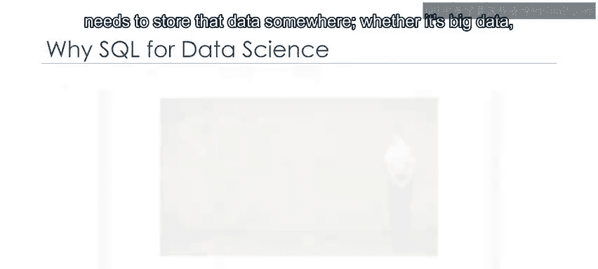

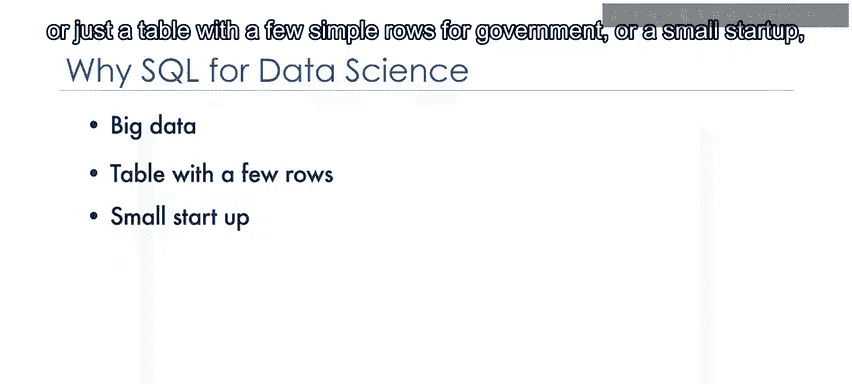

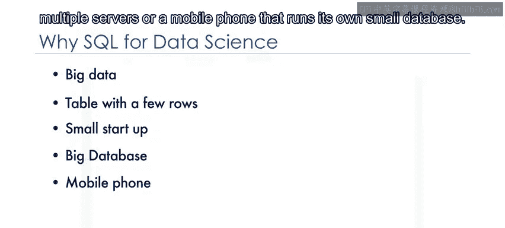

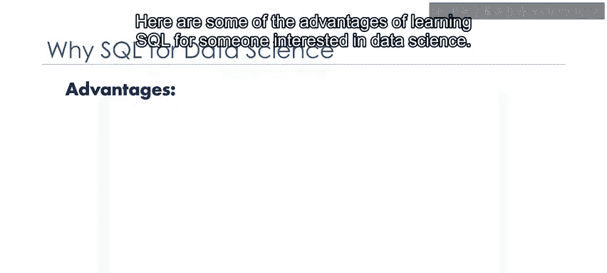

以下是对于有志于数据科学的人学习SQL的一些优势：

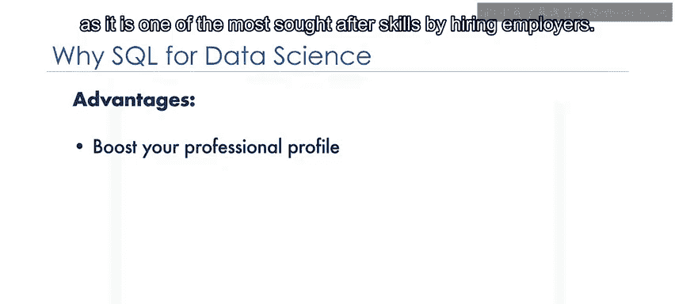

*   **提升专业形象**：SQL是雇主最渴求的技能之一，掌握它能显著提升你作为数据科学家的专业形象。
*   **理解关系数据库**：学习SQL能让你很好地理解关系数据库的工作原理。
*   **直接访问数据**：要利用所有这些信息，需要能够与存储数据的数据库进行通信。
*   **提高自主性**：即使你使用能自动生成SQL查询的报告工具，掌握编写自己的SQL语句也很有用，这样你就不必等待其他团队成员为你创建SQL语句。

---

## 本课程内容概览 📚

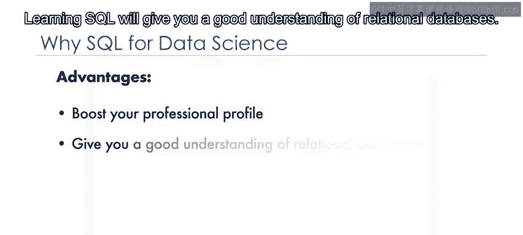

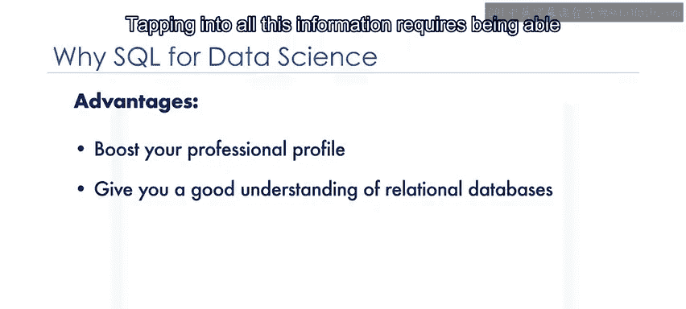

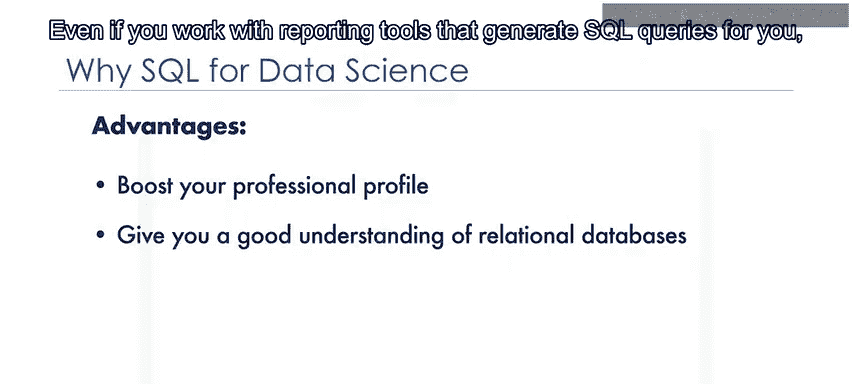

在本课程中，你将学习SQL语言和关系数据库的基础知识。课程包含有趣的测验和动手实验作业，让你获得使用数据库的实际经验。

在前几个模块中，你将直接操作数据库，并逐步掌握SQL的实用知识。

上一节我们介绍了SQL的基础概念，本节中我们来看看如何像数据科学家一样应用它。

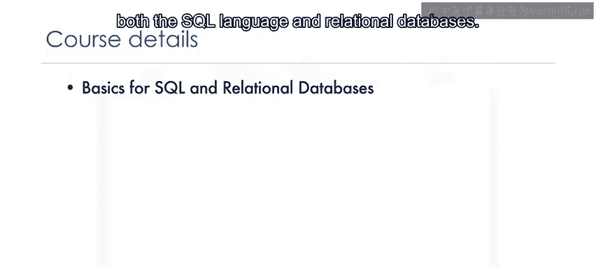

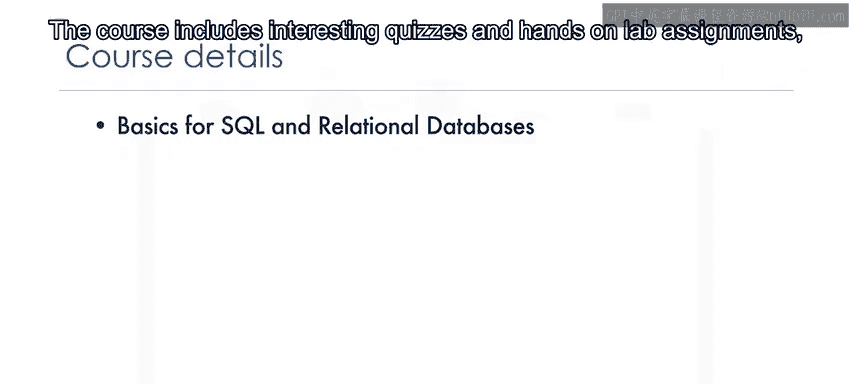

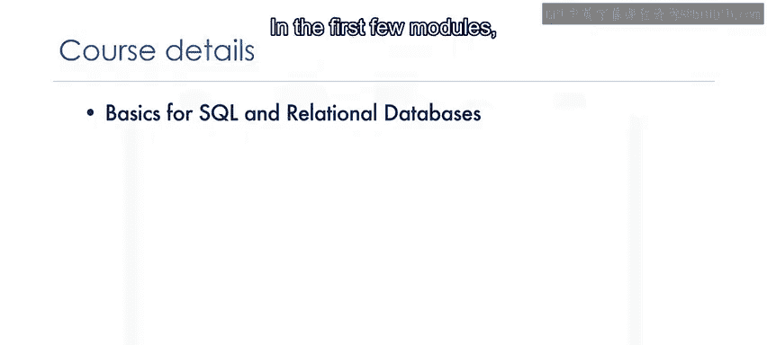

接着，你将学习如何连接数据库并运行SQL查询，就像数据科学家通常所做的那样。在这个过程中，你将使用Python和Jupyter Notebooks来连接关系数据库，以访问和分析数据。

---

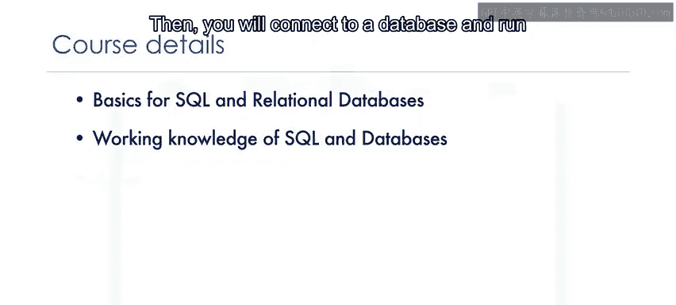

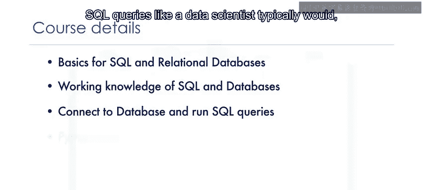

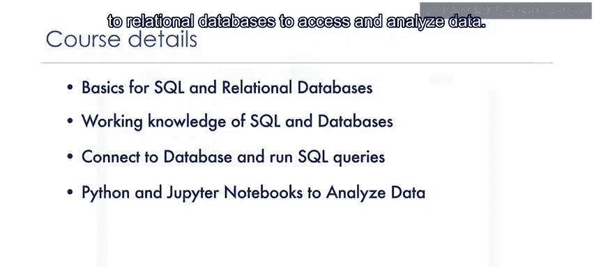

## 课程实践与总结 🎯

课程接近尾声时，还包含一项作业，你将有机会应用所学的概念。

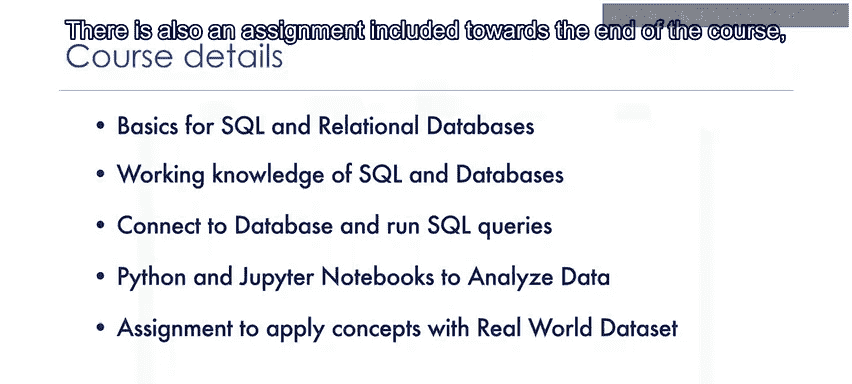

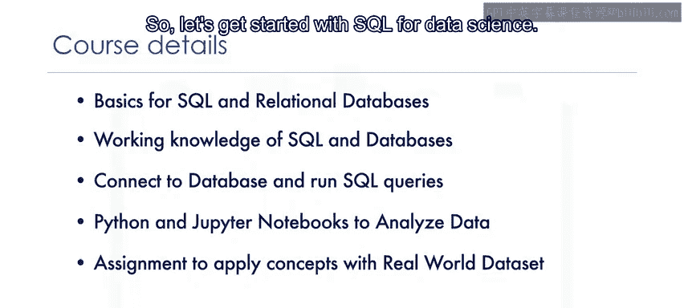

本节课中我们一起学习了SQL在数据科学中的核心地位、学习SQL的多重优势以及本课程的基本结构和学习路径。现在，让我们开始数据科学SQL的学习之旅。