# 003：使用SELECT语句检索数据

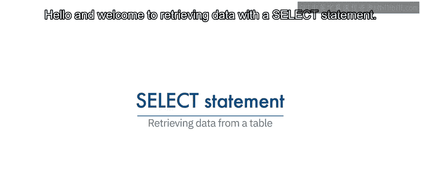

在本节课中，我们将学习如何从关系数据库表中检索数据，具体是通过选择表中的列来实现。课程结束时，你将能够：从关系数据库表中检索数据、定义谓词的用途、识别使用WHERE子句的SELECT语句语法，并列举关系数据库管理系统支持的比较运算符。

---

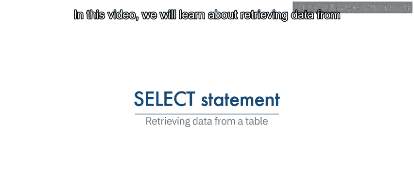

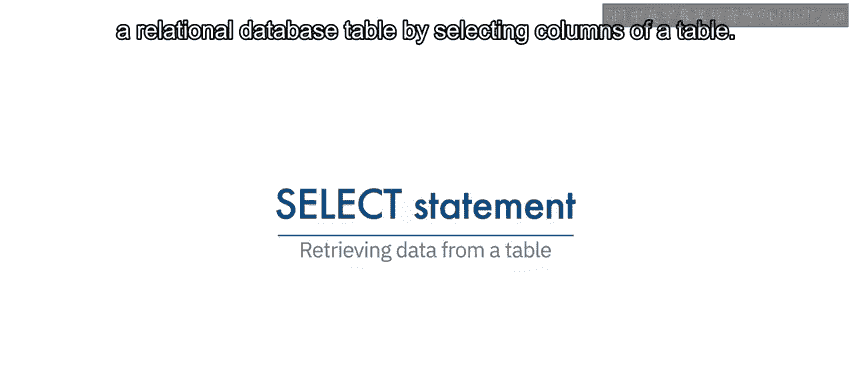

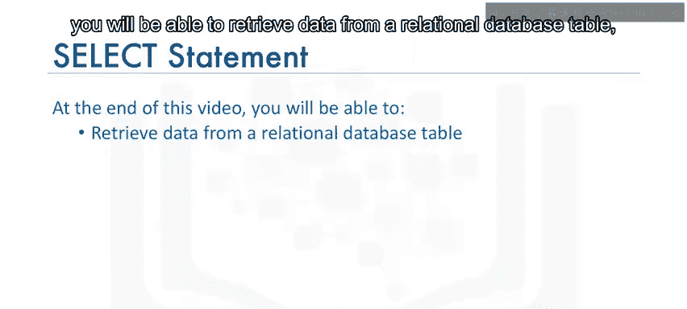

数据库管理系统的主要目的不仅是存储数据，还要便于数据的检索。

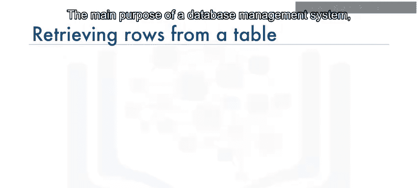

在创建了关系数据库表并向表中插入数据之后，我们通常需要查看这些数据。

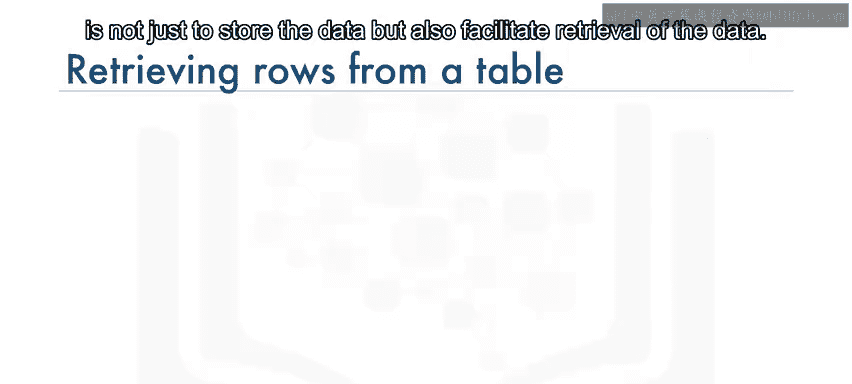

为了查看数据，我们使用SELECT语句。

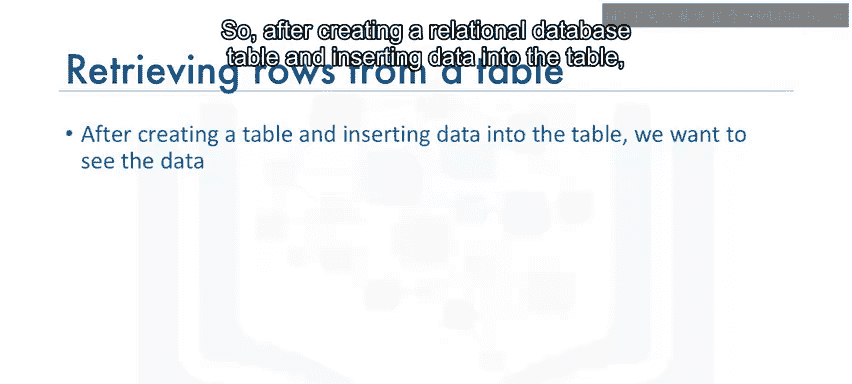

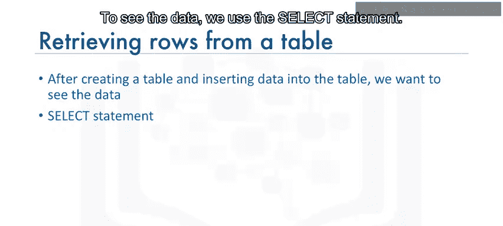

SELECT语句是一种数据操作语言（DML）语句。数据操作语言语句用于读取和修改数据。SELECT语句通常被称为查询，执行此查询得到的输出称为结果集或结果表。

SELECT语句最简单的形式是：`SELECT * FROM table_name`。

以“图书”实体为例，我们会使用实体名称“book”和实体属性作为表的列来创建表。数据通过INSERT语句作为行添加到book表中。在图书实体示例中，执行`SELECT * FROM book`会得到一个包含四行的结果集，显示表`book`中所有列的所有数据行。

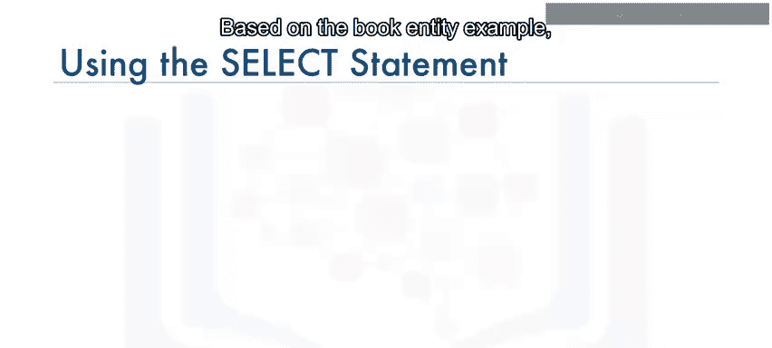

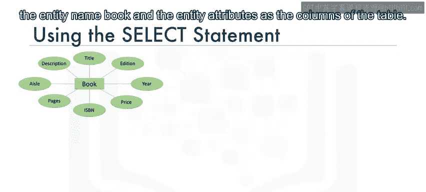

此外，你也可以通过在SELECT语句中单独指定列名来检索所有行的所有列。

你并不总是需要检索表中的所有列。你可以只检索列的一个子集。例如，你可以只从`book`表中检索两列：`book_id`和`title`。

在这种情况下，SELECT语句是：`SELECT book_id, title FROM book`。此时，四行中的每一行只显示这两列。同时请注意，显示的列顺序始终与SELECT语句中指定的顺序一致。

---

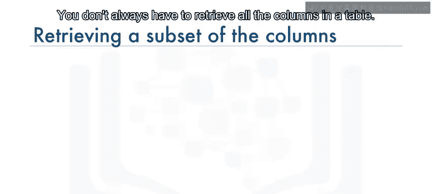

然而，如果我们想知道`book_id`为“B1”的图书的标题，该怎么办呢？

关系操作通过允许我们使用WHERE子句来帮助我们限制结果集。WHERE子句总是需要一个谓词。谓词是一个计算结果为真、假或未知的条件。谓词用在WHERE子句的搜索条件中。

因此，如果我们需要知道`book_id`为“B1”的图书标题，我们使用WHERE子句和谓词`book_id = ‘B1’`。

语句如下：`SELECT book_id, title FROM book WHERE book_id = ‘B1’`。

请注意，现在结果集被限制为仅有一行，即条件评估为真的那一行。

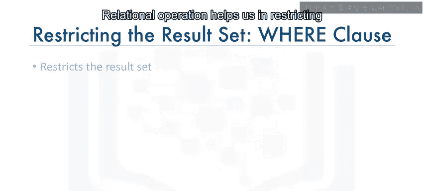

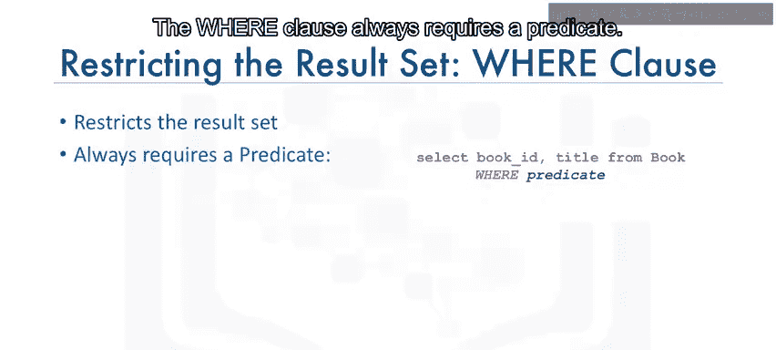

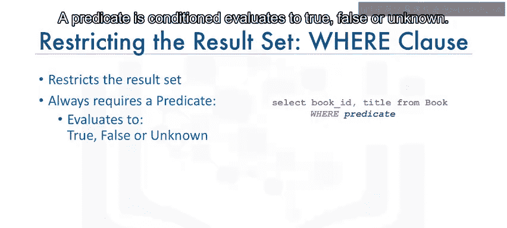

前面的示例在WHERE子句中使用了比较运算符“等于”。

---

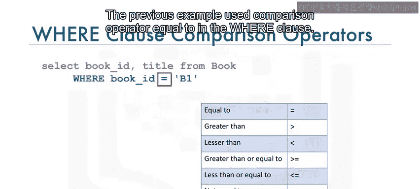

关系数据库管理系统还支持其他比较运算符。

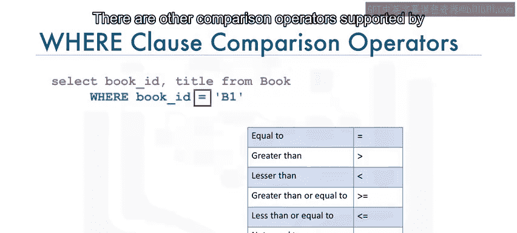

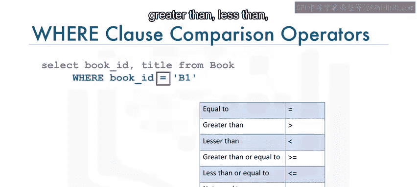

以下是关系数据库管理系统支持的主要比较运算符列表：
*   `=` 等于
*   `>` 大于
*   `<` 小于
*   `>=` 大于或等于
*   `<=` 小于或等于
*   `<>` 或 `!=` 不等于

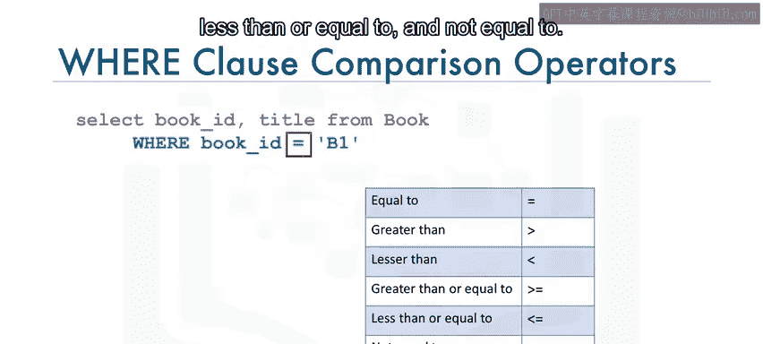

---

现在，你已经能够从关系数据库表中检索数据和选择列，定义了谓词的用途，识别了使用WHERE子句的SELECT语句语法，并列举了关系数据库管理系统支持的比较运算符。

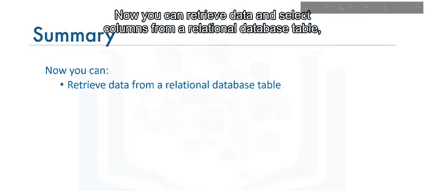

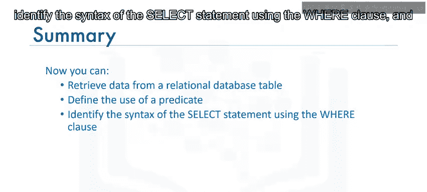

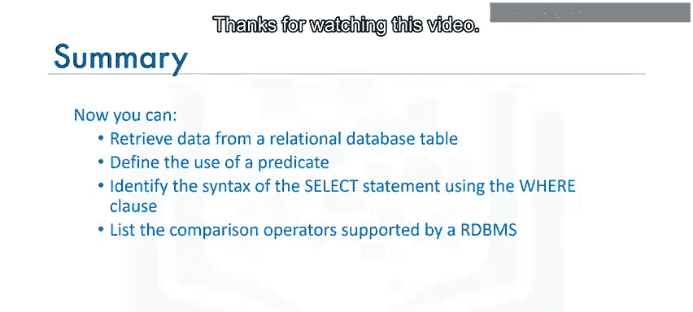

在本节课中，我们一起学习了使用SELECT语句从数据库检索数据的基础知识，包括选择特定列、使用WHERE子句和谓词进行条件过滤，以及常用的比较运算符。这些是进行数据查询和操作的核心技能。