# 004：COUNT、DISTINCT与LIMIT

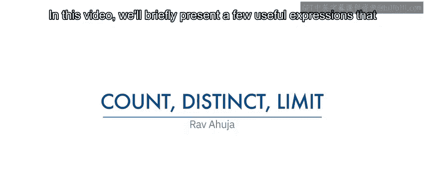


在本节课中，我们将学习三个与`SELECT`语句结合使用的实用表达式：`COUNT`、`DISTINCT`和`LIMIT`。这些功能对于数据汇总、去重和结果集控制至关重要。

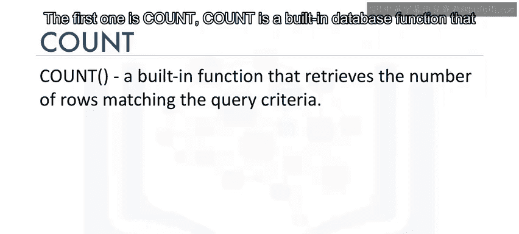

## 🧮 1. COUNT函数：统计行数

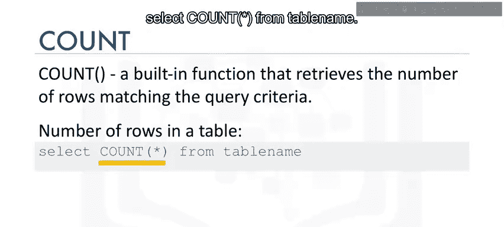

上一节我们介绍了基础的`SELECT`查询。本节中，我们首先来看看`COUNT`函数。`COUNT`是一个内置的数据库函数，用于检索符合查询条件的行数。

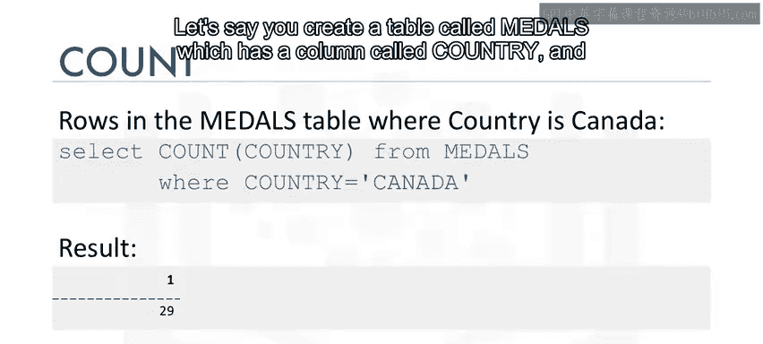

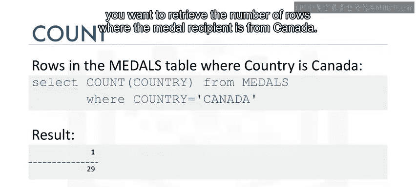

其基本语法公式如下：
```sql
SELECT COUNT(*) FROM table_name;
```

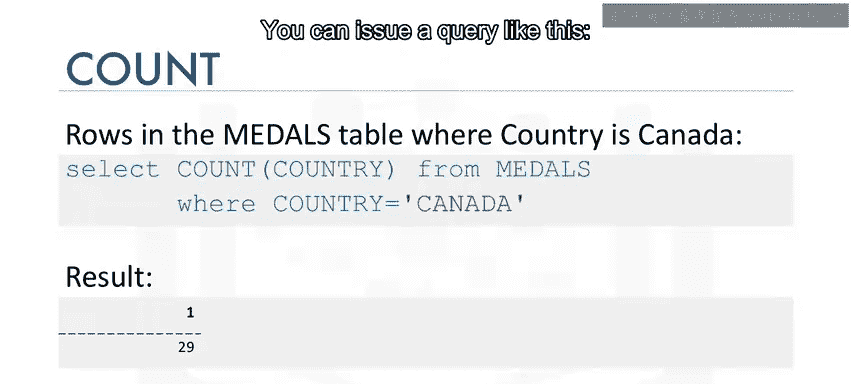

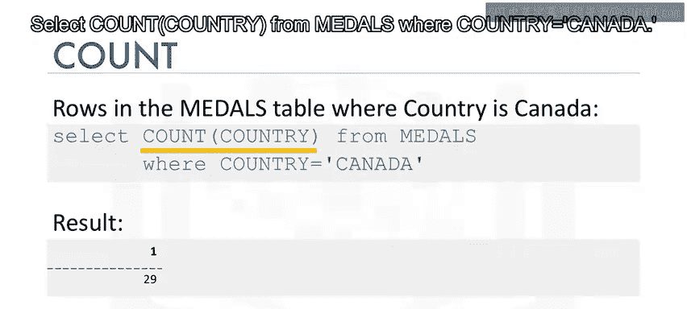

例如，要获取一个名为`Meals`的表中，`country`列值为“Canada”的行数，可以使用以下查询：
```sql
SELECT COUNT(*) FROM medals WHERE country = 'Canada';
```

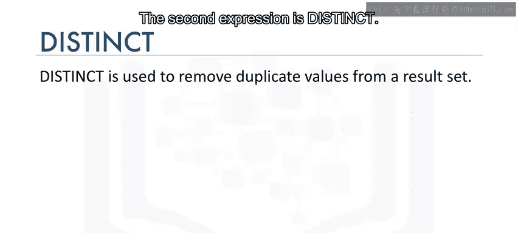

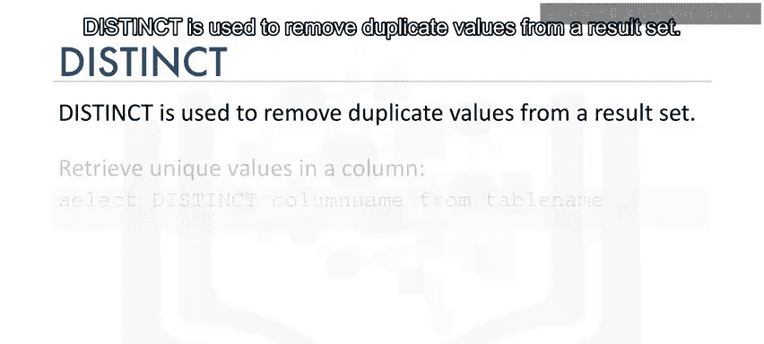

## 🔍 2. DISTINCT关键字：获取唯一值

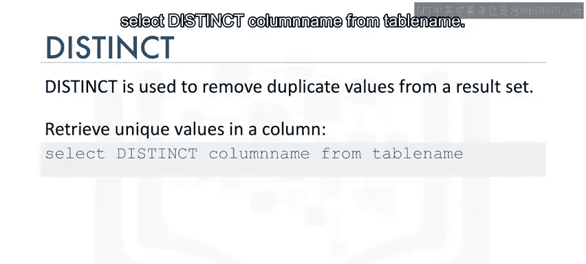

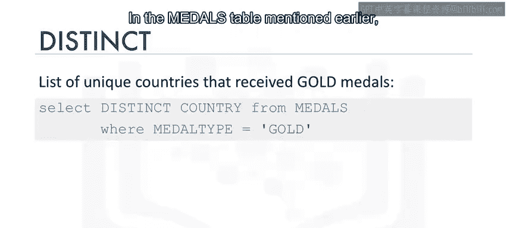

了解了如何计数后，我们来看看如何从结果集中移除重复值。`DISTINCT`关键字用于从结果集中删除重复值，从而获取列中的唯一值列表。

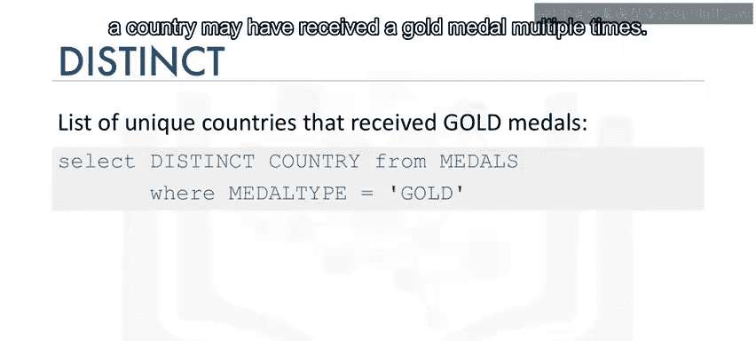

其基本语法公式如下：
```sql
SELECT DISTINCT column_name FROM table_name;
```

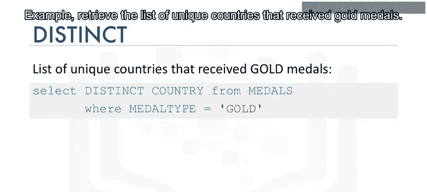

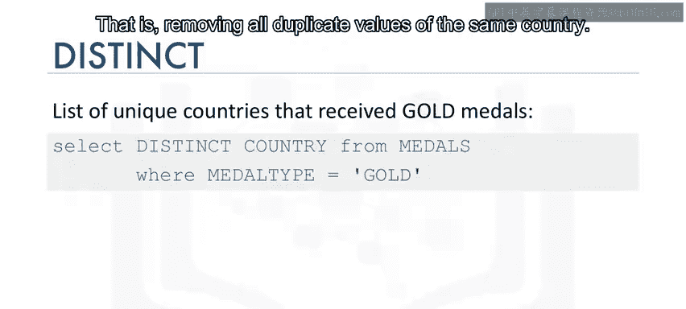

以下是`DISTINCT`的一个典型应用场景：
在之前提到的`medals`表中，一个国家可能多次获得金牌。如果我们想获取所有获得过金牌的唯一国家列表（即去除同一国家的重复记录），可以使用以下查询：
```sql
SELECT DISTINCT country FROM medals WHERE medal_type = 'gold';
```

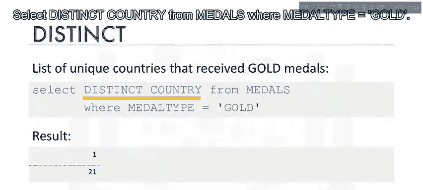

## ⏹️ 3. LIMIT子句：限制返回行数

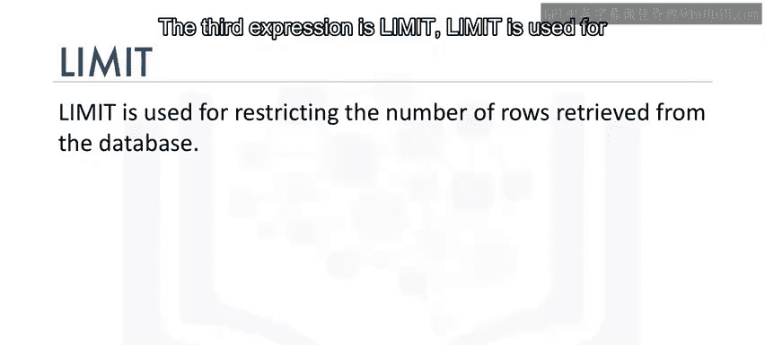

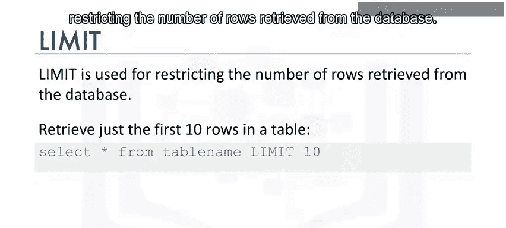

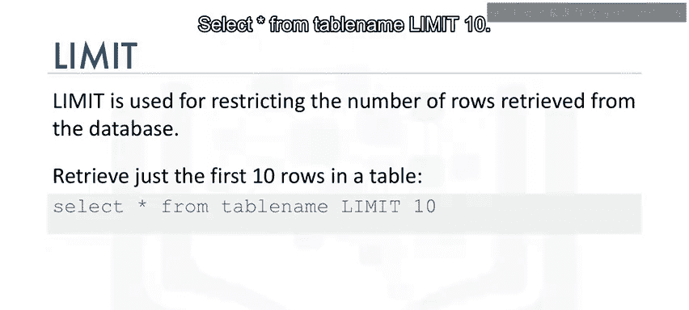

最后，我们来学习如何控制返回的数据量。`LIMIT`子句用于限制从数据库检索的行数。

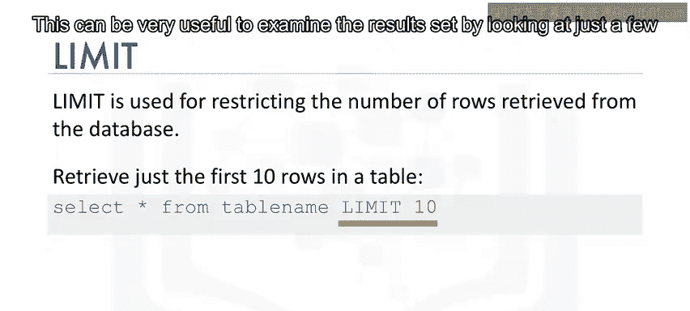

其基本语法公式如下：
```sql
SELECT * FROM table_name LIMIT number;
```

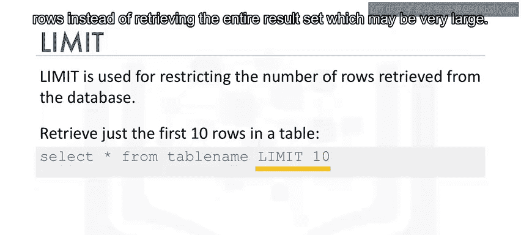


这在初步检查数据时非常有用，可以避免检索可能非常庞大的整个结果集。例如，仅查看`medals`表中2018年的前5条记录：
```sql
SELECT * FROM medals WHERE year = 2018 LIMIT 5;
```

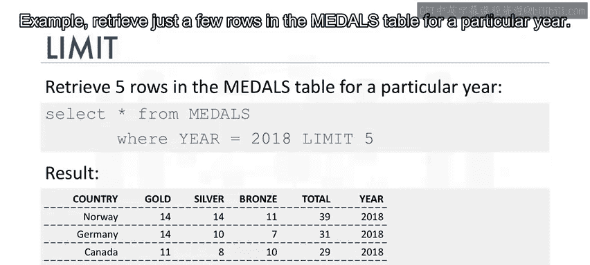

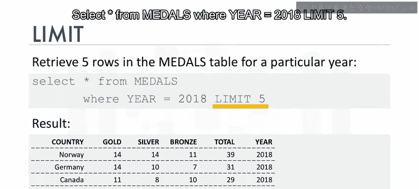

## 📝 总结

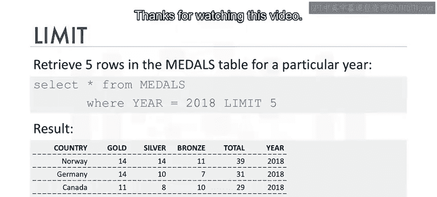

本节课中，我们一起学习了三个与`SELECT`语句结合使用的核心表达式：用于统计行数的`COUNT`函数、用于获取唯一值的`DISTINCT`关键字，以及用于限制返回行数的`LIMIT`子句。掌握这些功能将帮助你更高效地进行数据查询和分析。