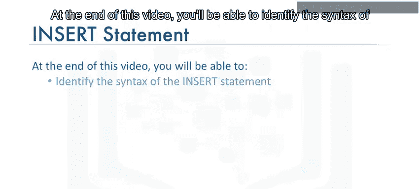
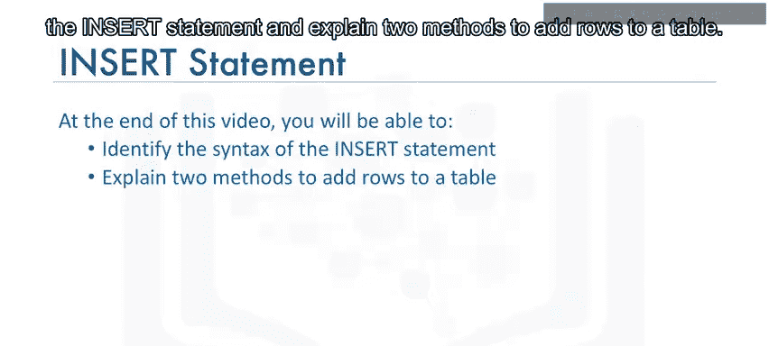
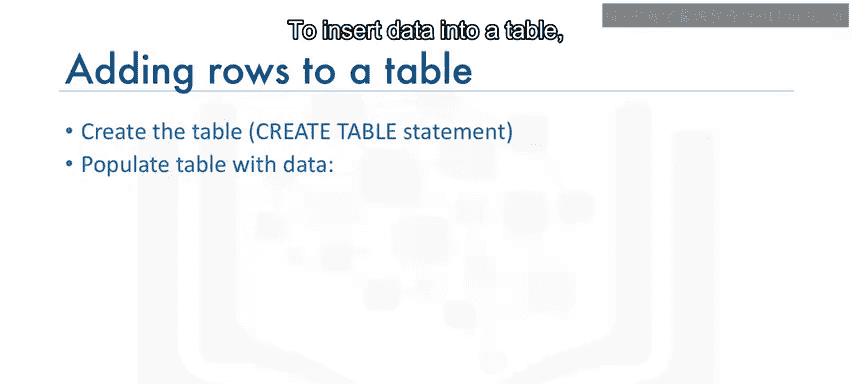
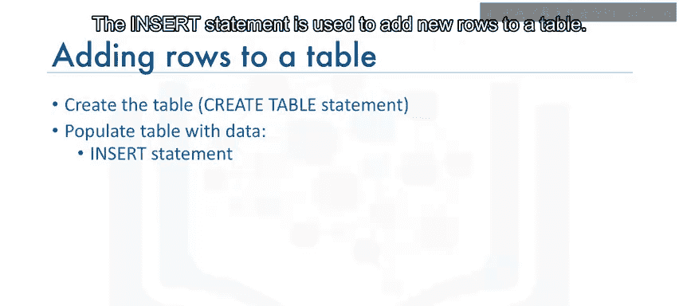
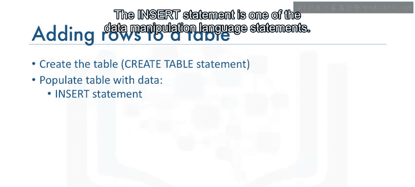
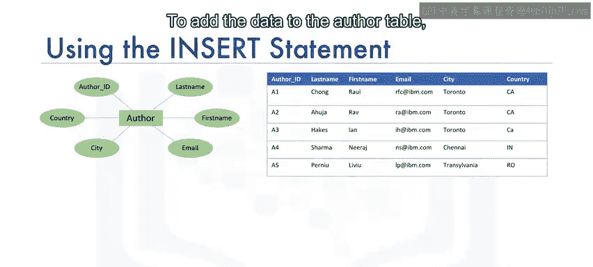
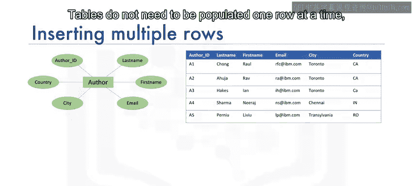
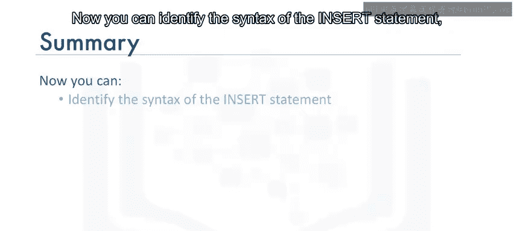
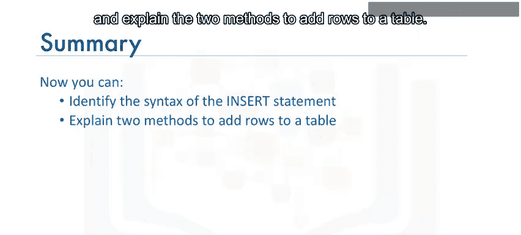
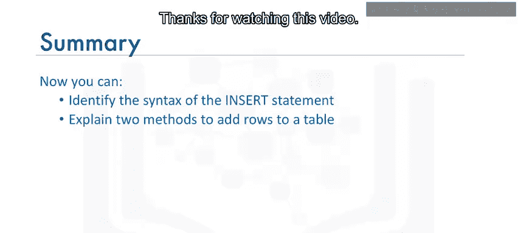

# 005：插入语句详解


在本节课中，我们将学习如何向关系数据库表中填充数据，即使用 `INSERT` 语句。课程结束时，你将能够识别 `INSERT` 语句的语法，并解释向表中添加数据的两种方法。

---


## 🗂️ 插入语句简介





上一节我们介绍了如何创建表。表创建完成后，需要向其中填充数据。向表中插入数据，我们使用 `INSERT` 语句。

`INSERT` 语句用于向表中添加新的数据行。它属于数据操作语言（Data Manipulation Language，简称 DML）语句。DML 语句主要用于读取和修改数据。

---

## 📝 INSERT 语句语法



基于之前创建的作者实体示例，我们使用实体名 `author` 及其属性作为表的列创建了 `author` 表。现在，我们将通过向表中添加行来填充数据。





向 `author` 表添加数据，我们使用 `INSERT`` 语句。其基本语法如下：

```sql
INSERT INTO table_name (column1, column2, column3, ...)
VALUES (value1, value2, value3, ...);
```

在这个语句中：
*   `table_name` 指定目标表。
*   `column_name list` 列出表中的每一列。
*   `VALUES` 子句指定要添加到表中各列的数据值。

---



## 🔧 插入单行数据

为了添加一行关于 Raoul Chong 的数据，我们插入一行数据，其中 `author_id` 为 `A1`，`last_name` 为 `Chong`，`first_name` 为 `Raoul`，`email` 为 `rfc@ibm.com`，`city` 为 `Toronto`，`country` 为 `CA`（代表加拿大）。

`author` 表有六列，因此 `INSERT` 语句列出了六个用逗号分隔的列名，随后是为每列提供的、同样用逗号分隔的值。

**关键点**：`VALUES` 子句中提供的值的数量必须与列名列表中指定的列数相等。这确保了每一列都有一个对应的值。

以下是插入单行数据的示例：

```sql
INSERT INTO author (author_id, last_name, first_name, email, city, country)
VALUES ('A1', 'Chong', 'Raoul', 'rfc@ibm.com', 'Toronto', 'CA');
```

---

## 🔄 插入多行数据

表不需要一次只填充一行。通过在 `VALUES` 子句中指定每一行，可以一次性插入多行数据。在 `VALUES` 子句中，每一行数据用逗号分隔。

以下是同时插入两行数据的示例：



```sql
INSERT INTO author (author_id, last_name, first_name, email, city, country)
VALUES
    ('A1', 'Chong', 'Raoul', 'rfc@ibm.com', 'Toronto', 'CA'),
    ('A2', 'Ahuja', 'Rav', 'ra@ibm.com', 'Toronto', 'CA');
```

---

## ✅ 课程总结





本节课我们一起学习了 `INSERT` 语句。你现在应该能够：
1.  识别 `INSERT INTO table_name (columns) VALUES (values);` 的基本语法。
2.  解释向数据库表添加数据的两种方法：**一次插入单行数据**，或**一次插入多行数据**。



掌握 `INSERT` 语句是操作和管理数据库内容的基础。