# 006：更新与删除语句 📝

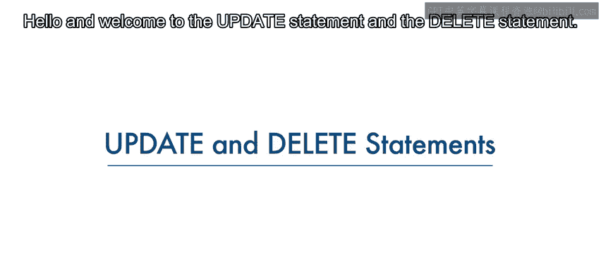

在本节课中，我们将学习如何在关系数据库表中修改和删除数据。课程结束后，你将能够识别UPDATE语句和DELETE语句的语法，并理解WHERE子句在这些语句中的重要性。

---

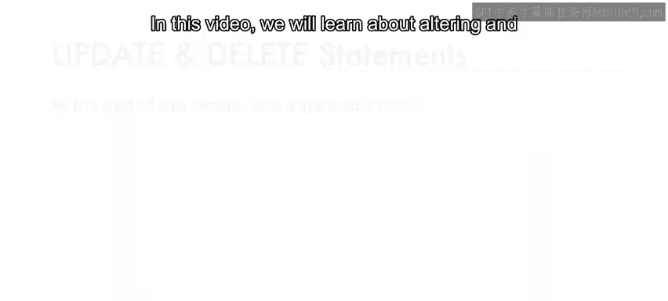

## 更新数据：UPDATE语句

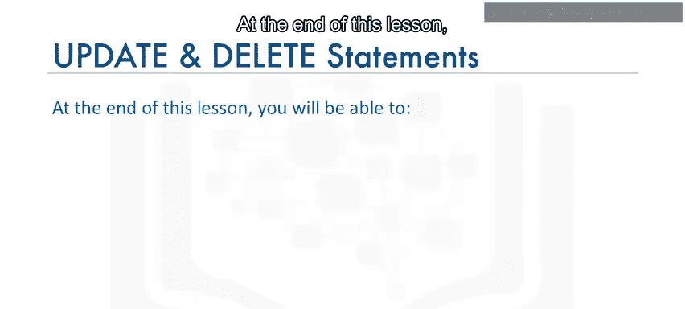

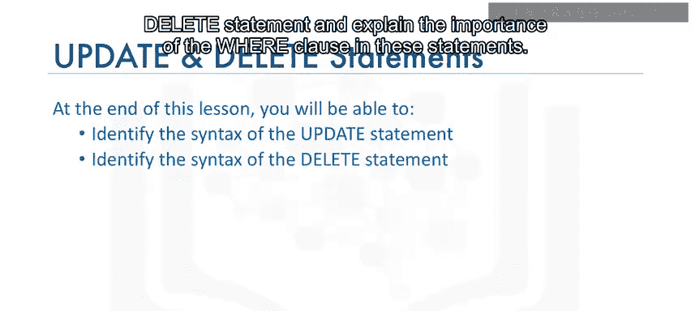


创建表并填充数据后，可以使用UPDATE语句修改表中的数据。UPDATE语句是数据操作语言（DML）语句之一，用于读取和修改数据。

基于作者实体示例，我们使用实体名称“author”和实体属性作为表的列创建了表。随后向作者表添加行以填充数据。一段时间后，你可能需要修改表中的数据。要修改作者表中的数据，我们使用UPDATE语句。

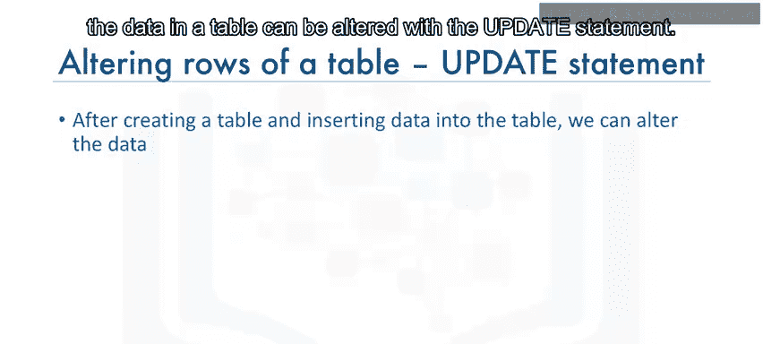

UPDATE语句的语法如下：

```sql
UPDATE table_name
SET column_name = value
WHERE condition;
```

在这个语句中，`table_name` 标识目标表，`column_name` 标识要更改的列，`value` 是要设置的新值，`WHERE condition` 指定哪些行需要更新。

### 示例：更新作者姓名

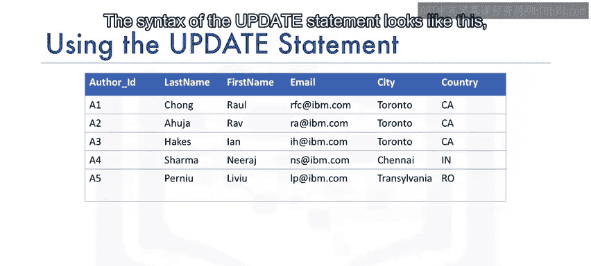

假设需要将作者ID为A2的作者姓名从“Raav Ahuja”更改为“Lakshmi Kata”。以下是操作步骤：


首先，查看更新前的所有行：

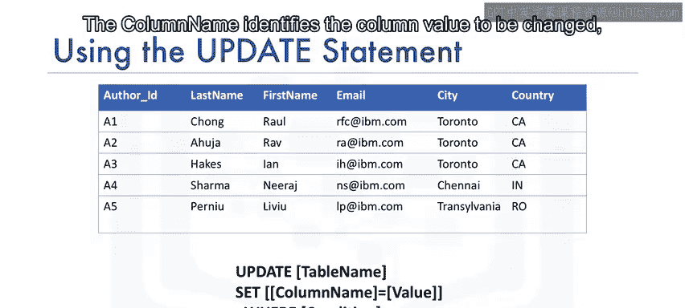

```sql
SELECT * FROM author;
```

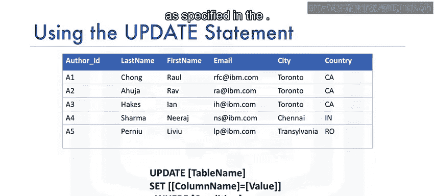

然后，执行UPDATE语句：

```sql
UPDATE author
SET last_name = 'Kata', first_name = 'Lakshmi'
WHERE author_id = 'A2';
```

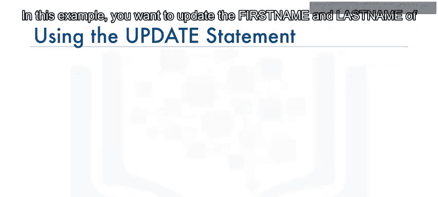

更新后，再次查看所有行以确认更改：

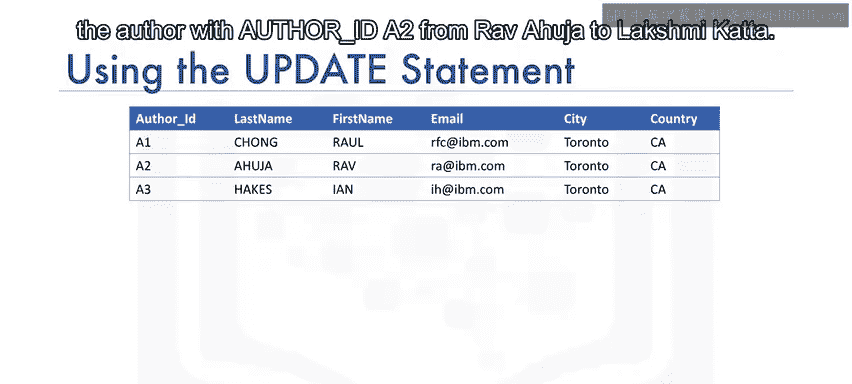

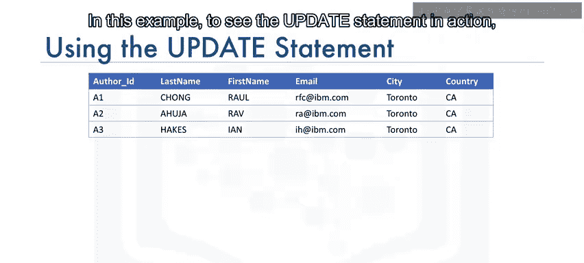

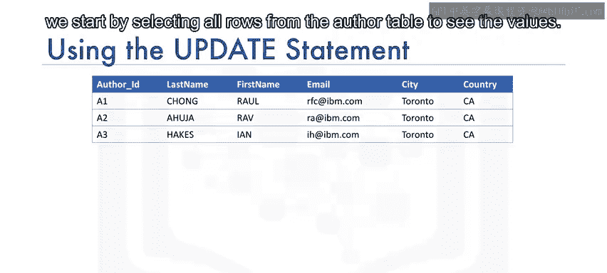

```sql
SELECT * FROM author;
```

你将看到第二行的姓名已从“Raav Ahuja”更改为“Lakshmi Kata”。

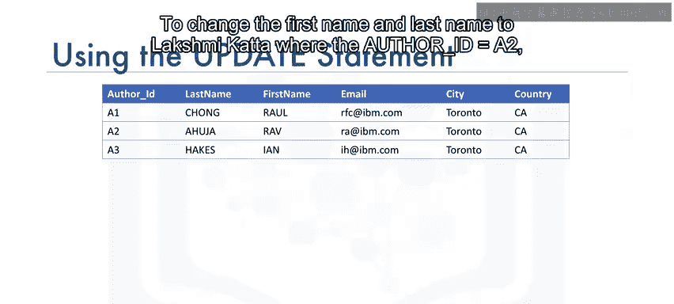

**重要提示**：如果不指定WHERE子句，表中的所有行都将被更新。例如，省略WHERE子句会导致所有作者姓名都被更改为“Lakshmi Kata”。

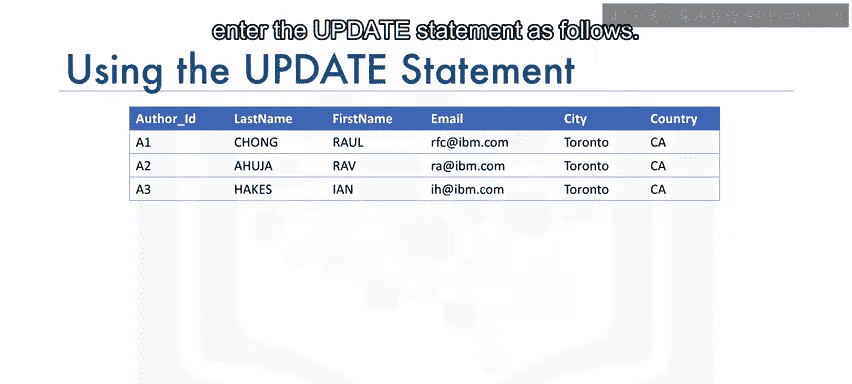

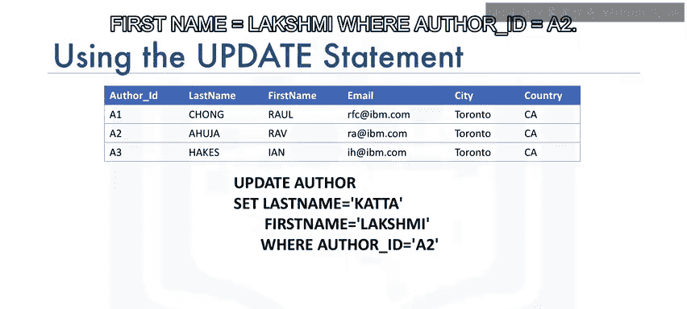

---

## 删除数据：DELETE语句

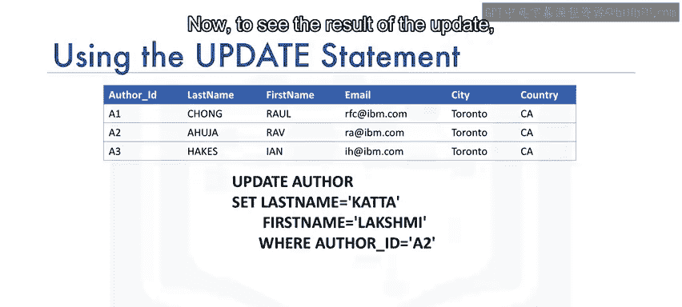


有时可能需要从表中删除一行或多行数据。DELETE语句用于删除行，它也是数据操作语言（DML）语句，用于读取和修改数据。

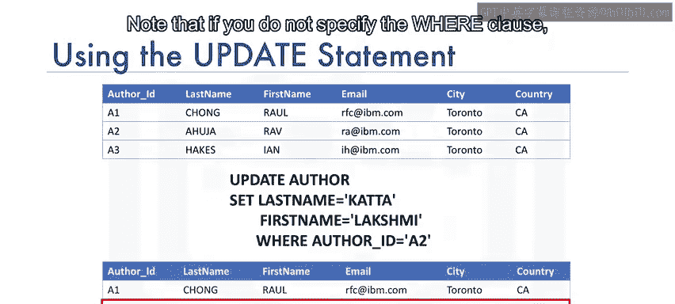

DELETE语句的语法如下：

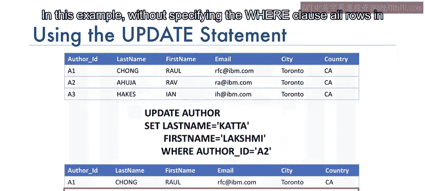

```sql
DELETE FROM table_name
WHERE condition;
```

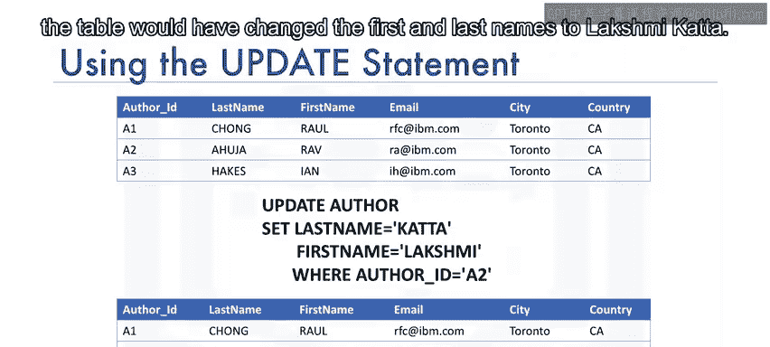

要删除的行由WHERE条件指定。

### 示例：删除特定作者

基于作者实体示例，假设需要删除作者ID为A2和A3的行。以下是操作步骤：

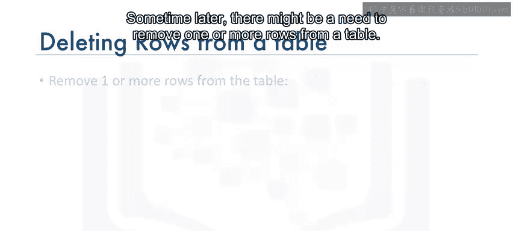

执行DELETE语句：

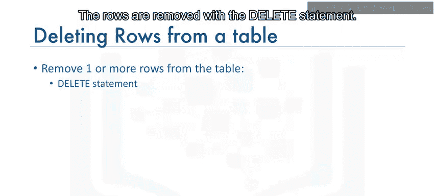

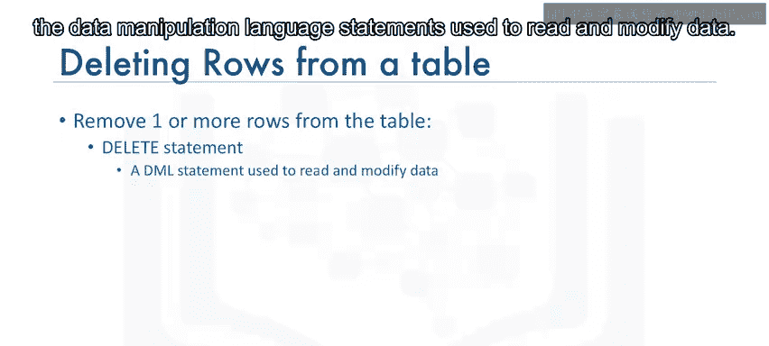

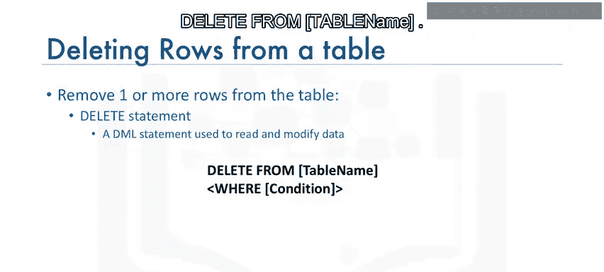

```sql
DELETE FROM author
WHERE author_id IN ('A2', 'A3');
```

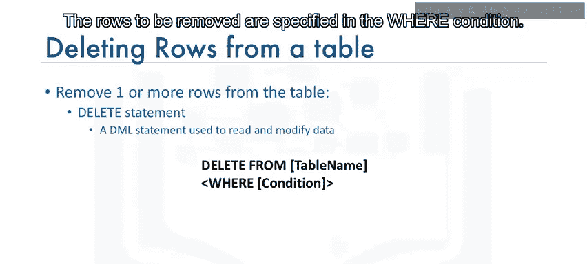

**重要提示**：如果不指定WHERE子句，表中的所有行都将被删除。

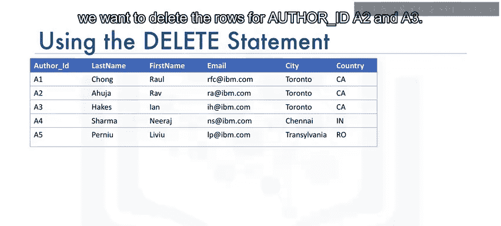

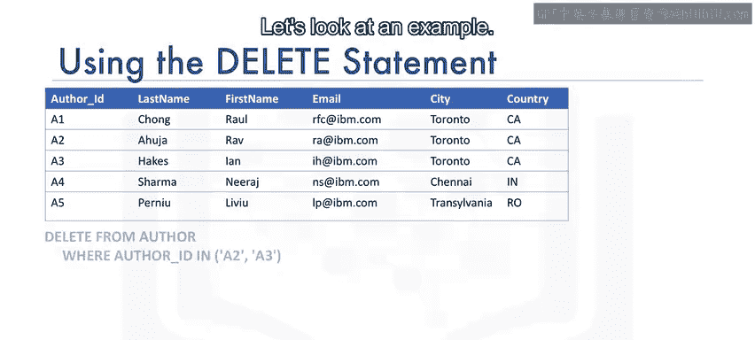

---

## 总结

本节课中，我们一起学习了UPDATE语句和DELETE语句的语法及其应用。UPDATE语句用于修改现有数据，而DELETE语句用于删除数据。在这两个语句中，WHERE子句都至关重要，因为它指定了要更新或删除的具体行，避免了对整个表的意外操作。

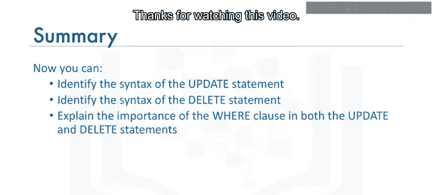

通过掌握这些语句，你将能够有效地管理和维护数据库中的数据。