# 008：SQL语句类型 - DDL与DML 🗂️


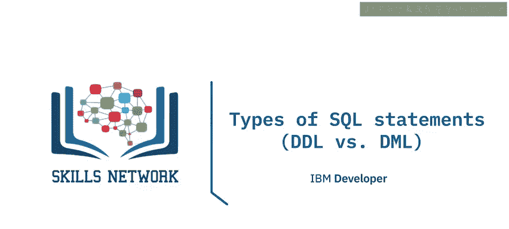

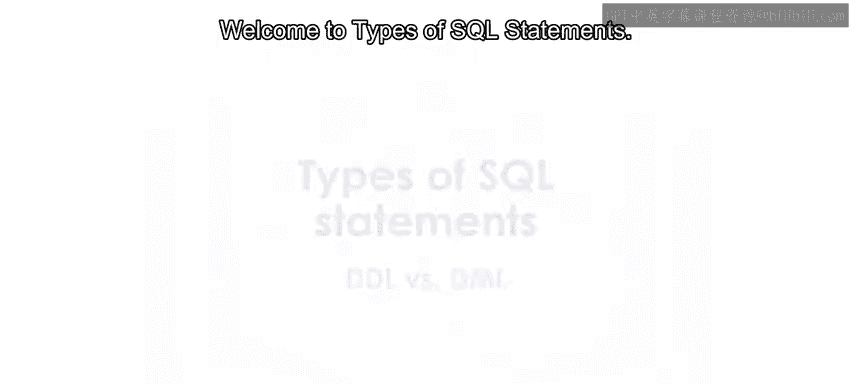

在本节课中，我们将学习SQL语句的两种主要类型：数据定义语言（DDL）和数据操作语言（DML）。我们将了解它们各自的作用、常见的语句类型以及它们之间的区别。

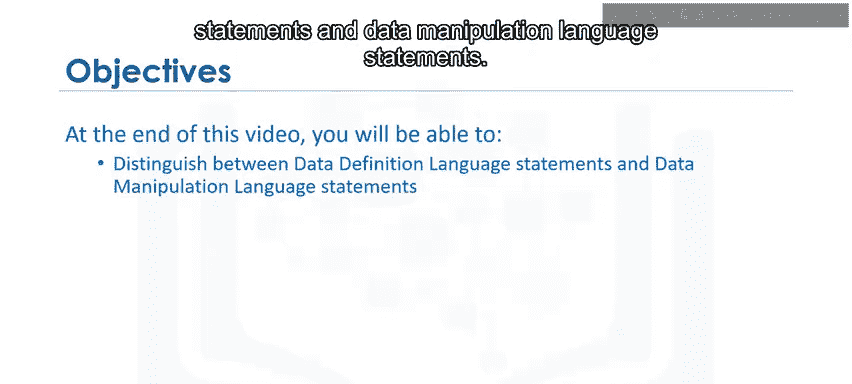

---

SQL语句用于与关系型数据库中的实体（如表）、属性（即列）及其包含数据值的元组（即行）进行交互。

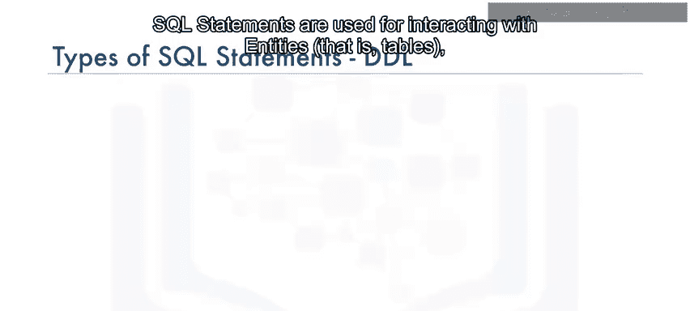

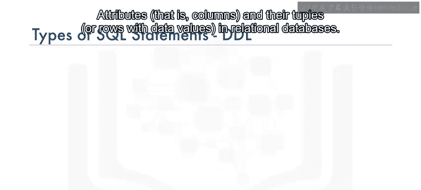

SQL语句主要分为两大类：**数据定义语言（DDL）** 语句和**数据操作语言（DML）** 语句。


---


## 🏗️ 数据定义语言（DDL）


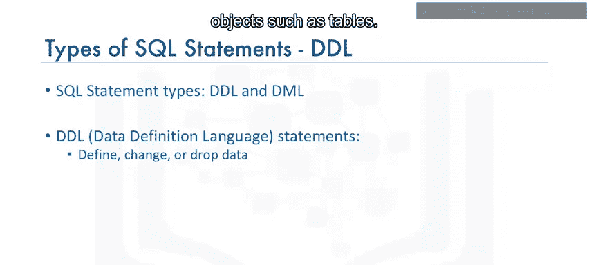

上一节我们介绍了SQL语句的分类，本节中我们来看看数据定义语言（DDL）。


数据定义语言（DDL）语句用于定义、更改或删除数据库对象，例如表。

以下是常见的DDL语句类型：

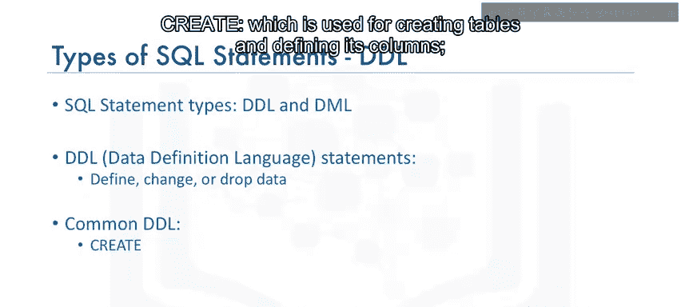

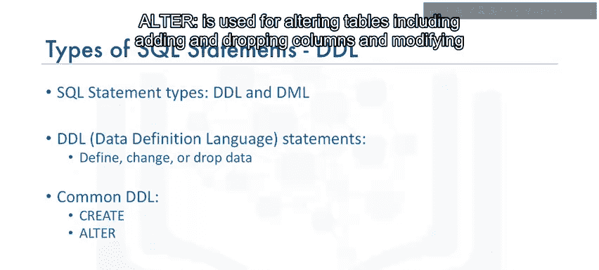

*   **`CREATE`**：用于创建表并定义其列。
    ```sql
    CREATE TABLE 表名 (
        列名1 数据类型,
        列名2 数据类型,
        ...
    );
    ```
*   **`ALTER`**：用于修改表结构，包括添加和删除列，以及修改列的数据类型。
    ```sql
    ALTER TABLE 表名 ADD 列名 数据类型;
    ALTER TABLE 表名 DROP COLUMN 列名;
    ```
*   **`TRUNCATE`**：用于删除表中的所有数据，但保留表本身的结构。
    ```sql
    TRUNCATE TABLE 表名;
    ```
*   **`DROP`**：用于删除整个表。
    ```sql
    DROP TABLE 表名;
    ```

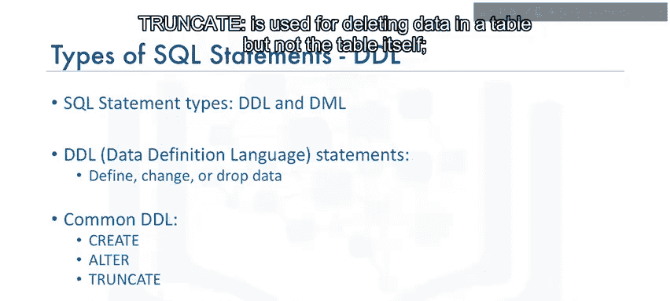

---

## 🔧 数据操作语言（DML）

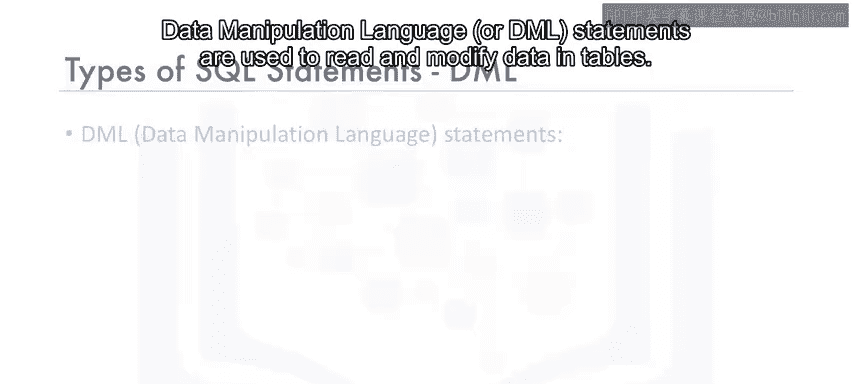

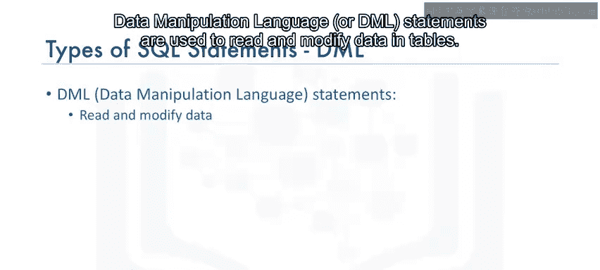


了解了如何定义和修改数据库结构后，本节我们来看看如何操作表中的数据。


数据操作语言（DML）语句用于读取和修改表中的数据。这些操作有时也被称为**CRUD操作**，即对表中的行进行**创建（Create）、读取（Read）、更新（Update）和删除（Delete）**。

以下是常见的DML语句类型：

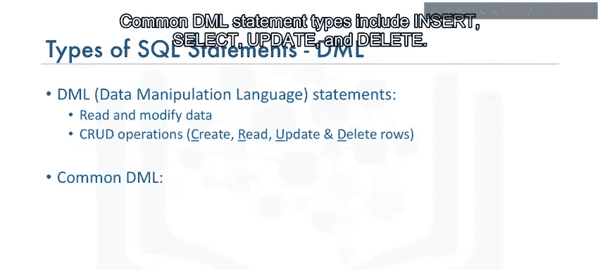

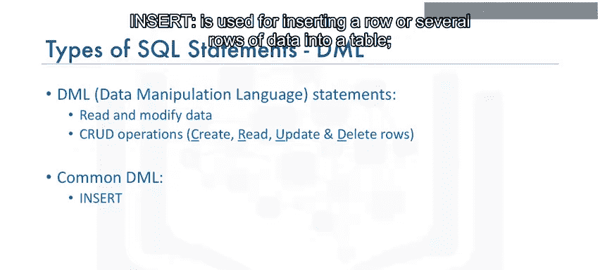

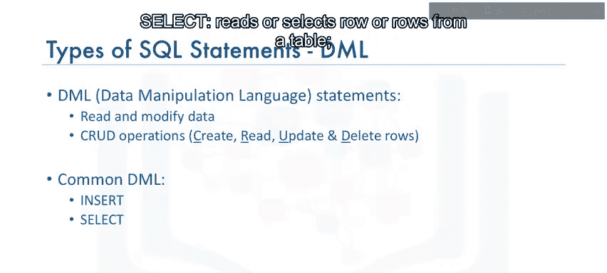

*   **`INSERT`**：用于向表中插入一行或多行数据。
    ```sql
    INSERT INTO 表名 (列1, 列2) VALUES (值1, 值2);
    ```
*   **`SELECT`**：用于从表中读取或选择一行或多行数据。
    ```sql
    SELECT 列1, 列2 FROM 表名 WHERE 条件;
    ```
*   **`UPDATE`**：用于编辑表中的一行或多行数据。
    ```sql
    UPDATE 表名 SET 列1 = 新值 WHERE 条件;
    ```
*   **`DELETE`**：用于从表中删除一行或多行数据。
    ```sql
    DELETE FROM 表名 WHERE 条件;
    ```

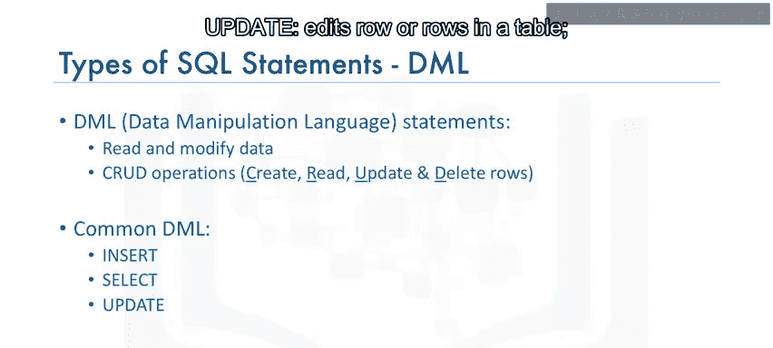

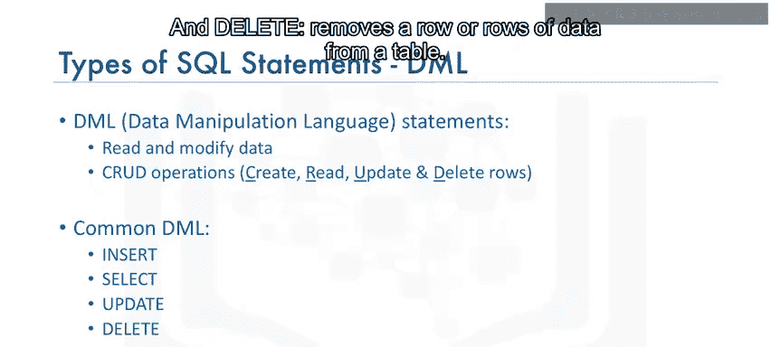

---

## 📝 总结

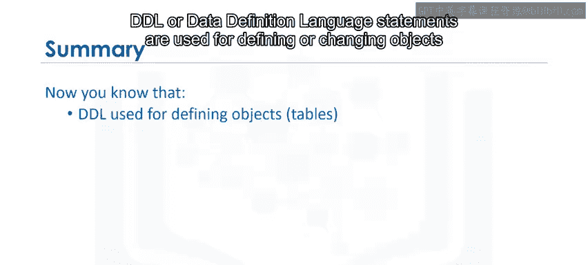

本节课中我们一起学习了SQL的两种核心语句类型。

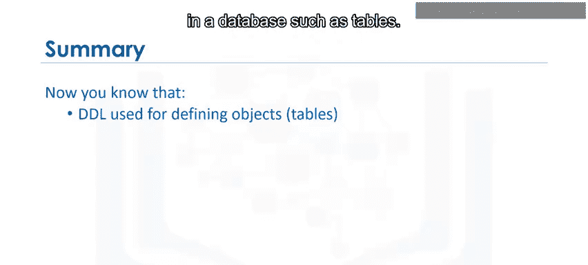


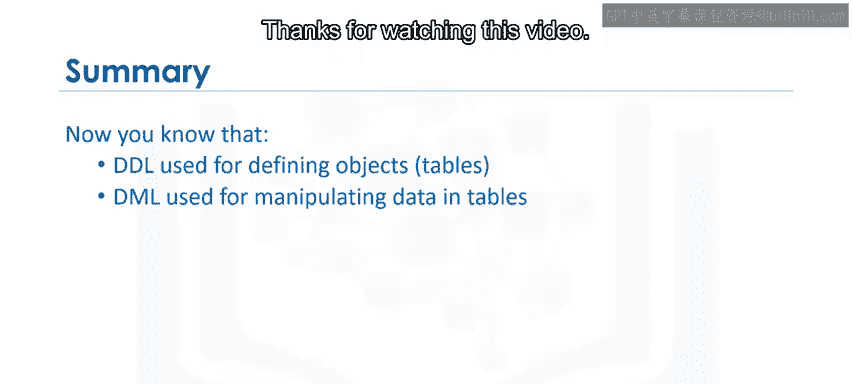

现在你知道了，**DDL（数据定义语言）** 语句用于定义或更改数据库中的对象（如表），而**DML（数据操作语言）** 语句用于操作或处理表中的数据。理解这两者的区别是有效使用SQL管理数据库的基础。