# 009：创建表语句


在本节课中，我们将学习如何使用SQL的`CREATE TABLE`语句来创建关系数据库表。你将了解如何将实体名称和属性转化为数据库中的表结构。

## 🏗️ CREATE TABLE 语句概述


`CREATE TABLE`是最常见的数据定义语言（DDL）语句之一。它的基本语法结构如下：

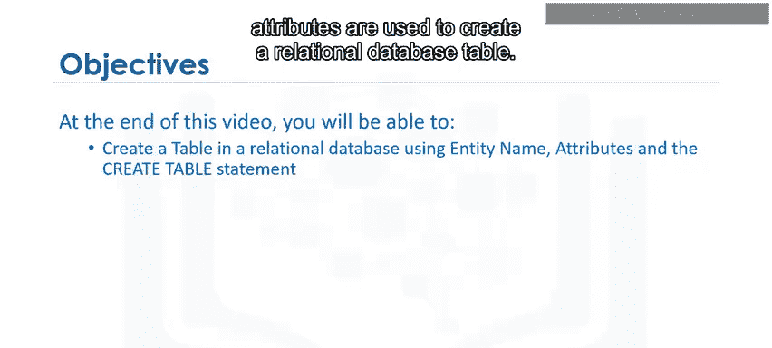


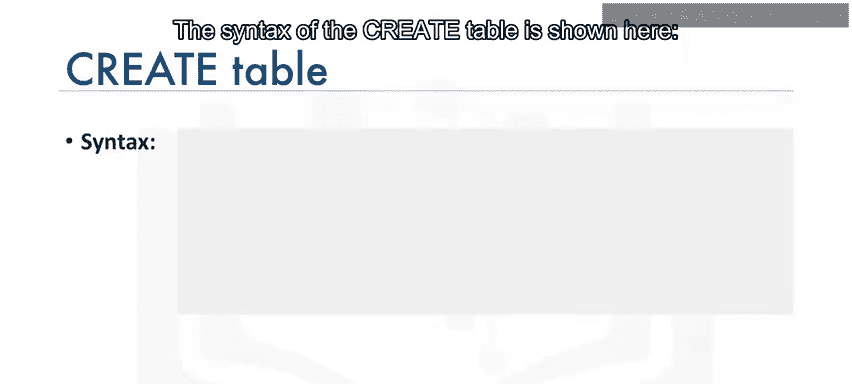

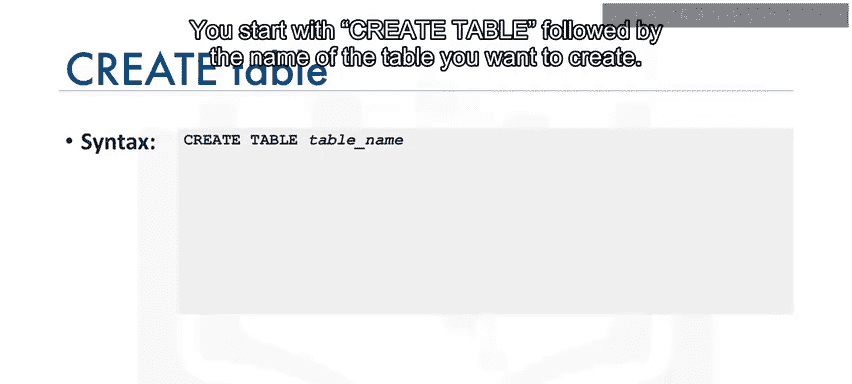

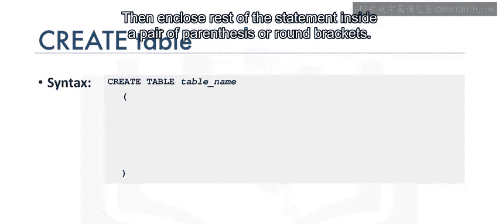

```sql
CREATE TABLE table_name (
    column1 datatype constraint,
    column2 datatype constraint,
    ...
);
```

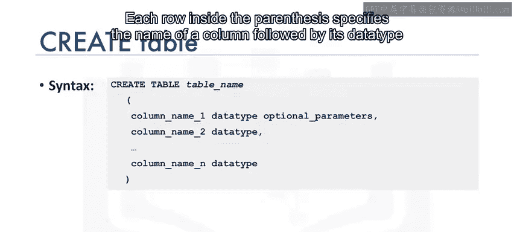

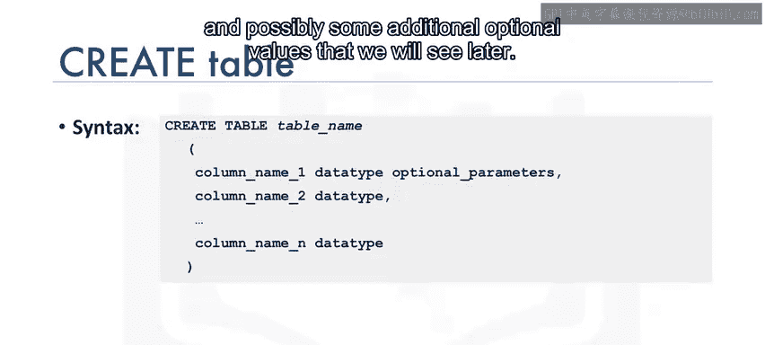


语句以`CREATE TABLE`开始，后跟要创建的表名。其余部分用一对圆括号括起来。括号内的每一行定义一个列，包括列名、数据类型以及可选的约束条件。每个列的定义用逗号分隔。

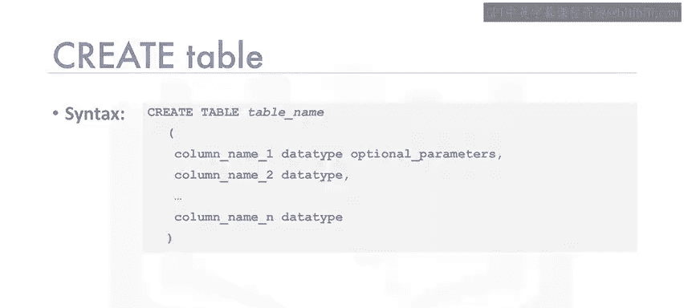

## 📝 创建表的基本示例

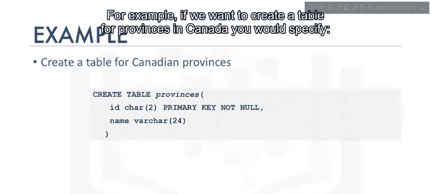

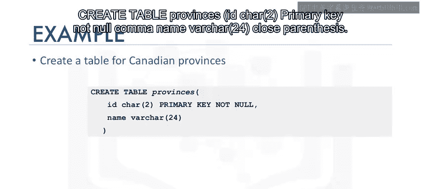

为了更好地理解，我们来看一个简单的例子。假设我们要为加拿大的省份创建一个表。

以下是创建该表的SQL语句：

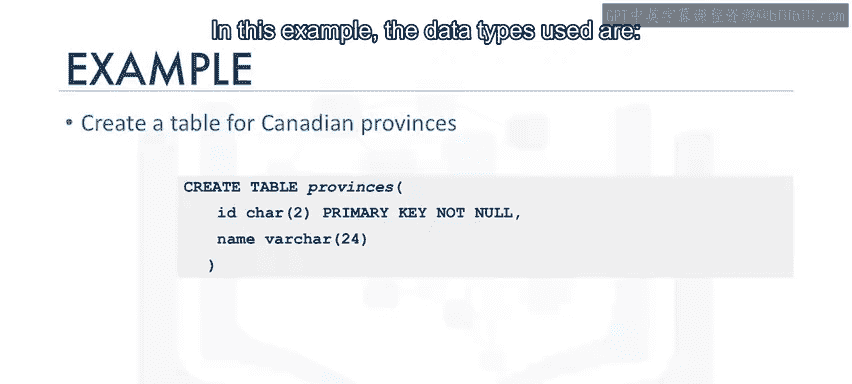


```sql
CREATE TABLE provinces (
    ID CHAR(2) PRIMARY KEY NOT NULL,
    name VARCHAR(24)
);
```

在这个例子中，我们使用了两种数据类型：
*   `CHAR(2)`：固定长度为2的字符串，用于存储省份的缩写代码（如AB、BC）。
*   `VARCHAR(24)`：可变长度字符串，最大长度为24个字符，用于存储省份的全名（如Alberta、British Columbia）。


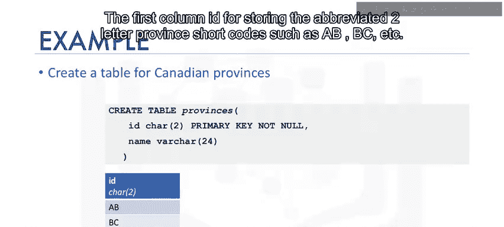

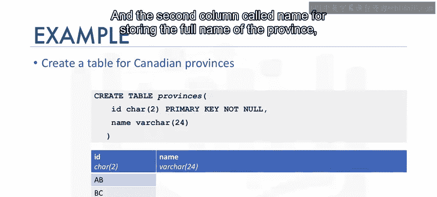

执行此语句后，数据库中会创建一个包含两列的表：`ID`列存储省份代码，`name`列存储省份全名。

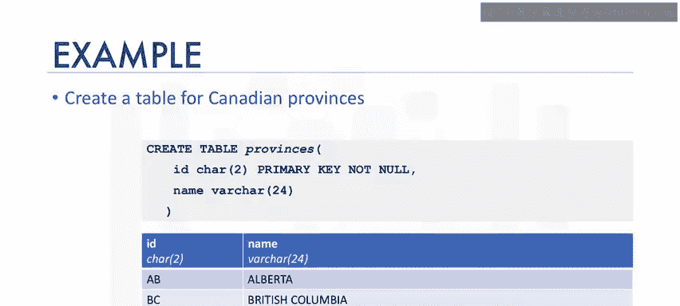

## 📚 图书馆数据库案例详解


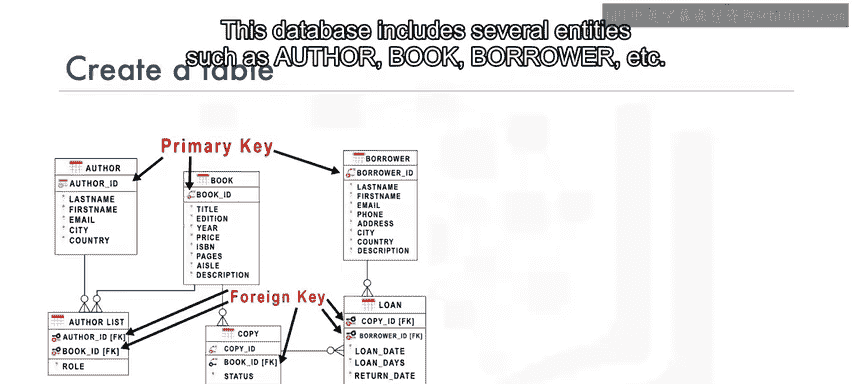

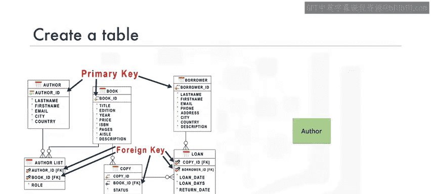

上一节我们介绍了创建表的基本语法，本节中我们来看一个更复杂的例子。我们将基于一个图书馆数据库来创建表，该数据库包含作者、书籍、借阅者等多个实体。

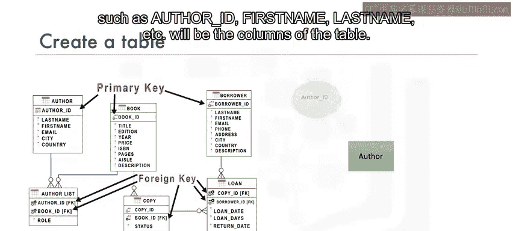

让我们从创建`author`（作者）表开始。表名将是`author`，其属性（如作者ID、名、姓等）将成为表的列。

以下是创建作者表的SQL命令：

```sql
CREATE TABLE author (
    author_id CHAR(2) PRIMARY KEY NOT NULL,
    last_name VARCHAR(15) NOT NULL,
    first_name VARCHAR(15) NOT NULL,
    email VARCHAR(40),
    city VARCHAR(15),
    country CHAR(2)
);
```

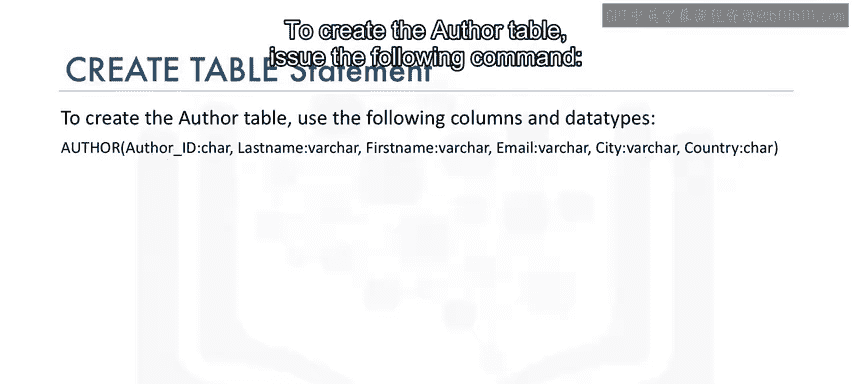

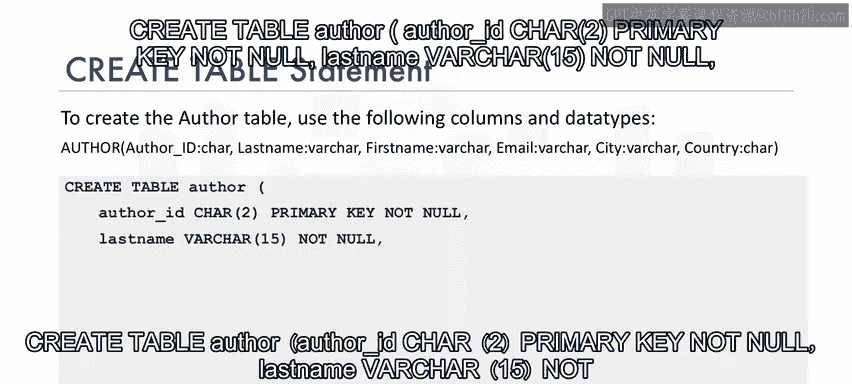

在这个表定义中，我们需要注意以下几点：

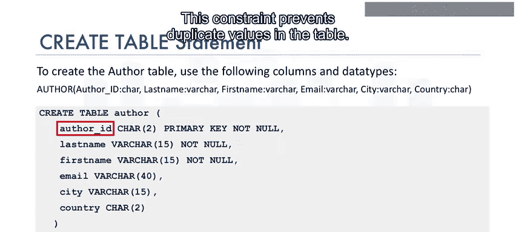

以下是本语句中定义的关键约束：
*   `author_id`被指定为**主键**。主键约束确保表中每一行的该列值都是唯一的，不允许重复。
*   `last_name`和`first_name`列被标记为`NOT NULL`。这个约束确保这些字段不能包含空值，因为作者必须拥有姓名。

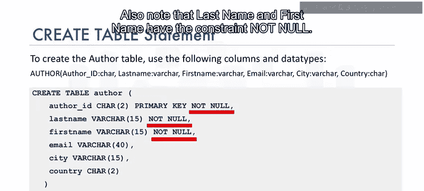

## ✅ 课程总结

本节课中，我们一起学习了SQL中`CREATE TABLE`语句的用法。我们了解到：
1.  `CREATE TABLE`是用于在数据库中创建实体或表的DDL语句。
2.  该语句的核心是定义表的列，包括列名、数据类型以及可选的约束（如主键、非空约束）。
3.  通过具体的示例，我们掌握了如何将现实世界的实体（如省份、作者）及其属性转化为规范的数据库表结构。


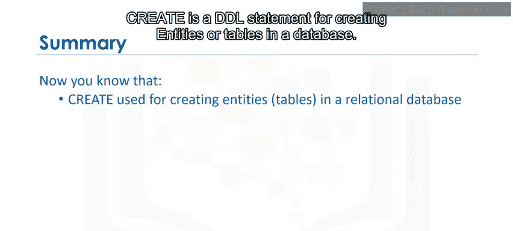

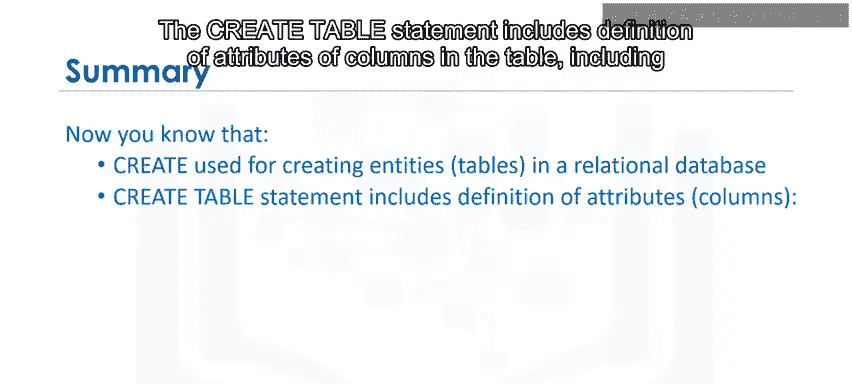


理解并掌握`CREATE TABLE`语句是构建和管理数据库的基石。