# 010：修改、删除与清空表


在本节课中，我们将学习如何使用 SQL 语句来修改现有表的结构、删除整个表，以及快速清空表中的所有数据。这些操作是数据库管理和维护中的核心技能。

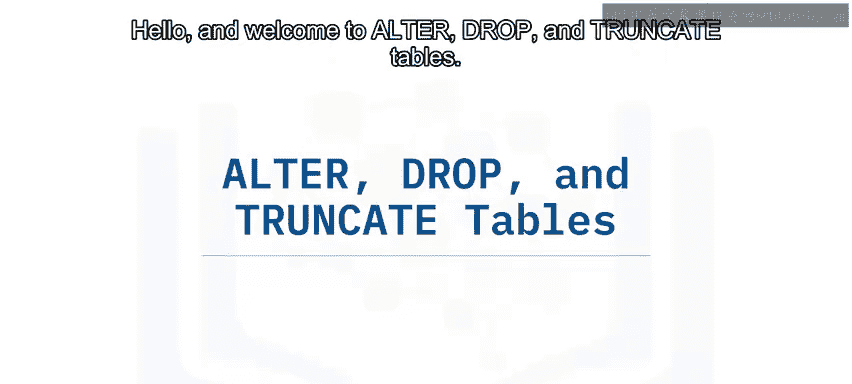

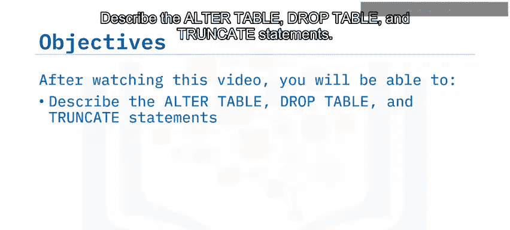

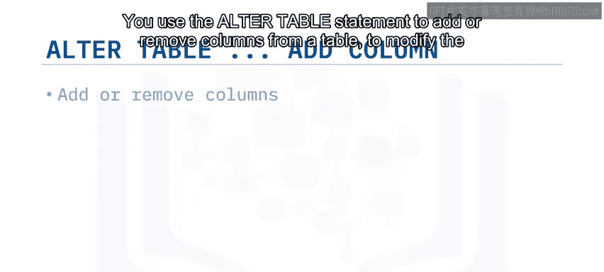

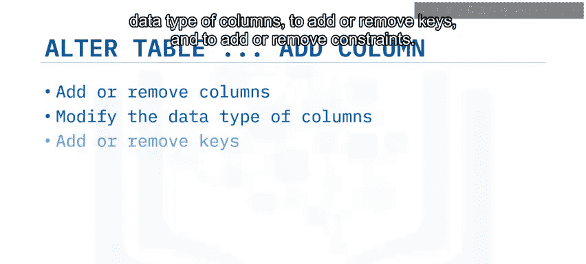

## 概述 📋

ALTER TABLE、DROP TABLE 和 TRUNCATE TABLE 是三种用于管理数据库表结构的重要 SQL 语句。它们分别用于修改表定义、删除整个表以及清空表内所有数据。掌握这些语句的语法和使用场景，对于灵活管理数据模型至关重要。

## 修改表结构：ALTER TABLE 语句 🔧

上一节我们介绍了创建表，本节中我们来看看如何修改一个已存在的表。`ALTER TABLE` 语句用于更改现有表的结构，例如添加或删除列、修改列的数据类型，以及添加或删除键和约束。

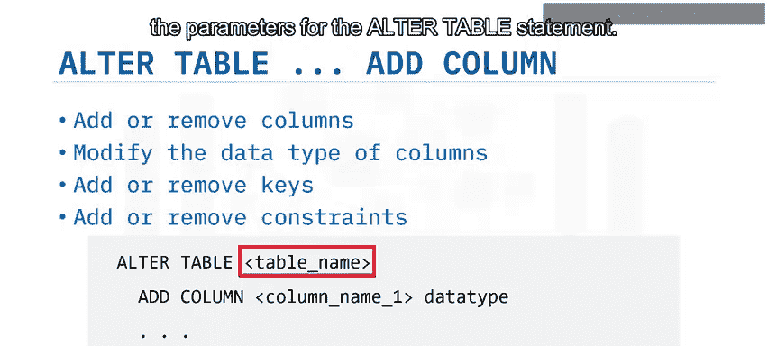

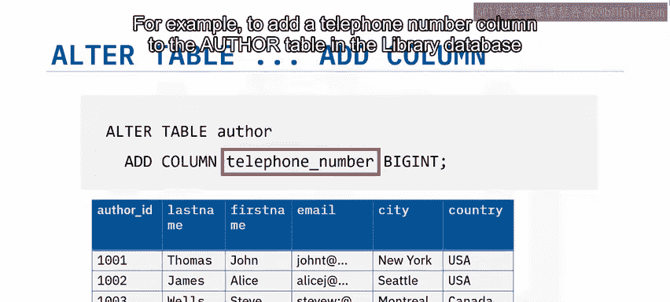

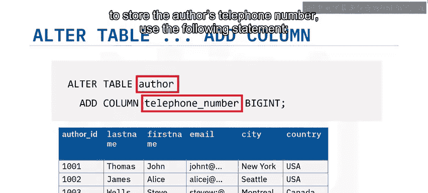

其基本语法如下：
```sql
ALTER TABLE table_name action;
```
与 `CREATE TABLE` 语句不同，`ALTER TABLE` 语句不使用括号来包裹参数。语句中的每一行都指定了要对表进行的一项更改。

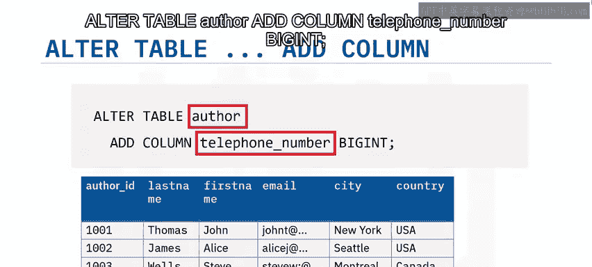

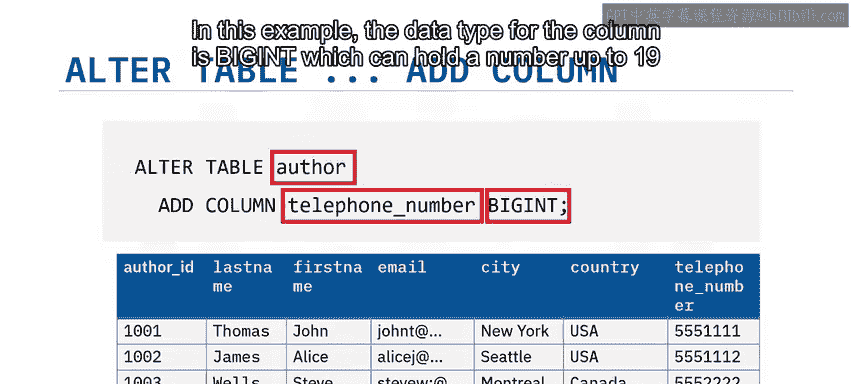

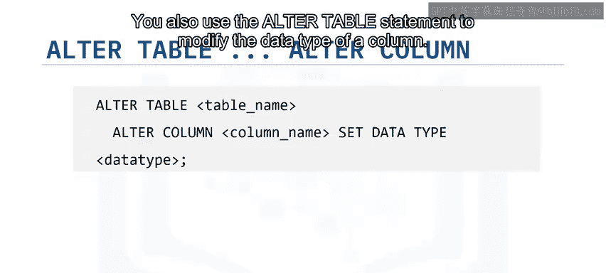

以下是 `ALTER TABLE` 语句的几种常见用法：

### 添加新列
例如，为了在图书馆数据库的 `author` 表中添加一个存储作者电话号码的列，可以使用以下语句：
```sql
ALTER TABLE author ADD COLUMN telephone_number BIGINT;
```
在这个例子中，列的数据类型是 `BIGINT`，它可以容纳长达19位的数字。

### 修改列的数据类型
要修改列的数据类型，需使用 `ALTER COLUMN` 子句，并为列指定新的数据类型。

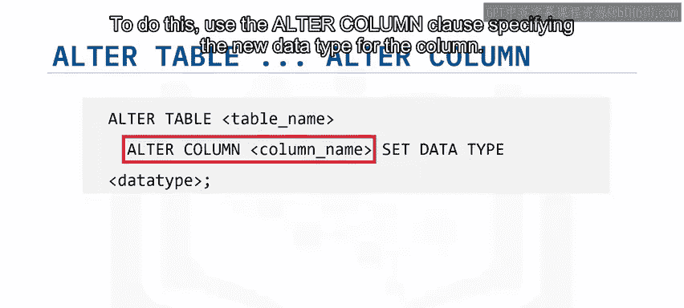

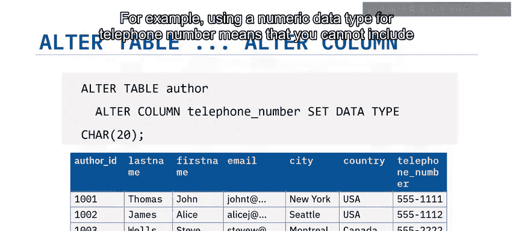

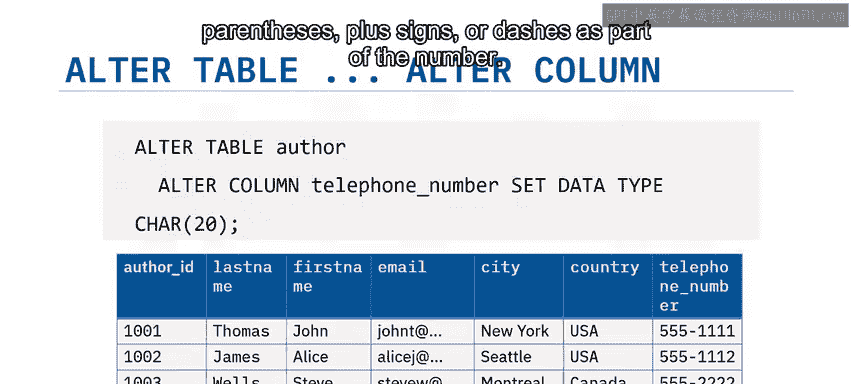

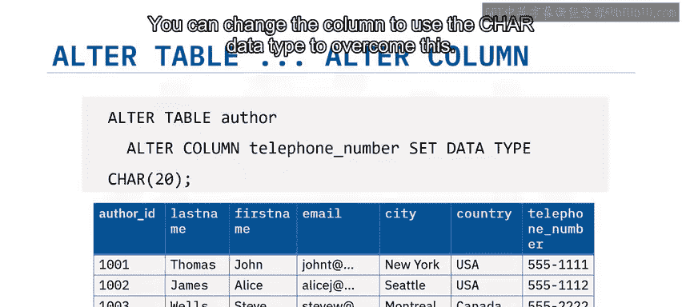

例如，使用数字数据类型存储电话号码意味着无法将括号、加号或破折号作为号码的一部分。你可以将列更改为使用字符数据类型来解决这个问题。以下代码展示了如何修改 `author` 表：
```sql
ALTER TABLE author ALTER COLUMN telephone_number SET DATA TYPE CHAR(20);
```
**注意**：修改包含现有数据的列的数据类型可能会导致问题，特别是当现有数据与新数据类型不兼容时。例如，如果列中已包含非数字数据，尝试将列从字符数据类型更改为数字数据类型将不会成功。你会看到通知日志中的错误信息，并且该语句不会执行。

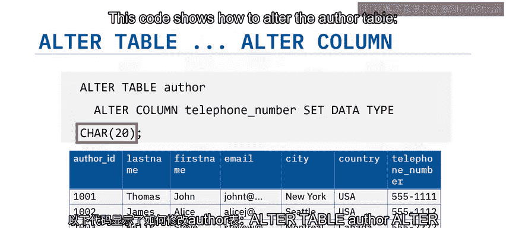

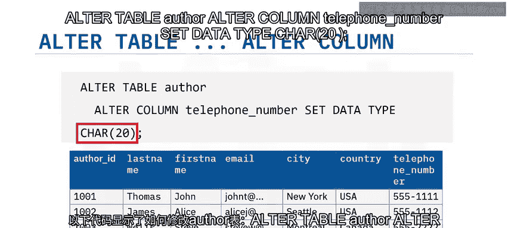

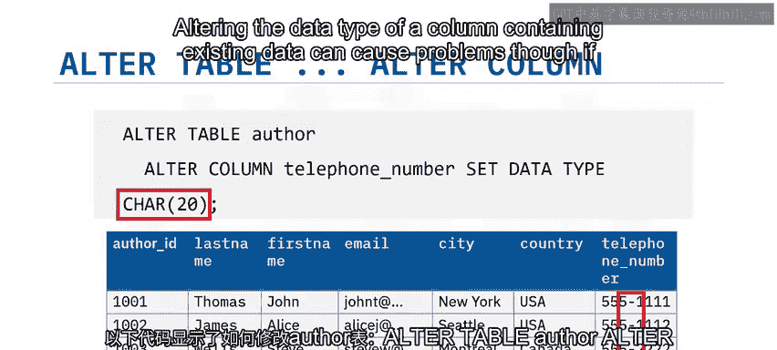

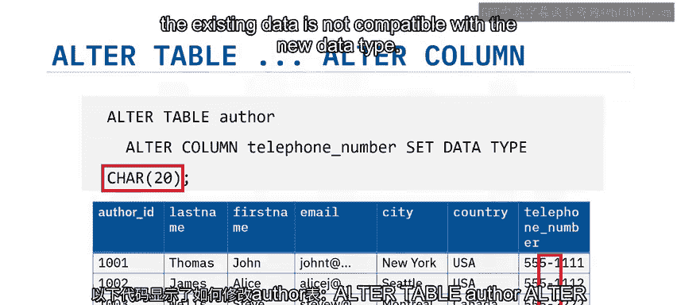

### 删除列
如果你的需求发生变化，不再需要某个额外的列，你可以再次使用 `ALTER TABLE` 语句，这次配合 `DROP COLUMN` 子句来删除该列，如下所示：
```sql
ALTER TABLE author DROP COLUMN telephone_number;
```

## 删除表：DROP TABLE 语句 🗑️

与使用 `DROP COLUMN` 从表中删除列类似，你可以使用 `DROP TABLE` 语句从数据库中删除整个表。默认情况下，如果你删除一个包含数据的表，数据将随表一起被删除。

该语句的语法是：
```sql
DROP TABLE table_name;
```
因此，要删除 `author` 表，你可以使用以下语句：
```sql
DROP TABLE author;
```


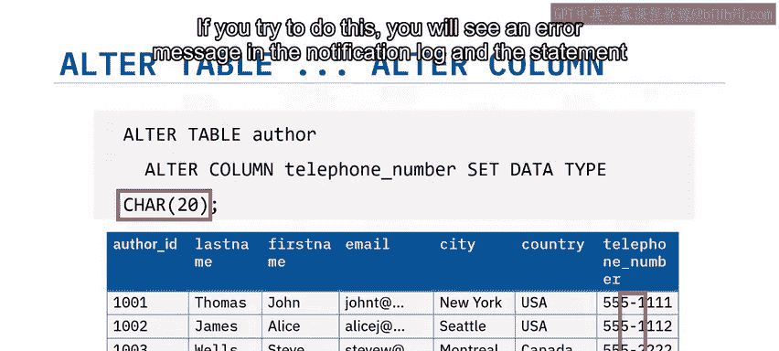

## 清空表数据：TRUNCATE TABLE 语句 ⚡

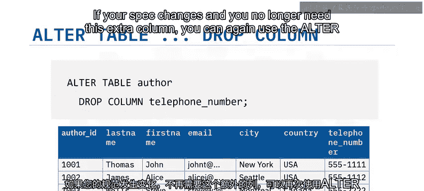

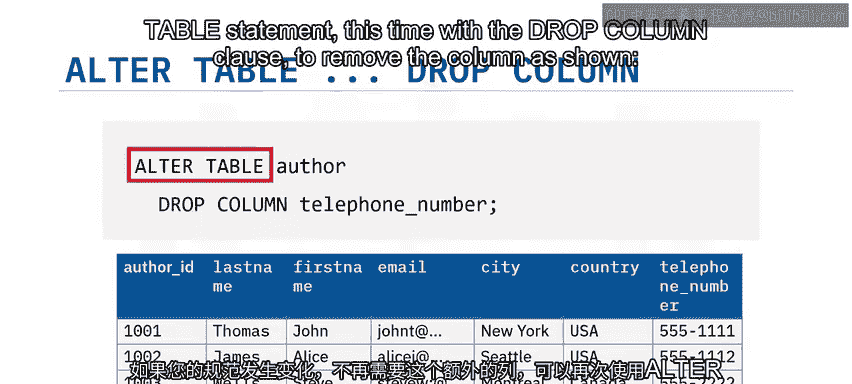

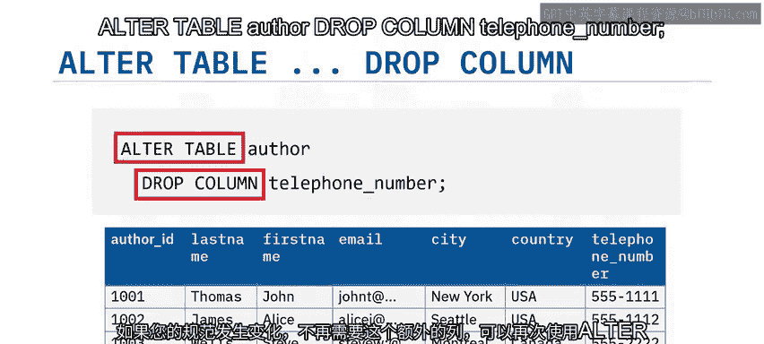

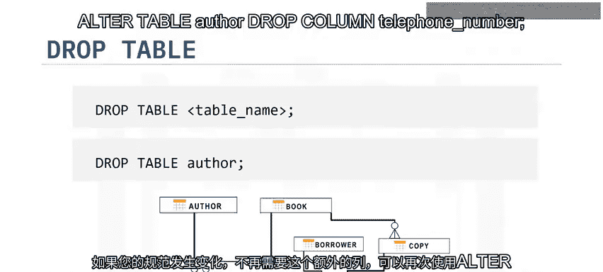

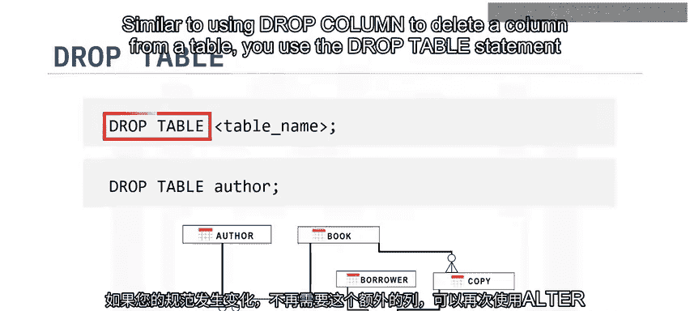

有时，你可能只想删除表中的数据，而不是删除表本身。虽然你可以使用不带 `WHERE` 子句的 `DELETE` 语句来实现，但使用 `TRUNCATE TABLE` 通常更快、更高效。

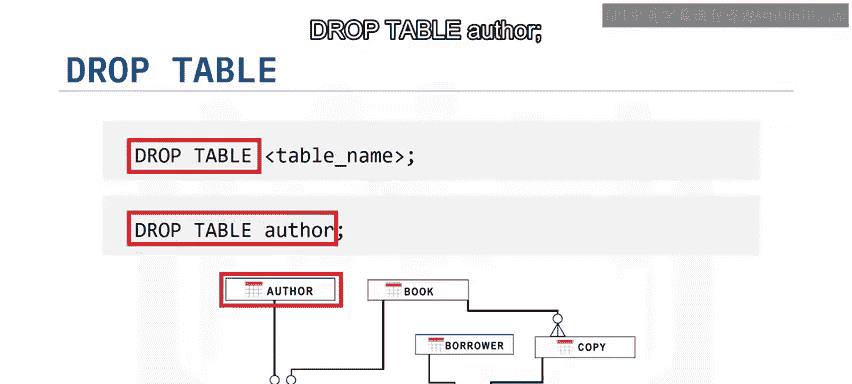

`TRUNCATE TABLE` 语句用于删除表中的所有行。其语法如下：
```sql
TRUNCATE TABLE table_name IMMEDIATE;
```
`IMMEDIATE` 指定立即处理该语句，且此操作无法撤销。

因此，要清空 `author` 表，你可以使用以下语句：
```sql
TRUNCATE TABLE author IMMEDIATE;
```

## 总结 🎯

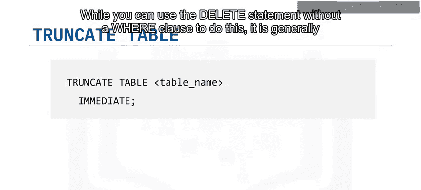

本节课中我们一起学习了三个关键的 SQL 表管理语句：
1.  **`ALTER TABLE` 语句**：用于更改现有表的结构，例如添加、修改或删除列。
2.  **`DROP TABLE` 语句**：用于删除数据库中的现有表（及其数据）。
3.  **`TRUNCATE TABLE` 语句**：用于快速删除表中的所有数据行，但保留表结构。

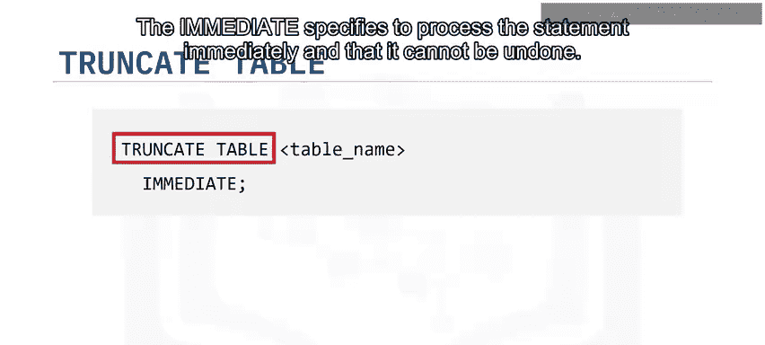

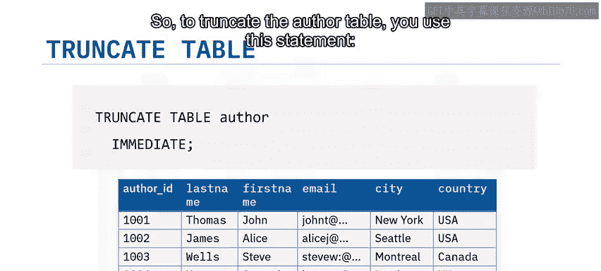


理解并正确使用这些语句，将帮助你有效地维护和调整数据库结构，以适应不断变化的数据需求。