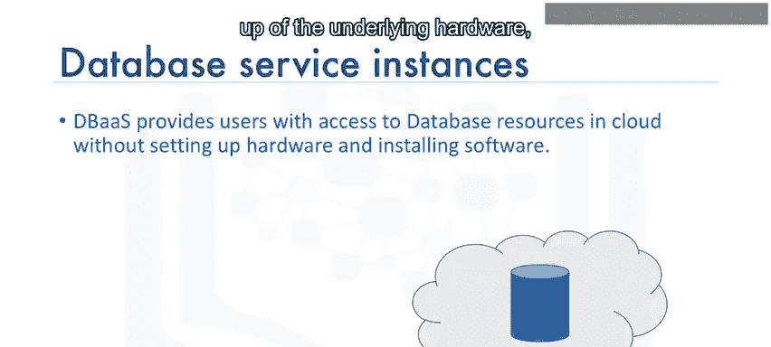
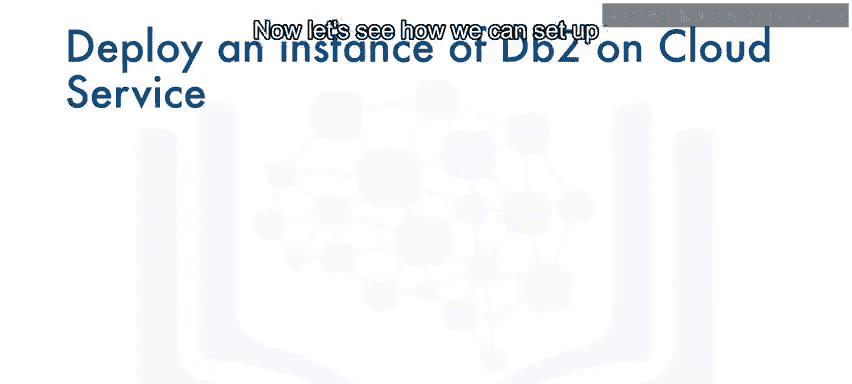
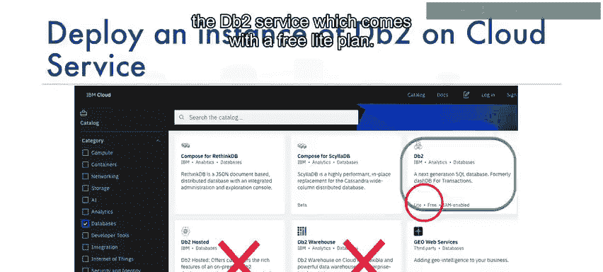
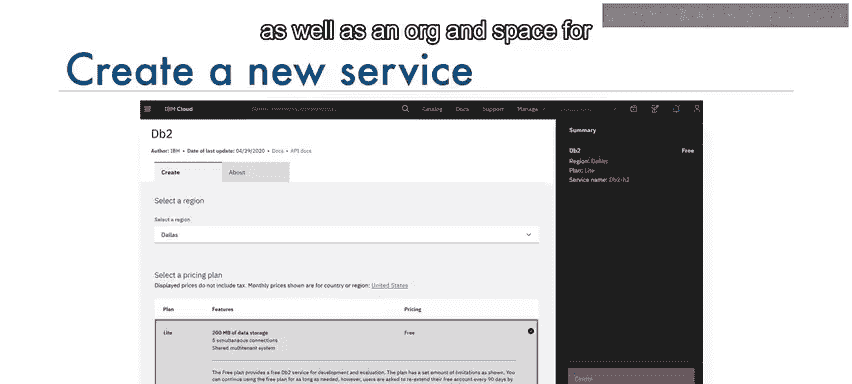
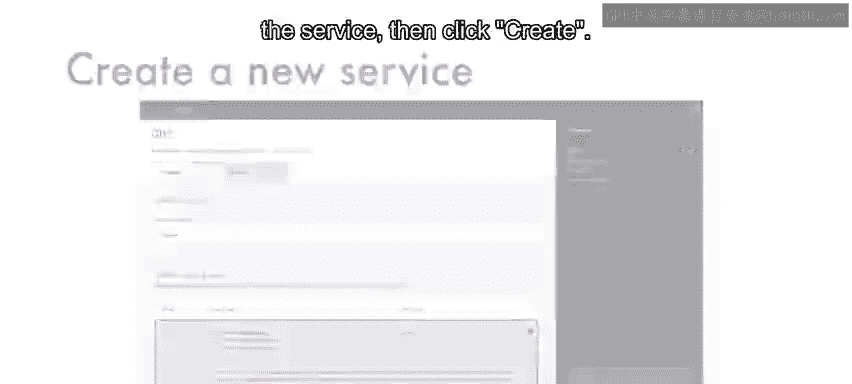
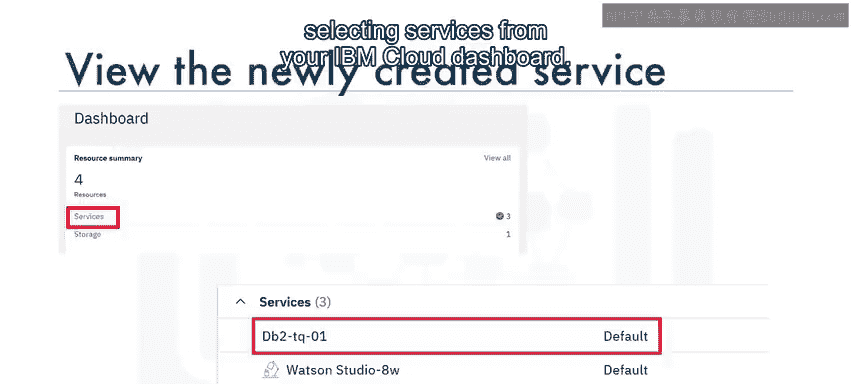
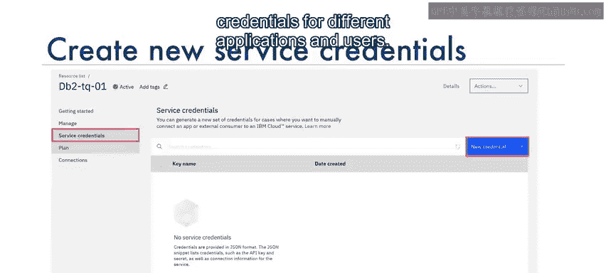
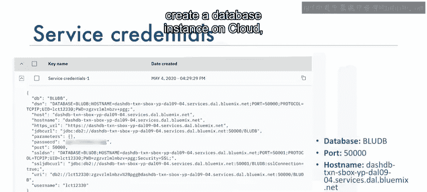

# 011：如何在云上创建数据库实例 🗄️

在本节课中，我们将学习关于云数据库的核心概念，并演示如何在IBM Cloud上创建一个DB2数据库服务实例，以便为后续的SQL查询练习提供环境。

## 云数据库概述

上一节我们介绍了学习SQL需要一个可用的数据库。本节中，我们来看看什么是云数据库。云数据库是一种通过云平台构建和访问的数据库服务。它具备传统数据库的多数功能，同时兼具云计算的灵活性。

使用云数据库的优势包括：
*   **易于使用**：用户几乎可以从任何地方，通过供应商的API、Web界面或自己的应用程序访问云数据库。
*   **可扩展性**：云数据库可以在运行时动态扩展或收缩其存储和计算能力，以适应不断变化的需求，组织只需为实际使用的资源付费。
*   **灾难恢复**：在发生自然灾害、设备故障或停电时，数据可通过在云上地理分布式区域的远程服务器备份来确保安全。

## 常见的云关系数据库

以下是几个常见的云关系数据库服务示例：
*   IBM DB2 on Cloud
*   Databases for PostgreSQL on IBM Cloud
*   Oracle Database Cloud Service
*   Microsoft Azure SQL Database
*   Amazon Relational Database Service (RDS)

这些云数据库可以作为虚拟机运行（由您自行管理），也可以作为托管服务提供，具体取决于供应商。数据库服务可以是单租户或多租户，这取决于所选的服务计划。

## 数据库服务实例



要在云中运行数据库，首先需要在您选择的云平台上配置一个数据库服务实例。数据库即服务实例为用户提供了对云中数据库资源的访问，而无需设置底层硬件、安装数据库软件和管理数据库。

数据库服务实例将您的数据存储在相关的表中。数据加载到数据库实例后，您可以通过Web界面或应用程序中的API连接到该实例。



```
应用程序 --(SQL查询)--> 数据库实例 --(操作数据)--> 返回结果集
```



连接建立后，您的应用程序可以向数据库实例发送SQL查询。数据库实例将SQL语句解析为对数据库中数据和对象的操作，并将检索到的任何数据作为结果集返回给应用程序。





## 在IBM Cloud上创建DB2实例



现在，让我们看看如何在IBM Cloud上为DB2创建一个数据库实例。IBM DB2 on Cloud是一个在云中为您提供的SQL数据库。您可以像使用任何数据库软件一样使用它，但无需承担高昂的硬件设置或软件安装和维护开销。

以下是创建DB2服务实例的步骤：



1.  **导航至IBM Cloud目录**：访问IBM Cloud控制台，进入目录（Catalog）。
2.  **选择DB2服务**：在目录中搜索并选择“DB2”服务。请注意，DB2服务有多个变体，包括DB2 Hosted和DB2 Warehouse。出于我们的目的，我们将选择带有免费轻量版计划的“Db2”服务。
3.  **选择服务计划**：选择“Lite”免费计划。如果需要，可以更改默认设置，例如输入服务实例名称、选择部署区域以及该服务的组织和空间。
4.  **创建实例**：点击“创建”按钮。
5.  **访问与管理**：创建完成后，您可以从IBM Cloud仪表板的“服务”列表中查看您创建的IBM DB2服务。通过此仪表板，您可以管理数据库实例，例如点击“打开控制台”按钮来启动数据库实例的Web控制台。Web控制台允许您创建表、加载数据、浏览表中的数据以及执行SQL查询。
6.  **获取连接凭证**：为了从您的应用程序访问数据库实例，您将需要服务凭证。首次使用时，您需要创建一组新的凭证。您也可以选择为不同的应用程序和用户创建多组凭证。凭证创建后，您可以将其视为一个JSON代码片段。凭证包含建立数据库连接所需的详细信息，主要包括：
    *   **数据库名称** 和 **端口号**
    *   **主机名**：您的数据库实例所在的云服务器名称
    *   **用户名** 和 **密码**：用于连接的用户ID。请注意，您的用户名默认也是您的表将被创建于其中的**模式名称**。

## 总结



本节课中，我们一起学习了云数据库的基本概念、优势以及常见的云数据库服务。我们重点描述了数据库服务实例的作用，并逐步演示了如何在IBM Cloud上创建一个DB2数据库服务实例。现在您已经知道如何在云上创建数据库实例，下一步就是亲自去创建一个，以便开始您的SQL实践。