# 013：排序结果集


在本节课中，我们将学习如何从关系数据库表中检索数据，并掌握对结果集进行排序的高级技巧。排序功能能让查询结果更有序、更易于分析。

---

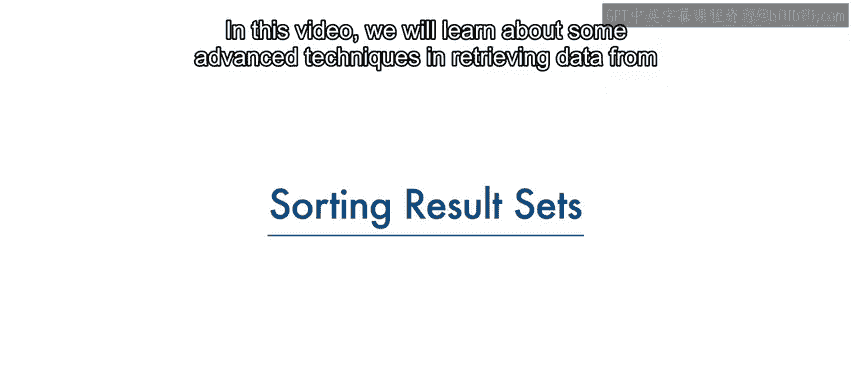

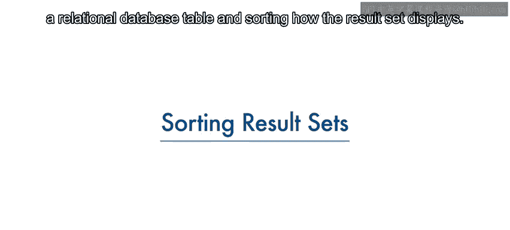

## 🎯 概述

数据库管理系统的主要目的不仅是存储数据，还要便于数据的检索。`SELECT` 语句是检索数据的基础工具。本节课我们将重点学习如何使用 `ORDER BY` 子句对查询结果进行排序，包括升序和降序排列，以及指定排序列的不同方法。

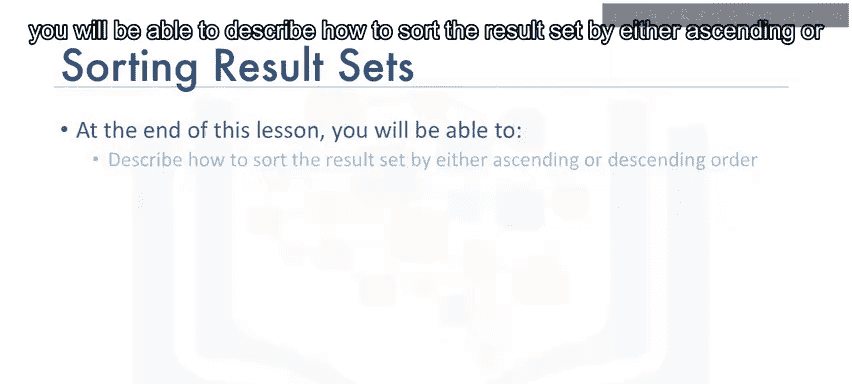

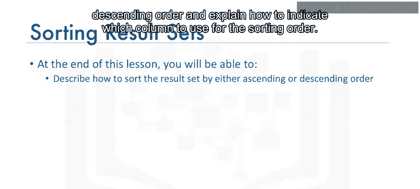

---

## 🔍 基础SELECT语句与结果集


最简单的 `SELECT` 语句形式是 `SELECT * FROM table_name`。它用于从指定表中检索所有列的所有数据行。

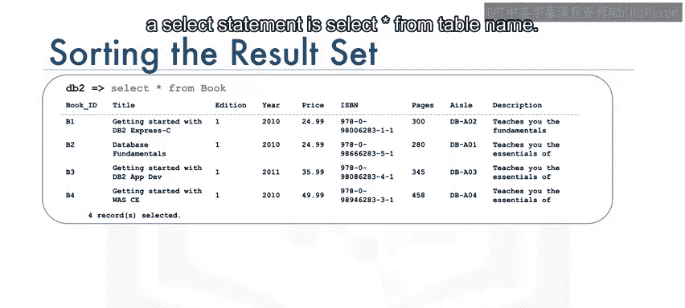

以简化的图书馆数据库模型中的 `book` 表为例，执行 `SELECT * FROM book` 会返回包含四行数据的结果集。

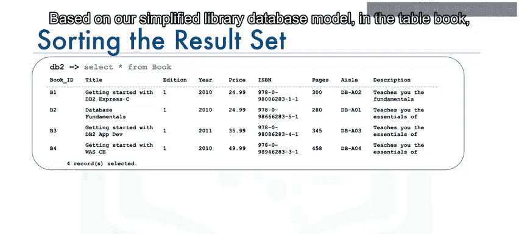


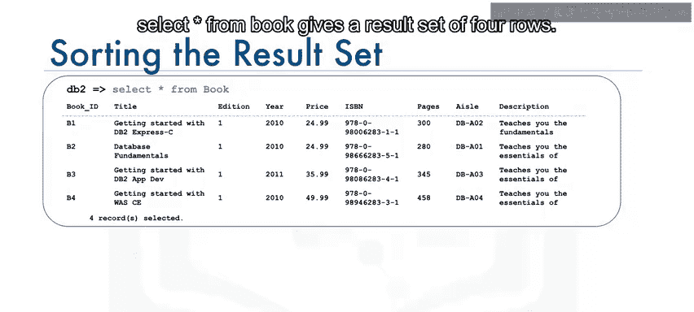

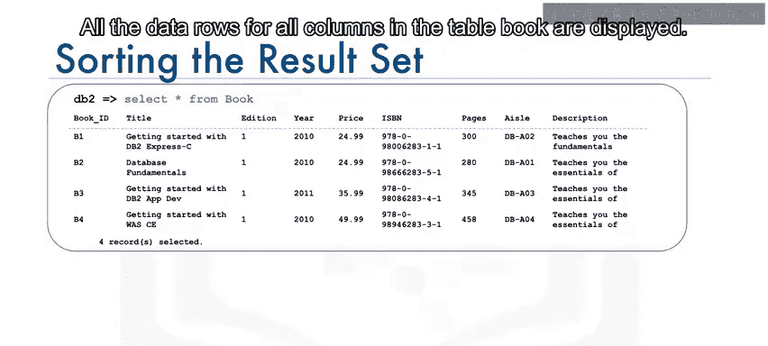

该语句会显示 `book` 表中所有列的所有数据行。

---

## 📝 引入ORDER BY子句进行排序

我们也可以选择只列出书名，例如：`SELECT title FROM book`。然而，默认的结果集可能没有任何特定顺序。按字母顺序显示结果集会使其更便于查阅。为此，我们需要使用 `ORDER BY` 子句。

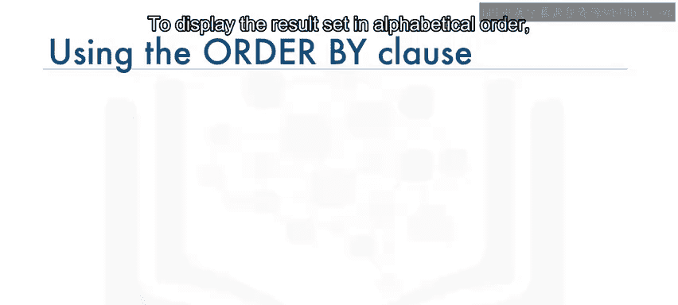

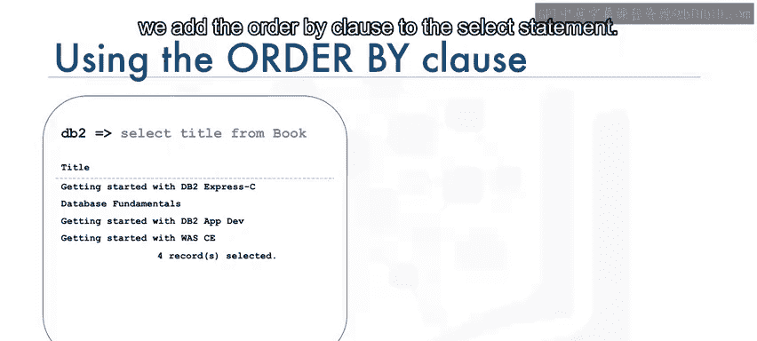

为了按字母顺序显示结果集，我们在 `SELECT` 语句中添加 `ORDER BY` 子句。

`ORDER BY` 子句用于在查询中根据指定列对结果集进行排序。在下面的例子中，我们在 `title` 列上使用了 `ORDER BY`。

**代码示例：**
```sql
SELECT title FROM book ORDER BY title;
```

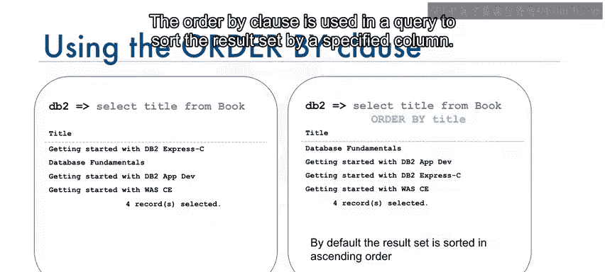

默认情况下，结果集按升序排序。因此，此示例的结果集会按书名的字母顺序排列。

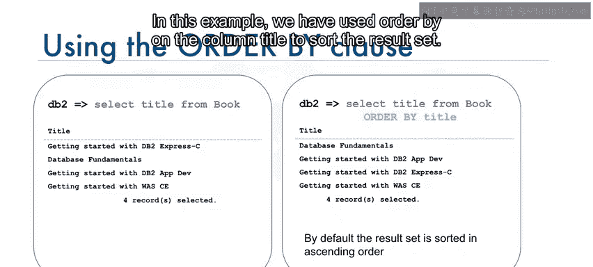

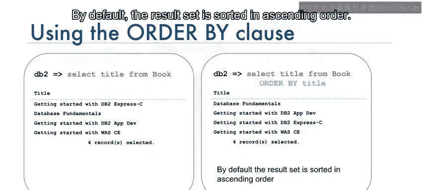

---

## ⬇️ 降序排序

要按降序排序，需使用关键字 `DESC`。

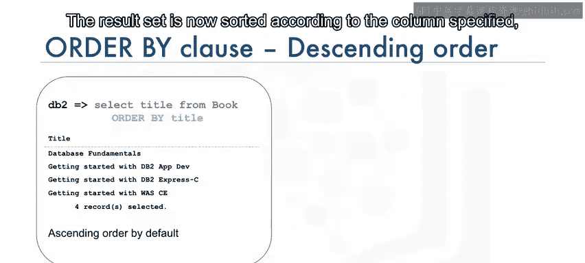

**代码示例：**
```sql
SELECT title FROM book ORDER BY title DESC;
```

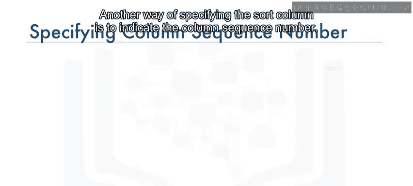

现在，结果集根据指定的 `title` 列按降序排序。请注意前三行的顺序：它们书名的前三个单词相同，因此排序从字符开始不同的位置进行。

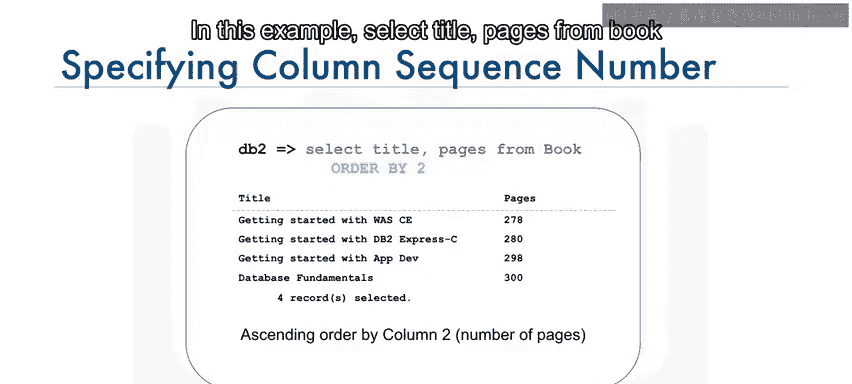

---

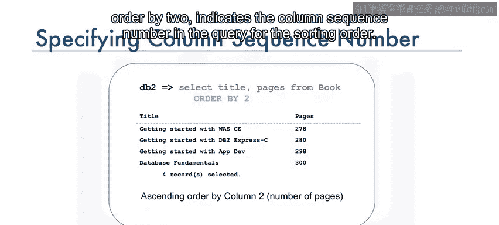

## 🔢 使用列序号指定排序

另一种指定排序列的方法是使用列序号。

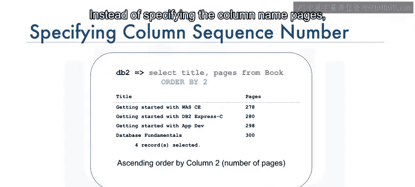

**代码示例：**
```sql
SELECT title, pages FROM book ORDER BY 2;
```

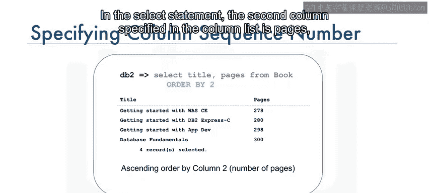

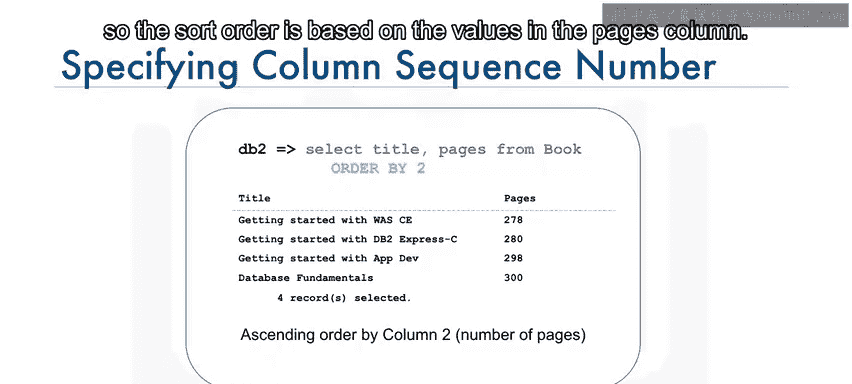

在这个例子中，`ORDER BY 2` 表示使用查询中列序列的第二个列作为排序依据。在 `SELECT` 语句中，指定的第二列是 `pages`，因此排序顺序基于 `pages` 列中的值。

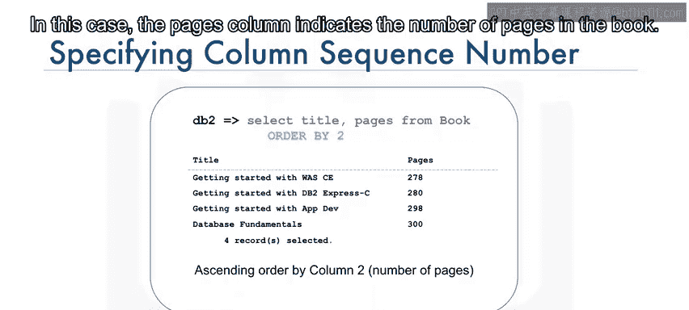

`pages` 列表示书籍的页数。如图所示，结果集按页数升序排列。

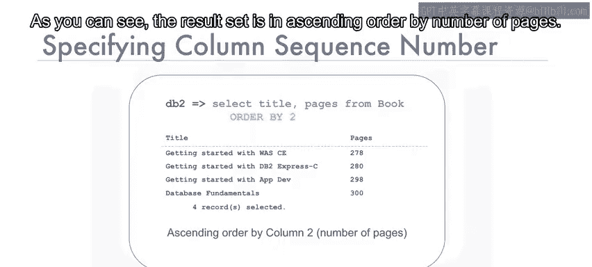

---

## ✅ 总结

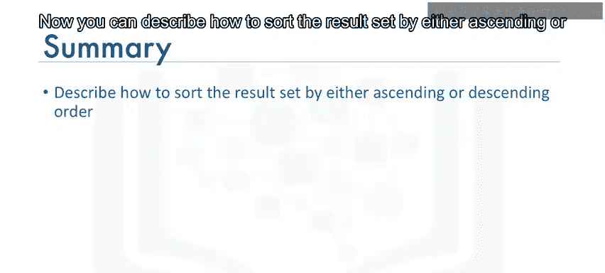

在本节课中，我们一起学习了如何对 `SELECT` 语句的结果集进行排序。我们掌握了使用 `ORDER BY` 子句进行升序（默认）和降序（使用 `DESC`）排序的方法，并了解了可以通过列名或列序号来指定用于排序的列。这些技巧能帮助你更有效地组织和分析从数据库中检索到的数据。