# 016：SQL日期与时间函数详解

在本节课中，我们将学习SQL数据库中用于处理日期和时间的内置函数。这些函数能帮助我们提取、计算和操作日期时间数据，是数据科学和数据分析中不可或缺的工具。


---

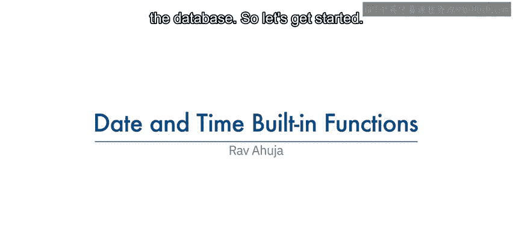

## 🗓️ 日期与时间数据类型

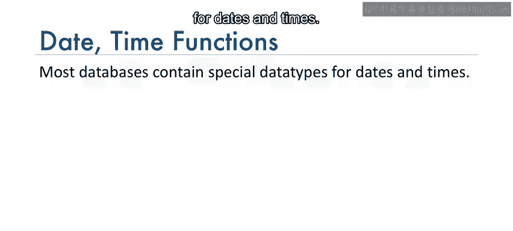

大多数数据库都包含用于存储日期和时间的特殊数据类型。

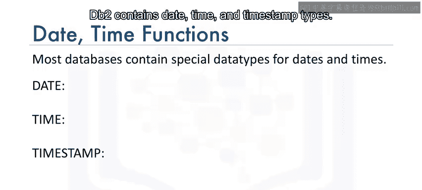

在DB2数据库中，主要包含三种日期时间类型：**DATE**、**TIME**和**TIMESTAMP**。

以下是这些类型的详细说明：

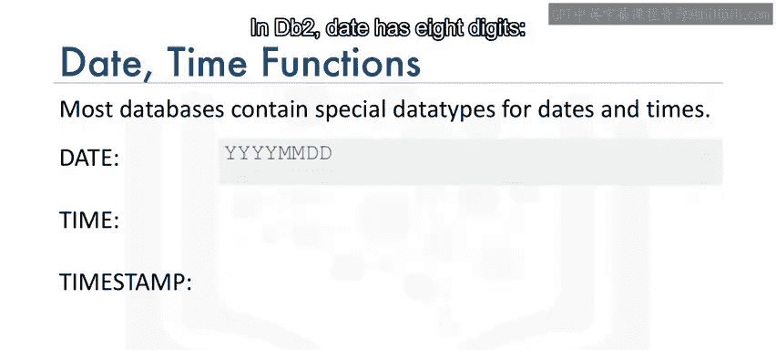

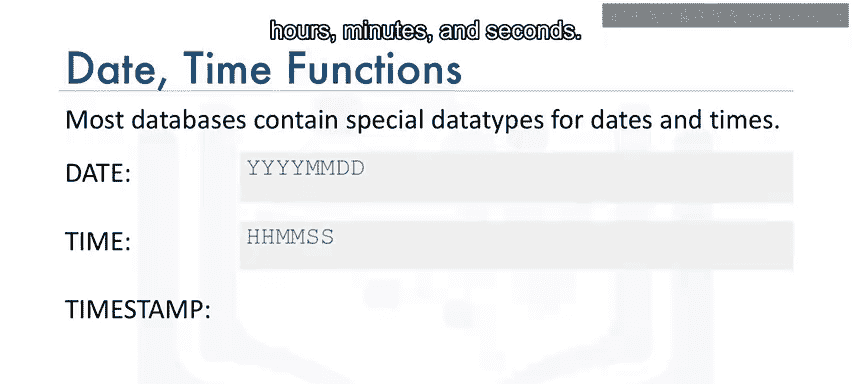

*   **DATE**：包含8位数字，格式为**YYYYMMDD**，分别代表年、月、日。
*   **TIME**：包含6位数字，格式为**HHMMSS**，分别代表时、分、秒。
*   **TIMESTAMP**：包含20位数字，格式为**YYYY-MM-DD-HH.MM.SS.XXXXXX**，其中`XXXXXX`代表微秒。它包含了年、月、日、时、分、秒和微秒。

---

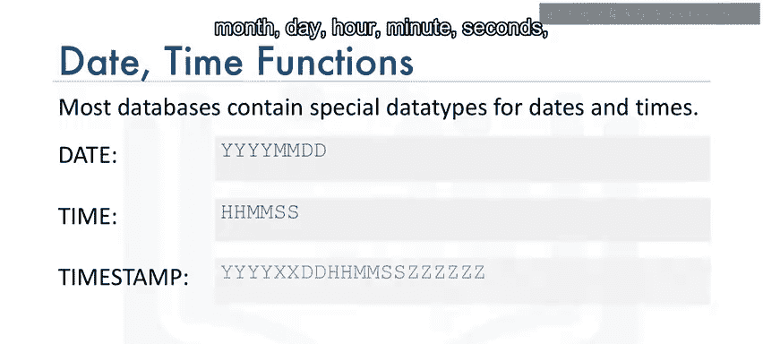

## 🔧 日期时间提取函数

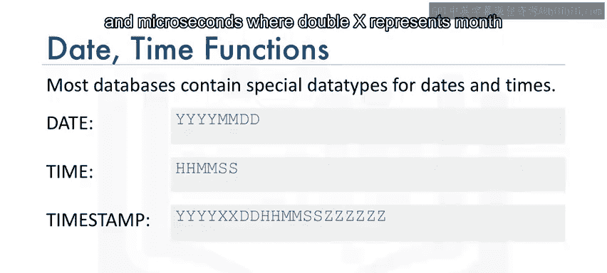

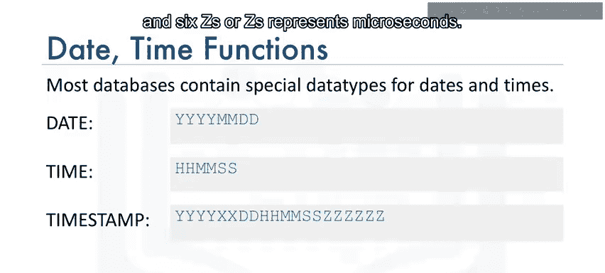

SQL提供了一系列函数，用于从日期时间值中提取特定的部分。

以下是常用的日期时间提取函数：

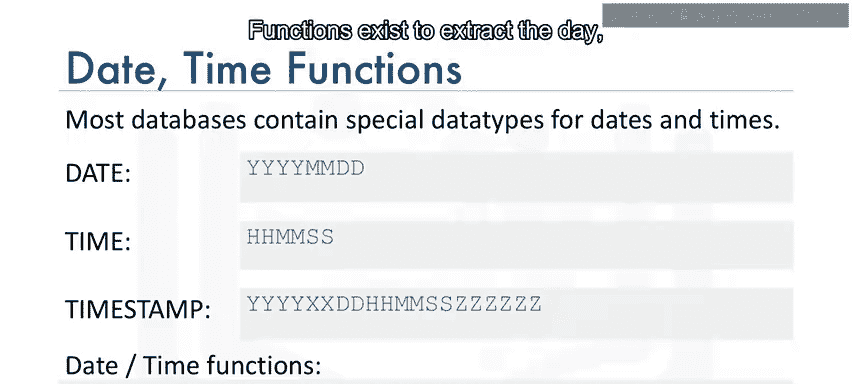

*   `DAY()`：提取日期中的“日”部分。
*   `MONTH()`：提取日期中的“月”部分。
*   `DAYOFMONTH()`：提取日期是该月中的第几天。
*   `DAYOFWEEK()`：提取日期是该周中的第几天。
*   `DAYOFYEAR()`：提取日期是该年中的第几天。
*   `WEEK()`：提取日期是该年中的第几周。
*   `HOUR()`：提取时间中的“小时”部分。
*   `MINUTE()`：提取时间中的“分钟”部分。
*   `SECOND()`：提取时间中的“秒”部分。

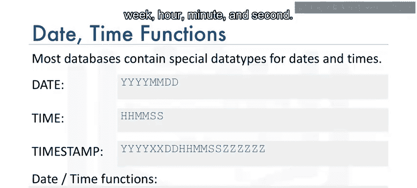

---

## 📝 函数应用示例

上一节我们介绍了各种提取函数，本节中我们来看看如何在查询中使用它们。

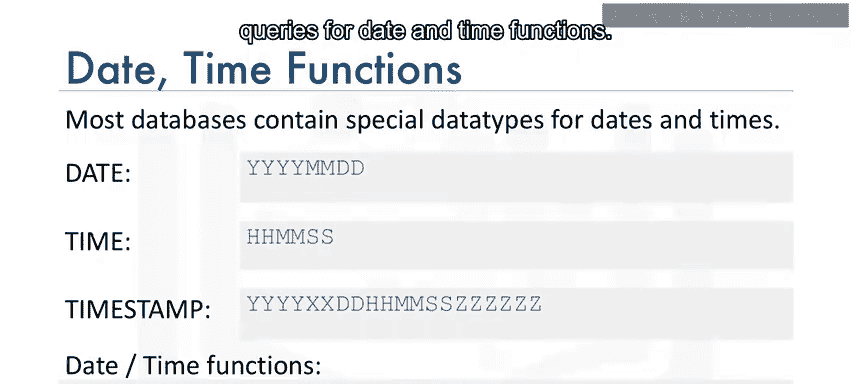

### 提取日期部分


`DAY()`函数可用于从日期中提取“日”的部分。例如，要获取所有涉及猫的救援日期中的“日”：

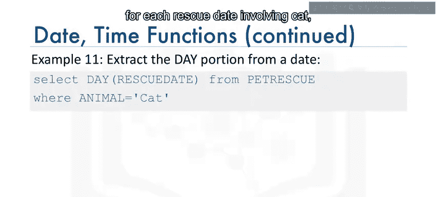

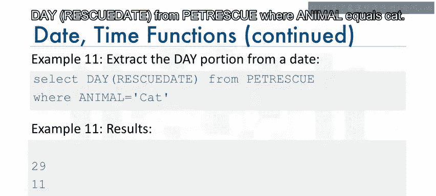

```sql
SELECT DAY(RESCUE_DATE) FROM PETRESCUE WHERE ANIMAL = ‘Cat’;
```

### 在WHERE子句中使用函数

日期时间函数也可以用在`WHERE`子句中进行条件过滤。例如，要统计五月份（即第5个月）的救援次数：


```sql
SELECT COUNT(*) FROM PETRESCUE WHERE MONTH(RESCUE_DATE) = 05;
```

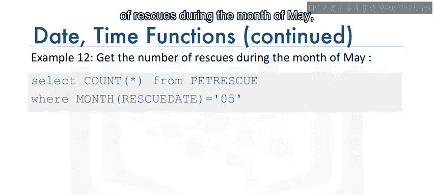

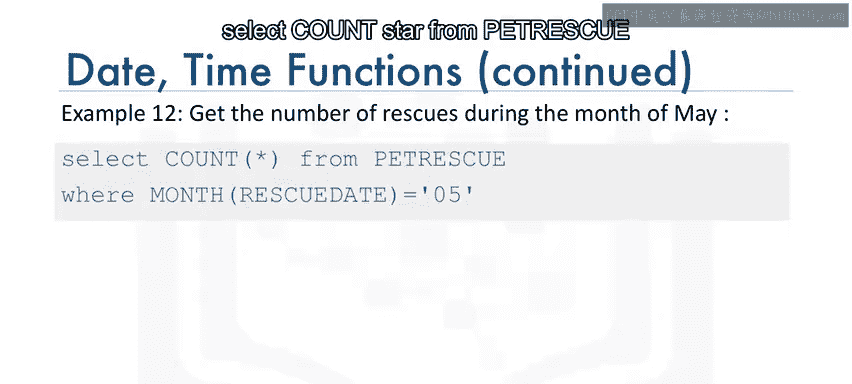

---

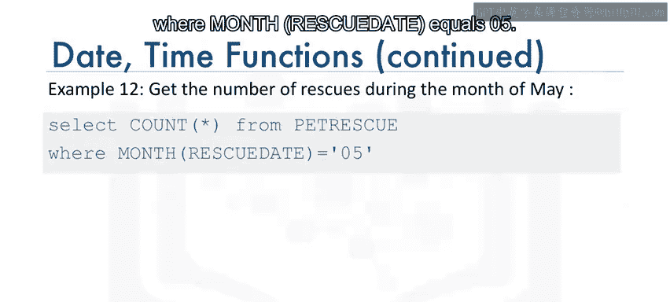

## ➕ 日期时间运算

除了提取，我们还可以对日期和时间进行算术运算。

### 日期加法


例如，要找出每个救援日期三天后的日期（假设救援需要在三天内处理完毕）：


```sql
SELECT RESCUE_DATE + 3 DAYS FROM PETRESCUE;
```


### 使用特殊寄存器计算时间差

数据库还提供了特殊寄存器，如`CURRENT_DATE`（当前日期）和`CURRENT_TIME`（当前时间）。例如，要计算从每个救援日期到今天已经过去了多少天：

```sql
SELECT CURRENT_DATE - RESCUE_DATE FROM PETRESCUE;
```
执行此查询的结果将以“年、月、日”的格式显示时间间隔。


---

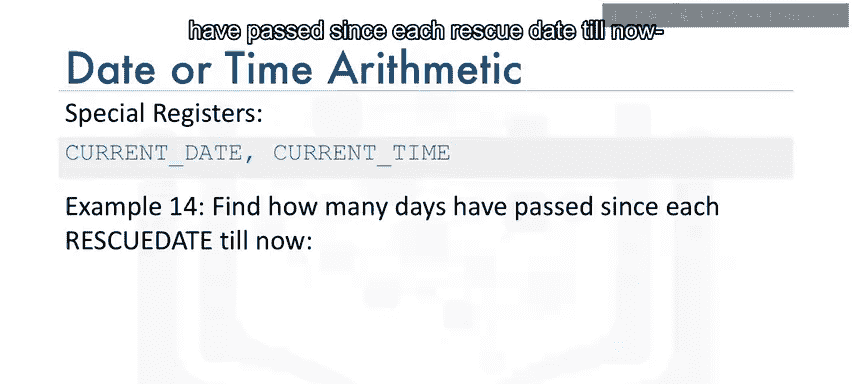

## 🎯 课程总结

本节课中，我们一起学习了SQL数据库中用于处理日期和时间的内置函数。我们了解了DB2中的主要日期时间数据类型（DATE, TIME, TIMESTAMP），掌握了如何使用`DAY()`、`MONTH()`等函数提取日期时间的特定部分，并学会了在查询和`WHERE`子句中应用这些函数。最后，我们还探索了如何进行日期时间的加减运算，以及如何使用`CURRENT_DATE`等特殊寄存器进行时间差计算。掌握这些函数将极大地增强你处理和分时间序列数据的能力。