# 017：子查询与嵌套选择 🧩


在本节课中，我们将学习如何编写子查询或嵌套的SELECT语句。子查询是SQL中一项强大的功能，它允许我们将一个查询嵌套在另一个查询内部，从而构建更复杂、更灵活的数据检索操作。

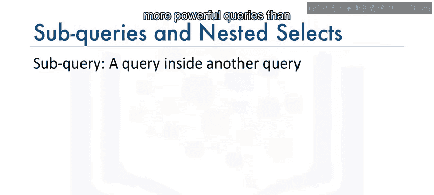

---

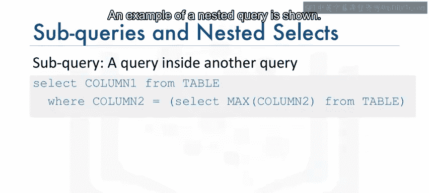

## 什么是子查询？ 🔍

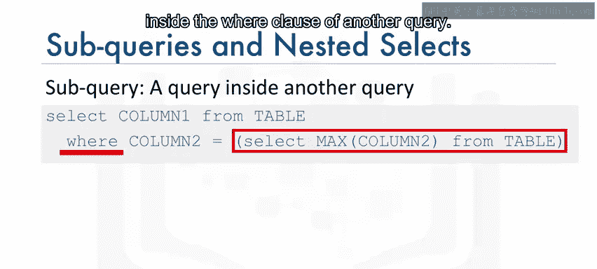

子查询，也称为嵌套SELECT语句，类似于常规查询，但被放置在括号内并嵌套在另一个查询中。这使得我们能够构建比单独使用简单查询更强大的查询语句。

一个嵌套查询的基本结构示例如下：
```sql
SELECT column1, column2
FROM table1
WHERE column1 = (SELECT column1 FROM table2 WHERE condition);
```

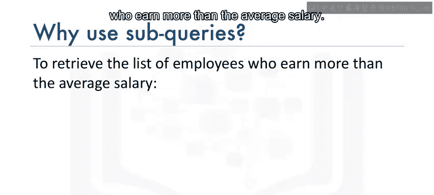

---

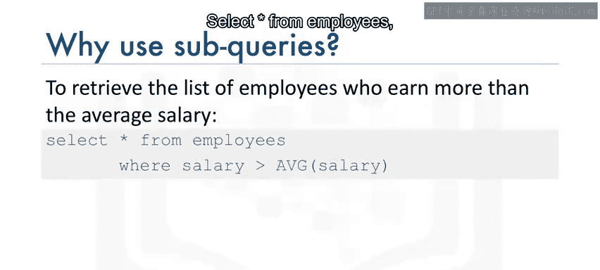

## 为什么需要子查询？ 🤔

上一节我们介绍了子查询的基本概念，本节中我们来看看为什么需要它。考虑一个来自之前视频的`employees`表，它包含员工ID、姓名、薪水等列。

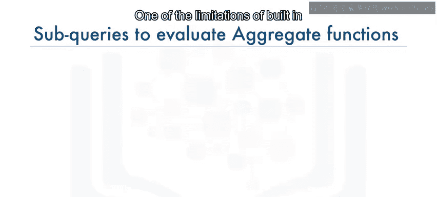

假设我们想检索薪水高于平均薪水的所有员工列表。一个直观但错误的尝试可能是：
```sql
SELECT * FROM employees WHERE salary > AVG(salary);
```
运行此查询会导致错误，提示聚合函数`AVG()`的使用无效。这是因为像`AVG()`这样的内置聚合函数，不能直接在`WHERE`子句中进行计算。

为了克服这个限制，我们可以使用子查询。

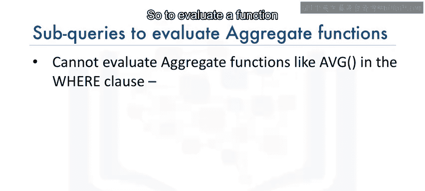

---

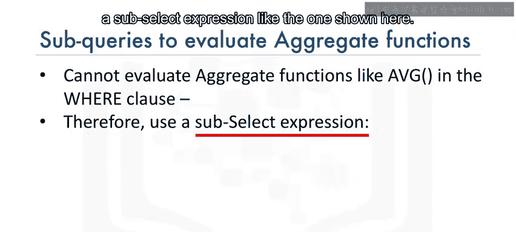

## 在WHERE子句中使用子查询 🛠️

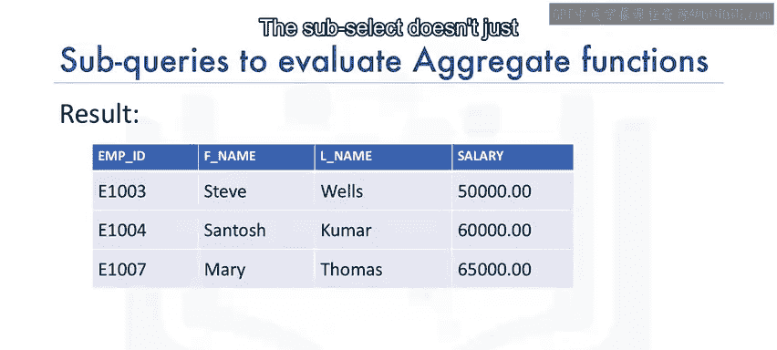

以下是解决上述问题的正确方法，即在`WHERE`子句中嵌套一个子查询来计算平均薪水：
```sql
SELECT employee_id, first_name, last_name, salary
FROM employees
WHERE salary > (SELECT AVG(salary) FROM employees);
```
在这个例子中，子查询`(SELECT AVG(salary) FROM employees)`首先执行，计算出平均薪水，然后这个结果被用于外层查询的`WHERE`条件中进行比较。

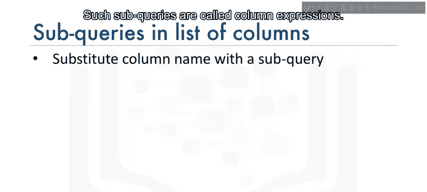

---

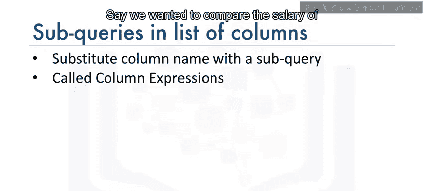

## 在SELECT列表中使用子查询（列表达式） 📊

子查询不仅可以用在`WHERE`子句中，还可以用在查询的其他部分，例如`SELECT`的列列表中。这类子查询被称为列表达式。

假设我们想比较每位员工的薪水与公司平均薪水。直接尝试`SELECT employee_id, salary, AVG(salary) AS avg_salary FROM employees;`会报错，因为没有指定`GROUP BY`子句。

我们可以通过在`SELECT`列表中使用子查询来规避这个错误：
```sql
SELECT employee_id, salary,
       (SELECT AVG(salary) FROM employees) AS avg_salary
FROM employees;
```
这样，子查询会为结果集中的每一行都计算并返回相同的平均薪水值。

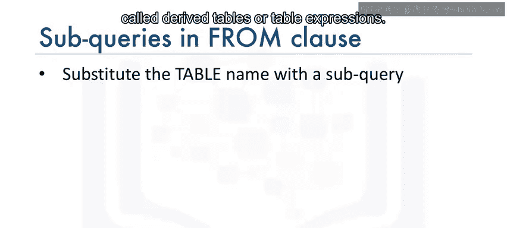

---

## 在FROM子句中使用子查询（派生表/表表达式） 🗂️

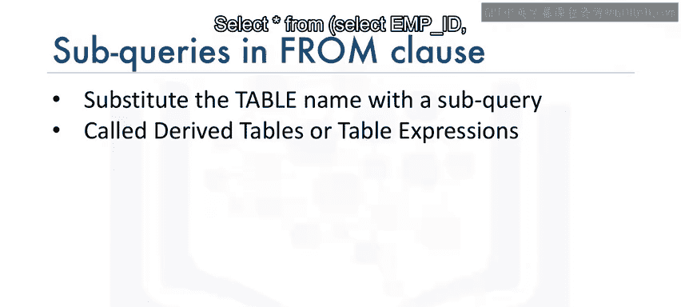

另一种选择是将子查询作为`FROM`子句的一部分。这类子查询有时被称为派生表或表表达式，因为外层查询将子查询的结果作为一个数据源来使用。

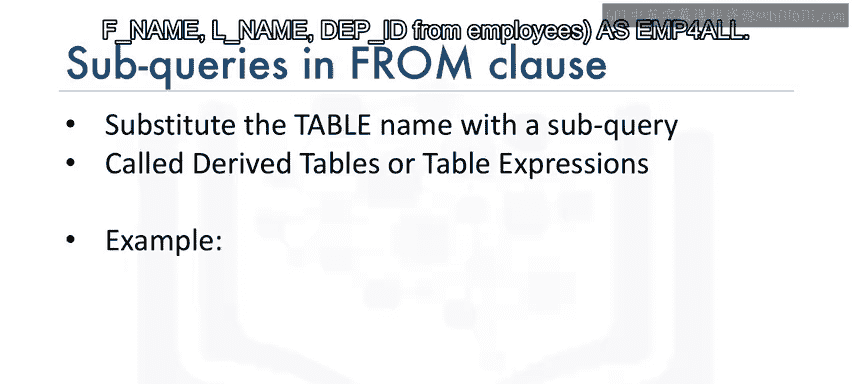

例如，我们可以创建一个不包含敏感信息（如出生日期、薪水）的员工信息派生表：
```sql
SELECT *
FROM (SELECT employee_id, first_name, last_name, department_id
      FROM employees) AS employee_info_all;
```
在这个简单的例子中，我们本可以直接在外层查询中指定这些列。然而，在处理多表连接等更复杂的场景时，派生表会变得非常强大和有用。

---

## 总结 📝

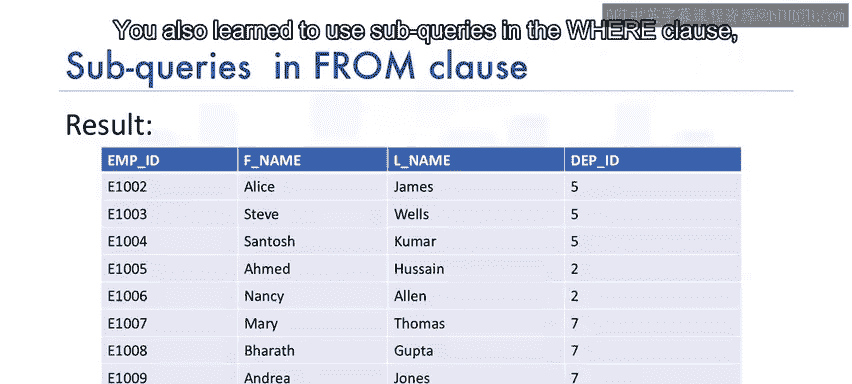

本节课中我们一起学习了子查询和嵌套查询的用法。我们了解到，子查询可以帮助我们构建更丰富的查询逻辑，并克服聚合函数在`WHERE`子句等位置使用的限制。

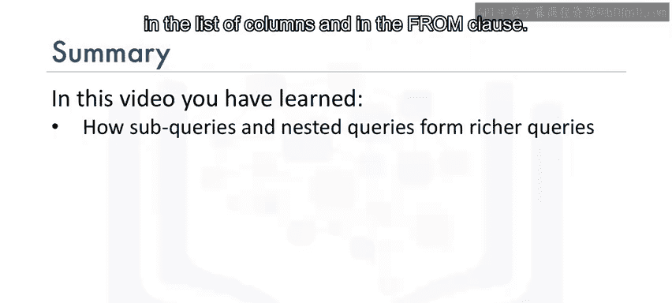

具体来说，你学会了：
*   子查询的基本概念和作用。
*   如何在`WHERE`子句中使用子查询来过滤数据。
*   如何在`SELECT`列列表中使用子查询作为列表达式。
*   如何在`FROM`子句中使用子查询来创建派生表或表表达式。

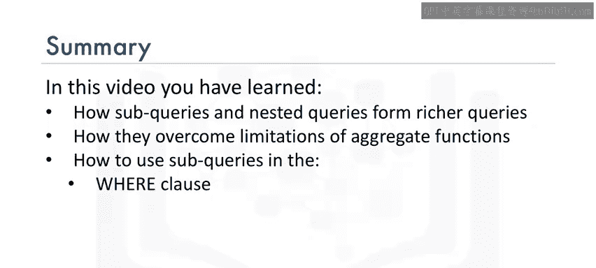

掌握子查询是提升SQL技能的关键一步，它为你处理复杂的数据检索需求打开了新的大门。