# 018：使用多个表

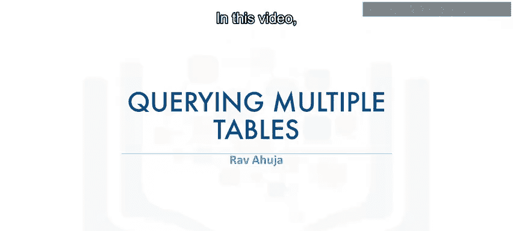


在本节课中，我们将学习如何编写查询以访问数据库中的多个表。你将掌握使用子查询和隐式连接这两种方法来组合不同表中的数据。

---

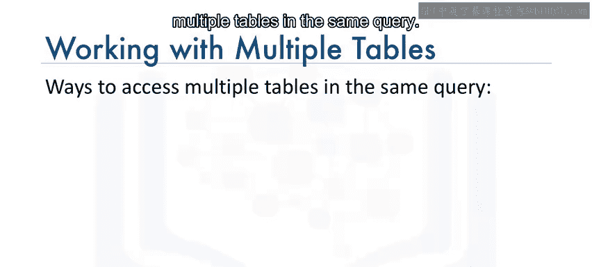

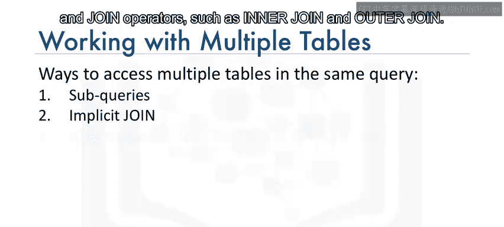

## 概述

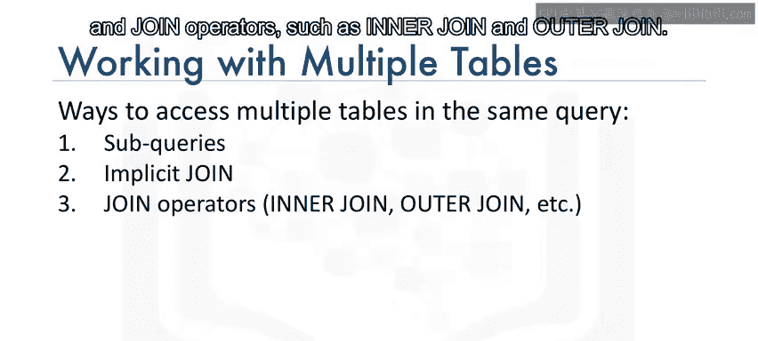

在之前的课程中，我们学习了如何从单个表中查询数据。然而，实际的数据通常分布在多个相关的表中。为了获取更完整的信息，我们需要学会同时访问多个表。本节将介绍两种实现此目的的方法：**子查询**和**隐式连接**。

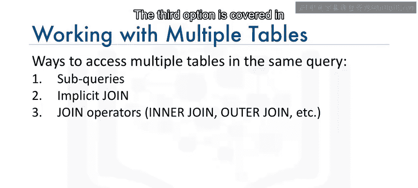

---


## 使用子查询访问多个表

上一节我们介绍了子查询的基本概念。本节中我们来看看如何利用子查询来处理多个表。

子查询允许我们将一个查询的结果作为另一个查询的条件。以下是几种常见的使用场景。


### 场景一：基于另一表的存在性筛选数据

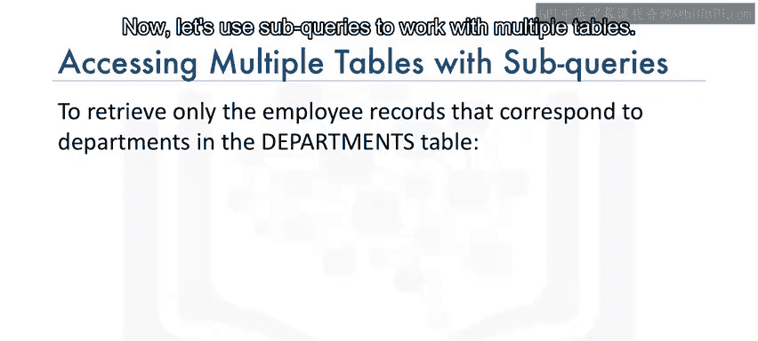

如果我们只想检索`employees`表中那些`Department ID`也存在于`departments`表中的员工记录，可以使用以下子查询：

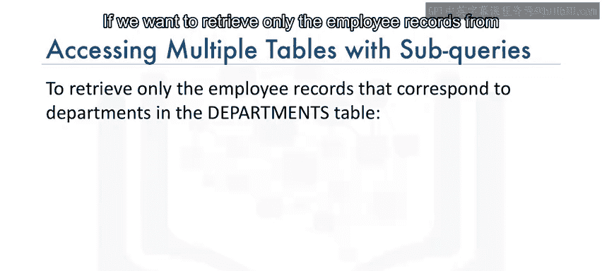

```sql
SELECT * FROM employees
WHERE Department_ID IN (
    SELECT Department_ID FROM departments
);
```

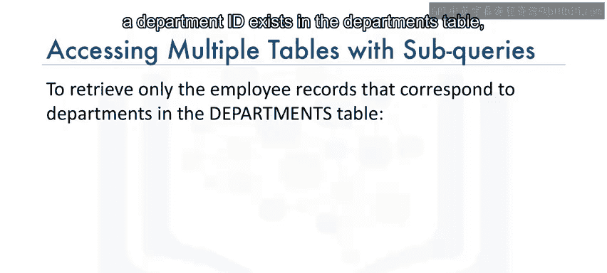

在这个例子中，外部查询访问`employees`表，而子查询在`departments`表上执行，用于过滤外部查询的结果集。

### 场景二：通过关联表进行复杂筛选

假设我们想检索位于特定地点（例如 `L0002`）的所有员工列表。`employees`表本身没有地点信息，但`departments`表中有一个`Location_ID`列。

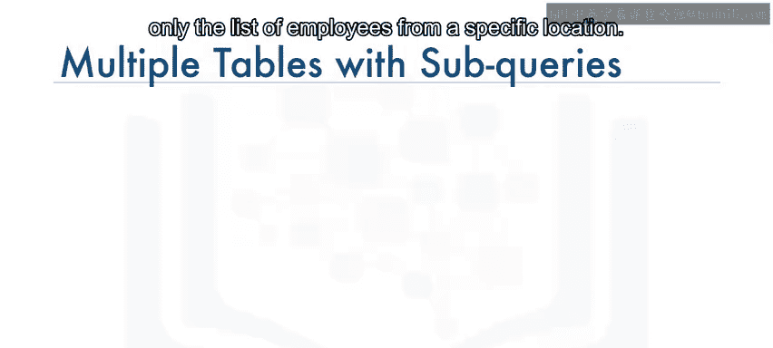

因此，我们可以使用来自`departments`表的子查询作为`employees`表查询的输入：

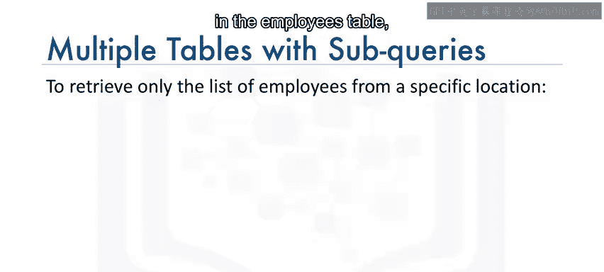

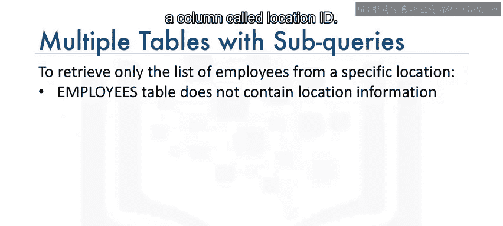

```sql
SELECT * FROM employees
WHERE Department_ID IN (
    SELECT Department_ID FROM departments
    WHERE Location_ID = ‘L0002’
);
```

### 场景三：从关联表中获取信息

现在，让我们检索薪资超过70,000美元的员工所在的部门ID和部门名称。


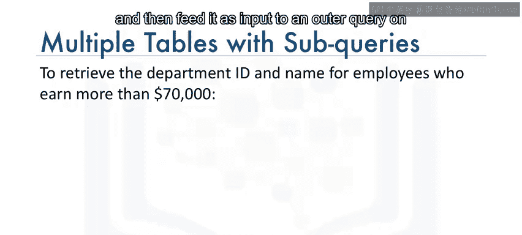

我们需要一个在`employees`表上的子查询来满足薪资条件，然后将其作为外部查询的输入，以从`departments`表中获取匹配的部门信息：

```sql
SELECT Department_ID, Department_Name FROM departments
WHERE Department_ID IN (
    SELECT Department_ID FROM employees
    WHERE Salary > 70000
);
```

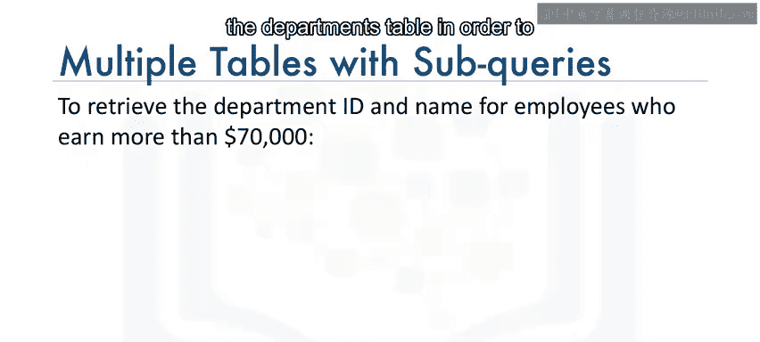

---


## 使用隐式连接访问多个表

除了子查询，我们还可以通过在查询的`FROM`子句中指定多个表来访问它们。这种方法被称为“隐式连接”。

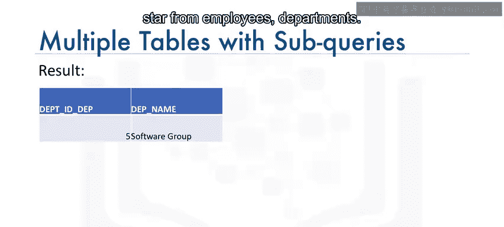

### 理解隐式连接

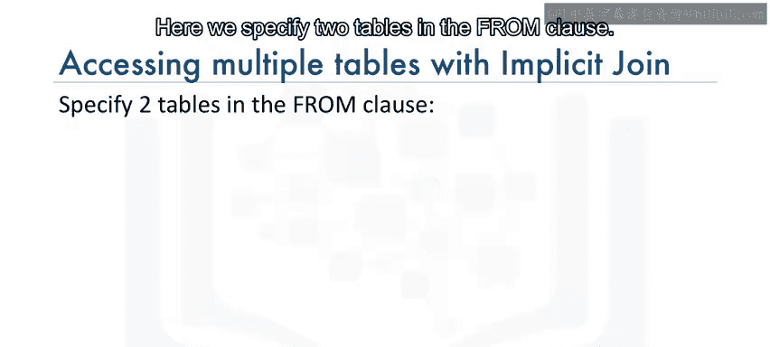

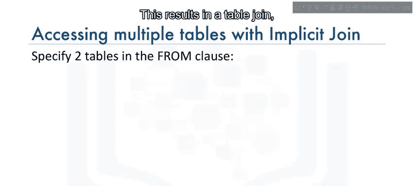

考虑以下示例：

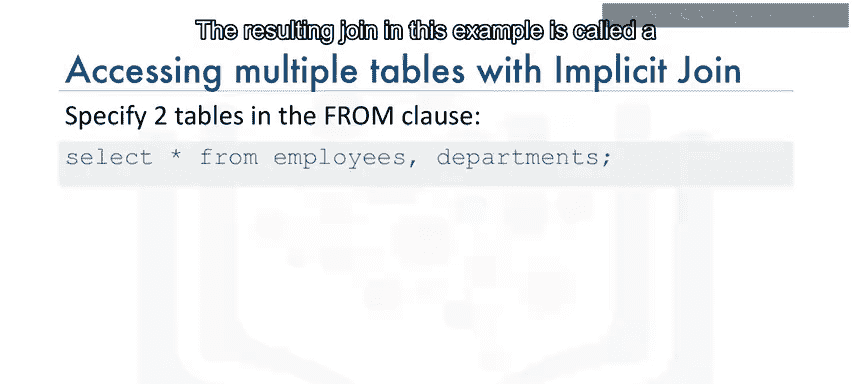

```sql
SELECT * FROM employees, departments;
```

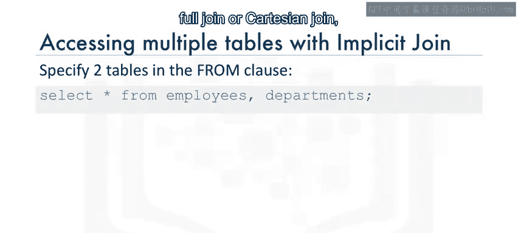

这里我们在`FROM`子句中指定了两个表。这会导致一个表连接，但请注意，我们并没有显式地使用`JOIN`操作符。

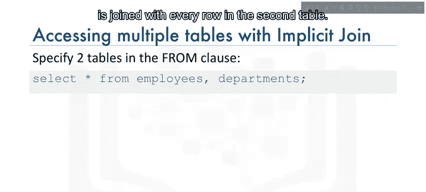

此示例中的连接结果称为**全连接**或**笛卡尔积**，因为第一个表中的每一行都与第二个表中的每一行进行连接。如果你检查结果集，会发现行数比两个表单独的行数要多得多。

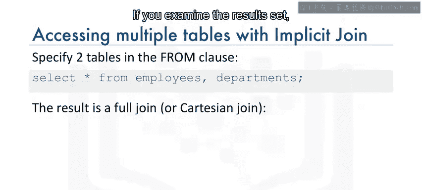

### 使用WHERE子句限制结果

我们可以使用`WHERE`子句来限制结果集，例如，只返回部门ID匹配的行：

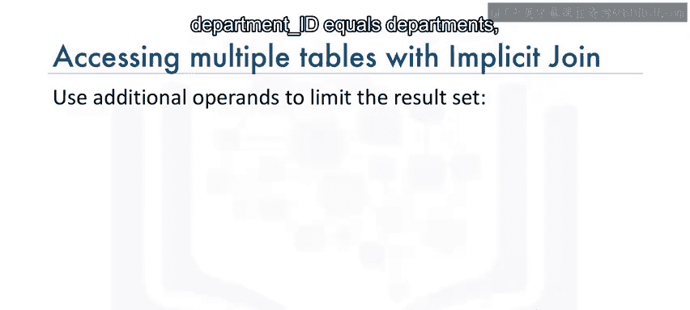

```sql
SELECT * FROM employees, departments
WHERE employees.Department_ID = departments.Department_ID;
```


请注意，在`WHERE`子句中，我们在列名前加上了表名作为前缀。这是为了**完全限定列名**，因为不同的表可能有完全相同的列名。

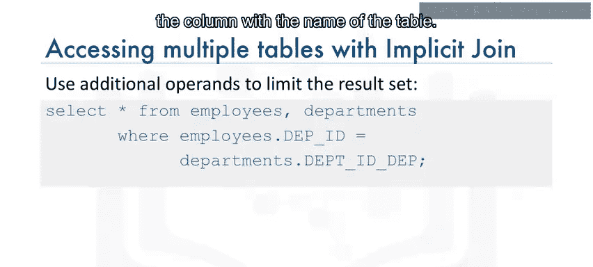

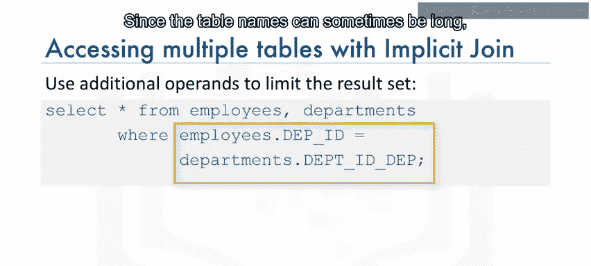

### 使用表别名简化查询

由于表名有时可能很长，我们可以为表名使用更短的别名，如下所示：

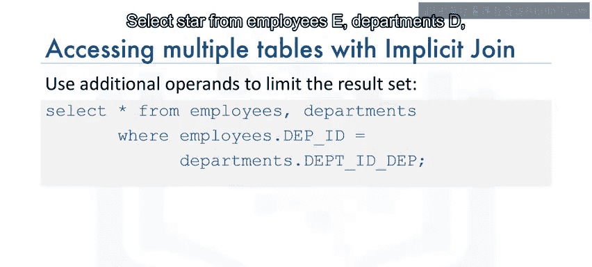

```sql
SELECT * FROM employees E, departments D
WHERE E.Department_ID = D.Department_ID;
```

这里我们为`employees`表定义了别名`E`，为`departments`表定义了别名`D`，然后在`WHERE`子句中使用这些别名。

### 选择特定列

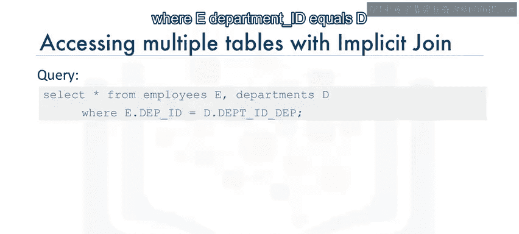

如果我们想查看每位员工的ID及其部门名称，可以输入以下代码：

```sql
SELECT E.Employee_ID, D.Department_Name
FROM employees E, departments D
WHERE E.Department_ID = D.Department_ID;
```

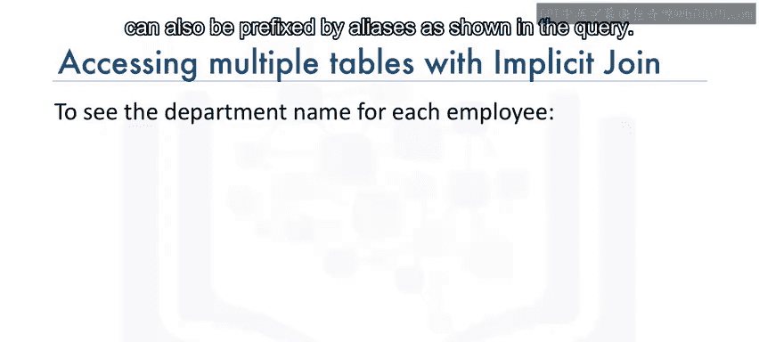

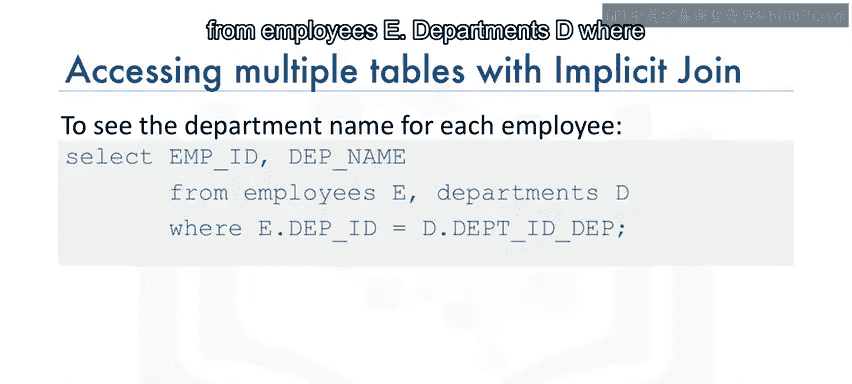

与之前类似，`SELECT`子句中的列名也可以用别名作为前缀：

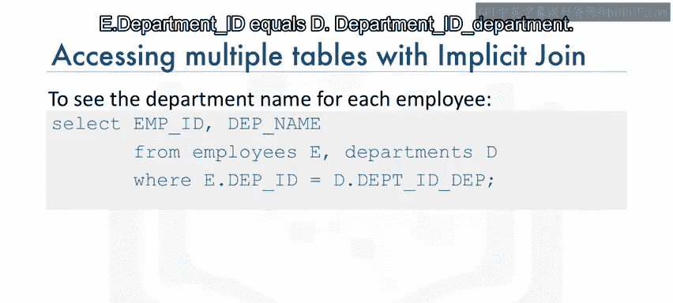

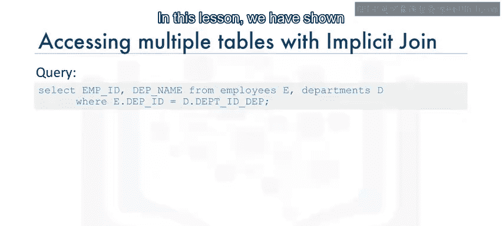

```sql
SELECT E.Employee_ID, D.Department_ID
FROM employees E, departments D
WHERE E.Department_ID = D.Department_ID;
```

---

## 总结

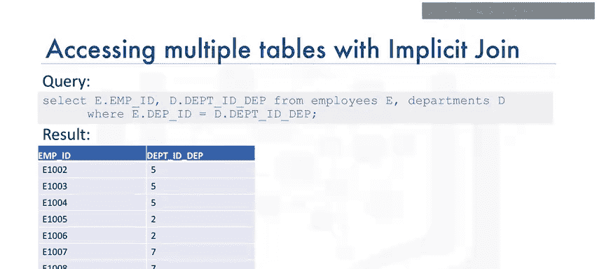

本节课中我们一起学习了如何使用**子查询**和**隐式连接**来操作多个数据库表。子查询适合用于基于另一个表的结果进行过滤或数据检索，而隐式连接则通过在`FROM`子句中列出多个表并配合`WHERE`子句来关联它们，提供了一种组合表数据的直接方式。掌握这些基础方法，是进行更复杂数据分析和操作的重要一步。