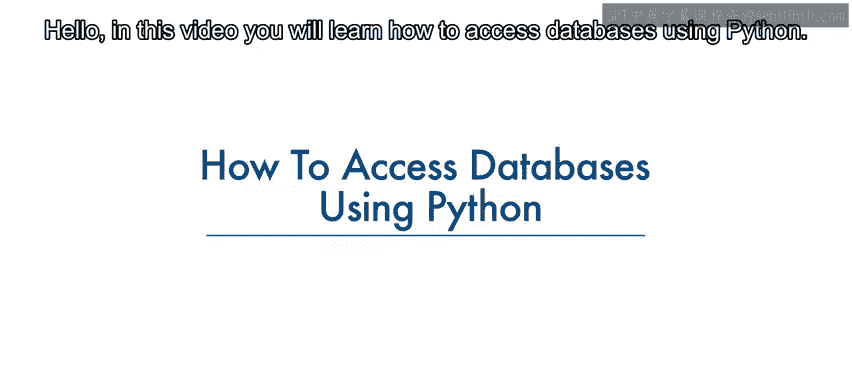
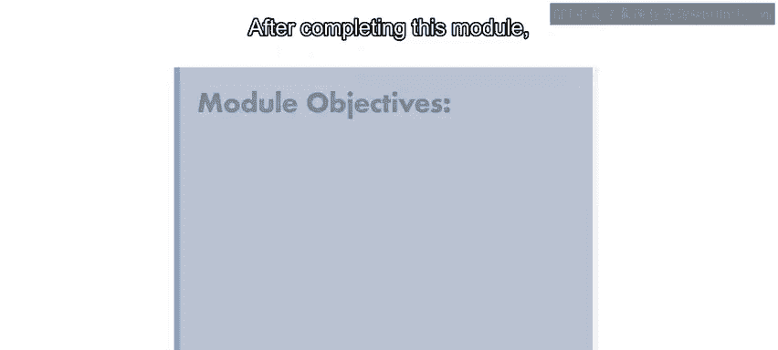
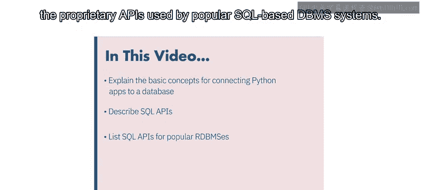
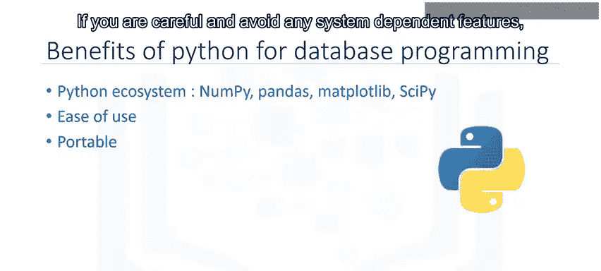
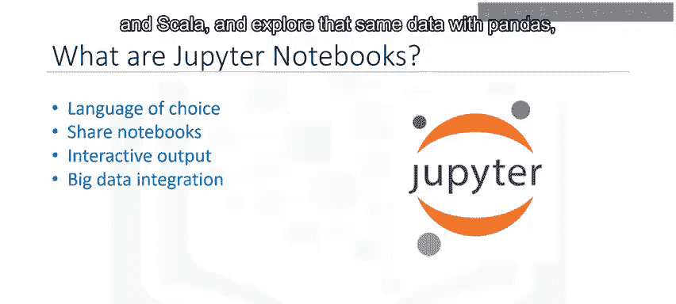
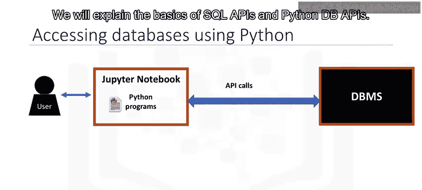
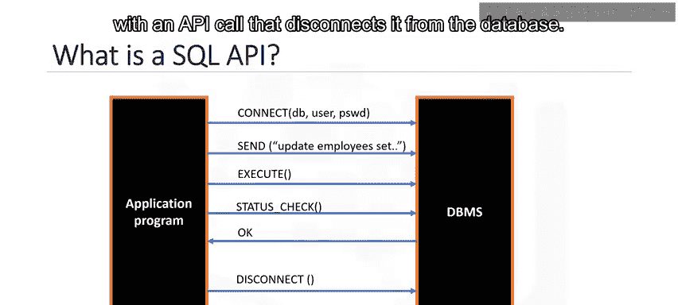
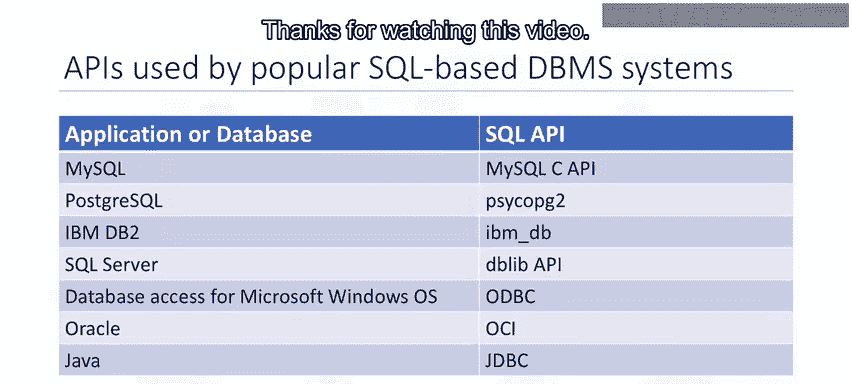

# 019：使用Python访问数据库 🐍

在本节课中，我们将学习如何使用Python连接和操作数据库。数据库是数据科学家的重要工具。通过本模块的学习，你将能够解释使用Python连接数据库的基本概念，并在Jupyter Notebook中创建表、加载数据、使用SQL查询数据，最终进行分析。

---

## 概述 📋

在实验任务中，你将学习如何在云端创建数据库实例、连接到数据库、使用SQL从数据库查询数据，并使用Python进行分析。你将能够解释连接Python应用程序与数据库的基本概念，描述SQL API，并列举一些流行的基于SQL的数据库管理系统所使用的专有API。

---

## Python的优势回顾 🚀

让我们快速回顾一下使用Python连接数据库的一些优势。Python是一种流行的脚本语言，其生态系统非常丰富，为数据科学提供了易于使用的工具。一些最受欢迎的包包括NumPy、Pandas、Matplotlib和SciPy。

Python易于学习，语法简单。由于其开源特性，Python已被移植到许多平台。只要注意避免使用任何系统依赖的功能，你的Python程序可以在这些平台上运行，无需任何修改。

Python支持关系型数据库系统。Python数据库API（通常称为DB API）的存在使得编写访问数据库的Python代码更加容易。与Python相关的详细文档也易于获取。

---

## Jupyter Notebook简介 📓

Notebook在数据科学领域非常流行，因为它们运行在一个允许创建和共享包含实时代码、公式、可视化和解释性文本的文档的环境中。Notebook界面是一个用于编程的虚拟笔记本环境。

Notebook界面的例子包括Mathematica Notebook、Maple Worksheet、MATLAB Notebook、IPython Jupyter、R Markdown、Apache Zeppelin、Apache Spark Notebook和Databricks Cloud。

在本模块中，我们将使用Jupyter Notebook。Jupyter Notebook是一个开源Web应用程序，允许你创建和共享包含实时代码、公式、可视化和叙述性文本的文档。

以下是使用Jupyter Notebook的一些优势：

*   支持超过40种编程语言，包括Python、R、Julia和Scala。
*   可以通过电子邮件、Dropbox、GitHub和Jupyter Notebook查看器与他人共享Notebook。
*   你的代码可以生成丰富的交互式输出，包括HTML、图像、视频、LaTeX和自定义MIME类型。
*   你可以利用大数据工具（如Apache Spark），并通过Python、R和Scala探索相同的数据，同时使用Pandas、scikit-learn、ggplot2和TensorFlow进行分析。

---

## Python访问数据库的典型流程 🔄

这是用户通过编写在Jupyter Notebook（一种基于Web的编辑器）上的Python代码访问数据库的典型方式。Python程序通过一种机制与数据库管理系统（DBMS）通信。

Python代码使用API调用连接到数据库。我们将解释SQL API和Python DB API的基础知识。

应用程序编程接口（API）是一组你可以调用的函数，用于获取对某种服务的访问权限。SQL API由库函数调用组成，作为DBMS的应用程序编程接口。

为了将SQL语句传递给DBMS，应用程序会调用API中的函数，并调用其他函数从DBMS检索查询结果和状态信息。

下图展示了一个典型SQL API的基本操作：

1.  应用程序通过一个或多个API调用开始其数据库访问，这些调用将程序连接到DBMS。
2.  为了将SQL语句发送到DBMS，程序在缓冲区中将语句构建为文本字符串，然后进行API调用以将缓冲区内容传递给DBMS。
3.  应用程序进行API调用来检查其DBMS请求的状态并处理错误。
4.  应用程序通过一个API调用结束其数据库访问，该调用将其与数据库断开连接。

---

## 流行的SQL DBMS专有API 📚

现在，让我们学习一些流行的基于SQL的数据库管理系统所使用的专有API的基本概念。

每个数据库系统都有自己的库。如下表所示，它列出了一些应用程序及其对应的SQL API。

以下是几个主要的数据库连接API：

*   **MySQL C API**：提供对MySQL客户端/服务器协议的低级访问，使C程序能够访问数据库内容。
*   **Psycopg2 API**：连接Python应用程序与PostgreSQL数据库。
*   **ibm_db API**：用于连接Python应用程序与IBM DB2数据库。
*   **pyodbc API**：用于连接到SQL Server数据库。
*   **ODBC**：用于Microsoft Windows操作系统的数据库访问。
*   **OCI**：由Oracle数据库使用。
*   **JDBC**：由Java应用程序使用。

---

## 总结 🎯

本节课中，我们一起学习了使用Python访问数据库的核心流程。我们回顾了Python在数据科学中的优势，介绍了Jupyter Notebook这一强大的交互式编程环境，并解释了应用程序通过SQL API与数据库交互的基本原理。最后，我们列举了连接不同数据库系统（如MySQL、PostgreSQL、DB2、SQL Server等）所需的特定Python库或API。掌握这些知识是进行数据获取和后续分析的重要基础。