# 020：使用DB API编写代码

在本节课中，我们将学习如何使用Python的DB API与数据库进行交互。我们将介绍DB API的基本概念、数据库游标的作用，并通过一个简单的示例演示如何编写代码来连接数据库、执行查询并获取结果。

---

## 🔗 DB API简介

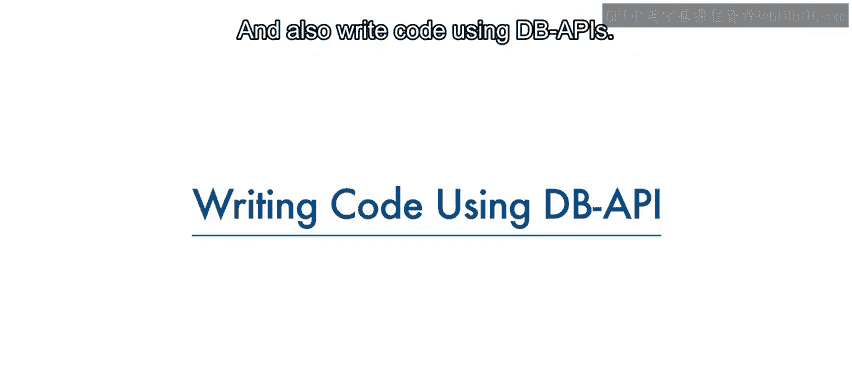

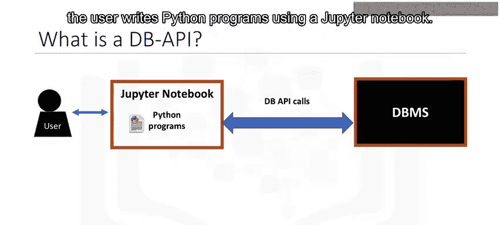

上一节我们介绍了Python与数据库交互的基本方式。本节中，我们来看看DB API的具体作用。

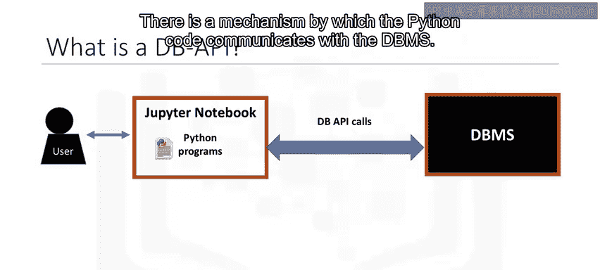

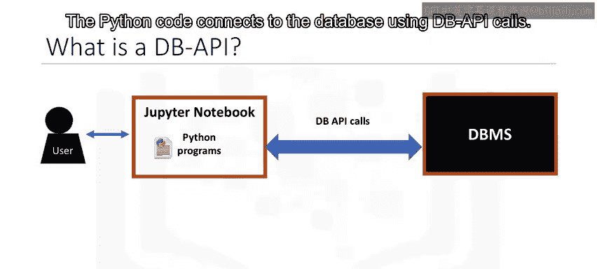

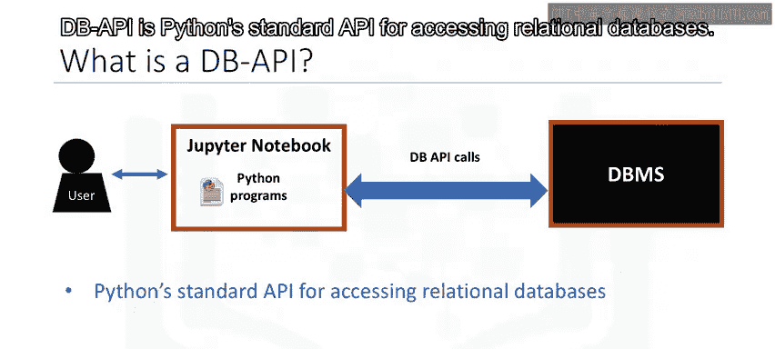

DB API是Python访问关系型数据库的标准API。它允许你编写一个程序，与多种关系型数据库进行交互，而无需为每种数据库编写单独的程序。

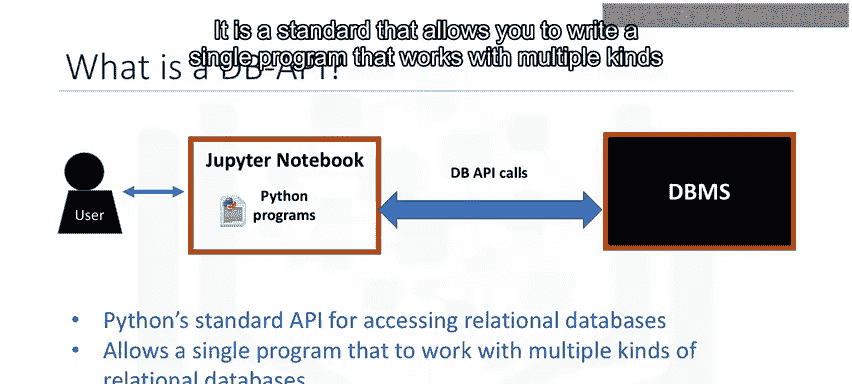

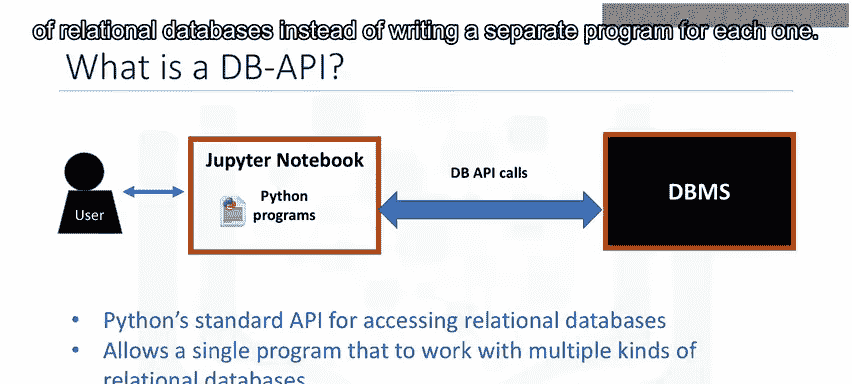

**公式**：`DB API = Python标准接口 + 多种数据库支持`

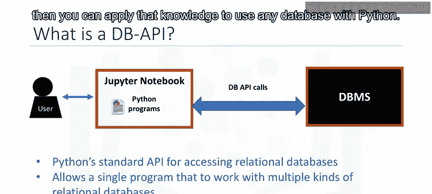

使用DB API的主要优势如下：

以下是使用DB API的一些优点：

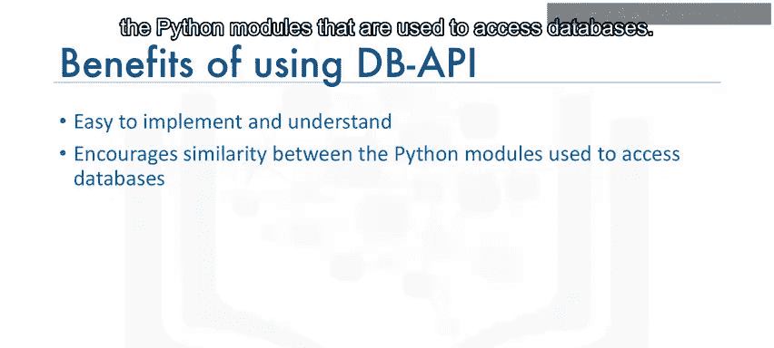

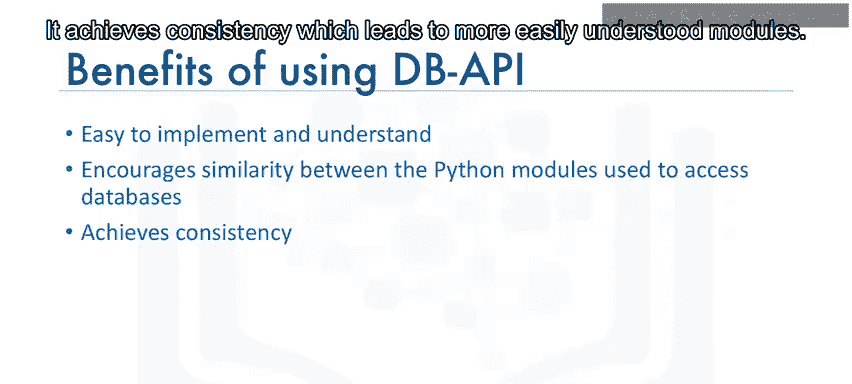

*   易于实现和理解。
*   鼓励不同数据库模块之间的一致性。
*   代码在不同数据库间更具可移植性。
*   扩展了Python的数据库连接能力。

---

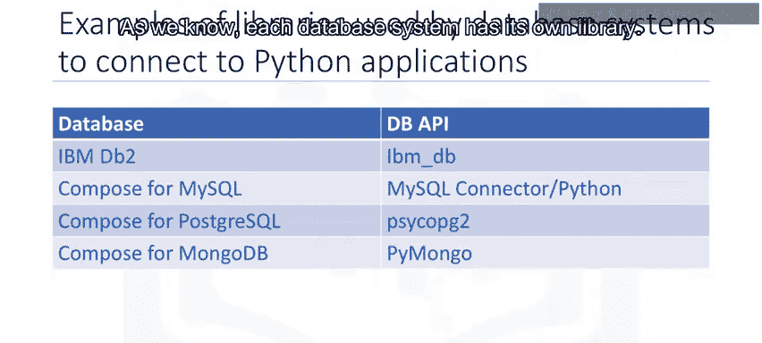

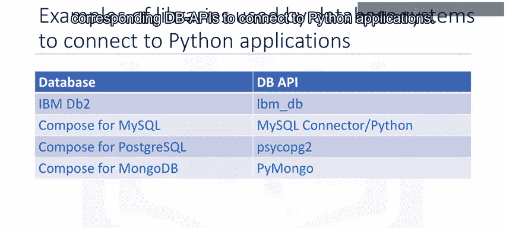

## 📚 数据库连接库

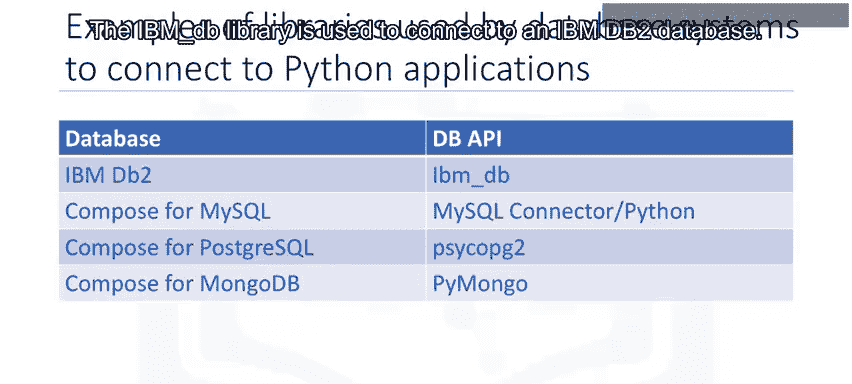

每个数据库系统都有其对应的Python库来实现DB API标准。

以下是几种常见数据库及其对应的Python连接库：

*   **IBM DB2**：使用 `ibm_db` 库。
*   **MySQL**：使用 `mysql-connector-python` 库。
*   **PostgreSQL**：使用 `psycopg2` 库。
*   **MongoDB**：使用 `pymongo` 库。

---

## 🧭 DB API的核心概念


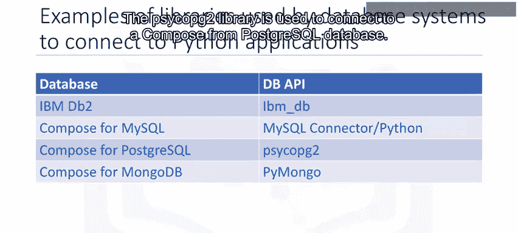

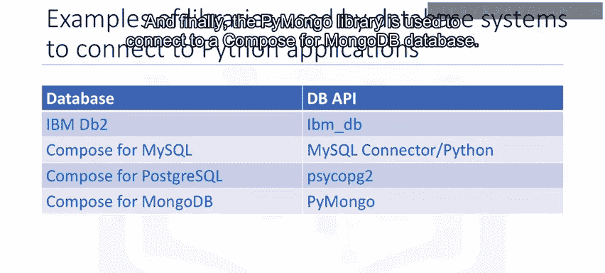

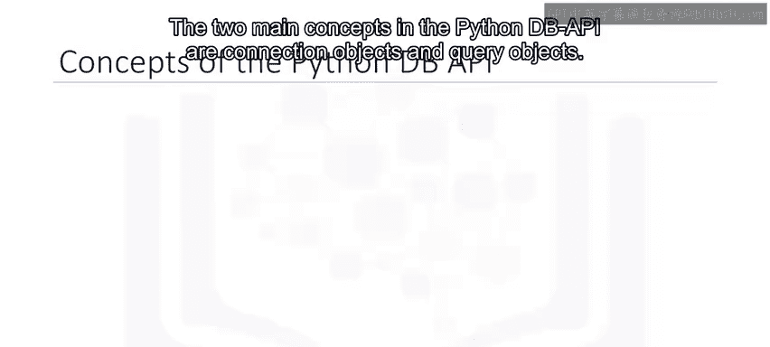

DB API主要围绕两个核心对象展开：连接对象和游标对象。

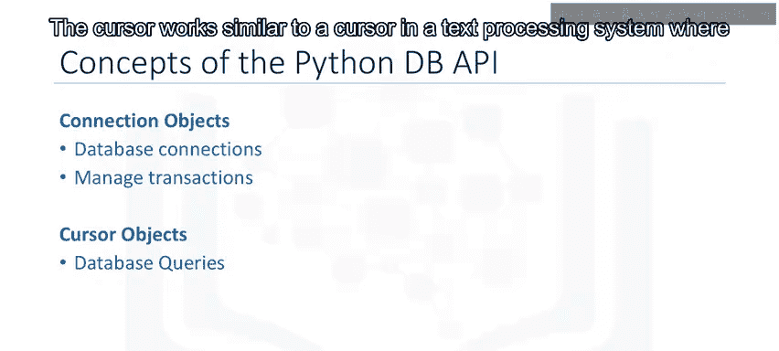

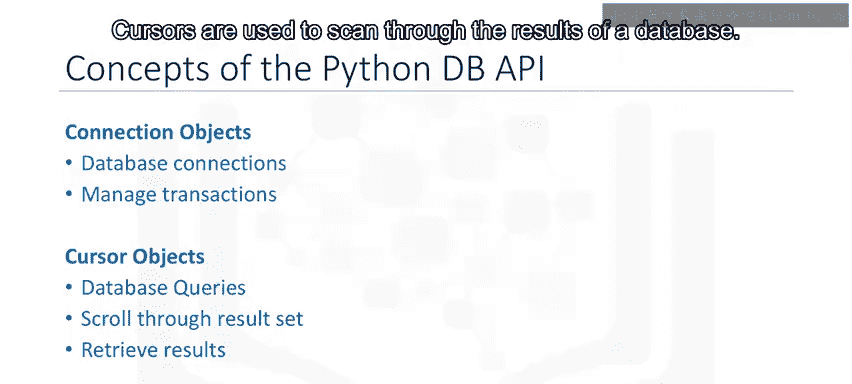

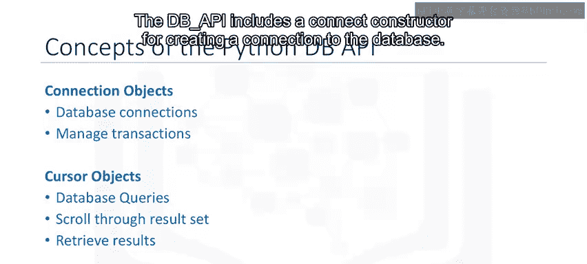

### 连接对象 (Connection Object)

连接对象用于建立和管理与数据库的连接及事务。通过 `connect()` 构造函数创建连接，它返回一个连接对象。该对象提供以下主要方法：

以下是连接对象的关键方法：

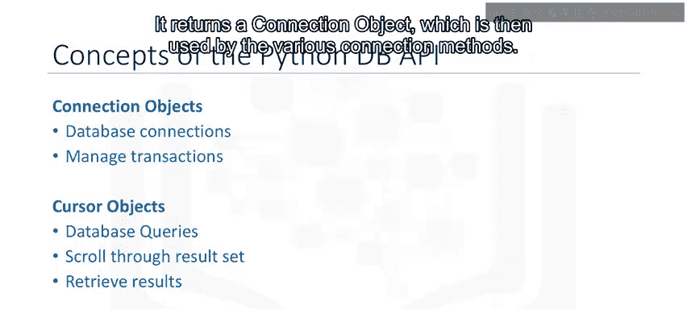

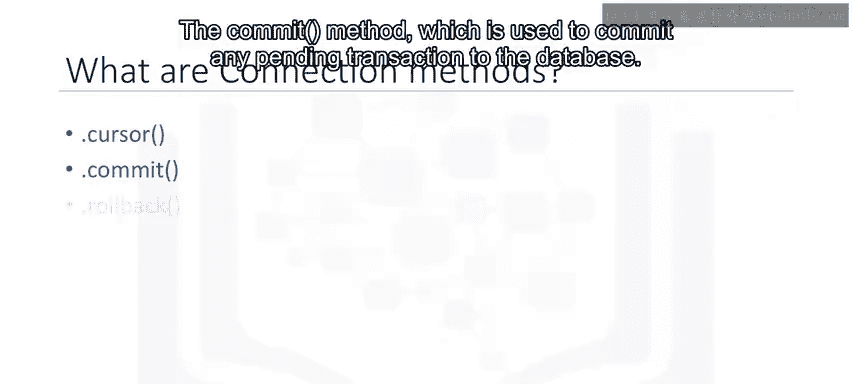

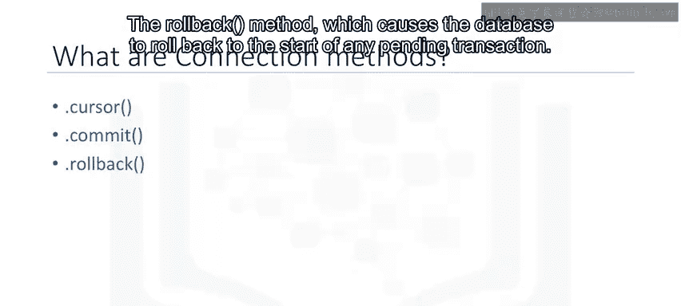

*   `cursor()`：返回一个新的游标对象。
*   `commit()`：提交所有待处理的事务到数据库。
*   `rollback()`：回滚到任何待处理事务的起点。
*   `close()`：关闭数据库连接。

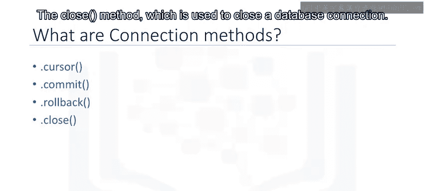

### 游标对象 (Cursor Object)

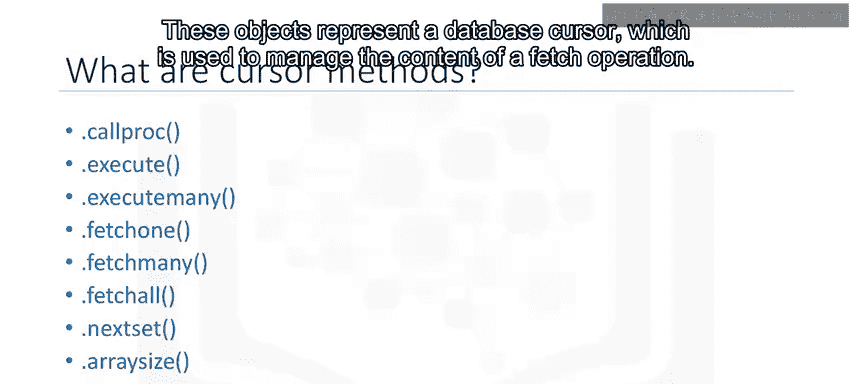

游标对象用于执行查询并管理获取结果的操作。它的行为类似于文本处理系统中的光标，可以在结果集中移动，将数据提取到应用程序中。

**类比**：就像程序通过**文件句柄**访问文件内容一样，程序通过**游标**访问查询结果。文件句柄跟踪在文件中的当前位置，游标则跟踪在查询结果中的当前位置。

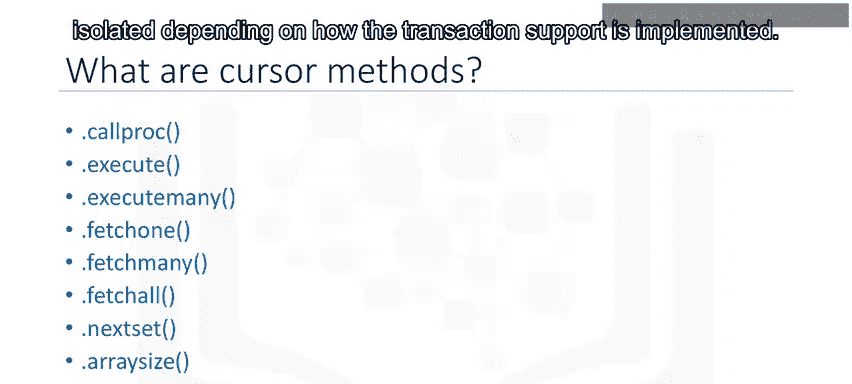

关于游标的重要说明：

*   从**同一连接**创建的游标不是隔离的。一个游标对数据库所做的更改会立即被其他游标看到。
*   从**不同连接**创建的游标是否隔离，取决于事务支持的实现方式。

---

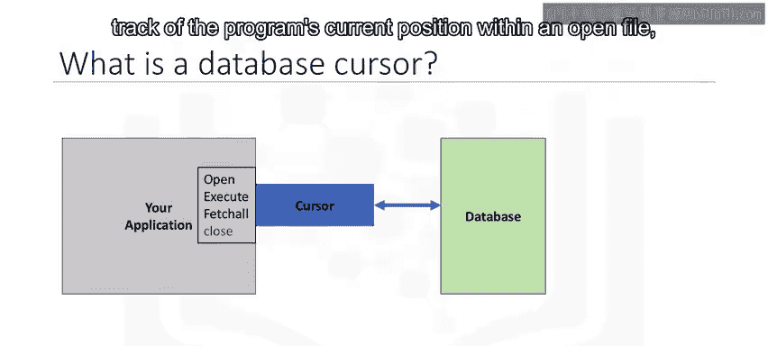

## 💻 使用DB API的代码流程

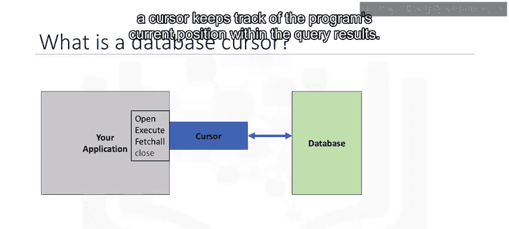

现在，让我们通过一个典型的Python应用程序流程，来看看如何使用DB API查询数据库。

以下是使用DB API进行数据库查询的基本步骤：

1.  **导入数据库模块**：导入特定数据库的库（如 `ibm_db`）。
2.  **建立连接**：使用 `connect()` 函数，传入数据库名称、用户名和密码等参数，获取连接对象。
    ```python
    conn = ibm_db.connect(database, user, password)
    ```
3.  **创建游标**：通过连接对象的 `cursor()` 方法创建游标对象。
    ```python
    cursor = conn.cursor()
    ```
4.  **执行查询**：使用游标对象的 `execute()` 方法运行SQL查询。
    ```python
    cursor.execute("SELECT * FROM table")
    ```
5.  **获取结果**：使用游标对象的方法（如 `fetchall()`）获取查询结果。
    ```python
    rows = cursor.fetchall()
    ```
6.  **关闭连接**：完成所有操作后，务必使用 `close()` 方法关闭连接，以释放资源。
    ```python
    conn.close()
    ```

---

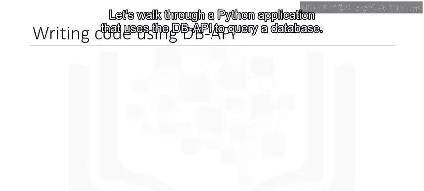

## 📝 课程总结

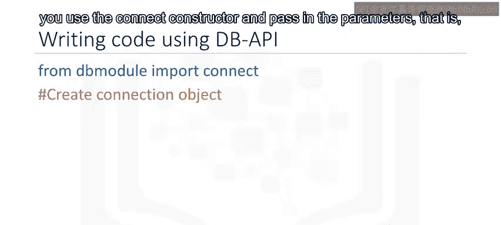

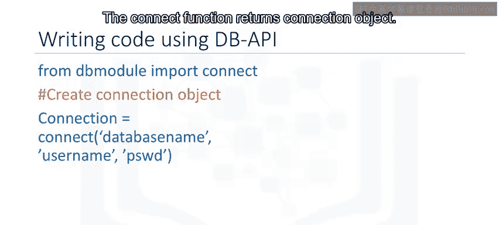

本节课中，我们一起学习了Python DB API的核心知识。我们了解了DB API作为标准接口的优势，认识了连接对象和游标对象这两个关键概念及其方法，并掌握了使用DB API连接数据库、执行查询和关闭连接的完整代码流程。记住，始终在操作结束后关闭数据库连接是一个重要的好习惯。