# 021：使用IBM DB API连接数据库 📚

在本节课中，我们将学习如何使用IBM DB API连接数据库。我们将了解IBM DB API的基本概念，以及使用Python连接IBM DB2数据库所需的凭证和步骤。课程将通过Jupyter Notebook中的代码示例进行演示。

---

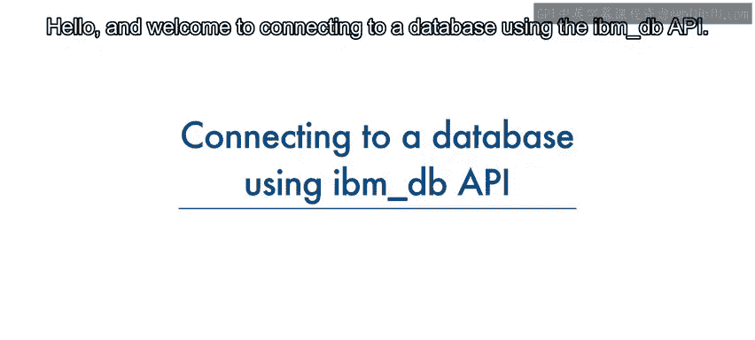

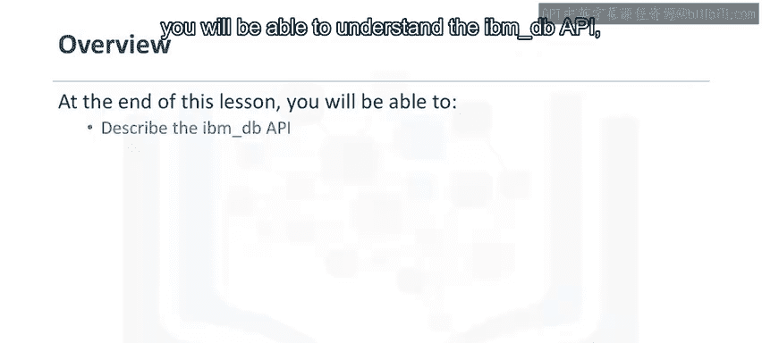

## IBM DB API概述 🔍

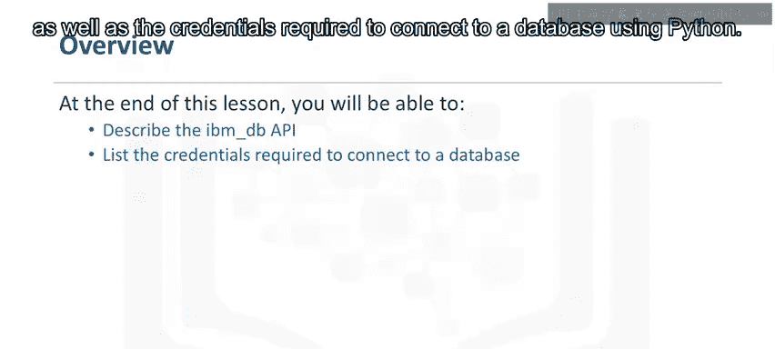

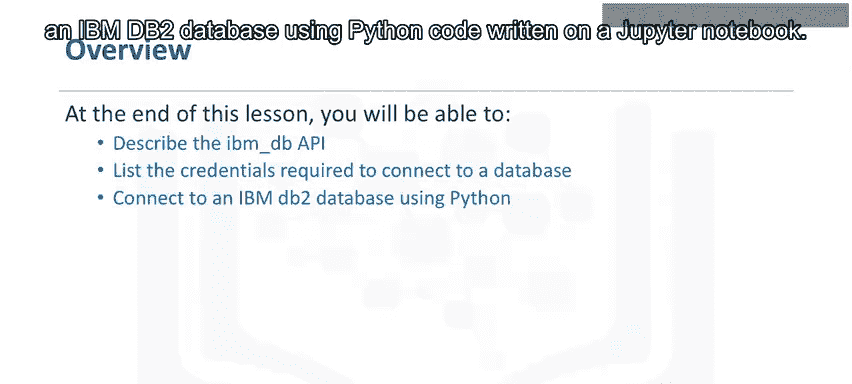

IBM DB API提供了一系列有用的Python函数，用于访问和操作IBM数据服务器数据库中的数据。这些功能包括连接数据库、准备和执行SQL语句、从结果集中获取行、调用存储过程、提交和回滚事务、处理错误以及检索元数据。

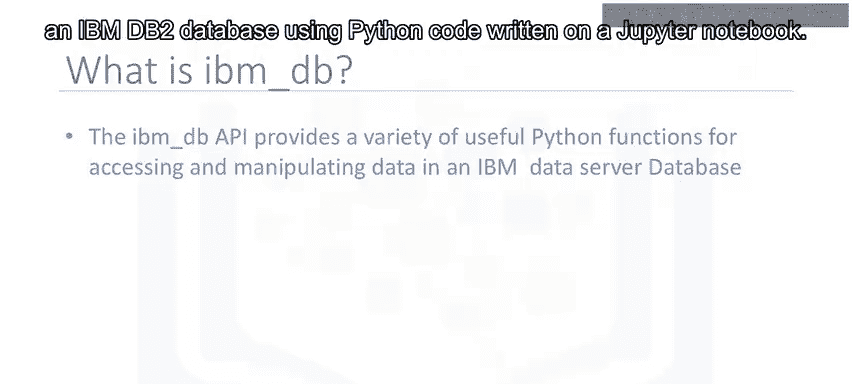

---

## 连接数据库所需信息 🔑

要连接到DB2数据库，需要以下信息：

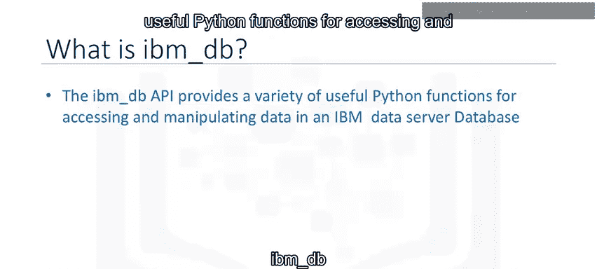

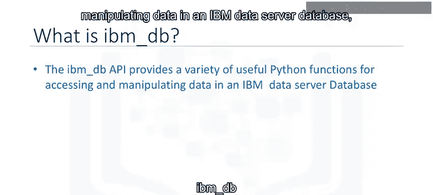

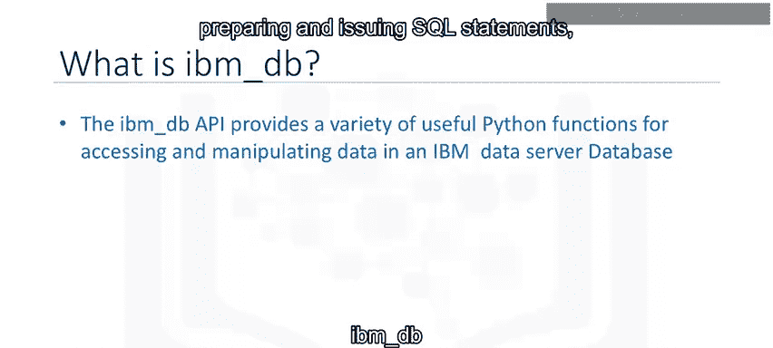

*   驱动程序名称
*   数据库名称
*   主机DNS名称或IP地址
*   主机端口
*   连接协议
*   用户ID
*   用户密码

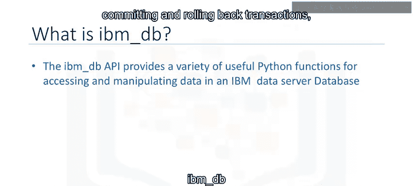

---

## 使用Python代码连接数据库 💻

上一节我们介绍了连接数据库所需的信息，本节中我们来看看如何在Python中实际建立连接。

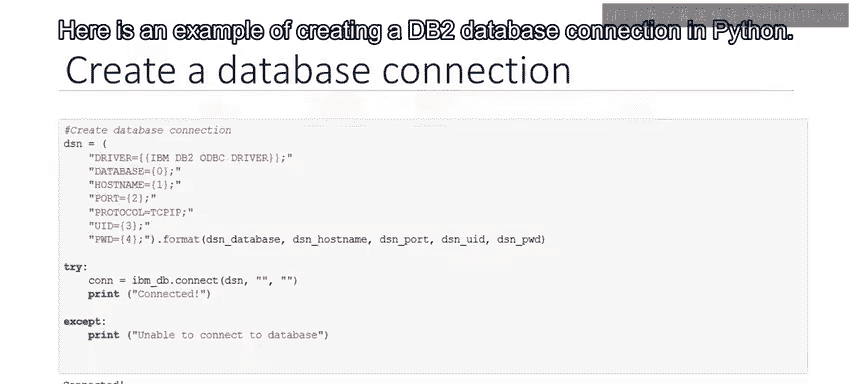

以下是创建DB2数据库连接的代码示例：

```python
import ibm_db

# 创建存储连接凭证的DSN对象
dsn = (
    "DRIVER={IBM DB2 ODBC DRIVER};"
    "DATABASE=数据库名;"
    "HOSTNAME=主机地址;"
    "PORT=端口号;"
    "PROTOCOL=TCPIP;"
    "UID=用户名;"
    "PWD=密码;"
)

# 使用connect函数建立非持久连接
try:
    conn = ibm_db.connect(dsn, "", "")
    print("连接成功")
except:
    print("无法连接到数据库")
finally:
    # 关闭连接以释放资源
    if conn:
        ibm_db.close(conn)
```

我们创建一个连接对象`dsn`来存储连接凭证。然后，使用IBM DB API的`connect`函数来建立一个非持久连接，并将`dsn`对象作为参数传递给该函数。如果成功连接到数据库，代码将输出“连接成功”，否则输出“无法连接到数据库”。最后，通过关闭连接来释放所有资源。

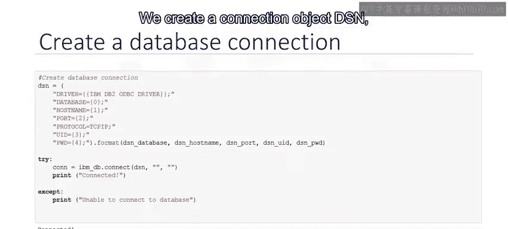

请记住，始终关闭连接非常重要，这样可以避免未使用的连接占用资源。

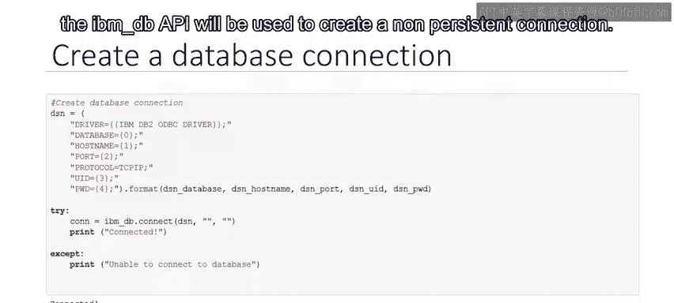

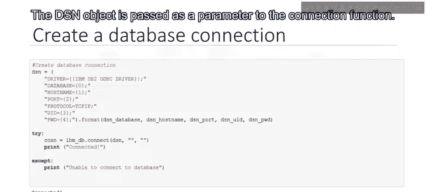

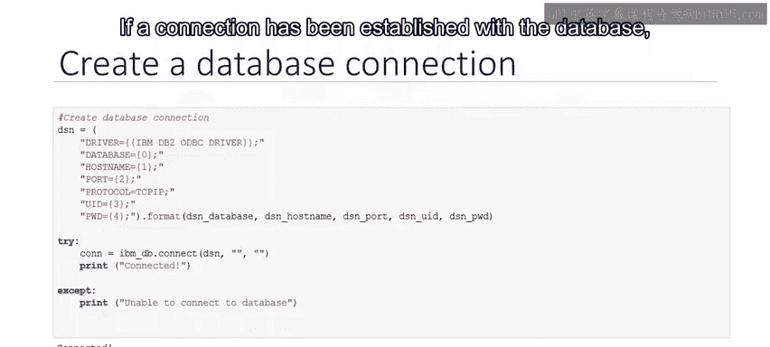

---

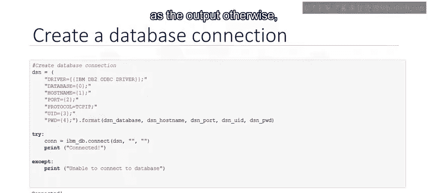

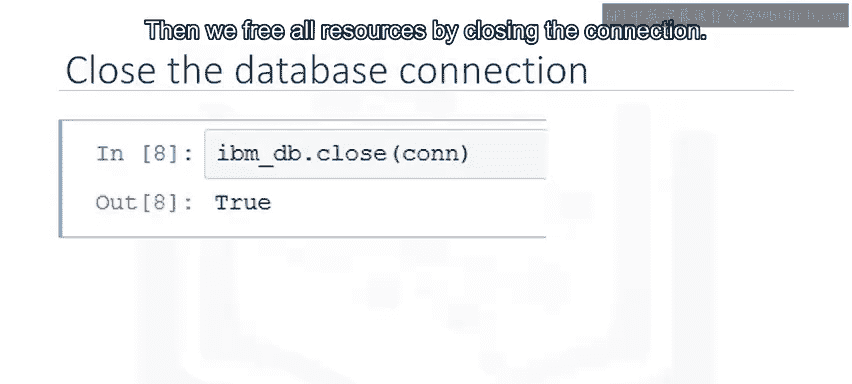

## 总结 📝

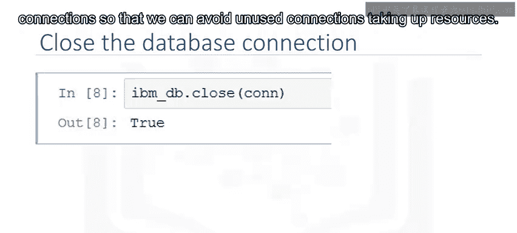

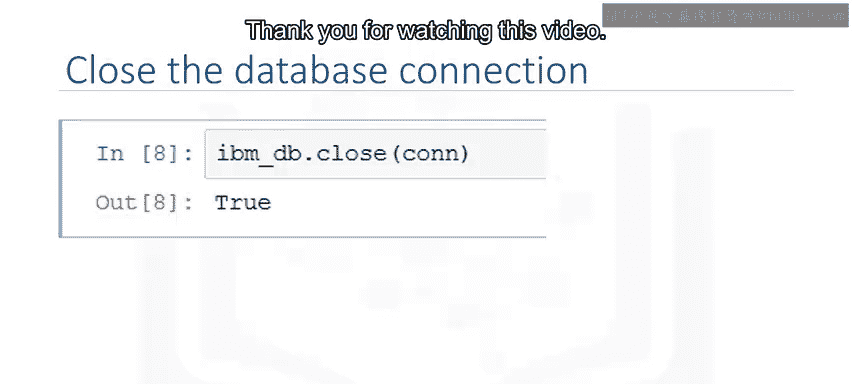

本节课中我们一起学习了如何使用IBM DB API连接数据库。我们了解了API的基本功能，明确了连接数据库所需的各项凭证，并通过具体的Python代码示例演示了在Jupyter Notebook中建立和关闭DB2数据库连接的全过程。掌握这些步骤是进行后续数据操作的基础。