# 022：创建表、加载数据和查询数据

在本节课中，我们将要学习使用Python进行数据库操作的基本概念，包括如何创建表、向表中加载数据以及如何查询数据。我们将以IBM DB2 on Cloud数据库和Jupyter Notebooks为例，演示这些任务的具体实现步骤。

完成本课程后，你将能够理解与创建表、加载数据和查询数据相关的基本概念，并掌握使用Python和IBM DB2数据库执行这些操作的方法。


---

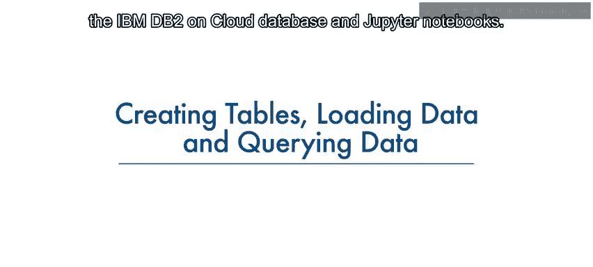

## 🔗 连接到数据库

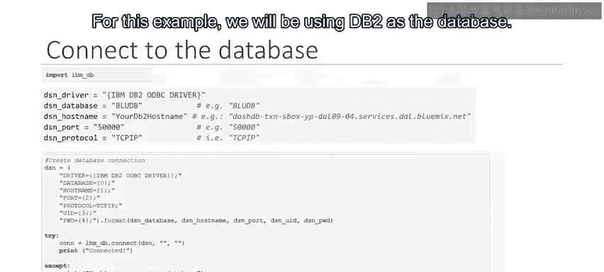

首先，我们需要建立与数据库的连接。我们使用`ibm_db` API的`connect`方法来获取一个连接资源。

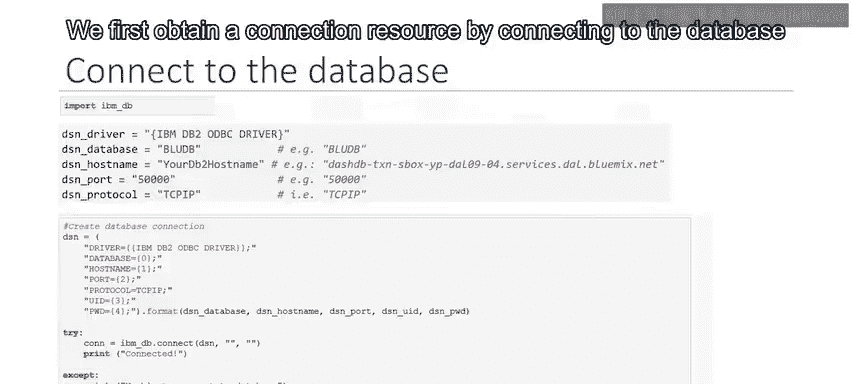

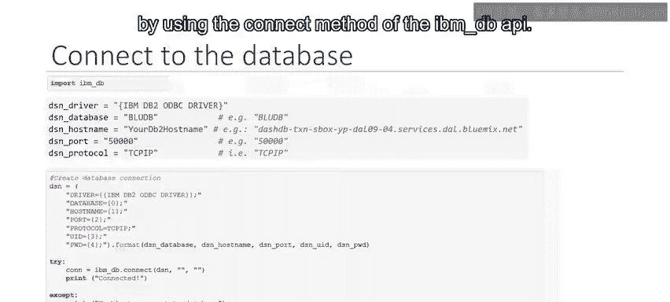

```python
import ibm_db
conn = ibm_db.connect("DATABASE=<dbname>;HOSTNAME=<hostname>;PORT=<port>;PROTOCOL=TCPIP;UID=<username>;PWD=<password>;", "", "")
```

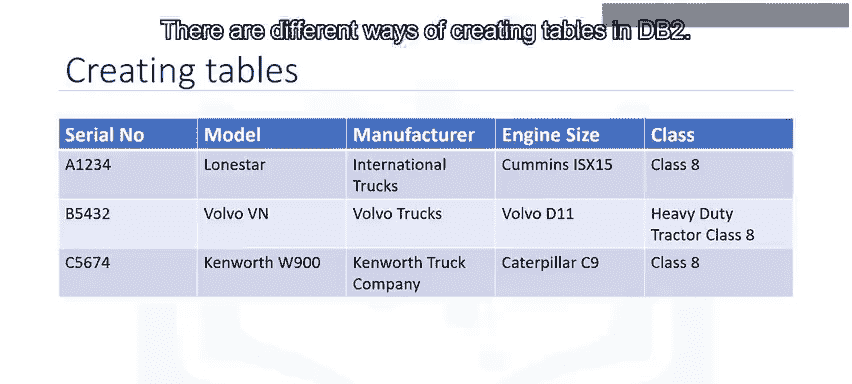

在上面的代码中，你需要将尖括号`<>`中的占位符替换为你自己的数据库名称、主机名、端口、用户名和密码。

---

## 🏗️ 创建表

在DB2中，有多种创建表的方式，例如使用DB2提供的Web控制台，或者从任何SQL、R或Python环境中创建。本节中我们来看看如何从Python应用程序中在DB2中创建表。

以下是一个商业卡车数据库的示例表结构。我们将学习如何使用Python代码在DB2中创建这个“卡车”表。

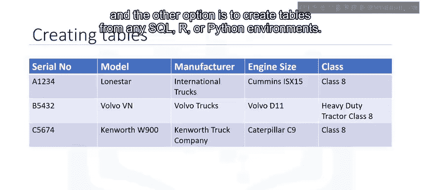

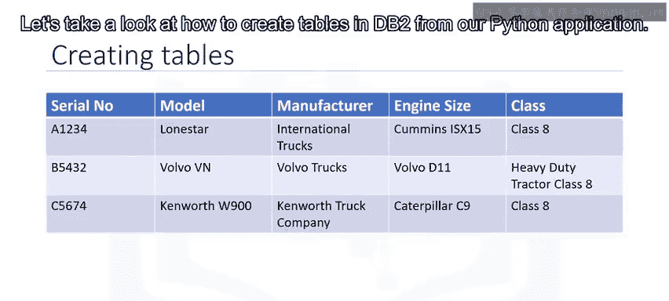

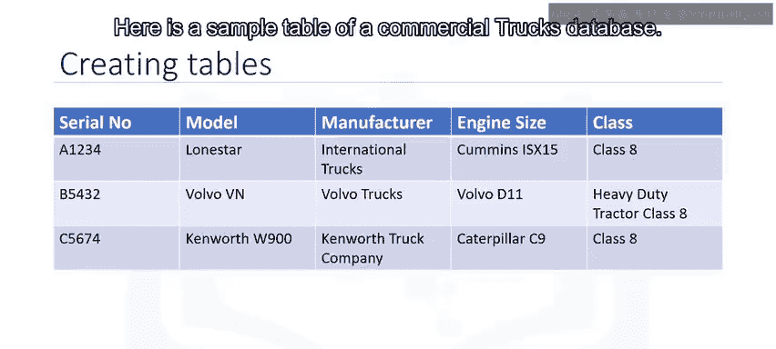

要创建表，我们使用`ibm_db` API的`ibm_db.exec_immediate`函数。该函数的参数如下：
*   `connection`: 一个有效的数据库连接资源，由`ibm_db.connect`或`ibm_db.pconnect`函数返回。
*   `statement`: 一个包含SQL语句的字符串。
*   `options`: 一个可选参数，是一个指定返回结果集游标类型的字典。

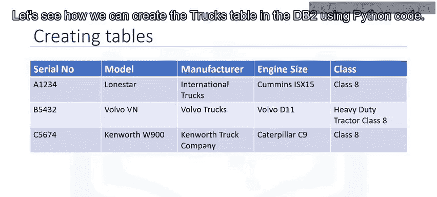


以下是创建名为`trucks`的表的Python代码：


```python
createTableSQL = """
CREATE TABLE trucks (
    serial_no VARCHAR(20) PRIMARY KEY NOT NULL,
    model VARCHAR(20) NOT NULL,
    manufacturer VARCHAR(20) NOT NULL,
    engine_size VARCHAR(20) NOT NULL,
    truck_class VARCHAR(20) NOT NULL
)
"""
createStmt = ibm_db.exec_immediate(conn, createTableSQL)
```

我们使用`ibm_db.exec_immediate`函数，并将之前创建的连接资源`conn`作为第一个参数传递给该函数。下一个参数是SQL语句，即用于创建`trucks`表的`CREATE TABLE`查询。新创建的表将包含五列，其中`serial_no`是主键。


---


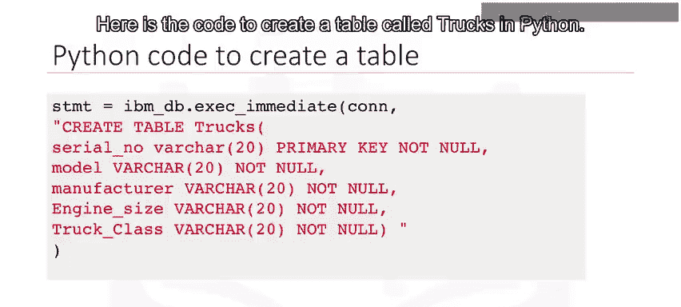

## 📥 加载数据

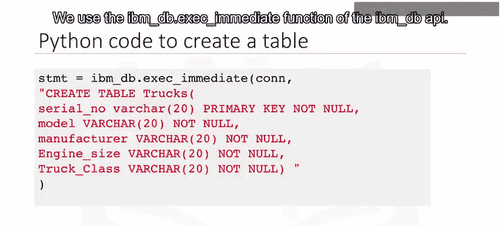

上一节我们介绍了如何创建表，本节中我们来看看如何向表中插入数据。我们同样使用`ibm_db.exec_immediate`函数。

连接资源`conn`作为第一个参数传递给该函数。下一个参数是SQL语句，即用于向`trucks`表插入数据的`INSERT INTO`查询。

以下是向表中插入一行数据的示例：

```python
insertSQL = "INSERT INTO trucks VALUES('A1234', 'Lion', 'Ford', '5.4L', 'Class 8')"
insertStmt = ibm_db.exec_immediate(conn, insertSQL)
```

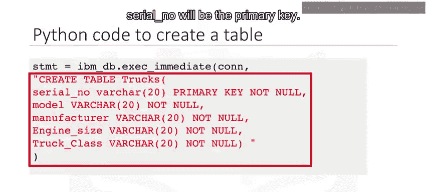

执行上述代码后，一行新数据将被添加到`trucks`表中。类似地，我们可以多次使用`ibm_db.exec_immediate`函数来添加更多行数据。

---

## 🔍 查询数据

现在，你的Python代码已经连接到数据库实例，数据库表也已创建并填充了数据。让我们看看如何使用Python代码从DB2上创建的`trucks`表中获取数据。


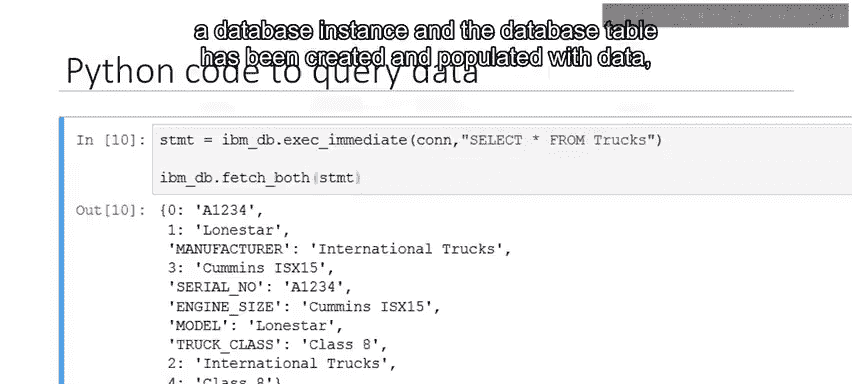

我们再次使用`ibm_db.exec_immediate`函数。连接资源`conn`作为第一个参数传递。下一个参数是SQL语句，即`SELECT * FROM table`查询。

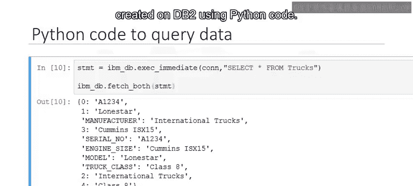

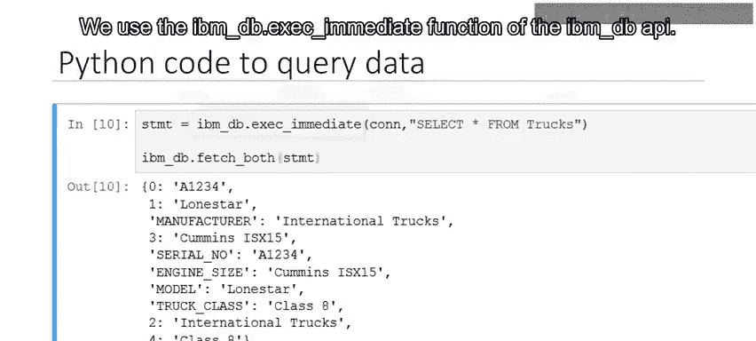

```python
selectSQL = "SELECT * FROM trucks"
selectStmt = ibm_db.exec_immediate(conn, selectSQL)
# 获取并打印结果
row = ibm_db.fetch_tuple(selectStmt)
while row:
    print(row)
    row = ibm_db.fetch_tuple(selectStmt)
```

Python代码将返回输出，显示`trucks`表中数据的各个字段。你可以通过参照DB2控制台来检查`SELECT`查询返回的输出是否正确。

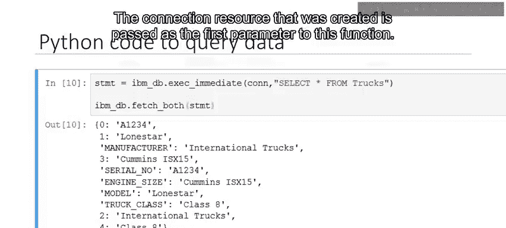

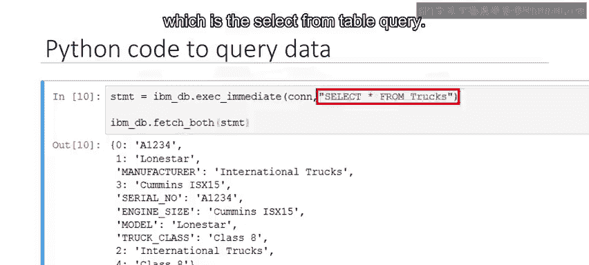

---

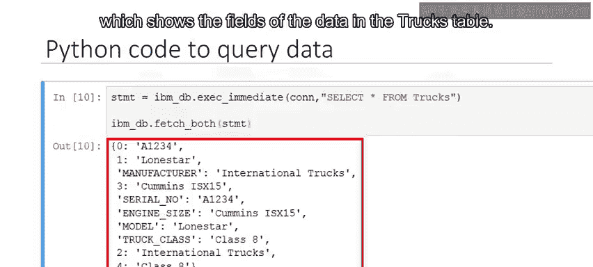

## 🐼 使用Pandas检索数据

除了直接使用`ibm_db`，我们还可以使用Pandas库来更便捷地检索和处理数据库表中的数据。Pandas是一个流行的Python库，它包含高级数据结构和操作工具，旨在使Python中的数据分析和处理变得快速而简单。

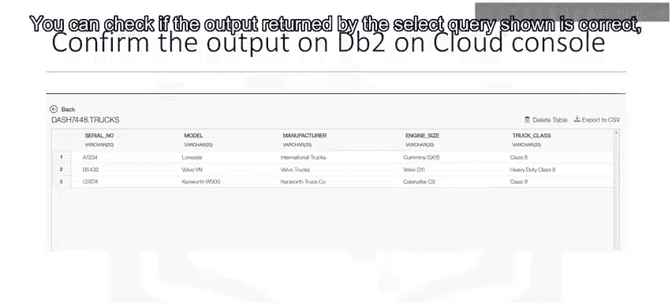

我们将数据从`trucks`表加载到一个名为`df`的DataFrame中。DataFrame是一种类似电子表格的表格数据结构，包含一个有序的列集合，每列可以是不同的值类型。

```python
import pandas as pd
import ibm_db_dbi
# 将ibm_db连接转换为DBAPI-2兼容的连接
pconn = ibm_db_dbi.Connection(conn)
# 使用pandas的read_sql函数执行查询并直接获取DataFrame
df = pd.read_sql("SELECT * FROM trucks", pconn)
print(df.head())
```


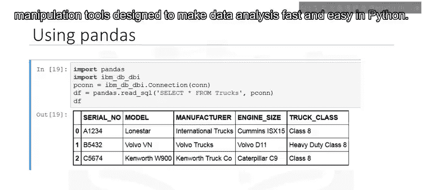

---

## 📝 总结

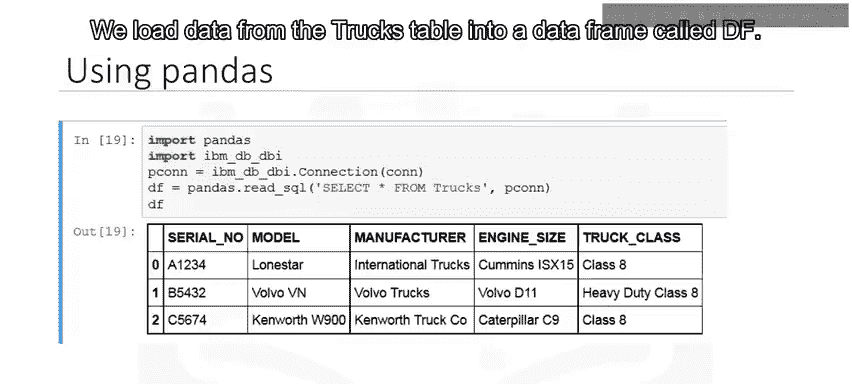

本节课中我们一起学习了使用Python进行数据库操作的核心流程。我们首先建立了与IBM DB2数据库的连接，然后逐步实现了创建表、向表中插入数据以及查询表中数据的操作。最后，我们还介绍了如何使用强大的Pandas库来简化数据检索过程，将查询结果直接转换为易于分析的DataFrame格式。


掌握这些基本操作是进行数据工程和数据分析的重要基础。