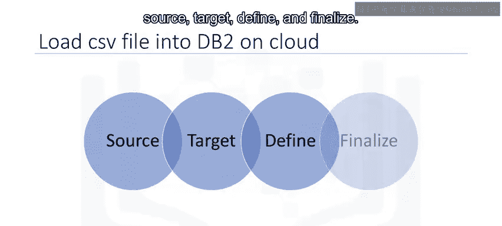
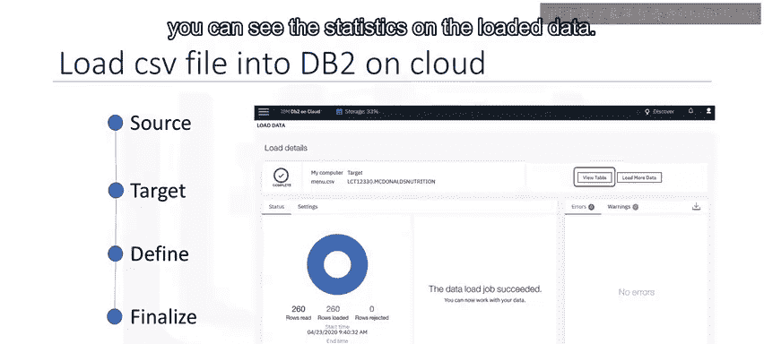
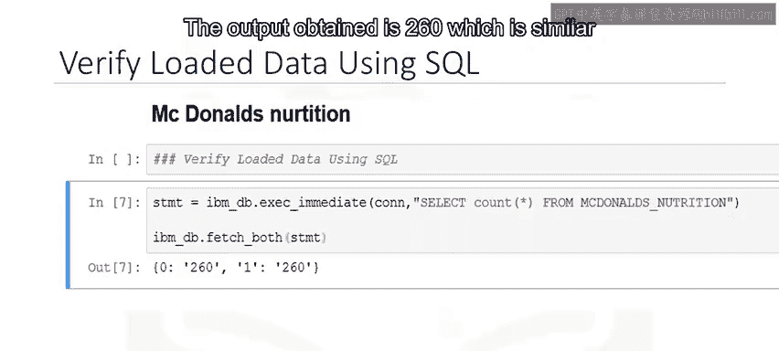
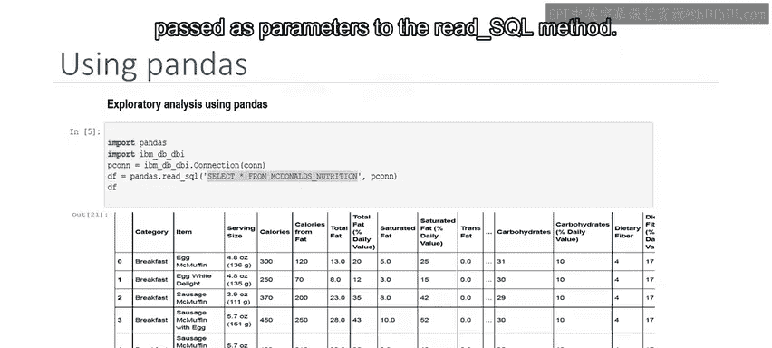
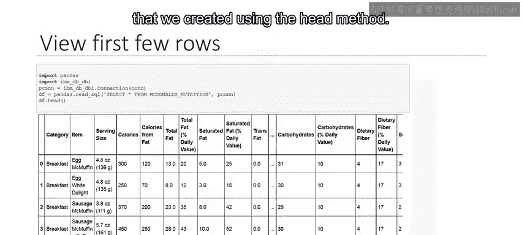
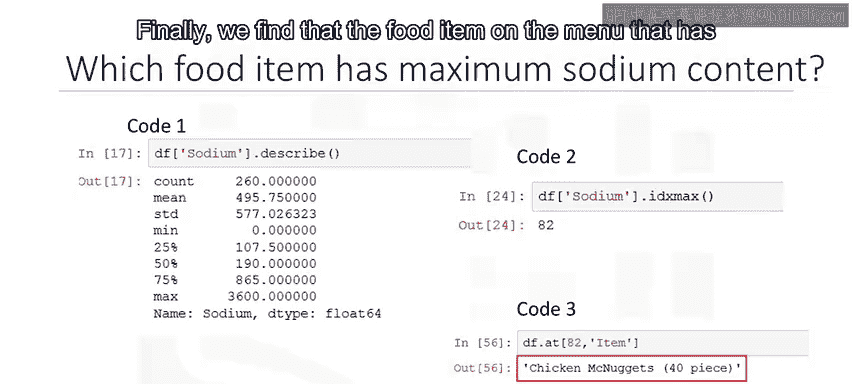
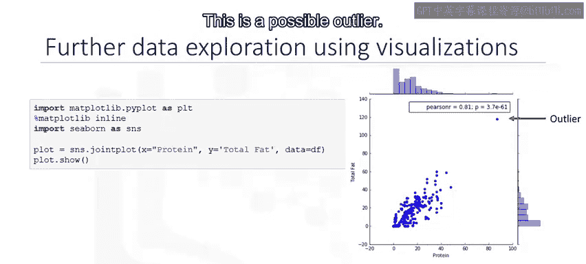
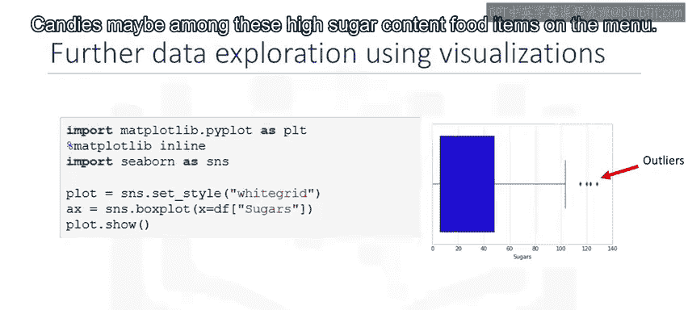

# 023：使用Python分析数据 🐍📊

在本节课中，我们将学习如何使用Python对数据进行基础的探索性分析。我们将以麦当劳菜单营养数据为例，演示如何将数据存储到IBM DB2云数据库中，并使用Python进行基本的数据分析。


## 概述

探索性数据分析是数据科学的关键步骤，它能帮助我们理解数据的结构、发现模式并识别异常值。本节将结合数据库操作与Python编程，展示一个完整的数据分析流程。

---

## 数据准备与加载 🗃️

上一节我们介绍了课程目标，本节中我们来看看如何准备和加载数据。

我们将使用麦当劳菜单营养数据集。麦当劳是一家美国快餐公司，也是全球收入最大的餐饮连锁店。其菜单不仅包含汉堡、薯条、软饮料、奶昔和甜点等快餐食品，也增加了沙拉、鱼类、冰沙和水果等选项。麦当劳提供其菜单项目的营养分析，以帮助消费者平衡饮食。

该数据集来源于Kaggle上的麦当劳菜单营养事实。我们需要在DB2数据库中创建一个表来存储这些数据。


以下是加载数据到DB2表的四个步骤：



1.  **源**：将电子表格加载到DB2控制台。
2.  **目标**：选择目标模式（Schema）。
3.  **定义**：选择将数据加载到现有表或创建新表。若创建新表，需指定表名，并可在数据预览中定义列和数据类型。
4.  **完成**：检查设置并开始加载。加载完成后，可以查看已加载数据的统计信息，并浏览表内容。


---



## 连接数据库与数据检索 🔗

数据成功加载到关系数据库后，我们可以运行Python脚本来检索和分析数据。DB2支持使用内置分析API、R或Python进行数据分析。

在本课程中，我们将在Jupyter Notebook中运行Python脚本。首先，我们需要连接到数据库。

我们使用`ibm_db` API的`connect`方法获取连接资源，然后使用SQL `SELECT`查询来验证表中加载的行数。输出显示为260行，这与DB2控制台中显示的行数一致。

```python
# 示例：验证行数
query = "SELECT COUNT(*) FROM mcdonalds_nutrition"
# ... 执行查询并获取结果
```



---

## 使用Pandas进行数据分析 🐼

现在，让我们看看如何使用pandas从数据库表中检索数据。

我们使用`read_sql`方法将数据从`mcdonalds_nutrition`表加载到名为`df`的DataFrame中。该方法需要传入SQL `SELECT`查询语句和连接对象作为参数。





```python
import pandas as pd
import ibm_db
# 假设conn是已建立的数据库连接
df = pd.read_sql("SELECT * FROM mcdonalds_nutrition", conn)
```

我们可以使用`head`方法查看创建的DataFrame `df`的前几行。

接下来是了解数据的时候了。Pandas提供了一系列常见的数学和统计方法。我们使用`describe`方法来查看DataFrame中数据的汇总统计信息。

```python
summary_stats = df.describe()
```

探索`describe`方法的输出，我们可以看到数据框中有260个观测值（即食品项目），以及9个独特的食品类别。同时，我们还能看到不同变量在260个食品项目上的汇总统计信息，如频数、均值、中位数、标准差等。例如，总脂肪的最大值为118。

---

## 深入分析：以钠含量为例 🧂

让我们进一步研究数据，尝试理解食品中的一种营养素——钠。

钠的主要来源是食盐。过量摄入钠可能导致血压升高和体液潴留。饮食中常见的钠摄入目标是每天少于2000毫克。

使用麦当劳的营养数据集，我们进行一些基本的数据分析来回答这个问题：**哪种食品的钠含量最高？**

我们首先使用可视化来探索食品的钠含量。利用seaborn包提供的`swarmplot`方法，我们创建一个分类散点图，将类别放在X轴，钠含量放在Y轴，数据源为包含麦当劳营养数据集的DataFrame `df`。

散点图显示了按类别划分的不同食品项目的钠值。我们注意到散点图上有一个约3600的高钠值。

让我们进一步探索这个高钠值，并确定菜单上哪些食品项目具有这个钠值。我们使用Python进行一些基本的数据分析来查找钠含量最高的食品项目。

以下是分析步骤：

1.  使用`describe`方法了解钠的汇总统计信息。注意钠的最大值是3600。
    ```python
    df[‘Sodium’].describe()
    ```
2.  使用`idxmax`方法找出DataFrame中钠最大值对应的索引值。输出是82。
    ```python
    max_sodium_index = df[‘Sodium’].idxmax()
    ```
3.  使用`at`方法查找索引为82的行的食品名称。
    ```python
    item_name = df.at[max_sodium_index, ‘Item’]
    ```

最终，我们发现菜单上钠含量最高的食品是**40块装麦乐鸡**。

---

## 数据可视化探索 📈

可视化对于初步的数据探索非常有用，可以帮助我们理解数据中的关系、模式和异常值。

首先，我们创建一个以蛋白质为X轴、总脂肪为Y轴的散点图。散点图是流行的可视化工具，通过每个观测值的一个点来显示两个变量之间的关系。

我们可以使用seaborn包提供的`jointplot`函数，输入X轴的蛋白质、Y轴的总脂肪，以及包含麦当劳营养数据集的DataFrame `df`。

输出的散点图显示了一个有趣的形状。它展示了两个变量——蛋白质和脂肪之间的相关性。相关性是衡量两个变量之间关联程度的指标，其值介于-1和+1之间。我们看到散点图上的点更接近一条正向的直线，因此这两个变量之间存在正相关关系。



在散点图的右上角，我们看到了皮尔逊相关系数值（0.81）以及表示相关显著性的p值，这是一个很好的值，表明变量之间确实存在相关性。

该图还显示了两个直方图：一个在顶部（蛋白质变量），一个在右侧（总脂肪变量）。我们还注意到散点图上有一个点偏离了总体模式，这可能是一个异常值。

---

## 使用箱线图进行可视化 📦

接下来，我们看看如何使用箱线图可视化数据。

箱线图是显示一个或多个变量分布的图表。箱体部分捕获了中间50%的数据，而线条和点则指示了可能的偏态和异常值。



让我们为糖含量创建一个箱线图。我们将使用seaborn包中的`boxplot`函数，并将名为`Sugars`的列作为输入。

输出结果显示在右侧，箱线图显示食品中糖的平均值约为30克。我们还注意到一些异常值，表明存在糖含量极高的食品项目。数据集中存在糖含量约为128克的食品项目，糖果可能是菜单上这些高糖含量食品之一。

---

## 总结 🎯

本节课中，我们一起学习了如何使用Python进行基础的探索性数据分析。我们从将数据加载到IBM DB2云数据库开始，然后使用pandas检索和描述数据。我们以钠含量为例，演示了如何通过统计方法和可视化工具（如散点图和箱线图）来深入分析特定变量、识别异常值（如钠含量最高的食品），并探索变量之间的关系（如蛋白质与脂肪的相关性）。




现在你已经了解了如何使用pandas和可视化工具进行基本的探索性数据分析，接下来可以继续进行本模块的实验练习，以巩固所学概念。