# 025：数据科学SQL数据库和SQL 🗃️
## P25：获取表和列的详细信息

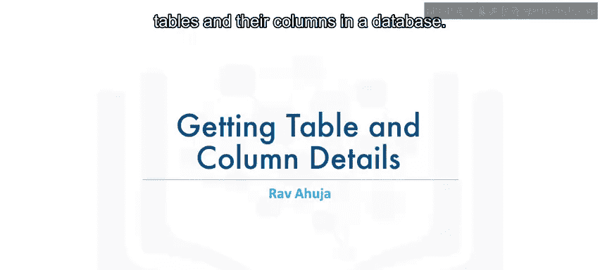

在本节课中，我们将学习如何从数据库中获取表及其列的详细信息。这对于在拥有多个表或记不清确切名称时，有效地浏览和管理数据库结构至关重要。

### 获取数据库中的表列表

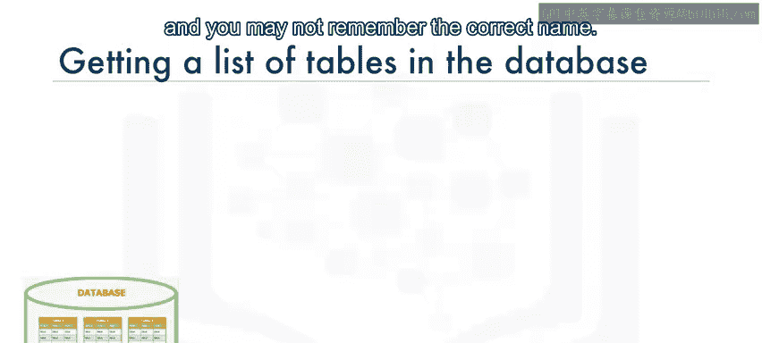

有时，数据库可能包含多个表，您可能无法准确记住表名。例如，您可能不确定表是叫 `dog`、`dogs` 还是 `four_legged_mammals`。

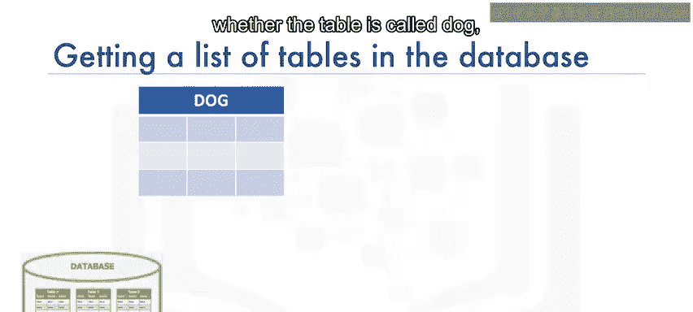

数据库系统通常包含系统表或目录表，您可以从这些表中查询表列表及其属性。不同数据库系统的目录名称不同：
*   在 DB2 中，称为 **SYSIBM.SYSTABLES**（视频中提到的“CisCAT tables”可能为口误或特定版本）。
*   在 SQL Server 中，称为 **INFORMATION_SCHEMA.TABLES**。
*   在 Oracle 中，称为 **ALL_TABLES** 或 **USER_TABLES**。

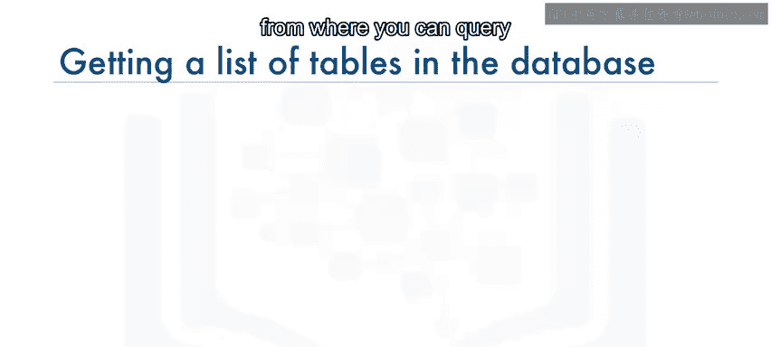

上一节我们介绍了获取表列表的必要性，本节中我们来看看在 DB2 中的具体操作方法。

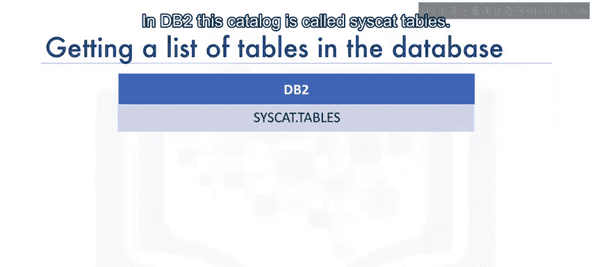

要获取 DB2 数据库中的表列表，可以运行以下查询：

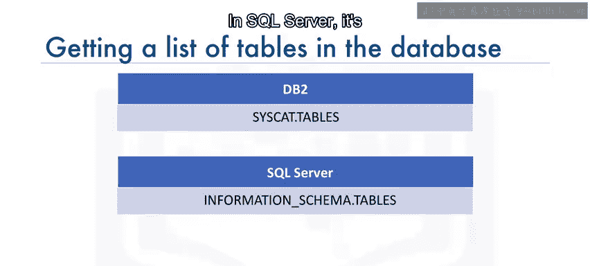

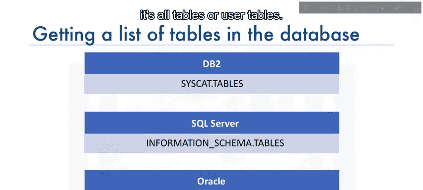

```sql
SELECT * FROM SYSIBM.SYSTABLES;
```

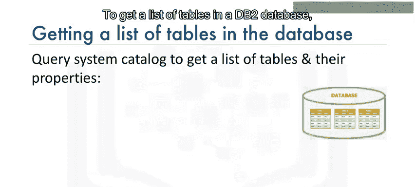

这个 `SELECT` 语句会返回包括系统表在内的所有表，因此最好对结果进行过滤。以下是更精确的查询示例：

```sql
SELECT TABSCHEMA, TABNAME, CREATE_TIME
FROM SYSIBM.SYSTABLES
WHERE TABSCHEMA = 'ABC12345';
```

**请注意**：您需要将 `'ABC12345'` 替换为您自己的 DB2 用户名。

当执行 `SELECT * FROM SYSIBM.SYSTABLES` 时，您会获得表的所有属性。有时我们只关心特定属性，例如表的创建时间。

假设您创建了多个名称相似的表，例如 `dog1`、`dog_test`、`dogtest1` 等，但您想确认其中哪个是最后创建的。为此，您可以发出如下查询：

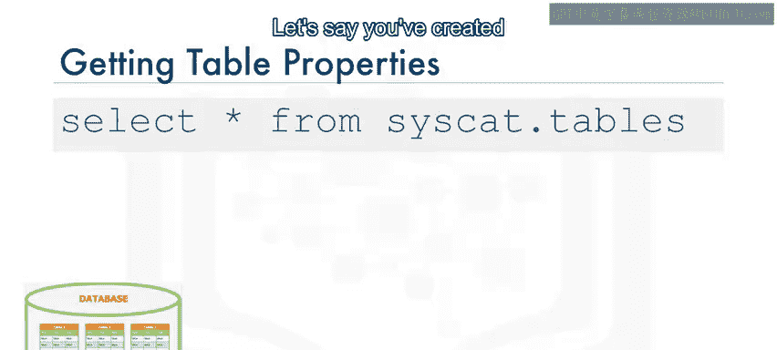

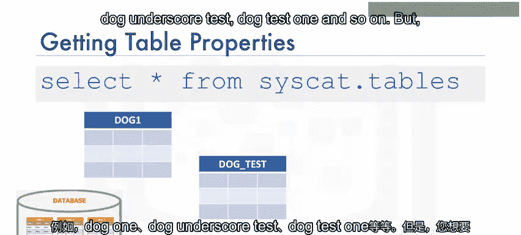

```sql
SELECT TABSCHEMA, TABNAME, CREATE_TIME
FROM SYSIBM.SYSTABLES
WHERE TABSCHEMA = 'QCM54853'
ORDER BY CREATE_TIME DESC;
```

输出结果将包含您模式（Schema）中所有表的模式名、表名和创建时间。

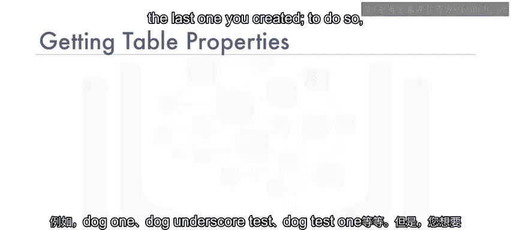

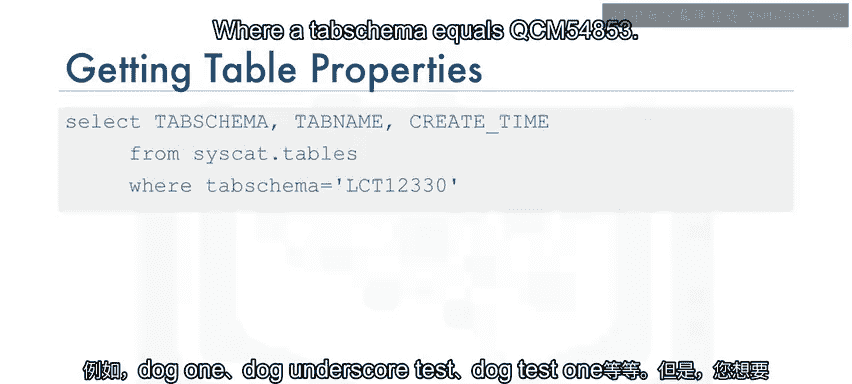

### 获取表中的列列表

接下来，我们来讨论如何获取表中列的列表。

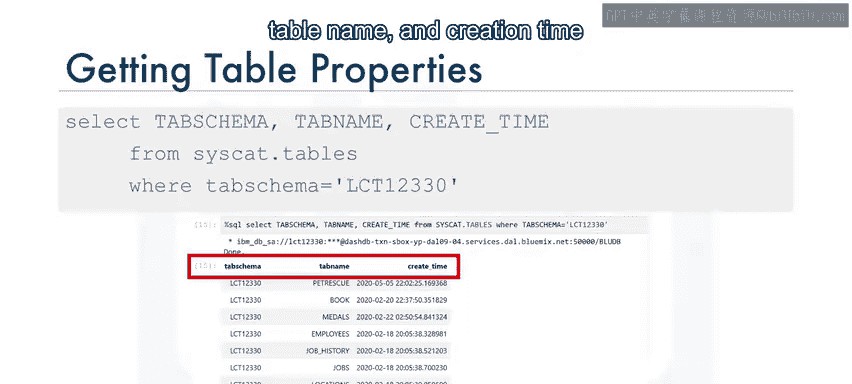

如果您记不清某列的确切名称，例如不确定它是否包含小写字符或下划线，在 DB2 中，您可以运行如下查询：

```sql
SELECT * FROM SYSIBM.SYSCOLUMNS WHERE TABNAME = 'DOGS';
```

**补充信息**：在 MySQL 中，您可以简单地运行命令：
```sql
SHOW COLUMNS FROM dogs;
```

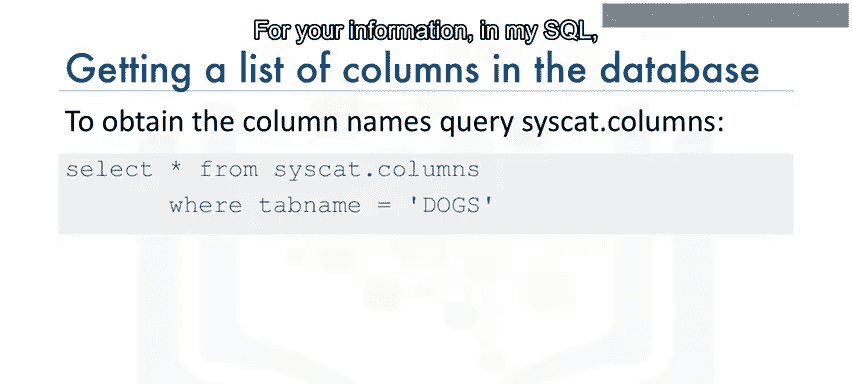

或者，您可能想了解特定属性，例如列的数据类型及其长度。在 DB2 中，可以执行如下语句：

```sql
SELECT COLNAME, TYPENAME, LENGTH
FROM SYSIBM.SYSCOLUMNS
WHERE TABNAME = 'DOGS';
```

以下是从 Jupyter Notebook 中检索名为 `Chicago_Crime_Data` 的真实表的列属性结果示例。请注意输出中，某些列名显示不同的大小写。例如，列标题 `Arrest` 的首字母 `A` 是大写，其余字符是小写。

**请记住**：当您在查询中引用此列时，不仅必须将单词 `Arrest` 用双引号括起来，还必须在引号内保持正确的大小写。

### 总结

本节课中我们一起学习了如何检索数据库中的表和列信息。我们了解了：
1.  如何使用系统目录表（如 DB2 的 `SYSIBM.SYSTABLES`）来获取表列表及其属性（如创建时间）。
2.  如何使用系统目录表（如 DB2 的 `SYSIBM.SYSCOLUMNS`）来获取表的列列表及其详细信息（如数据类型和长度）。
3.  注意在查询中引用具有特定大小写格式的列名时，需要使用双引号并保持原样。

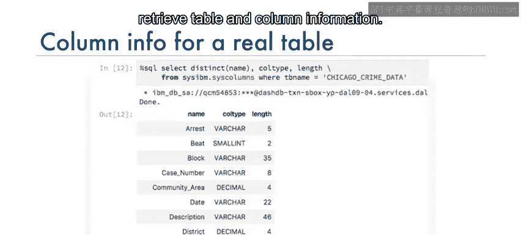

掌握这些技巧将帮助您更高效地探索和理解数据库结构。