# 026：视图（Views）👁️


在本节课中，我们将要学习SQL中的一个重要概念——视图。我们将了解视图的定义、适用场景以及如何创建和使用视图。

视图是一种表示一个或多个表（或视图）中数据的替代方式。它可以包含来自一个或多个基表或现有视图的全部或部分列。创建视图相当于为结果表创建了一个命名的规范，之后可以像查询普通表一样查询这个视图。你还可以通过对视图执行插入、更新和删除操作来修改基表中的数据。

当你定义一个视图时，存储的是视图的定义。视图所代表的数据则存储在基表中，而非视图本身。

---

## 何时使用视图？🤔

上一节我们介绍了视图的基本概念，本节中我们来看看视图的主要应用场景。

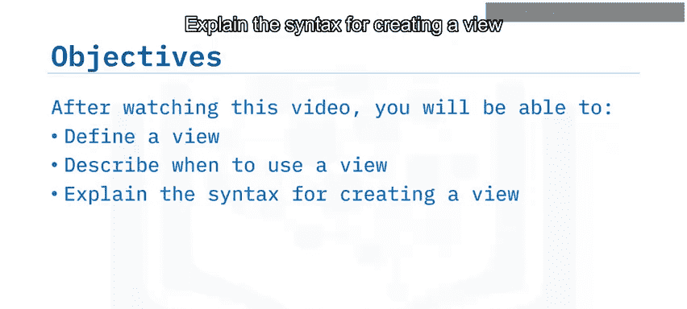

以下是视图的几个典型用途：

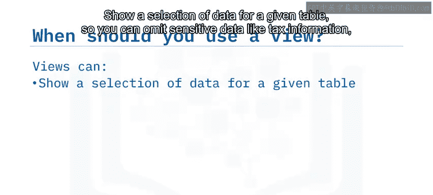

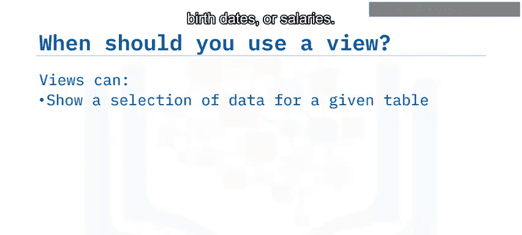

*   **数据筛选**：用于展示给定表中的特定数据，从而可以隐藏敏感信息，如税务信息、出生日期或薪资。
*   **数据整合**：以有意义的方式组合两个或多个表的数据。
*   **简化数据访问**：通过授予对视图的访问权限，而不授予对底层基表的访问权限，来简化数据访问。
*   **数据隔离**：仅展示与使用该视图的流程相关的部分数据。

例如，你可以创建一个视图，仅显示员工表中的非敏感数据，如员工ID、姓名、地址、职位ID、经理ID和部门ID。该视图不会显示薪资或出生日期等敏感信息。

---

## 如何创建视图？🔨

了解了视图的用途后，本节我们将学习创建视图的具体语法。

你可以使用 `CREATE VIEW` 语句来创建一个基于一个或多个表（或视图）的视图。

**创建视图的基本语法如下：**

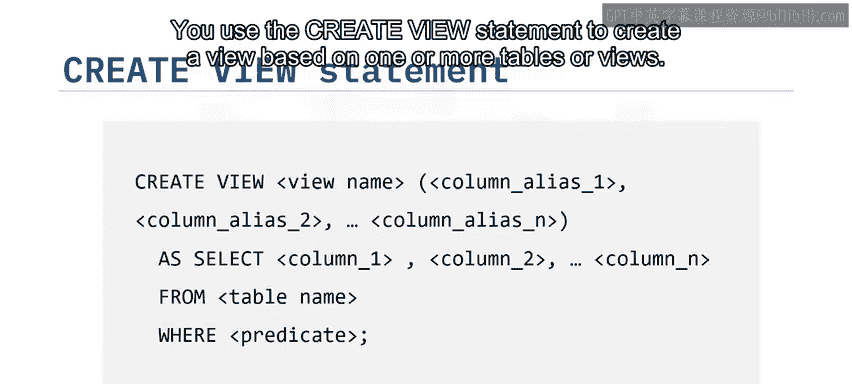

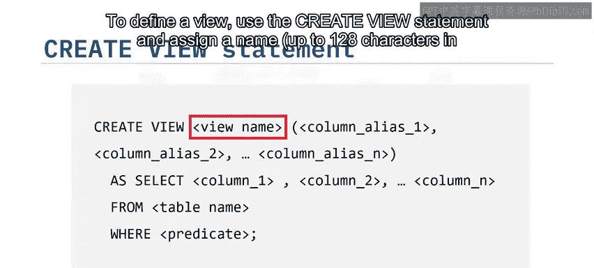

```sql
CREATE VIEW view_name [(column1, column2, ...)]
AS
SELECT column1, column2, ...
FROM base_table_name
[WHERE condition];
```

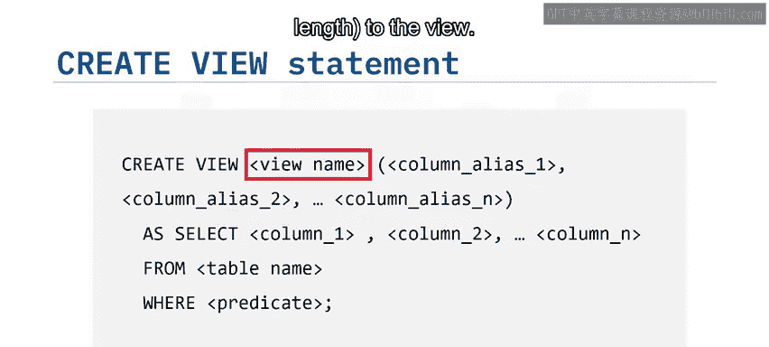

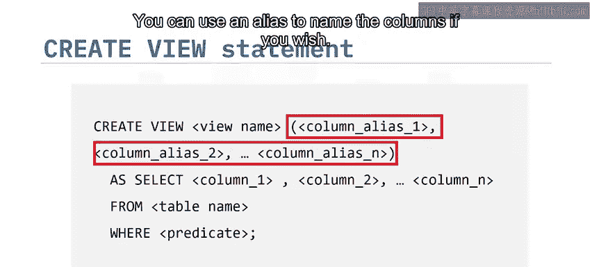

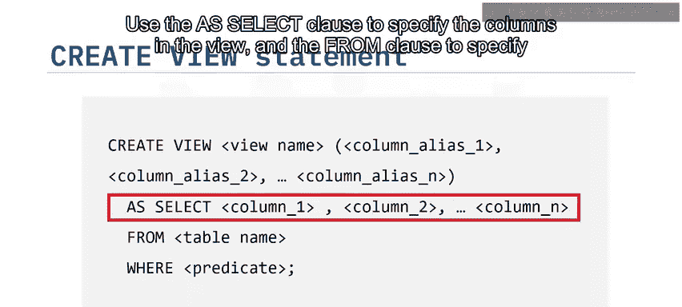

**语法说明：**

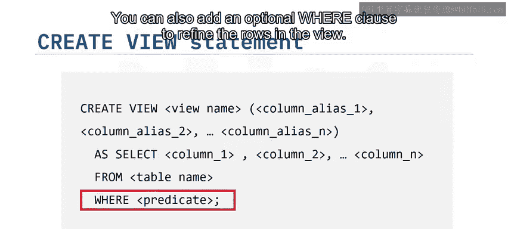

*   `CREATE VIEW`：用于创建视图的关键字。
*   `view_name`：为视图指定一个名称（长度最多128个字符）。
*   `(column1, column2, ...)`：可选。列出你想在视图中包含的列。你可以使用别名来为这些列命名。
*   `AS SELECT ...`：指定构成视图的列和数据来源。
*   `FROM base_table_name`：指定视图所基于的基表名称。
*   `WHERE condition`：可选。用于筛选视图中包含哪些行。

以下是一个创建视图的示例。该语句创建了一个名为 `F_Fin` 的视图，它基于 `employees` 表，并且只包含经理ID为30002的行。

```sql
CREATE VIEW F_Fin AS
SELECT emp_id, f_name, l_name, job_id, manager_id, dept_id
FROM employees
WHERE manager_id = 30002;
```

视图是动态的。它由用于创建它的 `SELECT` 语句所返回的数据构成。当你在另一个SQL语句中使用视图时，其行为就像你使用了一个返回该视图内容的 `SELECT` 语句一样。

用于创建视图的 `SELECT` 语句可以引用其他视图和表，并且可以使用 `WHERE`、`GROUP BY` 和 `HAVING` 子句。但它不能使用 `ORDER BY` 子句，也不能引用主机变量。

创建视图后，你可以使用 `SELECT` 语句来查看视图中的信息，以验证是否只包含了经理ID为30002的行。

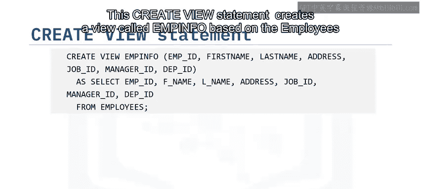

```sql
SELECT * FROM F_Fin;
```

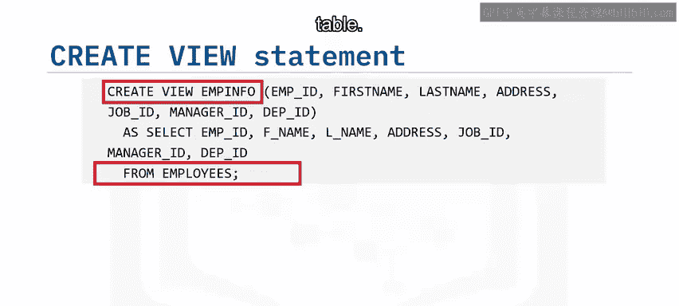

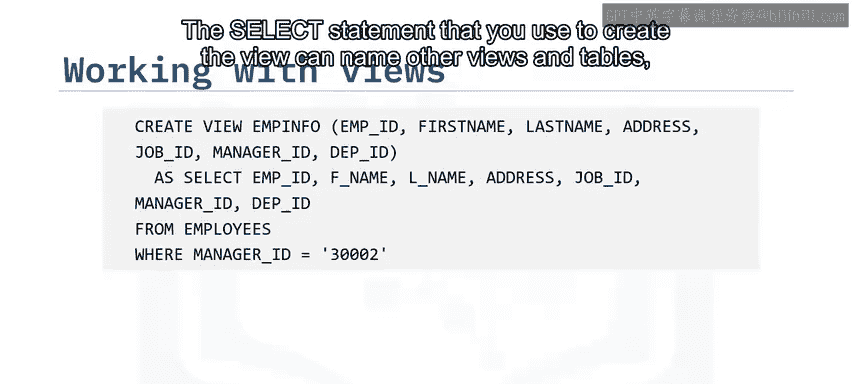

---

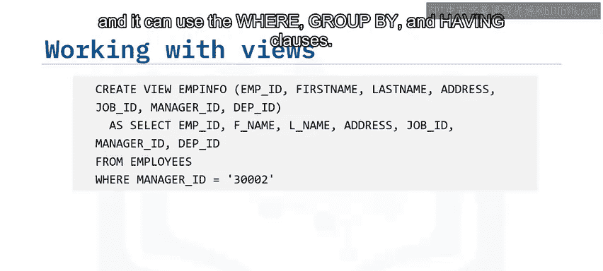

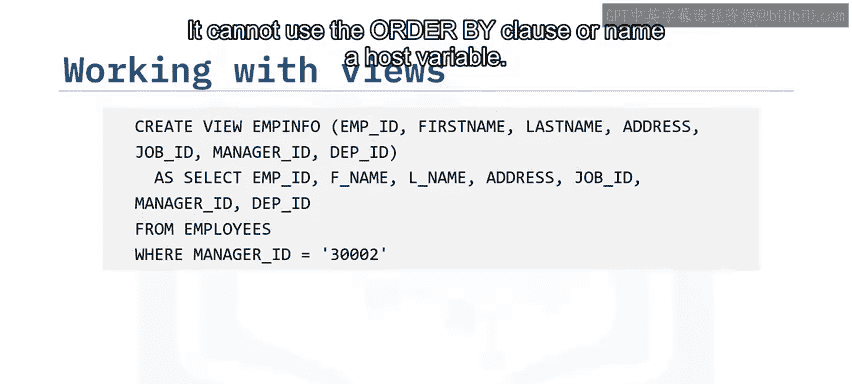

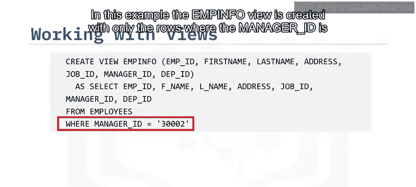

## 如何删除视图？🗑️

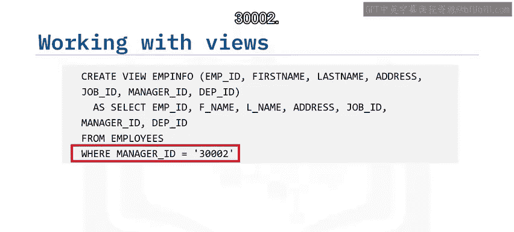

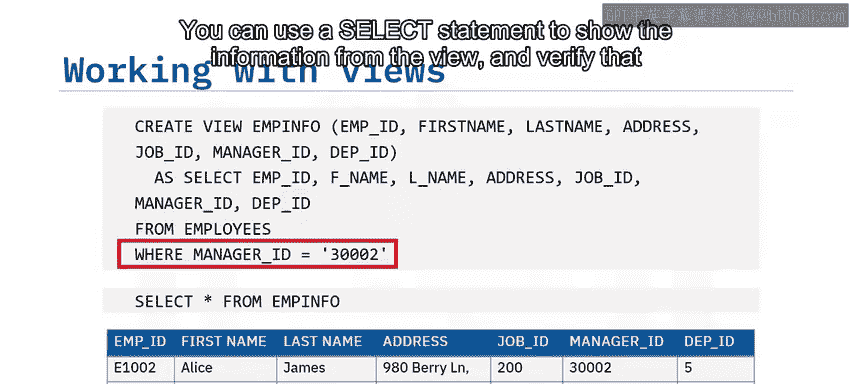

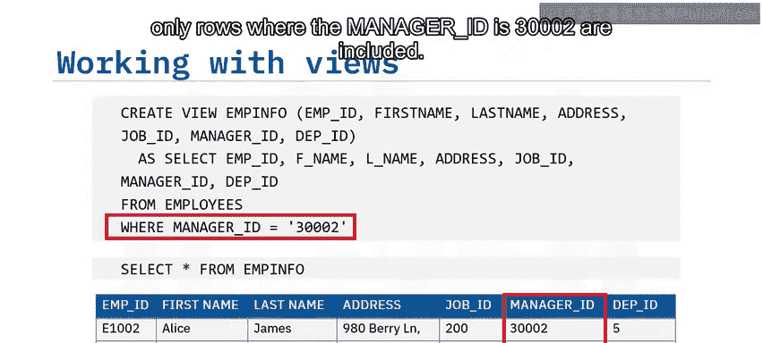

最后，如果你需要完全移除一个视图，可以使用 `DROP VIEW` 语句。

```sql
DROP VIEW view_name;
```

---

## 课程总结 📝

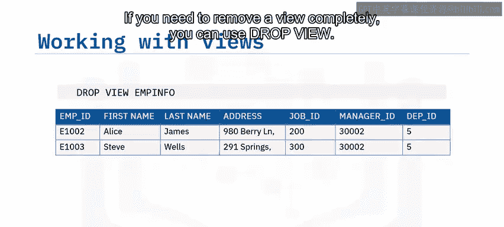

本节课中我们一起学习了SQL视图。

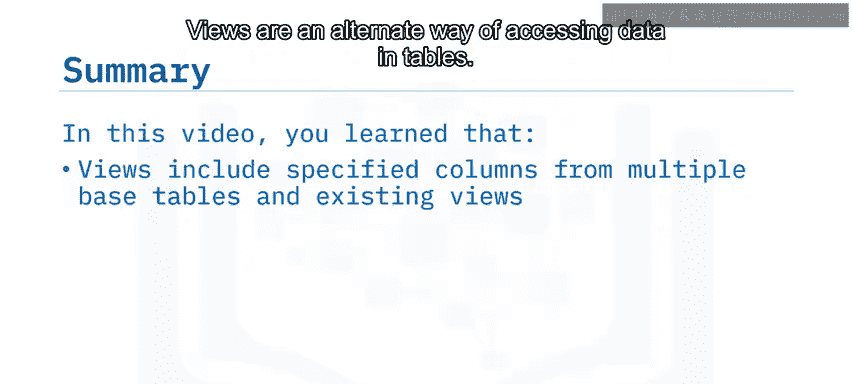

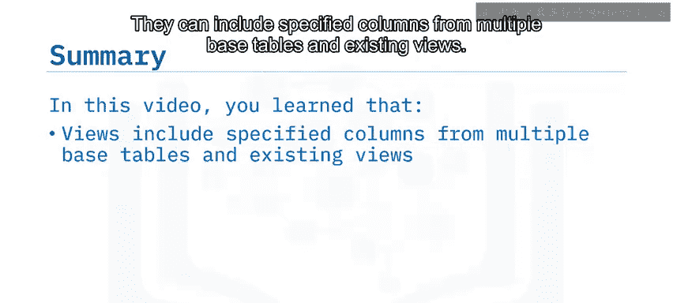

*   视图是访问表中数据的另一种方式。
*   视图可以包含来自多个基表和现有视图的指定列。
*   视图一旦创建，就可以像表一样被查询，并且可以通过视图修改基表中的数据。
*   视图是动态的，只有视图的定义被存储，数据仍保存在基表中。
*   你可以使用 `CREATE VIEW` 语句基于一个或多个表（或现有视图）来创建视图。
*   可以使用 `DROP VIEW` 语句来删除视图。