# 027：存储过程


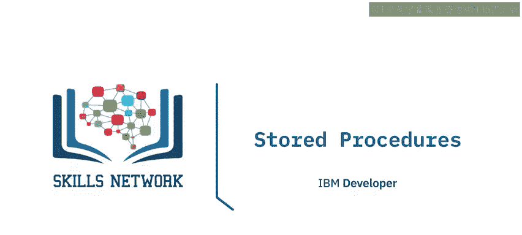

在本节课中，我们将要学习存储过程。我们将了解存储过程是什么，使用存储过程的好处，以及如何创建和使用存储过程。

## 什么是存储过程？🤔

存储过程是一组存储在数据库服务器上并执行的SQL语句。因此，无需从客户端向服务器发送多条SQL语句，你可以将它们封装在服务器上的一个存储过程中，然后从客户端发送一条语句来执行它们。

## 存储过程的优势 💪


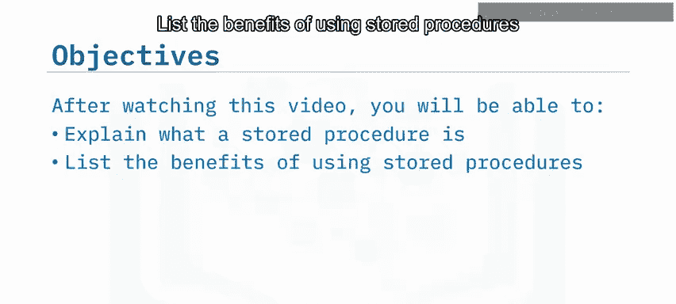

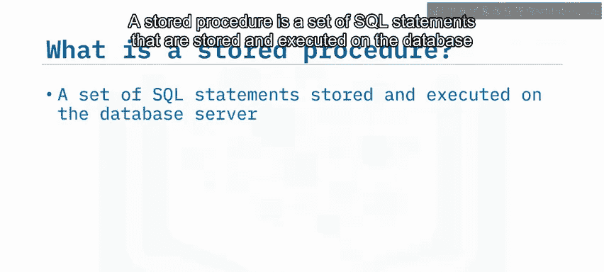

以下是使用存储过程的主要好处：

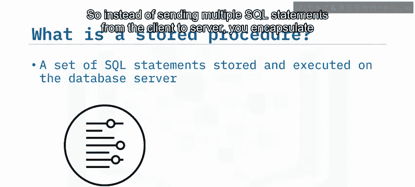

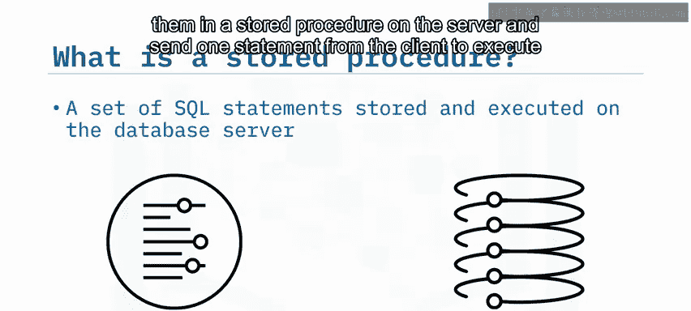

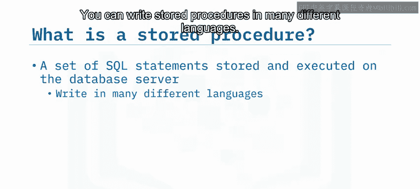

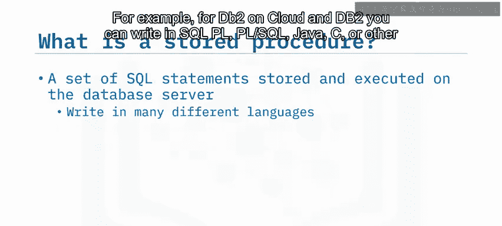

*   **减少网络流量**：因为只需要一次调用即可执行多条语句。
*   **提升性能**：处理过程发生在存储数据的服务器上，只有最终结果会传回客户端。
*   **代码复用**：多个应用程序可以为相同的工作使用同一个存储过程。
*   **增强安全性**：A. 你无需向客户端开发人员暴露所有表和列的信息；B. 你可以使用服务器端逻辑在数据被系统接受之前进行验证。

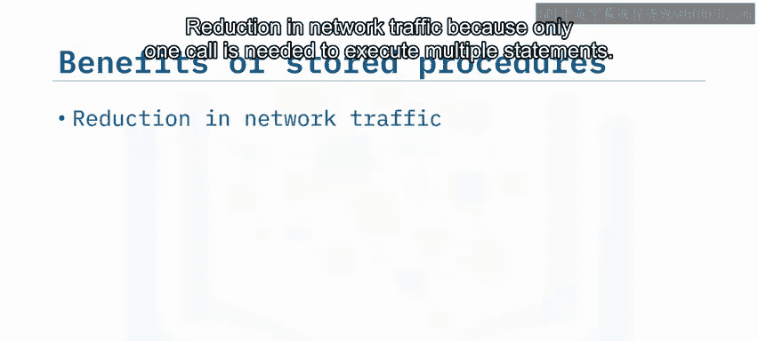

需要注意的是，SQL并非一个功能完备的编程语言，因此不应尝试将所有业务逻辑都写在存储过程中。

## 如何创建存储过程 🛠️

上一节我们介绍了存储过程的概念和优势，本节中我们来看看如何在Db2 on cloud上使用SQL创建一个存储过程。

首先，使用 `CREATE PROCEDURE` 语句，指定过程名称及其将接受的任何参数。在下面的例子中，`UPDATE_SALARY` 过程将接受一个员工编号和一个评级，它将根据评级来更新员工的薪资。

```sql
CREATE PROCEDURE UPDATE_SALARY (IN emp_id INT, IN rating INT)
```

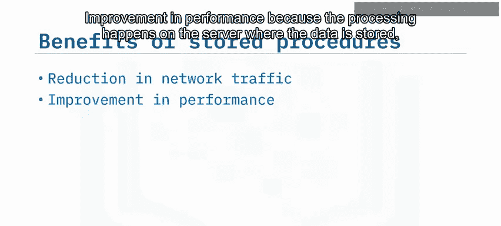

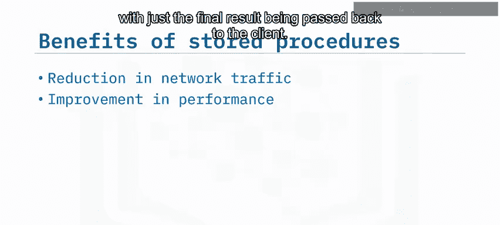

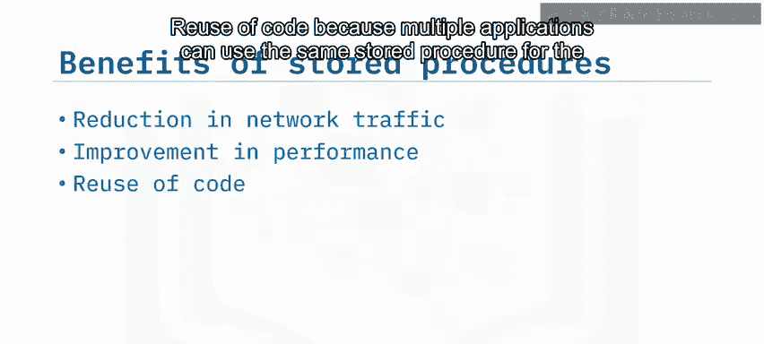

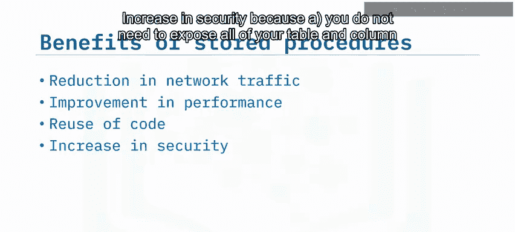

接着，声明你使用的语言。

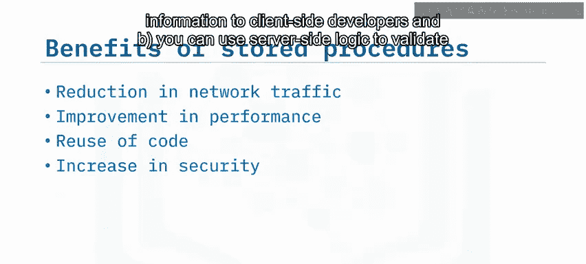

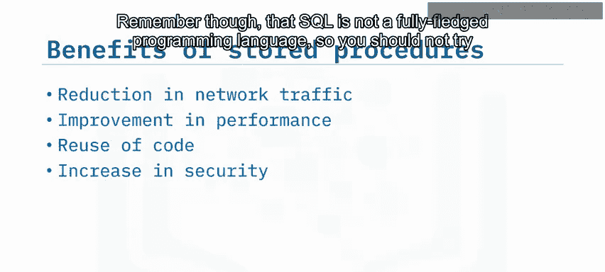

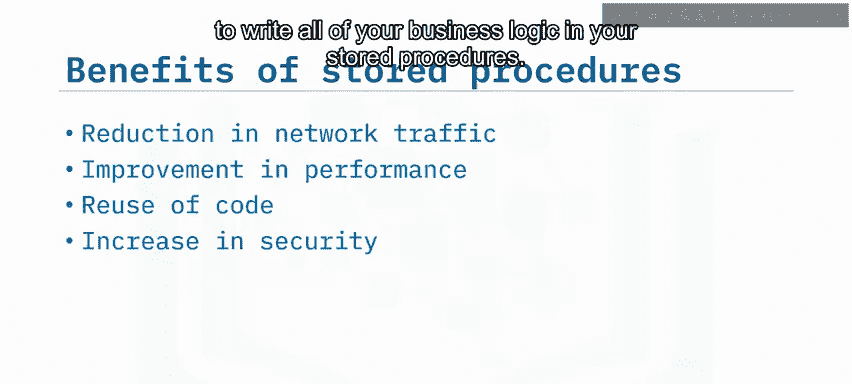

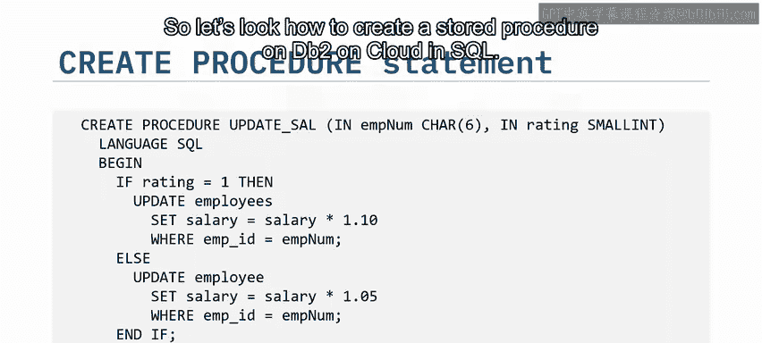

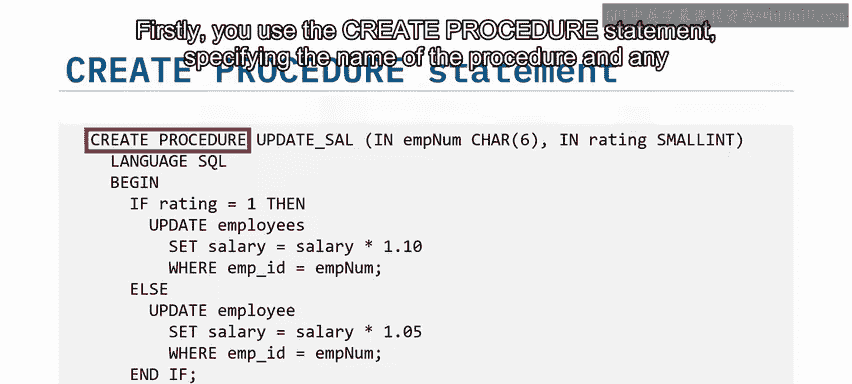

```sql
LANGUAGE SQL
```

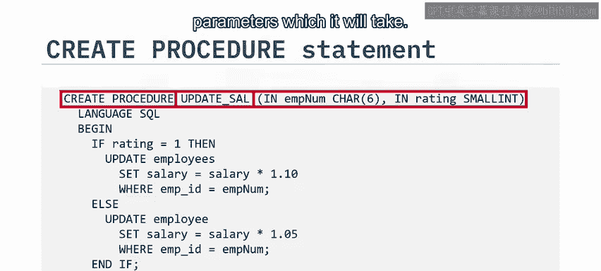

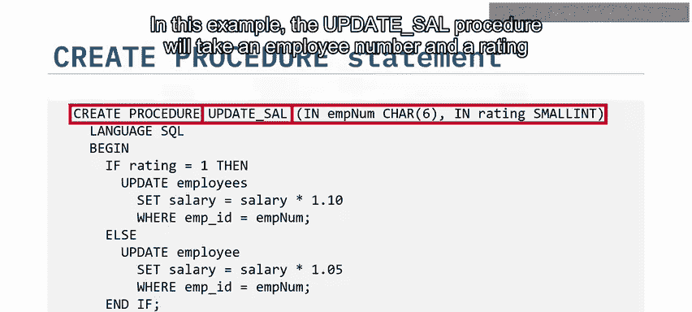

然后，将你的过程逻辑包裹在 `BEGIN` 和 `END` 语句中。在这个例子中，给评级为1的员工加薪10%，其他所有员工加薪5%。

```sql
BEGIN
    IF rating = 1 THEN
        UPDATE employees SET salary = salary * 1.10 WHERE employee_id = emp_id;
    ELSE
        UPDATE employees SET salary = salary * 1.05 WHERE employee_id = emp_id;
    END IF;
END
```

请注意，你可以在过程逻辑中直接使用传递给过程的参数信息。

## 如何调用存储过程 📞

你可以从外部应用程序或动态SQL语句中调用存储过程。要调用我们刚刚创建的 `UPDATE_SALARY` 存储过程，请使用 `CALL` 语句，后跟存储过程的名称并传递所需的参数。在这个例子中，参数是员工ID和该员工的评级。

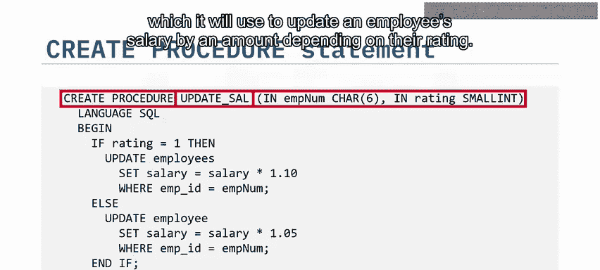

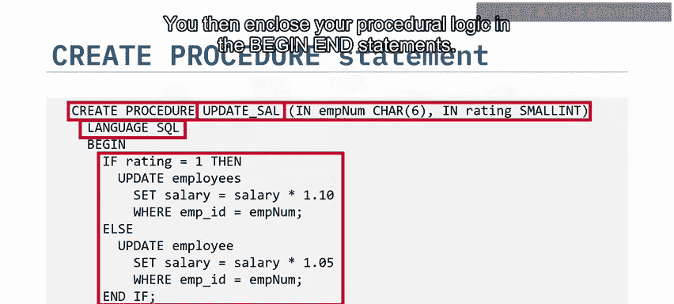

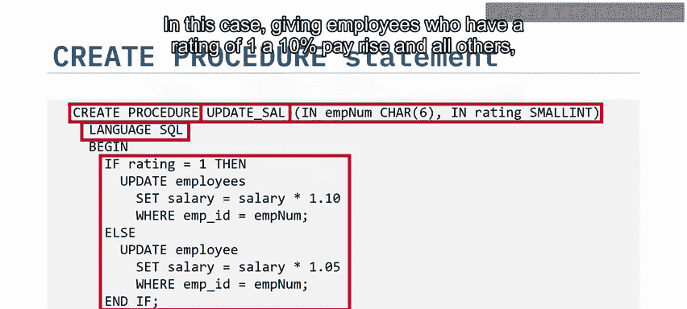

```sql
CALL UPDATE_SALARY(12345, 1);
```

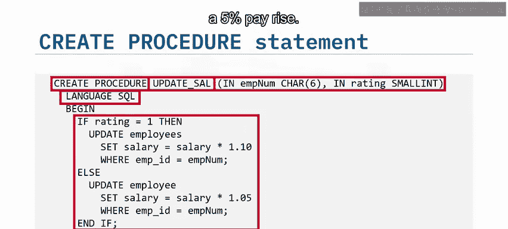

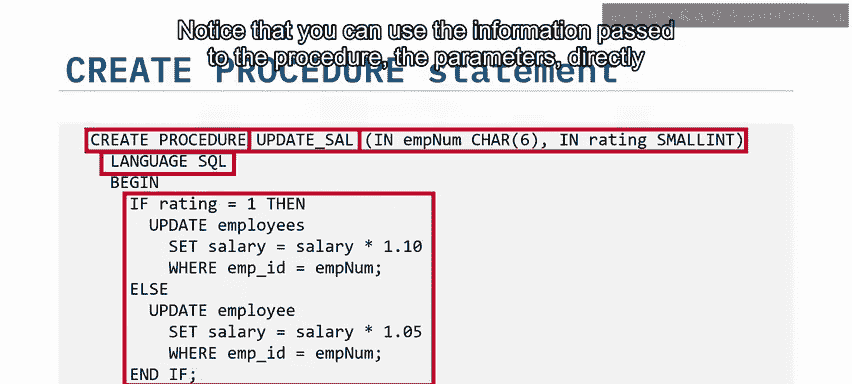

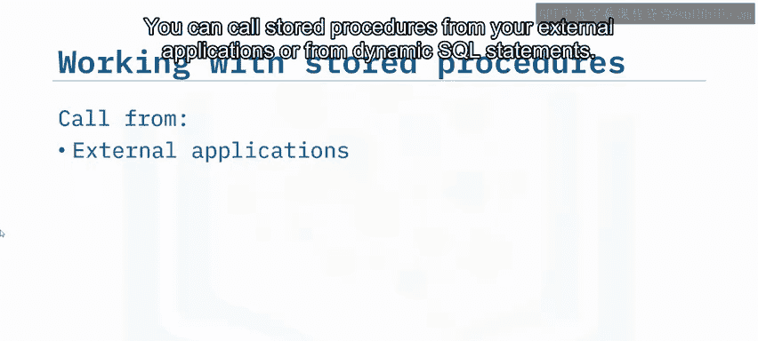

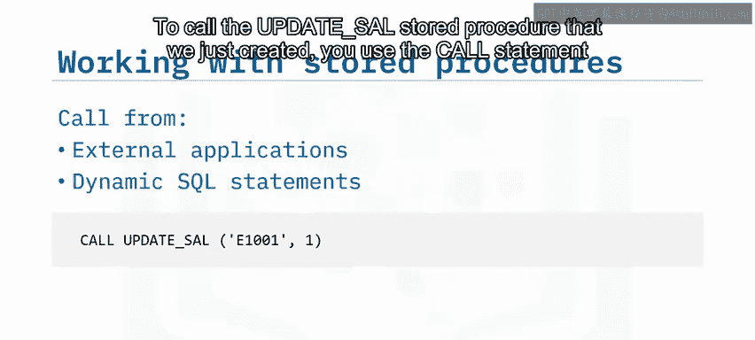

## 总结 📝

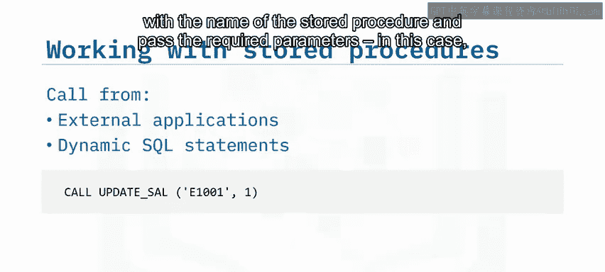

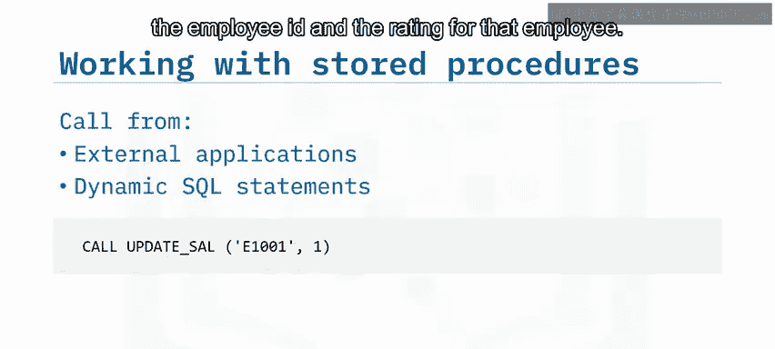


本节课中我们一起学习了存储过程。我们了解到存储过程是在服务器上执行的一组SQL语句。与向服务器发送SQL语句相比，存储过程提供了许多好处。你可以在动态SQL语句和外部应用程序中使用存储过程。