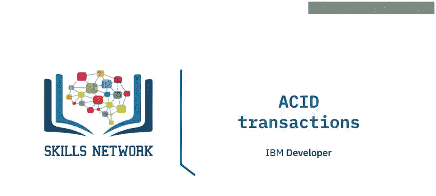
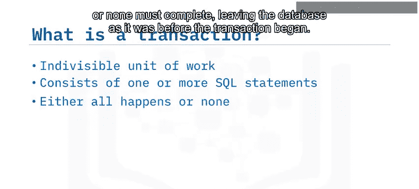
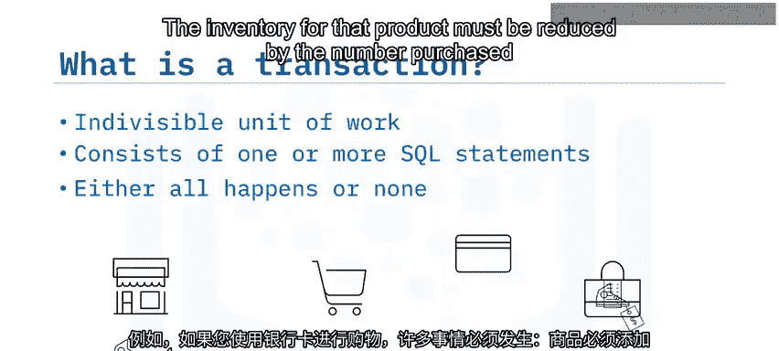
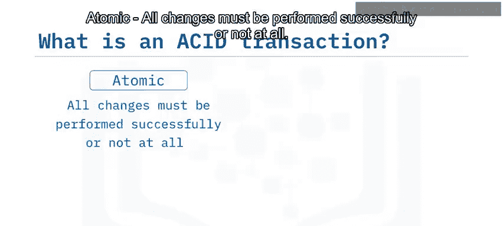
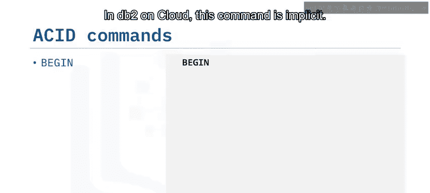
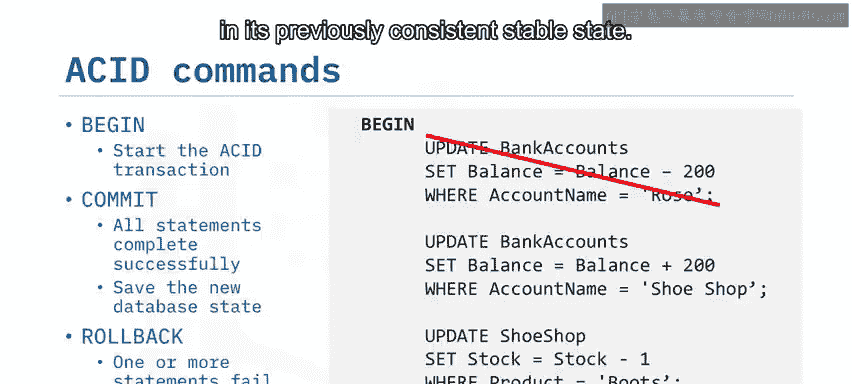
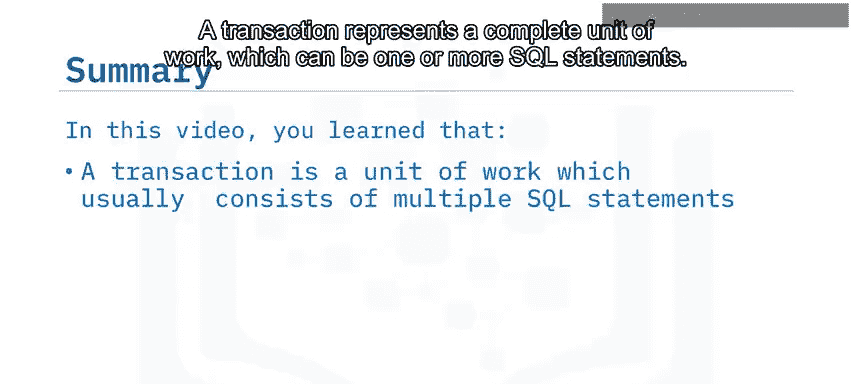
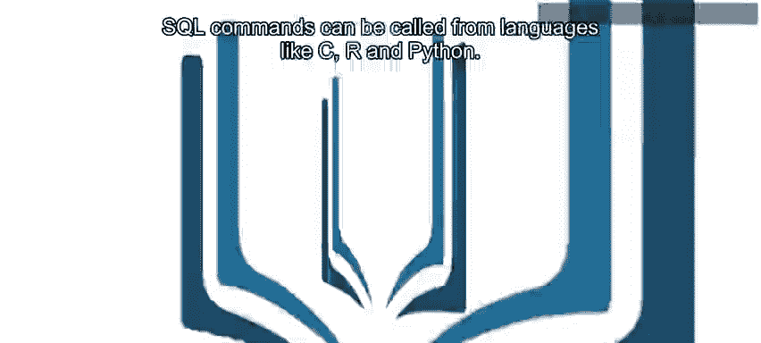

# 028：原子事务 🧩



在本节课中，我们将要学习数据库中的**原子事务**。我们将了解事务是什么，为什么它们对维护数据一致性至关重要，以及如何使用SQL命令来管理事务。

---

## 什么是事务？🤔

上一节我们介绍了课程概述，本节中我们来看看事务的基本概念。

一个事务是一个**不可分割的工作单元**。它可以由一个或多个SQL语句组成。但要使事务被视为成功，要么所有这些SQL语句都必须成功完成，使数据库进入一个新的稳定状态；要么一个都不完成，使数据库保持事务开始前的状态。

例如，当你使用银行卡购物时，必须发生很多事情：商品必须加入购物车、支付必须被处理、你的账户必须扣除正确金额、商店账户必须收到款项、该商品的库存必须相应减少。

---

## 深入分析示例 💳



让我们更详细地看一个例子。如果Rose购买了一双价值200美元的靴子，那么需要执行多个更新操作。



以下是完成此购买可能需要执行的SQL语句：

1.  使用UPDATE语句减少Rose的账户余额。
    ```sql
    UPDATE accounts SET balance = balance - 200 WHERE name = 'Rose';
    ```
2.  使用另一个UPDATE语句为鞋店账户增加200美元。
    ```sql
    UPDATE accounts SET balance = balance + 200 WHERE name = 'Shoe Shop';
    ```
3.  使用最后一个UPDATE语句将鞋店中靴子的库存水平减少一。
    ```sql
    UPDATE inventory SET stock = stock - 1 WHERE product = 'Boots' AND shop = 'Shoe Shop';
    ```

**核心要求是**：如果这些更新语句中的任何一条失败，整个事务都应该失败，以保持数据处于一致状态。

---

## 理解ACID事务 🛡️

上一节我们看到了一个多步骤操作的例子，本节中我们来定义确保此类操作安全性的属性。

示例中的这类事务被称为**ACID事务**。ACID是一个缩写，代表：

*   **原子性**：所有更改必须全部成功执行，或者全部不执行。
*   **一致性**：事务前后数据必须处于一致状态。
*   **隔离性**：事务运行时，其他进程不能更改所涉及的数据。
*   **持久性**：事务所做的更改必须持久保存。





---

## 如何管理事务？🛠️

了解了ACID属性后，本节我们来看看实际操作中如何控制事务。



在Db2 on Cloud中，使用 `BEGIN` 命令启动一个事务。这个命令通常是隐式的。在此之后发出的任何命令都是事务的一部分，直到发出 `COMMIT` 或 `ROLLBACK` 命令。

*   如果所有命令都成功完成，则发出 `COMMIT` 命令，将数据库中的所有更改保存到一个一致的、稳定的状态。
    ```sql
    COMMIT;
    ```
*   如果任何命令失败（例如，Rose的账户没有足够的钱支付），则可以发出 `ROLLBACK` 命令，撤销所有更改，使数据库恢复到之前一致的稳定状态。
    ```sql
    ROLLBACK;
    ```

---

## 在应用程序中使用事务 💻

上一节我们介绍了在SQL环境中直接管理事务，本节中我们看看如何在编程语言中集成事务。

SQL语句可以从Java、C、R和Python等语言调用。这需要使用数据库特定的访问API，例如Java的JDBC或Python的IBMDB数据库连接器。

大多数语言使用完全相同的SQL命令来启动和控制事务，包括 `COMMIT` 和 `ROLLBACK`。记住 `BEGIN` 通常是隐式的，不需要显式调用。

以下是一个概念性示例（伪代码）：
```python
# 伪代码示例
try:
    # 执行SQL语句1 (UPDATE account...)
    # 执行SQL语句2 (UPDATE shop_balance...)
    # 执行SQL语句3 (UPDATE inventory...)
    connection.commit()  # 所有成功则提交
except Exception as e:
    connection.rollback()  # 任何失败则回滚
```

将SQL命令合并到应用程序代码中，使你能够创建错误检查例程，进而控制事务是提交还是回滚。

---

## 总结 📚





本节课中我们一起学习了：
*   事务代表一个完整的工作单元，可以包含一个或多个SQL语句。
*   **ACID事务**要求所有SQL语句必须全部成功完成，或者全部不完成，这确保了数据库始终处于一致状态。
*   ACID代表**原子性**、**一致性**、**隔离性**、**持久性**。
*   SQL命令 `BEGIN`、`COMMIT` 和 `ROLLBACK` 用于管理ACID事务。
*   SQL命令可以从C、R和Python等编程语言中调用，从而在应用程序中实现复杂的事务逻辑和错误处理。