# 029：联接概述 🔗

在本节课中，我们将要学习SQL中一个核心且强大的功能——**联接（JOIN）**操作。我们将了解联接操作符的定义，解释主键和外键在联接中的作用，并列出不同类型的联接操作符。

---

## 什么是联接操作符？ 🤔

一个简单的`SELECT`语句可以从单个表的一列或多列中检索数据。更复杂的情况是从两个或更多表中检索数据，这导致了结果集生成的多种可能性。

为了组合来自两个表的数据，你需要使用**联接操作符**。一个联接操作基于这些表中某些列之间的关系，将来自两个或更多表的行组合起来。

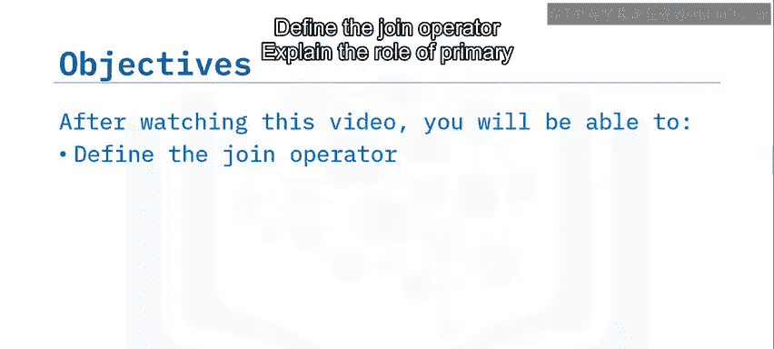

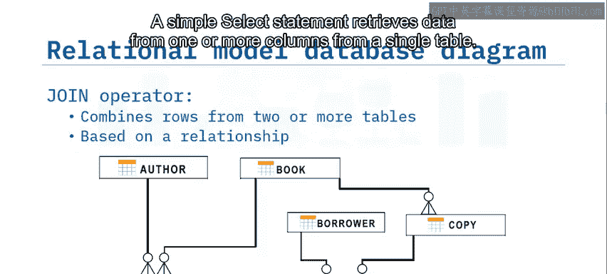

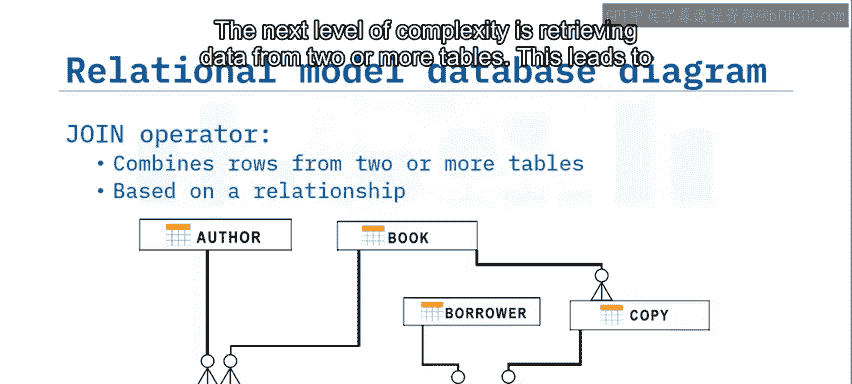

---

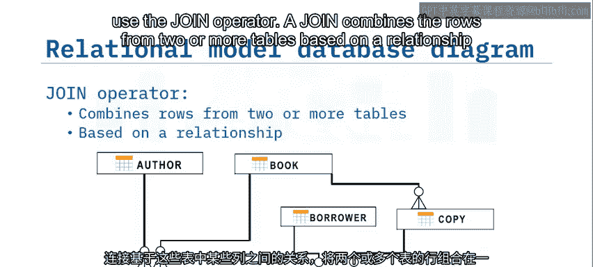

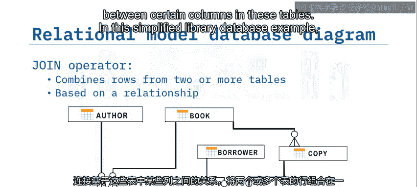

## 数据库中的关系与键 🔑

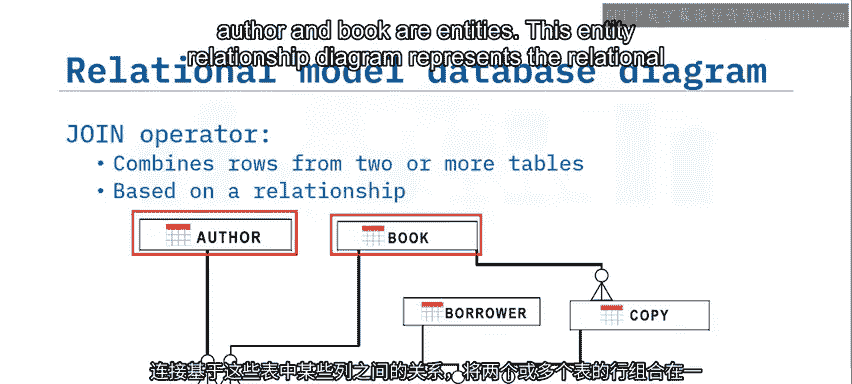

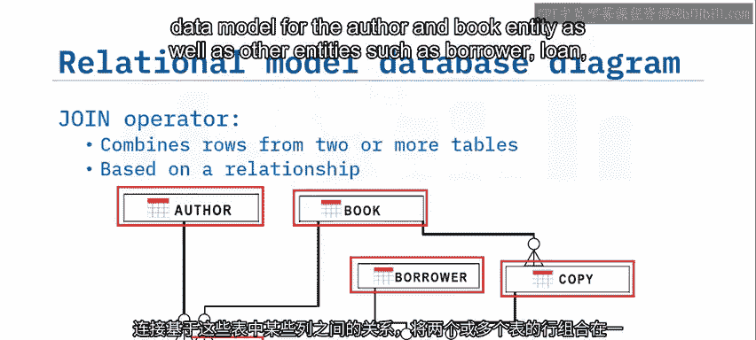

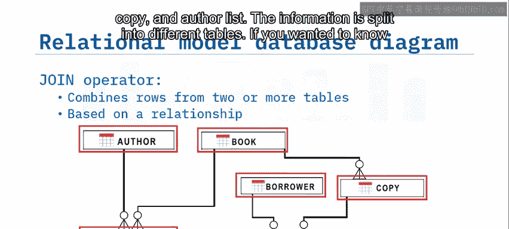

在简化的图书馆数据库示例中，作者（author）和书籍（book）是实体。实体关系图代表了作者、书籍以及其他实体（如借阅者、借阅记录、副本和作者列表）的关系数据模型。信息被拆分到不同的表中。

例如，如果你想知道哪位借阅者借出了哪本书的哪个副本，你需要从三个表中收集数据：`borrower`（借阅者）、`loan`（借阅记录）和`copy`（副本）表。这时你就需要使用联接操作符。

首先，你需要识别这些表之间的关系，即每个表中用于链接表的列。

在实体关系图中，注意`author_id`、`book_id`、`borrower_id`和`copy_id`旁边有主键图标。**主键（Primary Key）** 唯一标识表中的每一行。

同时，在屏幕下半部分的实体中，某些属性旁边标有`(FK)`。这标识了**外键（Foreign Key）**，它是一组引用另一个实体的主键的列。

例如，`loan`实体有一个带有`(FK)`标识的`borrower_id`属性。在这个例子中，`borrower_id`属性是`loan`实体中的外键，它引用了`borrower`实体的主键。

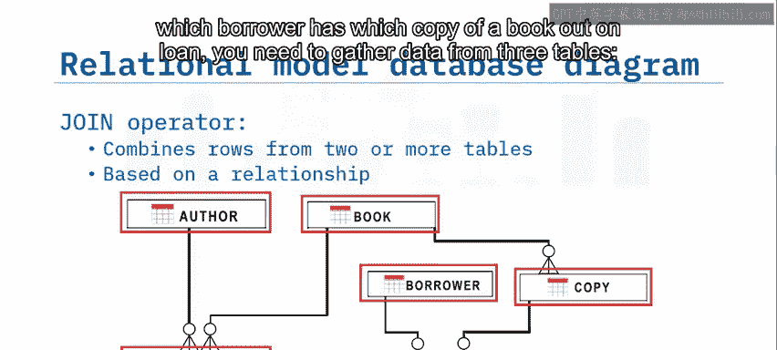

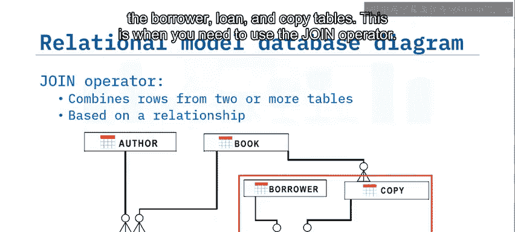

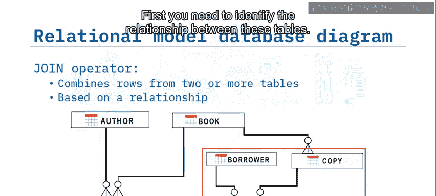

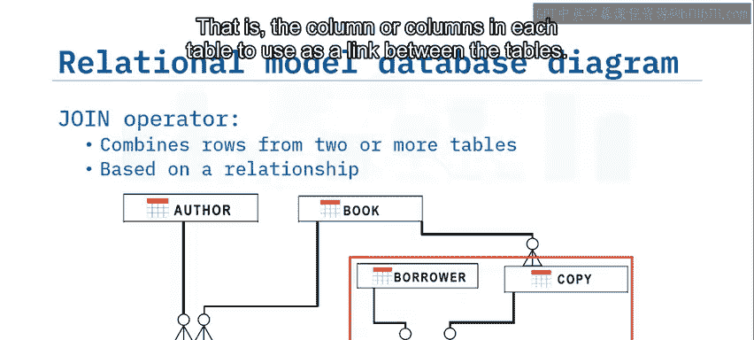

因此，如果你想知道哪位借阅者有书在借，你需要从`borrower`和`loan`表中收集数据，你将需要两个表中的`borrower_id`。

---

## 联接多个表 🔄

到目前为止，你已经看到了组合两个表的例子。但如果你需要组合来自三个或更多不同表的数据呢？你只需在联接中添加新的表。

例如，如果你想知道哪些借阅者有书在借，以及他们借的是哪本书的哪个副本：
1.  首先，通过匹配`borrower_id`，联接`borrower`表和`loan`表的信息。
2.  然后，通过匹配`copy_id`，联接`loan`表和`copy`表的信息。

---

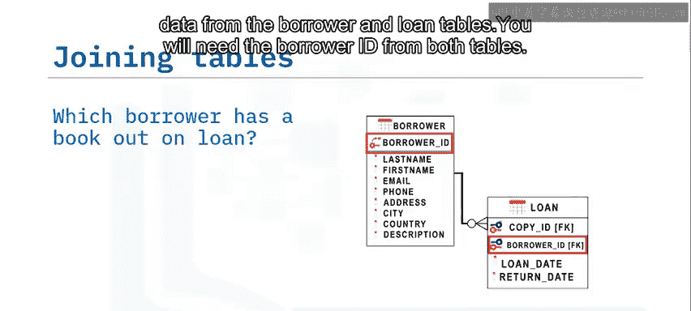

## 联接的类型 📊

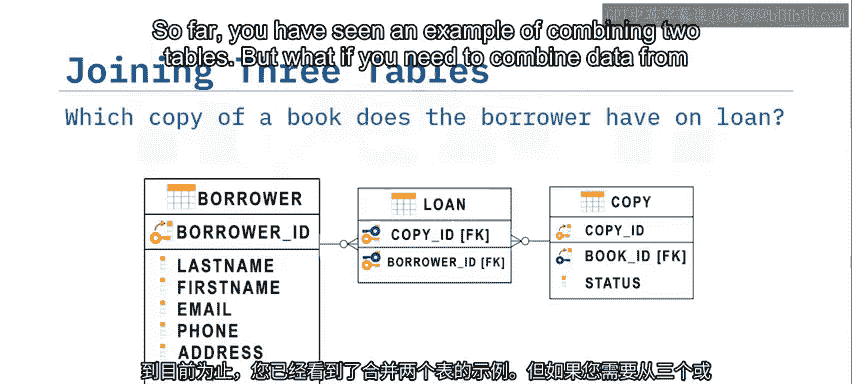

SQL提供了几种不同类型的联接。你可以提取对应于所涉及两个表交集的数据集，也可以选择一个更大的数据集，甚至可以选择组合这两个表中所有数据。

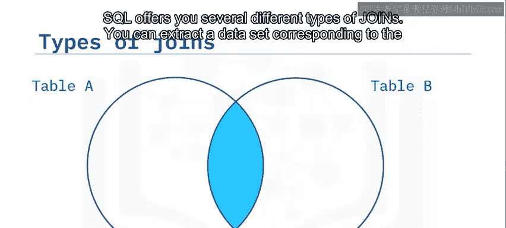

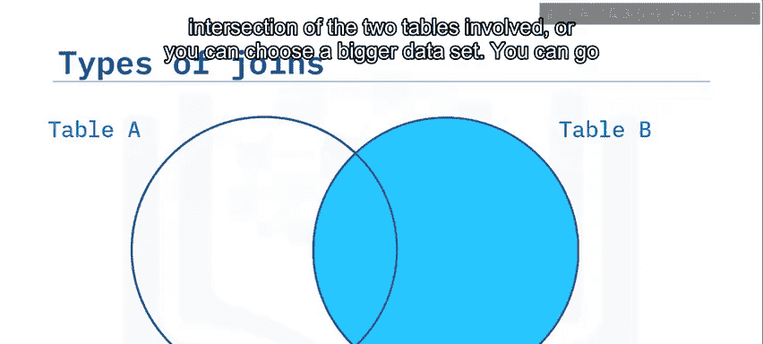

以下是主要的联接类型：

*   **内联接（INNER JOIN）**：最常见的联接类型。它只显示两个表中在公共列（通常是一个表的主键，在第二个表中作为外键存在）上具有匹配值的行。
    *   **公式/逻辑描述**：`结果集 = 表A ∩ 表B`（基于匹配条件）

*   **外联接（OUTER JOIN）**：返回匹配的行，甚至返回一个或另一个表中不匹配的行。外联接有多种变体，可用于细化你的结果集。

---

## 总结 📝

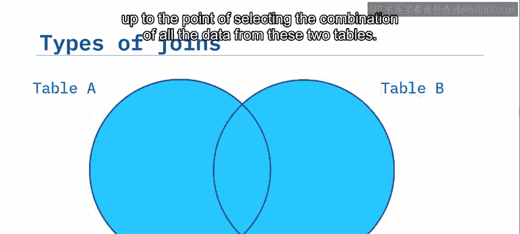

本节课中我们一起学习了：
1.  可以使用**联接操作符**来组合来自两个或更多表的行。
2.  被联接的表通过一个公共列相关，该列通常是一个表的主键，并作为外键出现在另一个表中。
3.  联接主要有两种类型：**内联接**和**外联接**，它们分别用于获取不同范围的数据组合。

掌握联接是进行复杂数据查询和分析的基础，下一节我们将深入探讨内联接的具体语法和应用场景。